<h1>Table of Contents<span class="tocSkip"></span></h1>
<div class="toc"><ul class="toc-item"><li><span><a href="#Capstone-Project--Overview" data-toc-modified-id="Capstone-Project--Overview-1"><span class="toc-item-num">1&nbsp;&nbsp;</span>Capstone Project--Overview</a></span><ul class="toc-item"><li><span><a href="#Problem-statement:--Predicting-DNA-Plasmid-Lab-of-Origin" data-toc-modified-id="Problem-statement:--Predicting-DNA-Plasmid-Lab-of-Origin-1.1"><span class="toc-item-num">1.1&nbsp;&nbsp;</span>Problem statement:  Predicting DNA Plasmid Lab of Origin</a></span></li><li><span><a href="#Why-I-chose-this-project-and-how-I-approached-it" data-toc-modified-id="Why-I-chose-this-project-and-how-I-approached-it-1.2"><span class="toc-item-num">1.2&nbsp;&nbsp;</span>Why I chose this project and how I approached it</a></span></li></ul></li><li><span><a href="#Obtaining-and-Exploring-Data" data-toc-modified-id="Obtaining-and-Exploring-Data-2"><span class="toc-item-num">2&nbsp;&nbsp;</span>Obtaining and Exploring Data</a></span><ul class="toc-item"><li><span><a href="#Data-Set-Location,-Features,-and-Starter-Guidance" data-toc-modified-id="Data-Set-Location,-Features,-and-Starter-Guidance-2.1"><span class="toc-item-num">2.1&nbsp;&nbsp;</span>Data Set Location, Features, and Starter Guidance</a></span><ul class="toc-item"><li><span><a href="#Accessing-the-data-sets" data-toc-modified-id="Accessing-the-data-sets-2.1.1"><span class="toc-item-num">2.1.1&nbsp;&nbsp;</span>Accessing the data sets</a></span></li><li><span><a href="#Data-Set-Features" data-toc-modified-id="Data-Set-Features-2.1.2"><span class="toc-item-num">2.1.2&nbsp;&nbsp;</span>Data Set Features</a></span></li><li><span><a href="#Starter-guidance-and-code-from-altlabs-and-DrivenData" data-toc-modified-id="Starter-guidance-and-code-from-altlabs-and-DrivenData-2.1.3"><span class="toc-item-num">2.1.3&nbsp;&nbsp;</span>Starter guidance and code from altlabs and DrivenData</a></span></li></ul></li><li><span><a href="#Data-Exploration" data-toc-modified-id="Data-Exploration-2.2"><span class="toc-item-num">2.2&nbsp;&nbsp;</span>Data Exploration</a></span><ul class="toc-item"><li><span><a href="#Training-Set" data-toc-modified-id="Training-Set-2.2.1"><span class="toc-item-num">2.2.1&nbsp;&nbsp;</span>Training Set</a></span></li><li><span><a href="#Distribution-of-plasmid-lengths-by-number-of-plasmids-of-that-length" data-toc-modified-id="Distribution-of-plasmid-lengths-by-number-of-plasmids-of-that-length-2.2.2"><span class="toc-item-num">2.2.2&nbsp;&nbsp;</span>Distribution of plasmid lengths by number of plasmids of that length</a></span></li><li><span><a href="#Training-labels-(lab-IDs)" data-toc-modified-id="Training-labels-(lab-IDs)-2.2.3"><span class="toc-item-num">2.2.3&nbsp;&nbsp;</span>Training labels (lab IDs)</a></span></li><li><span><a href="#Initial-data-exploration-observations" data-toc-modified-id="Initial-data-exploration-observations-2.2.4"><span class="toc-item-num">2.2.4&nbsp;&nbsp;</span>Initial data exploration observations</a></span></li></ul></li></ul></li><li><span><a href="#Modeling" data-toc-modified-id="Modeling-3"><span class="toc-item-num">3&nbsp;&nbsp;</span>Modeling</a></span><ul class="toc-item"><li><span><a href="#First-phase-of-modeling:--Random-forest-models" data-toc-modified-id="First-phase-of-modeling:--Random-forest-models-3.1"><span class="toc-item-num">3.1&nbsp;&nbsp;</span>First phase of modeling:  Random forest models</a></span><ul class="toc-item"><li><span><a href="#Initial-model:--Random-forest-model-from-DrivenData-blog" data-toc-modified-id="Initial-model:--Random-forest-model-from-DrivenData-blog-3.1.1"><span class="toc-item-num">3.1.1&nbsp;&nbsp;</span>Initial model:  Random forest model from DrivenData blog</a></span><ul class="toc-item"><li><span><a href="#Using-DNA-sequences-as-the-basis-for-model-features-(n-grams)" data-toc-modified-id="Using-DNA-sequences-as-the-basis-for-model-features-(n-grams)-3.1.1.1"><span class="toc-item-num">3.1.1.1&nbsp;&nbsp;</span>Using DNA sequences as the basis for model features (n-grams)</a></span></li><li><span><a href="#The-Error-Metric:--Top-10-Accuracy" data-toc-modified-id="The-Error-Metric:--Top-10-Accuracy-3.1.1.2"><span class="toc-item-num">3.1.1.2&nbsp;&nbsp;</span>The Error Metric:  Top 10 Accuracy</a></span></li><li><span><a href="#Model-run-on-4-grams-plus-original-binary-features" data-toc-modified-id="Model-run-on-4-grams-plus-original-binary-features-3.1.1.3"><span class="toc-item-num">3.1.1.3&nbsp;&nbsp;</span>Model run on 4-grams plus original binary features</a></span></li></ul></li><li><span><a href="#Constructing-my-own-features-for-random-forest-models:--3-grams" data-toc-modified-id="Constructing-my-own-features-for-random-forest-models:--3-grams-3.1.2"><span class="toc-item-num">3.1.2&nbsp;&nbsp;</span>Constructing my own features for random forest models:  3-grams</a></span><ul class="toc-item"><li><span><a href="#Feature-Engineering-and-Model-Run:--3-bp-Sequences" data-toc-modified-id="Feature-Engineering-and-Model-Run:--3-bp-Sequences-3.1.2.1"><span class="toc-item-num">3.1.2.1&nbsp;&nbsp;</span>Feature Engineering and Model Run:  3 bp Sequences</a></span></li><li><span><a href="#Run-model-on-3-letter-DNA-sequences" data-toc-modified-id="Run-model-on-3-letter-DNA-sequences-3.1.2.2"><span class="toc-item-num">3.1.2.2&nbsp;&nbsp;</span>Run model on 3-letter DNA sequences</a></span></li></ul></li><li><span><a href="#Constructing-my-own-features-for-random-forest-models:---Commonly-used-sequences" data-toc-modified-id="Constructing-my-own-features-for-random-forest-models:---Commonly-used-sequences-3.1.3"><span class="toc-item-num">3.1.3&nbsp;&nbsp;</span>Constructing my own features for random forest models:   Commonly used sequences</a></span><ul class="toc-item"><li><span><a href="#Additional-sequences-(e.g.,-RE-recognition-sites,-ORIs,-primers,-and-more)" data-toc-modified-id="Additional-sequences-(e.g.,-RE-recognition-sites,-ORIs,-primers,-and-more)-3.1.3.1"><span class="toc-item-num">3.1.3.1&nbsp;&nbsp;</span>Additional sequences (e.g., RE recognition sites, ORIs, primers, and more)</a></span></li><li><span><a href="#Model-run-on-selected-marker-sequences" data-toc-modified-id="Model-run-on-selected-marker-sequences-3.1.3.2"><span class="toc-item-num">3.1.3.2&nbsp;&nbsp;</span>Model run on selected marker sequences</a></span></li></ul></li><li><span><a href="#Conclusion-from-running-Random-Forest-models-on-these-features" data-toc-modified-id="Conclusion-from-running-Random-Forest-models-on-these-features-3.1.4"><span class="toc-item-num">3.1.4&nbsp;&nbsp;</span>Conclusion from running Random Forest models on these features</a></span></li></ul></li><li><span><a href="#Second-phase-of-modeling:--Neural-networks" data-toc-modified-id="Second-phase-of-modeling:--Neural-networks-3.2"><span class="toc-item-num">3.2&nbsp;&nbsp;</span>Second phase of modeling:  Neural networks</a></span><ul class="toc-item"><li><span><a href="#Conceptual-approach" data-toc-modified-id="Conceptual-approach-3.2.1"><span class="toc-item-num">3.2.1&nbsp;&nbsp;</span>Conceptual approach</a></span></li><li><span><a href="#Preparing-data-for-modeling" data-toc-modified-id="Preparing-data-for-modeling-3.2.2"><span class="toc-item-num">3.2.2&nbsp;&nbsp;</span>Preparing data for modeling</a></span><ul class="toc-item"><li><span><a href="#Reducing-dataframe-size-to-increase-the-speed-of-training-models" data-toc-modified-id="Reducing-dataframe-size-to-increase-the-speed-of-training-models-3.2.2.1"><span class="toc-item-num">3.2.2.1&nbsp;&nbsp;</span>Reducing dataframe size to increase the speed of training models</a></span></li><li><span><a href="#Character-level-vectorization:--values-and-targets" data-toc-modified-id="Character-level-vectorization:--values-and-targets-3.2.2.2"><span class="toc-item-num">3.2.2.2&nbsp;&nbsp;</span>Character-level vectorization:  values and targets</a></span></li><li><span><a href="#Train_test_split-on-this-data-for-validation" data-toc-modified-id="Train_test_split-on-this-data-for-validation-3.2.2.3"><span class="toc-item-num">3.2.2.3&nbsp;&nbsp;</span>Train_test_split on this data for validation</a></span></li><li><span><a href="#Compute-class-weights-for-training-dataset" data-toc-modified-id="Compute-class-weights-for-training-dataset-3.2.2.4"><span class="toc-item-num">3.2.2.4&nbsp;&nbsp;</span>Compute class weights for training dataset</a></span></li></ul></li><li><span><a href="#Modeling:--Labs-submitting-at-least-200-plasmids-each-(n-=-200)" data-toc-modified-id="Modeling:--Labs-submitting-at-least-200-plasmids-each-(n-=-200)-3.2.3"><span class="toc-item-num">3.2.3&nbsp;&nbsp;</span>Modeling:  Labs submitting at least 200 plasmids each (n = 200)</a></span><ul class="toc-item"><li><span><a href="#Model-setup" data-toc-modified-id="Model-setup-3.2.3.1"><span class="toc-item-num">3.2.3.1&nbsp;&nbsp;</span>Model setup</a></span></li><li><span><a href="#Model-compile" data-toc-modified-id="Model-compile-3.2.3.2"><span class="toc-item-num">3.2.3.2&nbsp;&nbsp;</span>Model compile</a></span></li><li><span><a href="#Model-fit" data-toc-modified-id="Model-fit-3.2.3.3"><span class="toc-item-num">3.2.3.3&nbsp;&nbsp;</span>Model fit</a></span></li><li><span><a href="#Visualizations" data-toc-modified-id="Visualizations-3.2.3.4"><span class="toc-item-num">3.2.3.4&nbsp;&nbsp;</span>Visualizations</a></span></li><li><span><a href="#Observations-about-model:--n->=-200-plasmids-per-lab" data-toc-modified-id="Observations-about-model:--n->=-200-plasmids-per-lab-3.2.3.5"><span class="toc-item-num">3.2.3.5&nbsp;&nbsp;</span>Observations about model:  n &gt;= 200 plasmids per lab</a></span></li></ul></li><li><span><a href="#Model:--labs-submitting-10-or-fewer-plasmids-each" data-toc-modified-id="Model:--labs-submitting-10-or-fewer-plasmids-each-3.2.4"><span class="toc-item-num">3.2.4&nbsp;&nbsp;</span>Model:  labs submitting 10 or fewer plasmids each</a></span><ul class="toc-item"><li><span><a href="#Model-setup" data-toc-modified-id="Model-setup-3.2.4.1"><span class="toc-item-num">3.2.4.1&nbsp;&nbsp;</span>Model setup</a></span></li><li><span><a href="#Model-compile" data-toc-modified-id="Model-compile-3.2.4.2"><span class="toc-item-num">3.2.4.2&nbsp;&nbsp;</span>Model compile</a></span></li><li><span><a href="#Model-fit" data-toc-modified-id="Model-fit-3.2.4.3"><span class="toc-item-num">3.2.4.3&nbsp;&nbsp;</span>Model fit</a></span></li><li><span><a href="#Visualizations" data-toc-modified-id="Visualizations-3.2.4.4"><span class="toc-item-num">3.2.4.4&nbsp;&nbsp;</span>Visualizations</a></span></li><li><span><a href="#Observations-about-model-for-n<=10-plasmids-per-lab-data-subset" data-toc-modified-id="Observations-about-model-for-n<=10-plasmids-per-lab-data-subset-3.2.4.5"><span class="toc-item-num">3.2.4.5&nbsp;&nbsp;</span>Observations about model for n&lt;=10 plasmids per lab data subset</a></span></li></ul></li><li><span><a href="#Model:--labs-submitting-between-10-and-50-plasmids-each" data-toc-modified-id="Model:--labs-submitting-between-10-and-50-plasmids-each-3.2.5"><span class="toc-item-num">3.2.5&nbsp;&nbsp;</span>Model:  labs submitting between 10 and 50 plasmids each</a></span><ul class="toc-item"><li><span><a href="#Model-setup" data-toc-modified-id="Model-setup-3.2.5.1"><span class="toc-item-num">3.2.5.1&nbsp;&nbsp;</span>Model setup</a></span></li><li><span><a href="#Model-compile" data-toc-modified-id="Model-compile-3.2.5.2"><span class="toc-item-num">3.2.5.2&nbsp;&nbsp;</span>Model compile</a></span></li><li><span><a href="#Model-fit" data-toc-modified-id="Model-fit-3.2.5.3"><span class="toc-item-num">3.2.5.3&nbsp;&nbsp;</span>Model fit</a></span></li><li><span><a href="#Visualizations" data-toc-modified-id="Visualizations-3.2.5.4"><span class="toc-item-num">3.2.5.4&nbsp;&nbsp;</span>Visualizations</a></span></li><li><span><a href="#Observations-about-model-for-plasmids-per-lab:--10-<=-n-<=-50" data-toc-modified-id="Observations-about-model-for-plasmids-per-lab:--10-<=-n-<=-50-3.2.5.5"><span class="toc-item-num">3.2.5.5&nbsp;&nbsp;</span>Observations about model for plasmids per lab:  10 &lt;= n &lt;= 50</a></span></li></ul></li><li><span><a href="#Model:--labs-summitting-50-or-fewer-plasmids-each" data-toc-modified-id="Model:--labs-summitting-50-or-fewer-plasmids-each-3.2.6"><span class="toc-item-num">3.2.6&nbsp;&nbsp;</span>Model:  labs summitting 50 or fewer plasmids each</a></span><ul class="toc-item"><li><span><a href="#Model-setup" data-toc-modified-id="Model-setup-3.2.6.1"><span class="toc-item-num">3.2.6.1&nbsp;&nbsp;</span>Model setup</a></span></li><li><span><a href="#Model-compile" data-toc-modified-id="Model-compile-3.2.6.2"><span class="toc-item-num">3.2.6.2&nbsp;&nbsp;</span>Model compile</a></span></li><li><span><a href="#Model-fit" data-toc-modified-id="Model-fit-3.2.6.3"><span class="toc-item-num">3.2.6.3&nbsp;&nbsp;</span>Model fit</a></span></li><li><span><a href="#Visualizations" data-toc-modified-id="Visualizations-3.2.6.4"><span class="toc-item-num">3.2.6.4&nbsp;&nbsp;</span>Visualizations</a></span></li><li><span><a href="#Observations-about-model:--n-<=-50-plasmids-per-lab" data-toc-modified-id="Observations-about-model:--n-<=-50-plasmids-per-lab-3.2.6.5"><span class="toc-item-num">3.2.6.5&nbsp;&nbsp;</span>Observations about model:  n &lt;= 50 plasmids per lab</a></span></li></ul></li></ul></li></ul></li><li><span><a href="#Results-and-Conclusions" data-toc-modified-id="Results-and-Conclusions-4"><span class="toc-item-num">4&nbsp;&nbsp;</span>Results and Conclusions</a></span><ul class="toc-item"><li><span><a href="#Summary-of-results-and-outcomes-for-analysis-performed-October-2020" data-toc-modified-id="Summary-of-results-and-outcomes-for-analysis-performed-October-2020-4.1"><span class="toc-item-num">4.1&nbsp;&nbsp;</span>Summary of results and outcomes for analysis performed October 2020</a></span></li><li><span><a href="#Summary-of-revised-analysis-(performed-July-2021)" data-toc-modified-id="Summary-of-revised-analysis-(performed-July-2021)-4.2"><span class="toc-item-num">4.2&nbsp;&nbsp;</span>Summary of revised analysis (performed July 2021)</a></span><ul class="toc-item"><li><span><a href="#Model-run:--Sequences-from-labs-submitting-10-or-fewer-plasmids-(449-labs-in-total)" data-toc-modified-id="Model-run:--Sequences-from-labs-submitting-10-or-fewer-plasmids-(449-labs-in-total)-4.2.1"><span class="toc-item-num">4.2.1&nbsp;&nbsp;</span>Model run:  Sequences from labs submitting 10 or fewer plasmids (449 labs in total)</a></span></li><li><span><a href="#Model-run:--Sequences-from-labs-submitting-between-10-and-50-plasmids-(730-labs)" data-toc-modified-id="Model-run:--Sequences-from-labs-submitting-between-10-and-50-plasmids-(730-labs)-4.2.2"><span class="toc-item-num">4.2.2&nbsp;&nbsp;</span>Model run:  Sequences from labs submitting between 10 and 50 plasmids (730 labs)</a></span></li><li><span><a href="#Model-run:--sequences-from-labs-submitting-50-or-fewer-plasmids-(1106-labs-in-total)" data-toc-modified-id="Model-run:--sequences-from-labs-submitting-50-or-fewer-plasmids-(1106-labs-in-total)-4.2.3"><span class="toc-item-num">4.2.3&nbsp;&nbsp;</span>Model run:  sequences from labs submitting 50 or fewer plasmids (1106 labs in total)</a></span></li><li><span><a href="#Comments-on-the-revised-analysis-using-data-subsets-with-many-more-targets" data-toc-modified-id="Comments-on-the-revised-analysis-using-data-subsets-with-many-more-targets-4.2.4"><span class="toc-item-num">4.2.4&nbsp;&nbsp;</span>Comments on the revised analysis using data subsets with many more targets</a></span></li></ul></li><li><span><a href="#So,-how-did-the-GEAC-competition-winners-approach-the-problem?" data-toc-modified-id="So,-how-did-the-GEAC-competition-winners-approach-the-problem?-4.3"><span class="toc-item-num">4.3&nbsp;&nbsp;</span>So, how did the GEAC competition winners approach the problem?</a></span></li><li><span><a href="#Final-thoughts" data-toc-modified-id="Final-thoughts-4.4"><span class="toc-item-num">4.4&nbsp;&nbsp;</span>Final thoughts</a></span></li></ul></li></ul></div>


# Capstone Project--Overview


## Problem statement:  Predicting DNA Plasmid Lab of Origin
This project is focused on exploring modeling techniques to predict the labs-of-origin for DNA constructs called plasmids.  Plasmids have been used for decades in molecular cloning applications and are critically important to both research activities and industrial production.  However, the increased availability of advanced methods and tools for genetic engineering raises the specter of potential harm due to unintended or malicious activities by a broader range of actors.  The development of tools that can correctly identify the lab of origin for a given plasmid is becoming ever more important and urgent.

<!-- #region -->
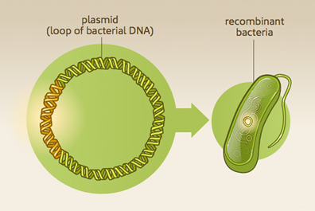


_Source:  https://www.nlm.nih.gov/exhibition/fromdnatobeer/img/exhibition-recombinantDNA.jpg_
<!-- #endregion -->

The Genetic Engineering Attribution Challenge (GEAC), a data science competition sponsored by altLabs and hosted by DrivenData, was created to crowdsource potential solutions to this problem.  (The competition page can be viewed at https://www.drivendata.org/competitions/63/genetic-engineering-attribution/.)  DrivenData and altlabs published a blog with some starter code and guidance to help participants get started and to successfully format competition submissions.  Partipicants downloaded training data and test data on which to make predictions for competition submission.  The training data set included over 63,000 plasmids submitted by a total of 1,314 labs.  Plasmid sequence lengths ranged from a few dozen DNA 'letters' to over 60,000, making this a fairly unusual sequential analysis relative to, say, natural language processing or time series analysis.


## Why I chose this project and how I approached it 
For my Flatiron data science capstone project, I chose to use a dataset from the GEAC competition.  It was a fascinating topic that allowed me to revisit and update the molecular biology knowledge I had gained in college.  It also pushed me to learn much more about deep learning and AI than I otherwise would have at the end of an already-rigorous data science program!


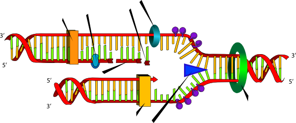 

_Source:  http://clipart-library.com/clipart/479704.htm_


While I did peek at a few abstracts of scientific papers by altlabs and others on this topic, I started off by thinking through the problem, applying what I had learned in the program, asking for guidance from my instructors, and beginning with the the guidance and starter code from the DataDriven/altlabs blog post.


# Obtaining and Exploring Data  


## Data Set Location, Features, and Starter Guidance

### Accessing the data sets

* The data sets provided by the competition organizers are too large to be hosted on github.  The required .csv files at https://www.drivendata.org/competitions/63/genetic-engineering-attribution/page/164/.  Login is required, but accounts are free and easy to set up.   

* The DrivenData website for this competition features a blog post that provides guidance and starter code to participants, so that everyone is able to access the data and format submissions properly.  The blog is available at https://www.drivendata.co/blog/genetic-attribution-benchmark/.


### Data Set Features

There are 41 columns in this dataset. Each row corresponds to a plasmid DNA sequence, which is uniquely identified by sequence_id, a 5-character alphanumeric string. In addition to the DNA sequences provided in sequence, there are 39 binary features that provide metadata about the plasmids. All variables are described below.

* ```sequence``` (type: string): A plasmid DNA sequence. Any Us were changed to Ts and letters other than A, T, G, C, or N were changed to Ns. Possible values: A, T, G, C, or N
* ```bacterial_resistance_ampicillin```, ```bacterial_resistance_chloramphenicol```, ```bacterial_resistance_kanamycin```, ```bacterial_resistance_other```, ```bacterial_resistance_spectinomycin``` (type: binary): One-hot encoded columns that indicate the antibiotic resistance of the plasmid used for selecting during bacterial growth and cloning.
* ```copy_number_high_copy```, ```copy_number_low_copy```, ```copy_number_unknown``` (type: binary): One-hot encoded columns that indicate the number of plasmids per bacterial cell.
* ```growth_strain_ccdb_survival```, ```growth_strain_dh10b```, ```growth_strain_dh5alpha```, ```growth_strain_neb_stable```, ```growth_strain_other```, ```growth_strain_stbl3```, ```growth_strain_top10```, ```growth_strain_xl1_blue``` (type: binary): One-hot encoded columns that indicate the strain used to clone the plasmid.
* ```growth_temp_30```, ```growth_temp_37```, ```growth_temp_other``` (type: binary): One-hot encoded columns that indicate the temperature the plasmid should be grown at.
* ```selectable_markers_blasticidin```, ```selectable_markers_his3```, ```selectable_markers_hygromycin```, ```selectable_markers_leu2```, ```selectable_markers_neomycin```, ```selectable_markers_other```, ```selectable_markers_puromycin```, ```selectable_markers_trp1```, ```selectable_markers_ura3```, ```selectable_markers_zeocin``` (type: binary): One-hot encoded columns that indicate genes that allow non-bacterial selection (for a plasmid used outside of the cloning organism).
* ```species_budding_yeast```, ```species_fly```, ```species_human```, ```species_mouse```, ```species_mustard_weed```, ```species_nematode```, ```species_other```, ```species_rat```, ```species_synthetic```, ```species_zebrafish``` (type: binary): One-hot encoded columns that indicate the species the plasmid is used in, after cloning.


### Starter guidance and code from altlabs and DrivenData
DrivenData and altlabs published a blog (https://www.drivendata.co/blog/genetic-attribution-benchmark/) providing ideas for how to approach the project and some starter code to explore the data and properly format model predictions for submission.  To generate predictions to feed into the function, they constructed a fairly simple random forest model with DNA n-grams ("bag of words").  They then took the model predictions and ran them through the function to generate the predictions in the appropriate format for competition submission.


## Data Exploration

Note:  What follows below is excerpts of code, visualizations, and results.  For full technical details, please see the technical notebook in the repo for this project.


### Training Set


<div>

<table border="1" class="dataframe">
  <thead>
    <tr style="text-align: right;">
      <th></th>
      <th>sequence</th>
      <th>bacterial_resistance_ampicillin</th>
      <th>bacterial_resistance_chloramphenicol</th>
      <th>bacterial_resistance_kanamycin</th>
      <th>bacterial_resistance_other</th>
      <th>bacterial_resistance_spectinomycin</th>
      <th>copy_number_high_copy</th>
      <th>copy_number_low_copy</th>
      <th>copy_number_unknown</th>
      <th>growth_strain_ccdb_survival</th>
      <th>growth_strain_dh10b</th>
      <th>growth_strain_dh5alpha</th>
      <th>growth_strain_neb_stable</th>
      <th>growth_strain_other</th>
      <th>growth_strain_stbl3</th>
      <th>growth_strain_top10</th>
      <th>growth_strain_xl1_blue</th>
      <th>growth_temp_30</th>
      <th>growth_temp_37</th>
      <th>growth_temp_other</th>
      <th>selectable_markers_blasticidin</th>
      <th>selectable_markers_his3</th>
      <th>selectable_markers_hygromycin</th>
      <th>selectable_markers_leu2</th>
      <th>selectable_markers_neomycin</th>
      <th>selectable_markers_other</th>
      <th>selectable_markers_puromycin</th>
      <th>selectable_markers_trp1</th>
      <th>selectable_markers_ura3</th>
      <th>selectable_markers_zeocin</th>
      <th>species_budding_yeast</th>
      <th>species_fly</th>
      <th>species_human</th>
      <th>species_mouse</th>
      <th>species_mustard_weed</th>
      <th>species_nematode</th>
      <th>species_other</th>
      <th>species_rat</th>
      <th>species_synthetic</th>
      <th>species_zebrafish</th>
    </tr>
    <tr>
      <th>sequence_id</th>
      <th></th>
      <th></th>
      <th></th>
      <th></th>
      <th></th>
      <th></th>
      <th></th>
      <th></th>
      <th></th>
      <th></th>
      <th></th>
      <th></th>
      <th></th>
      <th></th>
      <th></th>
      <th></th>
      <th></th>
      <th></th>
      <th></th>
      <th></th>
      <th></th>
      <th></th>
      <th></th>
      <th></th>
      <th></th>
      <th></th>
      <th></th>
      <th></th>
      <th></th>
      <th></th>
      <th></th>
      <th></th>
      <th></th>
      <th></th>
      <th></th>
      <th></th>
      <th></th>
      <th></th>
      <th></th>
      <th></th>
    </tr>
  </thead>
  <tbody>
    <tr>
      <th>9ZIMC</th>
      <td>CATGCATTAGTTATTAATAGTAATCAATTACGGGGTCATTAGTTCA...</td>
      <td>0.0</td>
      <td>0.0</td>
      <td>1.0</td>
      <td>0.0</td>
      <td>0.0</td>
      <td>1.0</td>
      <td>0.0</td>
      <td>0.0</td>
      <td>0.0</td>
      <td>0.0</td>
      <td>1.0</td>
      <td>0.0</td>
      <td>0.0</td>
      <td>0.0</td>
      <td>0.0</td>
      <td>0.0</td>
      <td>0.0</td>
      <td>1.0</td>
      <td>0.0</td>
      <td>0.0</td>
      <td>0.0</td>
      <td>0.0</td>
      <td>0.0</td>
      <td>0.0</td>
      <td>0.0</td>
      <td>0.0</td>
      <td>0.0</td>
      <td>0.0</td>
      <td>0.0</td>
      <td>0.0</td>
      <td>0.0</td>
      <td>0.0</td>
      <td>1.0</td>
      <td>0.0</td>
      <td>0.0</td>
      <td>0.0</td>
      <td>0.0</td>
      <td>0.0</td>
      <td>0.0</td>
    </tr>
    <tr>
      <th>5SAQC</th>
      <td>GCTGGATGGTTTGGGACATGTGCAGCCCCGTCTCTGTATGGAGTGA...</td>
      <td>1.0</td>
      <td>0.0</td>
      <td>0.0</td>
      <td>0.0</td>
      <td>0.0</td>
      <td>1.0</td>
      <td>0.0</td>
      <td>0.0</td>
      <td>0.0</td>
      <td>0.0</td>
      <td>1.0</td>
      <td>0.0</td>
      <td>0.0</td>
      <td>0.0</td>
      <td>0.0</td>
      <td>0.0</td>
      <td>0.0</td>
      <td>1.0</td>
      <td>0.0</td>
      <td>0.0</td>
      <td>0.0</td>
      <td>0.0</td>
      <td>0.0</td>
      <td>0.0</td>
      <td>0.0</td>
      <td>0.0</td>
      <td>0.0</td>
      <td>0.0</td>
      <td>0.0</td>
      <td>0.0</td>
      <td>0.0</td>
      <td>0.0</td>
      <td>1.0</td>
      <td>0.0</td>
      <td>0.0</td>
      <td>0.0</td>
      <td>0.0</td>
      <td>0.0</td>
      <td>0.0</td>
    </tr>
    <tr>
      <th>E7QRO</th>
      <td>NNCCGGGCTGTAGCTACACAGGGCGGAGATGAGAGCCCTACGAAAG...</td>
      <td>1.0</td>
      <td>0.0</td>
      <td>0.0</td>
      <td>0.0</td>
      <td>0.0</td>
      <td>1.0</td>
      <td>0.0</td>
      <td>0.0</td>
      <td>0.0</td>
      <td>0.0</td>
      <td>1.0</td>
      <td>0.0</td>
      <td>0.0</td>
      <td>0.0</td>
      <td>0.0</td>
      <td>0.0</td>
      <td>0.0</td>
      <td>1.0</td>
      <td>0.0</td>
      <td>0.0</td>
      <td>0.0</td>
      <td>0.0</td>
      <td>0.0</td>
      <td>0.0</td>
      <td>0.0</td>
      <td>0.0</td>
      <td>0.0</td>
      <td>0.0</td>
      <td>0.0</td>
      <td>0.0</td>
      <td>0.0</td>
      <td>0.0</td>
      <td>1.0</td>
      <td>0.0</td>
      <td>0.0</td>
      <td>0.0</td>
      <td>0.0</td>
      <td>0.0</td>
      <td>0.0</td>
    </tr>
    <tr>
      <th>CT5FP</th>
      <td>GCGGAGATGAAGAGCCCTACGAAAGCTGAGCCTGCGACTCCCGCAG...</td>
      <td>1.0</td>
      <td>0.0</td>
      <td>0.0</td>
      <td>0.0</td>
      <td>0.0</td>
      <td>1.0</td>
      <td>0.0</td>
      <td>0.0</td>
      <td>0.0</td>
      <td>0.0</td>
      <td>1.0</td>
      <td>0.0</td>
      <td>0.0</td>
      <td>0.0</td>
      <td>0.0</td>
      <td>0.0</td>
      <td>0.0</td>
      <td>1.0</td>
      <td>0.0</td>
      <td>0.0</td>
      <td>0.0</td>
      <td>0.0</td>
      <td>0.0</td>
      <td>0.0</td>
      <td>0.0</td>
      <td>0.0</td>
      <td>0.0</td>
      <td>0.0</td>
      <td>0.0</td>
      <td>0.0</td>
      <td>0.0</td>
      <td>0.0</td>
      <td>1.0</td>
      <td>0.0</td>
      <td>0.0</td>
      <td>0.0</td>
      <td>0.0</td>
      <td>0.0</td>
      <td>0.0</td>
    </tr>
    <tr>
      <th>7PTD8</th>
      <td>CGCGCATTACTTCACATGGTCCTCAAGGGTAACATGAAAGTGATCC...</td>
      <td>1.0</td>
      <td>0.0</td>
      <td>0.0</td>
      <td>0.0</td>
      <td>0.0</td>
      <td>1.0</td>
      <td>0.0</td>
      <td>0.0</td>
      <td>0.0</td>
      <td>0.0</td>
      <td>1.0</td>
      <td>0.0</td>
      <td>0.0</td>
      <td>0.0</td>
      <td>0.0</td>
      <td>0.0</td>
      <td>0.0</td>
      <td>1.0</td>
      <td>0.0</td>
      <td>0.0</td>
      <td>0.0</td>
      <td>0.0</td>
      <td>0.0</td>
      <td>0.0</td>
      <td>0.0</td>
      <td>0.0</td>
      <td>0.0</td>
      <td>0.0</td>
      <td>0.0</td>
      <td>0.0</td>
      <td>0.0</td>
      <td>0.0</td>
      <td>1.0</td>
      <td>0.0</td>
      <td>0.0</td>
      <td>0.0</td>
      <td>0.0</td>
      <td>0.0</td>
      <td>0.0</td>
    </tr>
    <tr>
      <th>...</th>
      <td>...</td>
      <td>...</td>
      <td>...</td>
      <td>...</td>
      <td>...</td>
      <td>...</td>
      <td>...</td>
      <td>...</td>
      <td>...</td>
      <td>...</td>
      <td>...</td>
      <td>...</td>
      <td>...</td>
      <td>...</td>
      <td>...</td>
      <td>...</td>
      <td>...</td>
      <td>...</td>
      <td>...</td>
      <td>...</td>
      <td>...</td>
      <td>...</td>
      <td>...</td>
      <td>...</td>
      <td>...</td>
      <td>...</td>
      <td>...</td>
      <td>...</td>
      <td>...</td>
      <td>...</td>
      <td>...</td>
      <td>...</td>
      <td>...</td>
      <td>...</td>
      <td>...</td>
      <td>...</td>
      <td>...</td>
      <td>...</td>
      <td>...</td>
      <td>...</td>
    </tr>
    <tr>
      <th>BOQSD</th>
      <td>AACAAAATATTAACGCTTACAATTTCCATTCGCCATTCAGGCTGCG...</td>
      <td>0.0</td>
      <td>0.0</td>
      <td>1.0</td>
      <td>0.0</td>
      <td>0.0</td>
      <td>0.0</td>
      <td>0.0</td>
      <td>1.0</td>
      <td>0.0</td>
      <td>0.0</td>
      <td>1.0</td>
      <td>0.0</td>
      <td>0.0</td>
      <td>0.0</td>
      <td>0.0</td>
      <td>0.0</td>
      <td>0.0</td>
      <td>1.0</td>
      <td>0.0</td>
      <td>0.0</td>
      <td>0.0</td>
      <td>0.0</td>
      <td>0.0</td>
      <td>1.0</td>
      <td>0.0</td>
      <td>0.0</td>
      <td>0.0</td>
      <td>0.0</td>
      <td>0.0</td>
      <td>0.0</td>
      <td>0.0</td>
      <td>1.0</td>
      <td>0.0</td>
      <td>0.0</td>
      <td>0.0</td>
      <td>0.0</td>
      <td>0.0</td>
      <td>0.0</td>
      <td>0.0</td>
    </tr>
    <tr>
      <th>5XVVU</th>
      <td>AACAAAATATTAACGCTTACAATTTCCATTCGCCATTCAGGCTGCG...</td>
      <td>0.0</td>
      <td>0.0</td>
      <td>1.0</td>
      <td>0.0</td>
      <td>0.0</td>
      <td>0.0</td>
      <td>0.0</td>
      <td>1.0</td>
      <td>0.0</td>
      <td>0.0</td>
      <td>1.0</td>
      <td>0.0</td>
      <td>0.0</td>
      <td>0.0</td>
      <td>0.0</td>
      <td>0.0</td>
      <td>0.0</td>
      <td>1.0</td>
      <td>0.0</td>
      <td>0.0</td>
      <td>0.0</td>
      <td>0.0</td>
      <td>0.0</td>
      <td>1.0</td>
      <td>0.0</td>
      <td>0.0</td>
      <td>0.0</td>
      <td>0.0</td>
      <td>0.0</td>
      <td>0.0</td>
      <td>0.0</td>
      <td>1.0</td>
      <td>0.0</td>
      <td>0.0</td>
      <td>0.0</td>
      <td>0.0</td>
      <td>0.0</td>
      <td>0.0</td>
      <td>0.0</td>
    </tr>
    <tr>
      <th>CVGHF</th>
      <td>CCGGTGGTGCATATCGGGGATGAAAGCTGGCGCATGATGACCACCG...</td>
      <td>1.0</td>
      <td>0.0</td>
      <td>0.0</td>
      <td>0.0</td>
      <td>0.0</td>
      <td>1.0</td>
      <td>0.0</td>
      <td>0.0</td>
      <td>0.0</td>
      <td>0.0</td>
      <td>1.0</td>
      <td>0.0</td>
      <td>0.0</td>
      <td>0.0</td>
      <td>0.0</td>
      <td>0.0</td>
      <td>0.0</td>
      <td>1.0</td>
      <td>0.0</td>
      <td>0.0</td>
      <td>0.0</td>
      <td>0.0</td>
      <td>0.0</td>
      <td>0.0</td>
      <td>0.0</td>
      <td>1.0</td>
      <td>0.0</td>
      <td>0.0</td>
      <td>0.0</td>
      <td>0.0</td>
      <td>0.0</td>
      <td>1.0</td>
      <td>0.0</td>
      <td>0.0</td>
      <td>0.0</td>
      <td>0.0</td>
      <td>0.0</td>
      <td>0.0</td>
      <td>0.0</td>
    </tr>
    <tr>
      <th>ZVT1A</th>
      <td>CTAGCTAGTCCTGCAGGTTTAAACGAATTCGCCCTTTGCTTTCTCT...</td>
      <td>1.0</td>
      <td>0.0</td>
      <td>0.0</td>
      <td>0.0</td>
      <td>0.0</td>
      <td>1.0</td>
      <td>0.0</td>
      <td>0.0</td>
      <td>0.0</td>
      <td>0.0</td>
      <td>1.0</td>
      <td>0.0</td>
      <td>0.0</td>
      <td>0.0</td>
      <td>0.0</td>
      <td>0.0</td>
      <td>0.0</td>
      <td>1.0</td>
      <td>0.0</td>
      <td>0.0</td>
      <td>0.0</td>
      <td>0.0</td>
      <td>0.0</td>
      <td>0.0</td>
      <td>0.0</td>
      <td>1.0</td>
      <td>0.0</td>
      <td>0.0</td>
      <td>0.0</td>
      <td>0.0</td>
      <td>0.0</td>
      <td>1.0</td>
      <td>0.0</td>
      <td>0.0</td>
      <td>0.0</td>
      <td>0.0</td>
      <td>0.0</td>
      <td>0.0</td>
      <td>0.0</td>
    </tr>
    <tr>
      <th>U5MR3</th>
      <td>TGGCGAATGGGACGCGCCCTGTAGCGGCGCATTAAGCGCGGCGGGT...</td>
      <td>0.0</td>
      <td>0.0</td>
      <td>1.0</td>
      <td>0.0</td>
      <td>0.0</td>
      <td>1.0</td>
      <td>0.0</td>
      <td>0.0</td>
      <td>0.0</td>
      <td>0.0</td>
      <td>1.0</td>
      <td>0.0</td>
      <td>0.0</td>
      <td>0.0</td>
      <td>0.0</td>
      <td>0.0</td>
      <td>0.0</td>
      <td>1.0</td>
      <td>0.0</td>
      <td>0.0</td>
      <td>0.0</td>
      <td>0.0</td>
      <td>0.0</td>
      <td>0.0</td>
      <td>0.0</td>
      <td>0.0</td>
      <td>0.0</td>
      <td>0.0</td>
      <td>0.0</td>
      <td>0.0</td>
      <td>0.0</td>
      <td>1.0</td>
      <td>0.0</td>
      <td>0.0</td>
      <td>0.0</td>
      <td>0.0</td>
      <td>0.0</td>
      <td>0.0</td>
      <td>0.0</td>
    </tr>
  </tbody>
</table>
<p>63017 rows × 40 columns</p>
</div>


```python
sequence_lengths = train_values.sequence.apply(len)
sequence_lengths.describe()
```


    count    63017.000000
    mean      4839.025501
    std       3883.148431
    min         20.000000
    25%        909.000000
    50%       4741.000000
    75%       7490.000000
    max      60099.000000
    Name: sequence, dtype: float64


### Distribution of plasmid lengths by number of plasmids of that length


We can see that the vast majority of plasmids are less than about 10,000 base pairs (bp), with a large spike of plasmids of length ~1,000 bp.  However, the scale of this graph can be misleading:  there are still thousands of plasmids beyond 10,000 bp in length; this can be seen in the following graphs.

<!-- #region -->


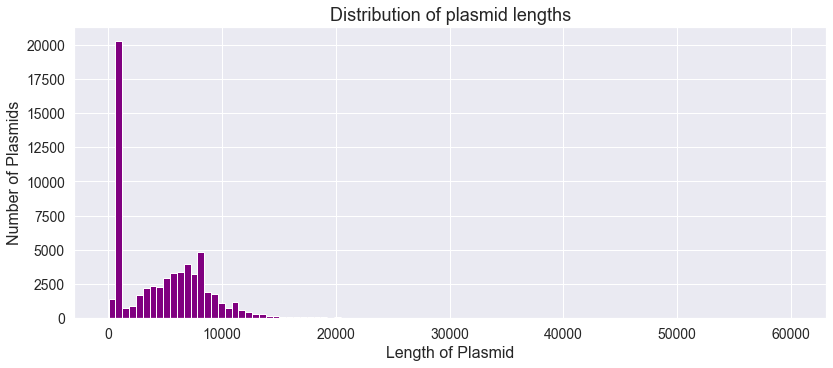


<!-- #endregion -->

Looking just at the distribution of plasmid lengths between 8,000 and 25000 bp, we see there are still many hundreds just in this bandwidth of plasmid length:


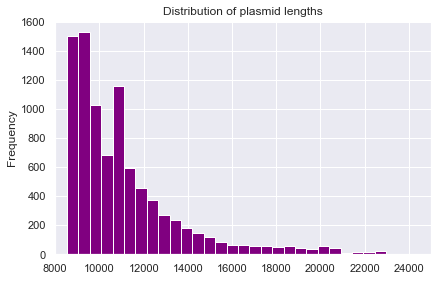


### Training labels (lab IDs)


(First 5 rows of dataframe)


<div>

<table border="1" class="dataframe">
  <thead>
    <tr style="text-align: right;">
      <th></th>
      <th>00Q4V31T</th>
      <th>012VT4JK</th>
      <th>028IO5W2</th>
      <th>03GRNN7N</th>
      <th>03Y3W51H</th>
      <th>09MQV1TY</th>
      <th>0A4AHRCT</th>
      <th>0A9M05NC</th>
      <th>0B9GCUVV</th>
      <th>0CL7QVG8</th>
      <th>0CML4B5I</th>
      <th>0DTHTJLJ</th>
      <th>0FFBBVE1</th>
      <th>0HWCWFNU</th>
      <th>0L3Y6ZB2</th>
      <th>0M44GDO8</th>
      <th>0MDYJM3H</th>
      <th>0N3V9P9M</th>
      <th>0NP55E93</th>
      <th>0PJ91ZT6</th>
      <th>0R296F9R</th>
      <th>0T2AZBD6</th>
      <th>0URA80CN</th>
      <th>0VRP2DI6</th>
      <th>0W6O08VX</th>
      <th>0WHP4PPK</th>
      <th>0XPTGGLP</th>
      <th>0XS4FHP3</th>
      <th>0Y24J5G2</th>
      <th>10TEBWK2</th>
      <th>11TTDKTM</th>
      <th>131RRHBV</th>
      <th>13LZE1F7</th>
      <th>14PBN8C2</th>
      <th>15D0Z97U</th>
      <th>15S88O4Q</th>
      <th>18C9J8EH</th>
      <th>19CAUKJB</th>
      <th>1AP294AT</th>
      <th>1B9BJ2IP</th>
      <th>1BE35FI1</th>
      <th>1CIHYCE4</th>
      <th>1DJ9L58E</th>
      <th>1DTDCRUO</th>
      <th>1EDZ6CA7</th>
      <th>1HCQTAYT</th>
      <th>1HK4VXP8</th>
      <th>1IXFZ3HO</th>
      <th>1K11RCST</th>
      <th>1KC6XYO6</th>
      <th>1KNFJ6KQ</th>
      <th>1KZHNVYR</th>
      <th>1LBGAU5Z</th>
      <th>1NXRMDN6</th>
      <th>1OQJ21E9</th>
      <th>1OWZDF82</th>
      <th>1PA232PA</th>
      <th>1PIGWQFY</th>
      <th>1Q1IUY3G</th>
      <th>1S515B69</th>
      <th>1TC200QC</th>
      <th>1TI4HS4X</th>
      <th>1UOA7CA1</th>
      <th>1UREJUSJ</th>
      <th>1UU0CHTK</th>
      <th>1VPOX8VI</th>
      <th>1VQS4WNS</th>
      <th>1X0VC0O1</th>
      <th>1XU60MET</th>
      <th>1ZC8RPN1</th>
      <th>20ABQYHS</th>
      <th>20CEB9KE</th>
      <th>216DWMG6</th>
      <th>21ZFBX5E</th>
      <th>24SL2992</th>
      <th>25UVYUID</th>
      <th>26KK8UM5</th>
      <th>27OS3BTP</th>
      <th>28D4D4QM</th>
      <th>298AMR5C</th>
      <th>29D6Q091</th>
      <th>2AQG6I31</th>
      <th>2BAFY4GP</th>
      <th>2CJHRNWD</th>
      <th>2FCX4O0X</th>
      <th>2GGU2QA2</th>
      <th>2GSZMU46</th>
      <th>2GTLIT33</th>
      <th>2H37WPKA</th>
      <th>2HNZZYDB</th>
      <th>2JPNC9X6</th>
      <th>2KDACBQT</th>
      <th>2L336TQL</th>
      <th>2M3CXS8N</th>
      <th>2MCB7LXW</th>
      <th>2MQ2NPMA</th>
      <th>2NEXWXMT</th>
      <th>2PY8K6GU</th>
      <th>2Q33W599</th>
      <th>2SSVM7H9</th>
      <th>2TVMHQTW</th>
      <th>2TXY439E</th>
      <th>2VP4JPB9</th>
      <th>2VTLZHDS</th>
      <th>2VX4F6RC</th>
      <th>2XC1478M</th>
      <th>2XX0N87I</th>
      <th>2Y9L13L4</th>
      <th>2YCH1PUI</th>
      <th>2YLQA8OZ</th>
      <th>303BN0Z0</th>
      <th>318RH8P0</th>
      <th>330L4OIV</th>
      <th>33AR5KVE</th>
      <th>343M819H</th>
      <th>34TE1Q0A</th>
      <th>35MKXPL0</th>
      <th>36W150XW</th>
      <th>36XLYYGZ</th>
      <th>37VO60SB</th>
      <th>384ASNLB</th>
      <th>38MDETY1</th>
      <th>38MEQ4SU</th>
      <th>39LLQ2PB</th>
      <th>39TEZ0C3</th>
      <th>39TPBOL7</th>
      <th>3BGLF8BC</th>
      <th>3C2VZQ2R</th>
      <th>3C952KY7</th>
      <th>3D9CMQ4V</th>
      <th>3EARN0Z7</th>
      <th>3EYBG174</th>
      <th>3EZXYI3U</th>
      <th>3FPH0N6R</th>
      <th>3FW33G68</th>
      <th>3GEXBRC0</th>
      <th>3KCEM7V4</th>
      <th>3L314D8W</th>
      <th>3LSNTL1N</th>
      <th>3MDRJUI2</th>
      <th>3MX1D3LD</th>
      <th>3N169DM2</th>
      <th>3NSJ6N02</th>
      <th>3O1GIAV7</th>
      <th>3QP4D23X</th>
      <th>3RK54JUW</th>
      <th>3TLD81QQ</th>
      <th>3TUFYWQN</th>
      <th>3TXFYNKG</th>
      <th>3X2GGDHW</th>
      <th>3XE0BJDW</th>
      <th>3YAQWNBK</th>
      <th>3YEGUN04</th>
      <th>3YYEC52Y</th>
      <th>40MD0YZ3</th>
      <th>40ZI3TDN</th>
      <th>443NZOSB</th>
      <th>448QVC4C</th>
      <th>44N2CYI9</th>
      <th>459BZKP3</th>
      <th>4648UZGD</th>
      <th>46AZ97U9</th>
      <th>48F0EUVN</th>
      <th>49571DXY</th>
      <th>49YZILWR</th>
      <th>4CKAV3LS</th>
      <th>4DGGCYVE</th>
      <th>4DGMNDIC</th>
      <th>4E7187A9</th>
      <th>4GF31RCS</th>
      <th>4GHCND6Z</th>
      <th>4IADYZ8R</th>
      <th>4IDTMY10</th>
      <th>4J7KEYE2</th>
      <th>4KSHU5M7</th>
      <th>4LCFACE1</th>
      <th>4LQ8L195</th>
      <th>4M3XG8RC</th>
      <th>4O39WLXM</th>
      <th>4O5RQHEF</th>
      <th>4PKCMX7O</th>
      <th>4QK5ZDHA</th>
      <th>4QU07FT7</th>
      <th>4RCA1UZG</th>
      <th>4RHLX089</th>
      <th>4S1LIWGV</th>
      <th>4TIT4L5F</th>
      <th>4U5LAAN5</th>
      <th>4VHMF1RI</th>
      <th>4WAQ4VFB</th>
      <th>4WRI77CU</th>
      <th>4X2RTV2D</th>
      <th>4Y4DT3SL</th>
      <th>4ZYW54M8</th>
      <th>50NBGIOB</th>
      <th>52Y9GFGK</th>
      <th>54C6PEBH</th>
      <th>54ZFOPSF</th>
      <th>558GIQ68</th>
      <th>55HTZ7T0</th>
      <th>579G0TJI</th>
      <th>57FHO8YC</th>
      <th>57NGF1YS</th>
      <th>58BSUZQB</th>
      <th>5ASQZ0OT</th>
      <th>5AUVXXDU</th>
      <th>5BNUT8AW</th>
      <th>5BTY65G6</th>
      <th>5CBNCRST</th>
      <th>5FUDT1QA</th>
      <th>5H71LUBY</th>
      <th>5K2PTY6L</th>
      <th>5KXWXV9G</th>
      <th>5LH9NUMK</th>
      <th>5OBD73W0</th>
      <th>5OF7OYEA</th>
      <th>5OFUVG9U</th>
      <th>5PC2F8NE</th>
      <th>5PR9OSRS</th>
      <th>5Q9ETXJL</th>
      <th>5QLBIUXN</th>
      <th>5QY2HU8J</th>
      <th>5SCOFTY2</th>
      <th>5SGMS705</th>
      <th>5V3Z108E</th>
      <th>5W2PCT95</th>
      <th>5X9VNAN3</th>
      <th>5Z4CMIY5</th>
      <th>5ZB8I3T0</th>
      <th>5ZW05824</th>
      <th>60HBQEP8</th>
      <th>62PKSARW</th>
      <th>638UYIQC</th>
      <th>64FFXH4M</th>
      <th>65CCBIXK</th>
      <th>669R7ER0</th>
      <th>66XSSS3Q</th>
      <th>685KTH3G</th>
      <th>68OY1RK5</th>
      <th>69M351P4</th>
      <th>6AT20D5S</th>
      <th>6DBY872A</th>
      <th>6E28DNQK</th>
      <th>6KT0EAKX</th>
      <th>6LQ0W02R</th>
      <th>6NCTAA30</th>
      <th>6NKNB308</th>
      <th>6NULQ6KP</th>
      <th>6PS2LHCV</th>
      <th>6PXRABDR</th>
      <th>6QBXXYN4</th>
      <th>6QUCW04X</th>
      <th>6SBB6IL2</th>
      <th>6T9SGGS1</th>
      <th>6TT5CXVI</th>
      <th>6TTWEXT3</th>
      <th>6UGWNYCX</th>
      <th>6UI9XACW</th>
      <th>6UXF7L28</th>
      <th>6WD2LIHN</th>
      <th>6WT1F4RJ</th>
      <th>6XVBD39G</th>
      <th>6YSX60MZ</th>
      <th>7039MMH2</th>
      <th>709K4VRB</th>
      <th>7185O9V8</th>
      <th>71R7TM8L</th>
      <th>738FBTIL</th>
      <th>73RKEO3U</th>
      <th>747XMBIJ</th>
      <th>74RXUGS4</th>
      <th>74TS5KG4</th>
      <th>78QGAL01</th>
      <th>78XDAJNS</th>
      <th>7ANCD9AK</th>
      <th>7DMNXU84</th>
      <th>7E63E5RD</th>
      <th>7F905YRZ</th>
      <th>7GWW4637</th>
      <th>7IHPTKFF</th>
      <th>7KG191H8</th>
      <th>7MUAYEHW</th>
      <th>7NGLQ1CA</th>
      <th>7O3PWIL0</th>
      <th>7OV5K86R</th>
      <th>7PWA4ZJN</th>
      <th>7QEORFJN</th>
      <th>7QF2VB5B</th>
      <th>7QWHL2C6</th>
      <th>7SW79VAJ</th>
      <th>7T28F53W</th>
      <th>7TYZHD5J</th>
      <th>7UU8O65I</th>
      <th>7WKS90AG</th>
      <th>7X3RSRT5</th>
      <th>7XPDUYJE</th>
      <th>7XU8ACPI</th>
      <th>7YSTNZME</th>
      <th>7ZV0Z1T9</th>
      <th>81QAZACE</th>
      <th>82NXGO4K</th>
      <th>862RYK1K</th>
      <th>86ET7WW4</th>
      <th>88E6O06E</th>
      <th>8ABA3MWO</th>
      <th>8BF8ANNO</th>
      <th>8C0T09C6</th>
      <th>8C9737JL</th>
      <th>8D4D6M5V</th>
      <th>8ECLELF1</th>
      <th>8EKC599S</th>
      <th>8F0XPAZX</th>
      <th>8FT6HD4D</th>
      <th>8FZMCIFG</th>
      <th>8G29TDOS</th>
      <th>8H6M75LF</th>
      <th>8HI3GY44</th>
      <th>8HW91I4K</th>
      <th>8HZXGARR</th>
      <th>8IPYO6SS</th>
      <th>8JKDTT0Y</th>
      <th>8K0HZBL0</th>
      <th>8MUKKVMF</th>
      <th>8MW998Z0</th>
      <th>8N5EPD5C</th>
      <th>8OBT3FSQ</th>
      <th>8ORZZFA7</th>
      <th>8RIKS696</th>
      <th>8SW7WFE6</th>
      <th>8T12OXHS</th>
      <th>8US76O46</th>
      <th>8VCFY56I</th>
      <th>8VI1RY3M</th>
      <th>8VLB2R3D</th>
      <th>8WAY3T1E</th>
      <th>8Z6SANMH</th>
      <th>8ZB94ICE</th>
      <th>8ZB99KHH</th>
      <th>904V6V2S</th>
      <th>909V5A2H</th>
      <th>91Y7NKBM</th>
      <th>91Z8RRSB</th>
      <th>92WF5WVN</th>
      <th>93R70J1L</th>
      <th>93WIIL7Y</th>
      <th>97FR69TQ</th>
      <th>97PR85CP</th>
      <th>99A19JAD</th>
      <th>9DBCRJYM</th>
      <th>9DKQF2I2</th>
      <th>9DRMDPIZ</th>
      <th>9G5XH4HI</th>
      <th>9GDHC3D0</th>
      <th>9HPM9NFY</th>
      <th>9HRDSOST</th>
      <th>9IVIPDX5</th>
      <th>9JRKFKVC</th>
      <th>9KHXMSMW</th>
      <th>9KV8R3HP</th>
      <th>9LSH625Y</th>
      <th>9MC0DPDJ</th>
      <th>9MC1YKKZ</th>
      <th>9MEFUZQN</th>
      <th>9MG50RM7</th>
      <th>9MZBKXJF</th>
      <th>9PWYZMNS</th>
      <th>9QQZ79I6</th>
      <th>9R765PJF</th>
      <th>9SJCUIKS</th>
      <th>9SSQ1FSY</th>
      <th>9U0DELRD</th>
      <th>9WEGTUIJ</th>
      <th>9WQQKFVK</th>
      <th>9XE0FL8P</th>
      <th>9Y5EWA8O</th>
      <th>9YM3QINZ</th>
      <th>9ZTEQPA4</th>
      <th>A0ADXLZU</th>
      <th>A0Z7XCDN</th>
      <th>A1738D1Z</th>
      <th>A18S09P2</th>
      <th>A1A8EROR</th>
      <th>A1J0YXZX</th>
      <th>A2A1R52R</th>
      <th>A2U1AIC1</th>
      <th>A332O9JW</th>
      <th>A3FZPLM1</th>
      <th>A3QUOXIX</th>
      <th>A44GW57T</th>
      <th>A4BM0B6A</th>
      <th>A6RCKKER</th>
      <th>A768XIWP</th>
      <th>A78F2YFJ</th>
      <th>A7CK3WNB</th>
      <th>A810BWR5</th>
      <th>A8FZHMOS</th>
      <th>A9G8OKRG</th>
      <th>AATDRXYQ</th>
      <th>AAURK3RG</th>
      <th>ABMAPCYN</th>
      <th>ABWCZWFU</th>
      <th>ACO8WWPF</th>
      <th>ADB7SAPN</th>
      <th>AG93GZYN</th>
      <th>AHMVJ2VP</th>
      <th>AL7N3DL2</th>
      <th>AM8AJH2H</th>
      <th>AMSPTQVJ</th>
      <th>AMV4U0A0</th>
      <th>AOCCEP3S</th>
      <th>AOFJN8HX</th>
      <th>AOFPYGHC</th>
      <th>AOKRU4AF</th>
      <th>AOQQU910</th>
      <th>AR433PVR</th>
      <th>AS30HPUK</th>
      <th>AUCMR8HU</th>
      <th>AUUSW2YZ</th>
      <th>AUZNSS79</th>
      <th>AV7ONIVD</th>
      <th>AWWC1KIV</th>
      <th>B131HDBV</th>
      <th>B17J3JSX</th>
      <th>B1I4L0XW</th>
      <th>B25KOPVH</th>
      <th>B2BULVFH</th>
      <th>B4L9R8JU</th>
      <th>B517ID6W</th>
      <th>B832TQ6U</th>
      <th>B8FC99WI</th>
      <th>B8YR9IIK</th>
      <th>B9H5SLHK</th>
      <th>BBTA1L43</th>
      <th>BBZJCYJ0</th>
      <th>BD9EXLDM</th>
      <th>BDQOSDFG</th>
      <th>BDSEVK9M</th>
      <th>BH7HW7XH</th>
      <th>BHKOO62U</th>
      <th>BHNI9DCI</th>
      <th>BHW9ILRC</th>
      <th>BJKTDFN4</th>
      <th>BL2TLVFC</th>
      <th>BLC9WIIM</th>
      <th>BLFM4YKK</th>
      <th>BLNELN02</th>
      <th>BN8BMXPM</th>
      <th>BNFZZTKX</th>
      <th>BP2X9ITX</th>
      <th>BPT27UPE</th>
      <th>BQJ79YS3</th>
      <th>BSEEWS00</th>
      <th>BSH6LB19</th>
      <th>BTQL3UFQ</th>
      <th>BV6PVSO5</th>
      <th>BV8D4RYV</th>
      <th>BWFN4ZI7</th>
      <th>BXMEKONO</th>
      <th>BY5IEG4O</th>
      <th>BZBNZDNS</th>
      <th>C1BIUBL5</th>
      <th>C35C2C2W</th>
      <th>C4W63WJ2</th>
      <th>CA0MBQ9S</th>
      <th>CAO2H0WE</th>
      <th>CAQEITX6</th>
      <th>CB714TAM</th>
      <th>CBCQST29</th>
      <th>CBFKYZ9S</th>
      <th>CBKRHK4I</th>
      <th>CDM3SRRP</th>
      <th>CDU1LWN3</th>
      <th>CEATO4LM</th>
      <th>CENOJ84D</th>
      <th>CFDEOSH4</th>
      <th>CFOET28L</th>
      <th>CFQ9PAJA</th>
      <th>CHTQ7QLX</th>
      <th>CJFLQNE1</th>
      <th>CK1M5UHL</th>
      <th>CKDZNQV2</th>
      <th>CLO7VQ12</th>
      <th>CNX48K3H</th>
      <th>COEMYLH1</th>
      <th>COVE5WRD</th>
      <th>CRP30ATM</th>
      <th>CTJGWLX0</th>
      <th>CTLP20Y9</th>
      <th>CWZP8AQK</th>
      <th>CY64689U</th>
      <th>CYCSYMQ3</th>
      <th>CZUGPH88</th>
      <th>D0EKC82X</th>
      <th>D0NFHXL2</th>
      <th>D0YWREJ5</th>
      <th>D10S0UDQ</th>
      <th>D1BZRMOB</th>
      <th>D2N5DOSQ</th>
      <th>D3KJQCYH</th>
      <th>D4PJE56U</th>
      <th>D4Q1QMRJ</th>
      <th>D63K976U</th>
      <th>D7L6VZNV</th>
      <th>D8MRQA91</th>
      <th>D8OQ3YNK</th>
      <th>DD0JBK3T</th>
      <th>DE6NAU7D</th>
      <th>DEFNZK0A</th>
      <th>DEWKAO5I</th>
      <th>DGE8LLAJ</th>
      <th>DGQ2L6KM</th>
      <th>DJW5U56I</th>
      <th>DKA65CRR</th>
      <th>DLSU0QRX</th>
      <th>DN01XVIU</th>
      <th>DQGG01WF</th>
      <th>DRFCUPZO</th>
      <th>DSE2G8LF</th>
      <th>DY0KIZZ9</th>
      <th>DZ2XFGQS</th>
      <th>E3CE5WE9</th>
      <th>E3CRPQL7</th>
      <th>E3FFACSU</th>
      <th>E4EF2K0A</th>
      <th>E4T4IQMG</th>
      <th>E59C5N01</th>
      <th>E5OB5QF1</th>
      <th>E6G69ESA</th>
      <th>E6TPDVWA</th>
      <th>E7CPRIYW</th>
      <th>E7EZD62E</th>
      <th>E8100WU0</th>
      <th>E8GMEHFW</th>
      <th>EA2DKNTD</th>
      <th>EBF1G8Z7</th>
      <th>ED0OS5OF</th>
      <th>EEC8D29F</th>
      <th>EFKGYR79</th>
      <th>EI8B4WEC</th>
      <th>EJ3T17DB</th>
      <th>EJXP2QAW</th>
      <th>EKHYS325</th>
      <th>EKXAPD70</th>
      <th>EL9FN1LB</th>
      <th>ELF2BN3S</th>
      <th>ELX1D1DS</th>
      <th>EMJXDINV</th>
      <th>EMNH5MYX</th>
      <th>EN78WKI4</th>
      <th>EOQAQ9X1</th>
      <th>EPDX32D3</th>
      <th>EQPB3YTZ</th>
      <th>ER1IJR80</th>
      <th>ETR2SP13</th>
      <th>EW4ZXWSN</th>
      <th>EXQZ5V7S</th>
      <th>EYOJGC9T</th>
      <th>EZ40BRHE</th>
      <th>EZL4HNHH</th>
      <th>EZMV5TKG</th>
      <th>F0ESSJYM</th>
      <th>F0MOWJYA</th>
      <th>F1X6DMDH</th>
      <th>F3D2JAYU</th>
      <th>F3S4VUQI</th>
      <th>F50DBVIK</th>
      <th>F8I0DT7Z</th>
      <th>F8LNIZ27</th>
      <th>FCI1HZ3G</th>
      <th>FEBWERSN</th>
      <th>FH8TEJI1</th>
      <th>FHR8UUYO</th>
      <th>FHZYKEUV</th>
      <th>FJTJ4KY0</th>
      <th>FLHGDG0P</th>
      <th>FLSWA4NU</th>
      <th>FLU9ZT18</th>
      <th>FMJ19E48</th>
      <th>FN1RKQ2M</th>
      <th>FN38BX60</th>
      <th>FNKCHGB7</th>
      <th>FNM1Z945</th>
      <th>FPH5H8JT</th>
      <th>FQ8V2QHL</th>
      <th>FRFT0H8N</th>
      <th>FRK40JVP</th>
      <th>FRX9XJYW</th>
      <th>FSR0IC6I</th>
      <th>FVYCRUFK</th>
      <th>FWOZ05UZ</th>
      <th>FXBIP7LS</th>
      <th>FXRWH0M9</th>
      <th>FZ37IFWH</th>
      <th>G2P73NZ0</th>
      <th>G4UJDFPK</th>
      <th>G57JANUL</th>
      <th>G6MP6EIN</th>
      <th>G7MXLRV8</th>
      <th>G81LO0AZ</th>
      <th>G8QWQL1C</th>
      <th>GB45D1XV</th>
      <th>GBX3MNVS</th>
      <th>GDV3S3ZG</th>
      <th>GHG5MDER</th>
      <th>GJKR73YA</th>
      <th>GJPI1WIV</th>
      <th>GKY6ZB15</th>
      <th>GKY7BZOQ</th>
      <th>GLOJFBA0</th>
      <th>GLUZC5HC</th>
      <th>GM3HKY2J</th>
      <th>GS8G1IFF</th>
      <th>GSK9JT39</th>
      <th>GSNU5TXL</th>
      <th>GT4RHNUE</th>
      <th>GTVTUGVY</th>
      <th>GUCIE6TT</th>
      <th>GUWYJRRS</th>
      <th>GWJ0A1IK</th>
      <th>GWP6E8FA</th>
      <th>GYCOAVYS</th>
      <th>GYCY8LCF</th>
      <th>GZMPRX5J</th>
      <th>H0WSDLJE</th>
      <th>H12S8X2Q</th>
      <th>H1G4FFR7</th>
      <th>H20JGHP0</th>
      <th>H3D82ATM</th>
      <th>H3RWZ7UR</th>
      <th>H48Y5BOY</th>
      <th>H5Y73UHQ</th>
      <th>H9RBDN30</th>
      <th>HB3OQUA5</th>
      <th>HCW1Y9QM</th>
      <th>HGN5HD65</th>
      <th>HGPS0FQN</th>
      <th>HHSIC4NY</th>
      <th>HI7ZNYCK</th>
      <th>HJNGSDJ5</th>
      <th>HK78MCH7</th>
      <th>HNGYSI62</th>
      <th>HODOBX62</th>
      <th>HQC2OFGM</th>
      <th>HRFD8R1G</th>
      <th>HRWBEBRE</th>
      <th>HT51BMN1</th>
      <th>HTXABMRS</th>
      <th>HV6GZXC3</th>
      <th>HVAG84XI</th>
      <th>HVBBJM37</th>
      <th>HVN93I56</th>
      <th>HVXSID0M</th>
      <th>HVZMFFNW</th>
      <th>HX2XDS73</th>
      <th>HX5NMCPJ</th>
      <th>HY9DN23J</th>
      <th>HZ5C2E4C</th>
      <th>I0J54PBT</th>
      <th>I16TS2B4</th>
      <th>I1RQMFZC</th>
      <th>I2ATV1DI</th>
      <th>I2N7C27Y</th>
      <th>I3UODLOR</th>
      <th>I5L6E1U2</th>
      <th>I5RNBXF3</th>
      <th>I6B3VKYD</th>
      <th>I7FXTVDP</th>
      <th>I8U0Q5FP</th>
      <th>I9MWC6I3</th>
      <th>IBBLXRDR</th>
      <th>ICDP084U</th>
      <th>ICRBJL24</th>
      <th>ID37U3DA</th>
      <th>IDXJ25FE</th>
      <th>IGHBC70Q</th>
      <th>IH12MVU4</th>
      <th>IIWFYXGG</th>
      <th>IJEA3NUI</th>
      <th>IL47R85Z</th>
      <th>ILKPIFSA</th>
      <th>IM2JLO1B</th>
      <th>IMFV7GM3</th>
      <th>IMVSI4VW</th>
      <th>INDCDVP0</th>
      <th>INELF20P</th>
      <th>INJ6L6NB</th>
      <th>IO2FYB6G</th>
      <th>IO56YRTG</th>
      <th>IOKPSO7K</th>
      <th>IOOQONCI</th>
      <th>IOPR6B78</th>
      <th>IP9XMFII</th>
      <th>IPV1W17S</th>
      <th>IPVYEI8G</th>
      <th>IQPZXRU2</th>
      <th>IS75OD95</th>
      <th>ISMP5LYF</th>
      <th>IUJPYIRX</th>
      <th>IYKXT23R</th>
      <th>IZD0O5Q0</th>
      <th>IZSQDCWP</th>
      <th>J0NVCXDJ</th>
      <th>J1UFMOCR</th>
      <th>J339EI56</th>
      <th>J3752QSY</th>
      <th>J3L1KD1J</th>
      <th>J3YKGOCX</th>
      <th>J5WRC3DJ</th>
      <th>J648LM1S</th>
      <th>J70NZZIW</th>
      <th>J7PWRE94</th>
      <th>J9M11KX1</th>
      <th>JAEI655A</th>
      <th>JB8JTFSG</th>
      <th>JC35D8WT</th>
      <th>JC6LUZLT</th>
      <th>JCHNPTSF</th>
      <th>JDENEZ6I</th>
      <th>JICWX3AS</th>
      <th>JJBJFUAT</th>
      <th>JK9C0VN8</th>
      <th>JKUCC6UK</th>
      <th>JL1OZP2G</th>
      <th>JMJD18BP</th>
      <th>JN497K3S</th>
      <th>JNB98WP1</th>
      <th>JNU5CAOV</th>
      <th>JO1WTZOB</th>
      <th>JPI7LZJ3</th>
      <th>JPO7CTQP</th>
      <th>JQ4YBT3Z</th>
      <th>JQ7Z5Q44</th>
      <th>JQJ499YN</th>
      <th>JRBK08H6</th>
      <th>JRDHZ51W</th>
      <th>JRRTJ3GV</th>
      <th>JS1KUAD6</th>
      <th>JS59HL6M</th>
      <th>JSEGAB8K</th>
      <th>JT4GYL2P</th>
      <th>JUC55NLK</th>
      <th>JUYW4QZ1</th>
      <th>JVWQ5HEJ</th>
      <th>JWVCJ3UR</th>
      <th>JWYYB1L5</th>
      <th>JXDP2C4M</th>
      <th>JYZ82A2B</th>
      <th>JZ1RSLKQ</th>
      <th>JZ2KQL0P</th>
      <th>JZS556ZA</th>
      <th>JZTRRSKQ</th>
      <th>K1DU5H0C</th>
      <th>K1K1AESM</th>
      <th>K212MH7P</th>
      <th>K25LXPOI</th>
      <th>K3QD4AHX</th>
      <th>K4AGNZ3R</th>
      <th>K57LN37R</th>
      <th>K83DA8K5</th>
      <th>KB0YFLBH</th>
      <th>KD7N9YDF</th>
      <th>KDW3ZVWJ</th>
      <th>KDZ388UF</th>
      <th>KF32BDPB</th>
      <th>KFWFMIUK</th>
      <th>KG943QKP</th>
      <th>KGMINGSB</th>
      <th>KH4VOX9Q</th>
      <th>KJJYCUJ7</th>
      <th>KKG07XA9</th>
      <th>KKIO1X0Z</th>
      <th>KM3OV97R</th>
      <th>KMPCXZUY</th>
      <th>KMSH5BSO</th>
      <th>KRS7ST1L</th>
      <th>KSFFKSV7</th>
      <th>KU0G64D0</th>
      <th>KUGU9MQC</th>
      <th>KUH39TQR</th>
      <th>KV5TCH8S</th>
      <th>KVLIE219</th>
      <th>KWH2Y6KA</th>
      <th>L0FS3EPM</th>
      <th>L27ULB0P</th>
      <th>L2HRYP1A</th>
      <th>L2UTYYJT</th>
      <th>L3OPGJO5</th>
      <th>L3RQSW75</th>
      <th>L3SSKU27</th>
      <th>L5AMS3QT</th>
      <th>L657W1BK</th>
      <th>L76WWQ74</th>
      <th>L78GOBQS</th>
      <th>L905DK46</th>
      <th>LDCSZOKC</th>
      <th>LF9AQIHZ</th>
      <th>LFQ6YRHV</th>
      <th>LGEAIIK8</th>
      <th>LGTP4O86</th>
      <th>LHMKC873</th>
      <th>LHNLO8Q8</th>
      <th>LKC4LOOM</th>
      <th>LKR5NGJZ</th>
      <th>LKVB0S84</th>
      <th>LL11R5T6</th>
      <th>LM6LV3JB</th>
      <th>LNTF6KP8</th>
      <th>LPBA27LH</th>
      <th>LPQY1SEL</th>
      <th>LQ6K46C8</th>
      <th>LU684LJ9</th>
      <th>LUHRMKEB</th>
      <th>LUI0TOT2</th>
      <th>LVXSGLT6</th>
      <th>LWQ8FULT</th>
      <th>LXBPBCS3</th>
      <th>LXOZJ3TV</th>
      <th>LXPTXE5K</th>
      <th>LYY8P69T</th>
      <th>M1CZ7MK8</th>
      <th>M2HPA1EK</th>
      <th>M2R84KMY</th>
      <th>M2W28OUV</th>
      <th>M3B15QGL</th>
      <th>M3MFQNC7</th>
      <th>M46L0EBU</th>
      <th>M4V0NJ97</th>
      <th>M59DNUXD</th>
      <th>M9265ASV</th>
      <th>M9PHW06O</th>
      <th>MB9HHEPN</th>
      <th>MBQUJESG</th>
      <th>MDCIP8E0</th>
      <th>MEKV5BRI</th>
      <th>MEVIH0XF</th>
      <th>MFZHQ165</th>
      <th>MGQBELNN</th>
      <th>MH0GC0GY</th>
      <th>MIUE47ZL</th>
      <th>MJR1CR7U</th>
      <th>ML1YCDCG</th>
      <th>ML5W6LDB</th>
      <th>MLGLKKI7</th>
      <th>MMU3QFIP</th>
      <th>MNV2YSWZ</th>
      <th>MOCIAZ0D</th>
      <th>MQKR83SM</th>
      <th>MQQTIYIC</th>
      <th>MQRIDTFZ</th>
      <th>MULMC195</th>
      <th>MUO5QBB6</th>
      <th>MV1CMX4O</th>
      <th>MXV7CSHI</th>
      <th>MZOM2K35</th>
      <th>N0CP1NI7</th>
      <th>N0FDUY5E</th>
      <th>N5LOOJSR</th>
      <th>N5X3YG2I</th>
      <th>N764BFJU</th>
      <th>N7BY4DKZ</th>
      <th>N8FNYI0A</th>
      <th>N8X63KYC</th>
      <th>N9I581ZL</th>
      <th>NBCZC85X</th>
      <th>ND7I48LA</th>
      <th>ND88CY09</th>
      <th>NDDT3NOB</th>
      <th>NDZT8PV3</th>
      <th>NHNLVWDR</th>
      <th>NIKHJTWP</th>
      <th>NIRCF0RK</th>
      <th>NK0S2WH6</th>
      <th>NKPC0Z4Q</th>
      <th>NKRRLD5O</th>
      <th>NMQKJMH3</th>
      <th>NNNIMDVI</th>
      <th>NPWC1BXV</th>
      <th>NQVW27OC</th>
      <th>NR26DCAB</th>
      <th>NRRH4BON</th>
      <th>NT9Y0D19</th>
      <th>NTLCS343</th>
      <th>NUOEY3LD</th>
      <th>NUSJ1NGL</th>
      <th>NUYVBFLU</th>
      <th>NWE84W10</th>
      <th>NWKWVAIA</th>
      <th>NX7I9PQG</th>
      <th>NYI75N90</th>
      <th>O1LMIA6M</th>
      <th>O3M287V6</th>
      <th>O4VJ2EV7</th>
      <th>O55K40VQ</th>
      <th>O5PJEO54</th>
      <th>O69KS0OS</th>
      <th>O7NEA7KO</th>
      <th>O8E18PJ4</th>
      <th>OAEZWMZR</th>
      <th>OAPTL0AF</th>
      <th>OB97CO94</th>
      <th>OCJ3W2EF</th>
      <th>OEGM98R5</th>
      <th>OERPDTWW</th>
      <th>OG01U0FT</th>
      <th>OJ9HCGTB</th>
      <th>OKI0Z2UO</th>
      <th>OKK933IV</th>
      <th>OKWROFEH</th>
      <th>OL1HWRRD</th>
      <th>OL59ZZX5</th>
      <th>OML0TEF3</th>
      <th>ON2CU60C</th>
      <th>ON9AXMKF</th>
      <th>ONPQ2I44</th>
      <th>OOKK1JHN</th>
      <th>OPPRIPN9</th>
      <th>OUA1CRWO</th>
      <th>OUJLF506</th>
      <th>OVPHRVOD</th>
      <th>OYRI4NVE</th>
      <th>P361G1OD</th>
      <th>P3Q11IAK</th>
      <th>P4H26KKX</th>
      <th>P8PW7Q1Q</th>
      <th>PEUBDA2B</th>
      <th>PFI6E05S</th>
      <th>PFNRAGJP</th>
      <th>PGWZZALU</th>
      <th>PHQEJTNO</th>
      <th>PIT16TZ9</th>
      <th>PJYVLL0Z</th>
      <th>PKC5LJ6W</th>
      <th>PMCWG8N5</th>
      <th>PNWFSSF0</th>
      <th>POKTJVRL</th>
      <th>PONI61NE</th>
      <th>POZMOX9T</th>
      <th>PQZ6Z3YJ</th>
      <th>PRU3JF6Y</th>
      <th>PRYT0A2P</th>
      <th>PS6MZN15</th>
      <th>PSY58O49</th>
      <th>PUECZ8ZI</th>
      <th>PV7QTHJV</th>
      <th>PW7GT7TE</th>
      <th>PXT3AJ7C</th>
      <th>PY8VPVM5</th>
      <th>PYX7I7X5</th>
      <th>Q1D88JO2</th>
      <th>Q1M9RXYR</th>
      <th>Q21CAL4Z</th>
      <th>Q2K8NHZY</th>
      <th>Q2LO2OGN</th>
      <th>Q35PXLRT</th>
      <th>Q3O4J4HB</th>
      <th>Q5V3EKJC</th>
      <th>QASMCASJ</th>
      <th>QC3VEU4P</th>
      <th>QEOKKUF1</th>
      <th>QJ5LYZHA</th>
      <th>QJJAG1IV</th>
      <th>QJMUUPFK</th>
      <th>QL3AU1NN</th>
      <th>QNE79S52</th>
      <th>QNKGHIRB</th>
      <th>QNQQVRNB</th>
      <th>QPA31HRW</th>
      <th>QQFF3LO5</th>
      <th>QQR3SE8Y</th>
      <th>QR91QBR2</th>
      <th>QSLQZQH2</th>
      <th>QT44Y8VV</th>
      <th>QTIRUM0G</th>
      <th>QUFMTUB3</th>
      <th>QUUKEGL5</th>
      <th>QV09SDY8</th>
      <th>QV71AJ91</th>
      <th>QVAHXT35</th>
      <th>QVAZPYQ8</th>
      <th>QYBCIW4J</th>
      <th>QYZ57QTQ</th>
      <th>QZ1V5GME</th>
      <th>QZ8BT14M</th>
      <th>QZD4I9UW</th>
      <th>R1BX2NZI</th>
      <th>R1OFLDKQ</th>
      <th>R2O5C424</th>
      <th>R3AAYF7V</th>
      <th>R3QOGZZF</th>
      <th>R5B3KVZI</th>
      <th>R67AMR4P</th>
      <th>R6QNKUC4</th>
      <th>R830GQGO</th>
      <th>RASRCD7I</th>
      <th>RBL3SN1I</th>
      <th>RBLPDV4R</th>
      <th>RBMLZBYW</th>
      <th>RD5YXSBA</th>
      <th>RD62G56Y</th>
      <th>RE7IER1C</th>
      <th>REKW7MRF</th>
      <th>RF45YZMF</th>
      <th>RFUY4U4W</th>
      <th>RFYO6TO0</th>
      <th>RGD51NW1</th>
      <th>RHH1X0A2</th>
      <th>RHSAJGR1</th>
      <th>RIEIBCRF</th>
      <th>RKJHZGDQ</th>
      <th>RNSK8HLJ</th>
      <th>RP37N5WN</th>
      <th>RQUURTUT</th>
      <th>RRIG3SH3</th>
      <th>RSMDF425</th>
      <th>RYUA3GVO</th>
      <th>RZCRWMTU</th>
      <th>RZPGGEG4</th>
      <th>RZPT9APG</th>
      <th>RZT9JPDV</th>
      <th>S0Z5J1EW</th>
      <th>S15Z6XG6</th>
      <th>S2PFIP6S</th>
      <th>S2ZYVBUF</th>
      <th>S5CBU2AX</th>
      <th>S7345IVO</th>
      <th>S768X16I</th>
      <th>S824JJ06</th>
      <th>SAONBMNO</th>
      <th>SBQXQOPV</th>
      <th>SBWHI6Y6</th>
      <th>SCKCR39J</th>
      <th>SD7VPKVQ</th>
      <th>SDNECLRB</th>
      <th>SEAEY0CN</th>
      <th>SEH3FI81</th>
      <th>SEVOI9NR</th>
      <th>SEX60YJE</th>
      <th>SFPE2DX4</th>
      <th>SGAZ5VOA</th>
      <th>SGIINS2G</th>
      <th>SHKNA9S1</th>
      <th>SIUTK5SR</th>
      <th>SIUXBYDS</th>
      <th>SLG5DZG2</th>
      <th>SLVO27W6</th>
      <th>SM3HAKL8</th>
      <th>SNNICLKQ</th>
      <th>SNZP9G8K</th>
      <th>SOPNMXWX</th>
      <th>SQB9N47Y</th>
      <th>SR345GAS</th>
      <th>SRZSX1LR</th>
      <th>SSVDNEY9</th>
      <th>ST2DCNR0</th>
      <th>SU06AE5D</th>
      <th>SUUFTUWK</th>
      <th>SW00LEHT</th>
      <th>SWHE2RH1</th>
      <th>SYQSKHN2</th>
      <th>SZ0MR59K</th>
      <th>T18CGW8H</th>
      <th>T3KHULCH</th>
      <th>T4J4YRDK</th>
      <th>T5R7YFPH</th>
      <th>T8R673OI</th>
      <th>T9LSOTV6</th>
      <th>T9ZHWQE9</th>
      <th>TBJE6V15</th>
      <th>TBUHVONI</th>
      <th>TCKOTGYJ</th>
      <th>TD593FIM</th>
      <th>TE1TWCPZ</th>
      <th>TFTOGJOD</th>
      <th>TGPPSF7M</th>
      <th>THD393NW</th>
      <th>THW6JGC7</th>
      <th>TI21BGNU</th>
      <th>TIAPP57M</th>
      <th>TJLVHJ87</th>
      <th>TK932JM1</th>
      <th>TKLYRWYO</th>
      <th>TNR495LD</th>
      <th>TQAA3UHV</th>
      <th>TRM5SRRW</th>
      <th>TTU1NVDI</th>
      <th>TU2W2LCB</th>
      <th>TUO2TVTX</th>
      <th>TVQC1R4D</th>
      <th>TWH1XFPL</th>
      <th>TWV05PEP</th>
      <th>TYJN7K7A</th>
      <th>TYQ2T01H</th>
      <th>TZ8JAEO6</th>
      <th>TZL79DYX</th>
      <th>U0U7F3EW</th>
      <th>U2C1NG0D</th>
      <th>U2C2VVY8</th>
      <th>U2OZU4IY</th>
      <th>U2VWRM3F</th>
      <th>U2ZEEFLD</th>
      <th>U3QRAT06</th>
      <th>U47IUY9C</th>
      <th>U49ISLNE</th>
      <th>U5966IDO</th>
      <th>U5ZJCLCX</th>
      <th>U69N21WU</th>
      <th>U6DS14AT</th>
      <th>U6TNOS7M</th>
      <th>U74I1JYB</th>
      <th>U8FRHWSV</th>
      <th>U8SWTHB5</th>
      <th>UAY0HW9A</th>
      <th>UBO7MS4D</th>
      <th>UBWK5LJH</th>
      <th>UBXL2EGE</th>
      <th>UC094GDG</th>
      <th>UCC4KYQL</th>
      <th>UCVUALGM</th>
      <th>UEZVPK90</th>
      <th>UFAQZXPY</th>
      <th>UFEO02VM</th>
      <th>UFTYVG6Y</th>
      <th>UH5Z524P</th>
      <th>UHU62P41</th>
      <th>UJNF3UO2</th>
      <th>UJSK2U9A</th>
      <th>UK4B4I7A</th>
      <th>UKG1R822</th>
      <th>ULOHU3PC</th>
      <th>ULVU086L</th>
      <th>UMDZG9XM</th>
      <th>UMM76IOX</th>
      <th>UMOD7PGG</th>
      <th>UNAGKRY0</th>
      <th>UNE947CO</th>
      <th>UO4MVLJS</th>
      <th>UP3750KB</th>
      <th>UQUIUCVA</th>
      <th>URO46KFW</th>
      <th>URY1ZVZI</th>
      <th>US8KF8X3</th>
      <th>UVXQ3O4K</th>
      <th>UWWS6RWO</th>
      <th>UXK3D4GF</th>
      <th>UYCX4ZJS</th>
      <th>UYLJZRPN</th>
      <th>UYPE34HA</th>
      <th>V04Z48C3</th>
      <th>V1YVL2DL</th>
      <th>V3JDHWOB</th>
      <th>V4A28VLV</th>
      <th>V4RKPN30</th>
      <th>V5C3CWTK</th>
      <th>V6X2Z58S</th>
      <th>V8MF2IKQ</th>
      <th>VAGUTU8C</th>
      <th>VB04AEHZ</th>
      <th>VDSDXJ71</th>
      <th>VDYHUCQB</th>
      <th>VE48SF8D</th>
      <th>VFCTUL5J</th>
      <th>VFOEJ2CS</th>
      <th>VGCXUCRO</th>
      <th>VGWO9SBA</th>
      <th>VHPX9GYO</th>
      <th>VJU9EYFE</th>
      <th>VKN3L279</th>
      <th>VKU9G6Y5</th>
      <th>VMU0L6UM</th>
      <th>VO0ATBFS</th>
      <th>VOT8OKU2</th>
      <th>VRZZPHI4</th>
      <th>VW6ZY2L1</th>
      <th>VYW7T8YY</th>
      <th>VZLS9GCK</th>
      <th>W184Y53L</th>
      <th>W1STLS0T</th>
      <th>W2DYAZID</th>
      <th>W7WRIFC0</th>
      <th>W9QZOUW7</th>
      <th>WAL364PD</th>
      <th>WB78G3XF</th>
      <th>WBGCVIO8</th>
      <th>WD8MHX8N</th>
      <th>WDNYZZHJ</th>
      <th>WG42FGWA</th>
      <th>WG7S6W2T</th>
      <th>WHLUO40S</th>
      <th>WK162QYQ</th>
      <th>WK4NBYSB</th>
      <th>WKRC8NSD</th>
      <th>WKYJ6R7D</th>
      <th>WL3FJI96</th>
      <th>WL8VMHWG</th>
      <th>WM3Q8LBC</th>
      <th>WM9JWC4B</th>
      <th>WNEX0Y1X</th>
      <th>WP6H3E2T</th>
      <th>WQ1DVVYG</th>
      <th>WQBN4WGH</th>
      <th>WRDZ1CVS</th>
      <th>WSHPKJ3H</th>
      <th>WTFS8JV2</th>
      <th>WTYMIZ88</th>
      <th>WUARWGNF</th>
      <th>WUR2UJYP</th>
      <th>WWDAZG6C</th>
      <th>WX0HMR4F</th>
      <th>WZX61W39</th>
      <th>WZZLL8O4</th>
      <th>X0VJJXGQ</th>
      <th>X2PFPX2S</th>
      <th>X4WO7LHO</th>
      <th>X4YNMN9Z</th>
      <th>X6497O49</th>
      <th>X6LFEBK7</th>
      <th>X920R0YN</th>
      <th>X9RNN0YD</th>
      <th>XCWSW5T9</th>
      <th>XD80LQN2</th>
      <th>XE4D68OI</th>
      <th>XHQPAVRU</th>
      <th>XLYFD8RW</th>
      <th>XOEVMQZT</th>
      <th>XP1SRNTB</th>
      <th>XP5B8615</th>
      <th>XPQ9IYZC</th>
      <th>XR7GR7UE</th>
      <th>XRENDLF1</th>
      <th>XSA3Y2H6</th>
      <th>XTKRJ8N6</th>
      <th>XU8GASLQ</th>
      <th>XV32YHEZ</th>
      <th>XY9JOM6L</th>
      <th>XYB5NWR4</th>
      <th>Y060M6TK</th>
      <th>Y324NGPN</th>
      <th>Y3HA6UDE</th>
      <th>Y4G53L4X</th>
      <th>Y4X5JU76</th>
      <th>Y575VUS1</th>
      <th>Y5YH740Y</th>
      <th>Y620TYKH</th>
      <th>Y6EC9YQA</th>
      <th>Y73L2QKM</th>
      <th>Y81SHRRC</th>
      <th>YCD71LRY</th>
      <th>YCNWCC0Z</th>
      <th>YCY2FFYZ</th>
      <th>YDPNP1KR</th>
      <th>YE9BU3J3</th>
      <th>YEA0ZZZP</th>
      <th>YEZ30YUQ</th>
      <th>YFSGJUTL</th>
      <th>YGFI5B9G</th>
      <th>YGFIQ8SA</th>
      <th>YHUR7HZ6</th>
      <th>YHX2594T</th>
      <th>YKXRSB4N</th>
      <th>YL8AOR9Q</th>
      <th>YLS2HEMR</th>
      <th>YMHGXK99</th>
      <th>YMWK7JKH</th>
      <th>YP4WCV92</th>
      <th>YQ3L8TWE</th>
      <th>YQITW66D</th>
      <th>YTGT3GEX</th>
      <th>YTOOMPZ8</th>
      <th>YW85XPTE</th>
      <th>YWQZUSA8</th>
      <th>YWZAEK5A</th>
      <th>YXKFDH6S</th>
      <th>YY5Y32CI</th>
      <th>YZX8R26H</th>
      <th>Z1C99MVU</th>
      <th>Z1Y066QU</th>
      <th>Z6LWLWFZ</th>
      <th>Z7YFK3I0</th>
      <th>Z7ZKDLZG</th>
      <th>Z80NVAXF</th>
      <th>Z8BWVZZX</th>
      <th>ZAYLY2YU</th>
      <th>ZB6DPIG5</th>
      <th>ZB862XHR</th>
      <th>ZBQD50GN</th>
      <th>ZC07UYVV</th>
      <th>ZCU48L3S</th>
      <th>ZEAZQ1QQ</th>
      <th>ZEB7PDQK</th>
      <th>ZEBTRK7D</th>
      <th>ZEJOQQJF</th>
      <th>ZELU1VMX</th>
      <th>ZFBSIW7Q</th>
      <th>ZGY1YZ7P</th>
      <th>ZH6LR5MO</th>
      <th>ZIGUIE0J</th>
      <th>ZIJRW95G</th>
      <th>ZK6YBV02</th>
      <th>ZLSXM0KN</th>
      <th>ZMCRIYYJ</th>
      <th>ZMEZU4BS</th>
      <th>ZMUIMBDX</th>
      <th>ZOI7FJEN</th>
      <th>ZQ5A6IY9</th>
      <th>ZQNGGY33</th>
      <th>ZSHS4VJZ</th>
      <th>ZT1IP3T6</th>
      <th>ZU6860XU</th>
      <th>ZU6TVFFU</th>
      <th>ZU75P59K</th>
      <th>ZUI6TDWV</th>
      <th>ZWFD8OHC</th>
      <th>ZX06ZDZN</th>
      <th>ZZJVE4HO</th>
    </tr>
    <tr>
      <th>sequence_id</th>
      <th></th>
      <th></th>
      <th></th>
      <th></th>
      <th></th>
      <th></th>
      <th></th>
      <th></th>
      <th></th>
      <th></th>
      <th></th>
      <th></th>
      <th></th>
      <th></th>
      <th></th>
      <th></th>
      <th></th>
      <th></th>
      <th></th>
      <th></th>
      <th></th>
      <th></th>
      <th></th>
      <th></th>
      <th></th>
      <th></th>
      <th></th>
      <th></th>
      <th></th>
      <th></th>
      <th></th>
      <th></th>
      <th></th>
      <th></th>
      <th></th>
      <th></th>
      <th></th>
      <th></th>
      <th></th>
      <th></th>
      <th></th>
      <th></th>
      <th></th>
      <th></th>
      <th></th>
      <th></th>
      <th></th>
      <th></th>
      <th></th>
      <th></th>
      <th></th>
      <th></th>
      <th></th>
      <th></th>
      <th></th>
      <th></th>
      <th></th>
      <th></th>
      <th></th>
      <th></th>
      <th></th>
      <th></th>
      <th></th>
      <th></th>
      <th></th>
      <th></th>
      <th></th>
      <th></th>
      <th></th>
      <th></th>
      <th></th>
      <th></th>
      <th></th>
      <th></th>
      <th></th>
      <th></th>
      <th></th>
      <th></th>
      <th></th>
      <th></th>
      <th></th>
      <th></th>
      <th></th>
      <th></th>
      <th></th>
      <th></th>
      <th></th>
      <th></th>
      <th></th>
      <th></th>
      <th></th>
      <th></th>
      <th></th>
      <th></th>
      <th></th>
      <th></th>
      <th></th>
      <th></th>
      <th></th>
      <th></th>
      <th></th>
      <th></th>
      <th></th>
      <th></th>
      <th></th>
      <th></th>
      <th></th>
      <th></th>
      <th></th>
      <th></th>
      <th></th>
      <th></th>
      <th></th>
      <th></th>
      <th></th>
      <th></th>
      <th></th>
      <th></th>
      <th></th>
      <th></th>
      <th></th>
      <th></th>
      <th></th>
      <th></th>
      <th></th>
      <th></th>
      <th></th>
      <th></th>
      <th></th>
      <th></th>
      <th></th>
      <th></th>
      <th></th>
      <th></th>
      <th></th>
      <th></th>
      <th></th>
      <th></th>
      <th></th>
      <th></th>
      <th></th>
      <th></th>
      <th></th>
      <th></th>
      <th></th>
      <th></th>
      <th></th>
      <th></th>
      <th></th>
      <th></th>
      <th></th>
      <th></th>
      <th></th>
      <th></th>
      <th></th>
      <th></th>
      <th></th>
      <th></th>
      <th></th>
      <th></th>
      <th></th>
      <th></th>
      <th></th>
      <th></th>
      <th></th>
      <th></th>
      <th></th>
      <th></th>
      <th></th>
      <th></th>
      <th></th>
      <th></th>
      <th></th>
      <th></th>
      <th></th>
      <th></th>
      <th></th>
      <th></th>
      <th></th>
      <th></th>
      <th></th>
      <th></th>
      <th></th>
      <th></th>
      <th></th>
      <th></th>
      <th></th>
      <th></th>
      <th></th>
      <th></th>
      <th></th>
      <th></th>
      <th></th>
      <th></th>
      <th></th>
      <th></th>
      <th></th>
      <th></th>
      <th></th>
      <th></th>
      <th></th>
      <th></th>
      <th></th>
      <th></th>
      <th></th>
      <th></th>
      <th></th>
      <th></th>
      <th></th>
      <th></th>
      <th></th>
      <th></th>
      <th></th>
      <th></th>
      <th></th>
      <th></th>
      <th></th>
      <th></th>
      <th></th>
      <th></th>
      <th></th>
      <th></th>
      <th></th>
      <th></th>
      <th></th>
      <th></th>
      <th></th>
      <th></th>
      <th></th>
      <th></th>
      <th></th>
      <th></th>
      <th></th>
      <th></th>
      <th></th>
      <th></th>
      <th></th>
      <th></th>
      <th></th>
      <th></th>
      <th></th>
      <th></th>
      <th></th>
      <th></th>
      <th></th>
      <th></th>
      <th></th>
      <th></th>
      <th></th>
      <th></th>
      <th></th>
      <th></th>
      <th></th>
      <th></th>
      <th></th>
      <th></th>
      <th></th>
      <th></th>
      <th></th>
      <th></th>
      <th></th>
      <th></th>
      <th></th>
      <th></th>
      <th></th>
      <th></th>
      <th></th>
      <th></th>
      <th></th>
      <th></th>
      <th></th>
      <th></th>
      <th></th>
      <th></th>
      <th></th>
      <th></th>
      <th></th>
      <th></th>
      <th></th>
      <th></th>
      <th></th>
      <th></th>
      <th></th>
      <th></th>
      <th></th>
      <th></th>
      <th></th>
      <th></th>
      <th></th>
      <th></th>
      <th></th>
      <th></th>
      <th></th>
      <th></th>
      <th></th>
      <th></th>
      <th></th>
      <th></th>
      <th></th>
      <th></th>
      <th></th>
      <th></th>
      <th></th>
      <th></th>
      <th></th>
      <th></th>
      <th></th>
      <th></th>
      <th></th>
      <th></th>
      <th></th>
      <th></th>
      <th></th>
      <th></th>
      <th></th>
      <th></th>
      <th></th>
      <th></th>
      <th></th>
      <th></th>
      <th></th>
      <th></th>
      <th></th>
      <th></th>
      <th></th>
      <th></th>
      <th></th>
      <th></th>
      <th></th>
      <th></th>
      <th></th>
      <th></th>
      <th></th>
      <th></th>
      <th></th>
      <th></th>
      <th></th>
      <th></th>
      <th></th>
      <th></th>
      <th></th>
      <th></th>
      <th></th>
      <th></th>
      <th></th>
      <th></th>
      <th></th>
      <th></th>
      <th></th>
      <th></th>
      <th></th>
      <th></th>
      <th></th>
      <th></th>
      <th></th>
      <th></th>
      <th></th>
      <th></th>
      <th></th>
      <th></th>
      <th></th>
      <th></th>
      <th></th>
      <th></th>
      <th></th>
      <th></th>
      <th></th>
      <th></th>
      <th></th>
      <th></th>
      <th></th>
      <th></th>
      <th></th>
      <th></th>
      <th></th>
      <th></th>
      <th></th>
      <th></th>
      <th></th>
      <th></th>
      <th></th>
      <th></th>
      <th></th>
      <th></th>
      <th></th>
      <th></th>
      <th></th>
      <th></th>
      <th></th>
      <th></th>
      <th></th>
      <th></th>
      <th></th>
      <th></th>
      <th></th>
      <th></th>
      <th></th>
      <th></th>
      <th></th>
      <th></th>
      <th></th>
      <th></th>
      <th></th>
      <th></th>
      <th></th>
      <th></th>
      <th></th>
      <th></th>
      <th></th>
      <th></th>
      <th></th>
      <th></th>
      <th></th>
      <th></th>
      <th></th>
      <th></th>
      <th></th>
      <th></th>
      <th></th>
      <th></th>
      <th></th>
      <th></th>
      <th></th>
      <th></th>
      <th></th>
      <th></th>
      <th></th>
      <th></th>
      <th></th>
      <th></th>
      <th></th>
      <th></th>
      <th></th>
      <th></th>
      <th></th>
      <th></th>
      <th></th>
      <th></th>
      <th></th>
      <th></th>
      <th></th>
      <th></th>
      <th></th>
      <th></th>
      <th></th>
      <th></th>
      <th></th>
      <th></th>
      <th></th>
      <th></th>
      <th></th>
      <th></th>
      <th></th>
      <th></th>
      <th></th>
      <th></th>
      <th></th>
      <th></th>
      <th></th>
      <th></th>
      <th></th>
      <th></th>
      <th></th>
      <th></th>
      <th></th>
      <th></th>
      <th></th>
      <th></th>
      <th></th>
      <th></th>
      <th></th>
      <th></th>
      <th></th>
      <th></th>
      <th></th>
      <th></th>
      <th></th>
      <th></th>
      <th></th>
      <th></th>
      <th></th>
      <th></th>
      <th></th>
      <th></th>
      <th></th>
      <th></th>
      <th></th>
      <th></th>
      <th></th>
      <th></th>
      <th></th>
      <th></th>
      <th></th>
      <th></th>
      <th></th>
      <th></th>
      <th></th>
      <th></th>
      <th></th>
      <th></th>
      <th></th>
      <th></th>
      <th></th>
      <th></th>
      <th></th>
      <th></th>
      <th></th>
      <th></th>
      <th></th>
      <th></th>
      <th></th>
      <th></th>
      <th></th>
      <th></th>
      <th></th>
      <th></th>
      <th></th>
      <th></th>
      <th></th>
      <th></th>
      <th></th>
      <th></th>
      <th></th>
      <th></th>
      <th></th>
      <th></th>
      <th></th>
      <th></th>
      <th></th>
      <th></th>
      <th></th>
      <th></th>
      <th></th>
      <th></th>
      <th></th>
      <th></th>
      <th></th>
      <th></th>
      <th></th>
      <th></th>
      <th></th>
      <th></th>
      <th></th>
      <th></th>
      <th></th>
      <th></th>
      <th></th>
      <th></th>
      <th></th>
      <th></th>
      <th></th>
      <th></th>
      <th></th>
      <th></th>
      <th></th>
      <th></th>
      <th></th>
      <th></th>
      <th></th>
      <th></th>
      <th></th>
      <th></th>
      <th></th>
      <th></th>
      <th></th>
      <th></th>
      <th></th>
      <th></th>
      <th></th>
      <th></th>
      <th></th>
      <th></th>
      <th></th>
      <th></th>
      <th></th>
      <th></th>
      <th></th>
      <th></th>
      <th></th>
      <th></th>
      <th></th>
      <th></th>
      <th></th>
      <th></th>
      <th></th>
      <th></th>
      <th></th>
      <th></th>
      <th></th>
      <th></th>
      <th></th>
      <th></th>
      <th></th>
      <th></th>
      <th></th>
      <th></th>
      <th></th>
      <th></th>
      <th></th>
      <th></th>
      <th></th>
      <th></th>
      <th></th>
      <th></th>
      <th></th>
      <th></th>
      <th></th>
      <th></th>
      <th></th>
      <th></th>
      <th></th>
      <th></th>
      <th></th>
      <th></th>
      <th></th>
      <th></th>
      <th></th>
      <th></th>
      <th></th>
      <th></th>
      <th></th>
      <th></th>
      <th></th>
      <th></th>
      <th></th>
      <th></th>
      <th></th>
      <th></th>
      <th></th>
      <th></th>
      <th></th>
      <th></th>
      <th></th>
      <th></th>
      <th></th>
      <th></th>
      <th></th>
      <th></th>
      <th></th>
      <th></th>
      <th></th>
      <th></th>
      <th></th>
      <th></th>
      <th></th>
      <th></th>
      <th></th>
      <th></th>
      <th></th>
      <th></th>
      <th></th>
      <th></th>
      <th></th>
      <th></th>
      <th></th>
      <th></th>
      <th></th>
      <th></th>
      <th></th>
      <th></th>
      <th></th>
      <th></th>
      <th></th>
      <th></th>
      <th></th>
      <th></th>
      <th></th>
      <th></th>
      <th></th>
      <th></th>
      <th></th>
      <th></th>
      <th></th>
      <th></th>
      <th></th>
      <th></th>
      <th></th>
      <th></th>
      <th></th>
      <th></th>
      <th></th>
      <th></th>
      <th></th>
      <th></th>
      <th></th>
      <th></th>
      <th></th>
      <th></th>
      <th></th>
      <th></th>
      <th></th>
      <th></th>
      <th></th>
      <th></th>
      <th></th>
      <th></th>
      <th></th>
      <th></th>
      <th></th>
      <th></th>
      <th></th>
      <th></th>
      <th></th>
      <th></th>
      <th></th>
      <th></th>
      <th></th>
      <th></th>
      <th></th>
      <th></th>
      <th></th>
      <th></th>
      <th></th>
      <th></th>
      <th></th>
      <th></th>
      <th></th>
      <th></th>
      <th></th>
      <th></th>
      <th></th>
      <th></th>
      <th></th>
      <th></th>
      <th></th>
      <th></th>
      <th></th>
      <th></th>
      <th></th>
      <th></th>
      <th></th>
      <th></th>
      <th></th>
      <th></th>
      <th></th>
      <th></th>
      <th></th>
      <th></th>
      <th></th>
      <th></th>
      <th></th>
      <th></th>
      <th></th>
      <th></th>
      <th></th>
      <th></th>
      <th></th>
      <th></th>
      <th></th>
      <th></th>
      <th></th>
      <th></th>
      <th></th>
      <th></th>
      <th></th>
      <th></th>
      <th></th>
      <th></th>
      <th></th>
      <th></th>
      <th></th>
      <th></th>
      <th></th>
      <th></th>
      <th></th>
      <th></th>
      <th></th>
      <th></th>
      <th></th>
      <th></th>
      <th></th>
      <th></th>
      <th></th>
      <th></th>
      <th></th>
      <th></th>
      <th></th>
      <th></th>
      <th></th>
      <th></th>
      <th></th>
      <th></th>
      <th></th>
      <th></th>
      <th></th>
      <th></th>
      <th></th>
      <th></th>
      <th></th>
      <th></th>
      <th></th>
      <th></th>
      <th></th>
      <th></th>
      <th></th>
      <th></th>
      <th></th>
      <th></th>
      <th></th>
      <th></th>
      <th></th>
      <th></th>
      <th></th>
      <th></th>
      <th></th>
      <th></th>
      <th></th>
      <th></th>
      <th></th>
      <th></th>
      <th></th>
      <th></th>
      <th></th>
      <th></th>
      <th></th>
      <th></th>
      <th></th>
      <th></th>
      <th></th>
      <th></th>
      <th></th>
      <th></th>
      <th></th>
      <th></th>
      <th></th>
      <th></th>
      <th></th>
      <th></th>
      <th></th>
      <th></th>
      <th></th>
      <th></th>
      <th></th>
      <th></th>
      <th></th>
      <th></th>
      <th></th>
      <th></th>
      <th></th>
      <th></th>
      <th></th>
      <th></th>
      <th></th>
      <th></th>
      <th></th>
      <th></th>
      <th></th>
      <th></th>
      <th></th>
      <th></th>
      <th></th>
      <th></th>
      <th></th>
      <th></th>
      <th></th>
      <th></th>
      <th></th>
      <th></th>
      <th></th>
      <th></th>
      <th></th>
      <th></th>
      <th></th>
      <th></th>
      <th></th>
      <th></th>
      <th></th>
      <th></th>
      <th></th>
      <th></th>
      <th></th>
      <th></th>
      <th></th>
      <th></th>
      <th></th>
      <th></th>
      <th></th>
      <th></th>
      <th></th>
      <th></th>
      <th></th>
      <th></th>
      <th></th>
      <th></th>
      <th></th>
      <th></th>
      <th></th>
      <th></th>
      <th></th>
      <th></th>
      <th></th>
      <th></th>
      <th></th>
      <th></th>
      <th></th>
      <th></th>
      <th></th>
      <th></th>
      <th></th>
      <th></th>
      <th></th>
      <th></th>
      <th></th>
      <th></th>
      <th></th>
      <th></th>
      <th></th>
      <th></th>
      <th></th>
      <th></th>
      <th></th>
      <th></th>
      <th></th>
      <th></th>
      <th></th>
      <th></th>
      <th></th>
      <th></th>
      <th></th>
      <th></th>
      <th></th>
      <th></th>
      <th></th>
      <th></th>
      <th></th>
      <th></th>
      <th></th>
      <th></th>
      <th></th>
      <th></th>
      <th></th>
      <th></th>
      <th></th>
      <th></th>
      <th></th>
      <th></th>
      <th></th>
      <th></th>
      <th></th>
      <th></th>
      <th></th>
      <th></th>
      <th></th>
      <th></th>
      <th></th>
      <th></th>
      <th></th>
      <th></th>
      <th></th>
      <th></th>
      <th></th>
      <th></th>
      <th></th>
      <th></th>
      <th></th>
      <th></th>
      <th></th>
      <th></th>
      <th></th>
      <th></th>
      <th></th>
      <th></th>
      <th></th>
      <th></th>
      <th></th>
      <th></th>
      <th></th>
      <th></th>
      <th></th>
      <th></th>
      <th></th>
      <th></th>
      <th></th>
      <th></th>
      <th></th>
      <th></th>
      <th></th>
      <th></th>
      <th></th>
      <th></th>
      <th></th>
      <th></th>
      <th></th>
      <th></th>
      <th></th>
      <th></th>
      <th></th>
      <th></th>
      <th></th>
      <th></th>
      <th></th>
      <th></th>
      <th></th>
      <th></th>
      <th></th>
      <th></th>
      <th></th>
      <th></th>
      <th></th>
      <th></th>
      <th></th>
      <th></th>
      <th></th>
      <th></th>
      <th></th>
      <th></th>
      <th></th>
      <th></th>
      <th></th>
      <th></th>
      <th></th>
      <th></th>
      <th></th>
      <th></th>
      <th></th>
      <th></th>
      <th></th>
      <th></th>
      <th></th>
      <th></th>
      <th></th>
      <th></th>
      <th></th>
      <th></th>
      <th></th>
      <th></th>
      <th></th>
      <th></th>
      <th></th>
      <th></th>
      <th></th>
      <th></th>
      <th></th>
      <th></th>
      <th></th>
      <th></th>
      <th></th>
      <th></th>
      <th></th>
      <th></th>
      <th></th>
      <th></th>
      <th></th>
      <th></th>
      <th></th>
      <th></th>
      <th></th>
      <th></th>
      <th></th>
      <th></th>
      <th></th>
      <th></th>
      <th></th>
      <th></th>
      <th></th>
      <th></th>
      <th></th>
      <th></th>
      <th></th>
      <th></th>
      <th></th>
      <th></th>
      <th></th>
      <th></th>
      <th></th>
      <th></th>
      <th></th>
      <th></th>
      <th></th>
      <th></th>
      <th></th>
      <th></th>
      <th></th>
      <th></th>
      <th></th>
      <th></th>
      <th></th>
      <th></th>
      <th></th>
      <th></th>
      <th></th>
      <th></th>
      <th></th>
      <th></th>
      <th></th>
      <th></th>
      <th></th>
      <th></th>
      <th></th>
      <th></th>
      <th></th>
      <th></th>
      <th></th>
      <th></th>
      <th></th>
      <th></th>
      <th></th>
      <th></th>
      <th></th>
      <th></th>
      <th></th>
      <th></th>
      <th></th>
      <th></th>
      <th></th>
      <th></th>
      <th></th>
      <th></th>
      <th></th>
      <th></th>
      <th></th>
      <th></th>
      <th></th>
      <th></th>
      <th></th>
      <th></th>
      <th></th>
      <th></th>
      <th></th>
      <th></th>
      <th></th>
      <th></th>
      <th></th>
      <th></th>
      <th></th>
      <th></th>
      <th></th>
      <th></th>
      <th></th>
      <th></th>
      <th></th>
      <th></th>
      <th></th>
      <th></th>
      <th></th>
      <th></th>
      <th></th>
      <th></th>
      <th></th>
      <th></th>
      <th></th>
      <th></th>
      <th></th>
      <th></th>
      <th></th>
      <th></th>
      <th></th>
      <th></th>
      <th></th>
      <th></th>
      <th></th>
      <th></th>
      <th></th>
      <th></th>
      <th></th>
      <th></th>
      <th></th>
      <th></th>
      <th></th>
      <th></th>
      <th></th>
      <th></th>
      <th></th>
      <th></th>
      <th></th>
      <th></th>
      <th></th>
      <th></th>
      <th></th>
      <th></th>
      <th></th>
      <th></th>
      <th></th>
      <th></th>
      <th></th>
      <th></th>
      <th></th>
      <th></th>
      <th></th>
      <th></th>
      <th></th>
      <th></th>
      <th></th>
      <th></th>
      <th></th>
      <th></th>
      <th></th>
      <th></th>
      <th></th>
      <th></th>
      <th></th>
      <th></th>
      <th></th>
      <th></th>
      <th></th>
      <th></th>
      <th></th>
      <th></th>
      <th></th>
      <th></th>
      <th></th>
      <th></th>
      <th></th>
      <th></th>
      <th></th>
      <th></th>
      <th></th>
      <th></th>
      <th></th>
      <th></th>
      <th></th>
      <th></th>
      <th></th>
      <th></th>
      <th></th>
      <th></th>
      <th></th>
      <th></th>
      <th></th>
      <th></th>
      <th></th>
      <th></th>
      <th></th>
      <th></th>
      <th></th>
      <th></th>
      <th></th>
      <th></th>
      <th></th>
      <th></th>
      <th></th>
      <th></th>
      <th></th>
      <th></th>
      <th></th>
      <th></th>
      <th></th>
      <th></th>
      <th></th>
      <th></th>
      <th></th>
      <th></th>
      <th></th>
      <th></th>
      <th></th>
      <th></th>
      <th></th>
      <th></th>
      <th></th>
      <th></th>
      <th></th>
      <th></th>
      <th></th>
      <th></th>
      <th></th>
      <th></th>
      <th></th>
      <th></th>
      <th></th>
      <th></th>
      <th></th>
      <th></th>
      <th></th>
      <th></th>
      <th></th>
      <th></th>
      <th></th>
      <th></th>
      <th></th>
      <th></th>
      <th></th>
      <th></th>
      <th></th>
      <th></th>
      <th></th>
      <th></th>
      <th></th>
      <th></th>
      <th></th>
      <th></th>
      <th></th>
      <th></th>
      <th></th>
      <th></th>
      <th></th>
      <th></th>
      <th></th>
      <th></th>
      <th></th>
      <th></th>
      <th></th>
      <th></th>
      <th></th>
      <th></th>
      <th></th>
      <th></th>
      <th></th>
      <th></th>
      <th></th>
      <th></th>
      <th></th>
      <th></th>
      <th></th>
      <th></th>
      <th></th>
      <th></th>
      <th></th>
      <th></th>
      <th></th>
      <th></th>
      <th></th>
      <th></th>
      <th></th>
      <th></th>
    </tr>
  </thead>
  <tbody>
    <tr>
      <th>9ZIMC</th>
      <td>0.0</td>
      <td>0.0</td>
      <td>0.0</td>
      <td>0.0</td>
      <td>0.0</td>
      <td>0.0</td>
      <td>0.0</td>
      <td>0.0</td>
      <td>0.0</td>
      <td>0.0</td>
      <td>0.0</td>
      <td>0.0</td>
      <td>0.0</td>
      <td>0.0</td>
      <td>0.0</td>
      <td>0.0</td>
      <td>0.0</td>
      <td>0.0</td>
      <td>0.0</td>
      <td>0.0</td>
      <td>0.0</td>
      <td>0.0</td>
      <td>0.0</td>
      <td>0.0</td>
      <td>0.0</td>
      <td>0.0</td>
      <td>0.0</td>
      <td>0.0</td>
      <td>0.0</td>
      <td>0.0</td>
      <td>0.0</td>
      <td>0.0</td>
      <td>0.0</td>
      <td>0.0</td>
      <td>0.0</td>
      <td>0.0</td>
      <td>0.0</td>
      <td>0.0</td>
      <td>0.0</td>
      <td>0.0</td>
      <td>0.0</td>
      <td>0.0</td>
      <td>0.0</td>
      <td>0.0</td>
      <td>0.0</td>
      <td>0.0</td>
      <td>0.0</td>
      <td>0.0</td>
      <td>0.0</td>
      <td>0.0</td>
      <td>0.0</td>
      <td>0.0</td>
      <td>0.0</td>
      <td>0.0</td>
      <td>0.0</td>
      <td>0.0</td>
      <td>0.0</td>
      <td>0.0</td>
      <td>0.0</td>
      <td>0.0</td>
      <td>0.0</td>
      <td>0.0</td>
      <td>0.0</td>
      <td>0.0</td>
      <td>0.0</td>
      <td>0.0</td>
      <td>0.0</td>
      <td>0.0</td>
      <td>0.0</td>
      <td>0.0</td>
      <td>0.0</td>
      <td>0.0</td>
      <td>0.0</td>
      <td>0.0</td>
      <td>0.0</td>
      <td>0.0</td>
      <td>0.0</td>
      <td>0.0</td>
      <td>0.0</td>
      <td>0.0</td>
      <td>0.0</td>
      <td>0.0</td>
      <td>0.0</td>
      <td>0.0</td>
      <td>0.0</td>
      <td>0.0</td>
      <td>0.0</td>
      <td>0.0</td>
      <td>0.0</td>
      <td>0.0</td>
      <td>0.0</td>
      <td>0.0</td>
      <td>0.0</td>
      <td>0.0</td>
      <td>0.0</td>
      <td>0.0</td>
      <td>0.0</td>
      <td>0.0</td>
      <td>0.0</td>
      <td>0.0</td>
      <td>0.0</td>
      <td>0.0</td>
      <td>0.0</td>
      <td>0.0</td>
      <td>0.0</td>
      <td>0.0</td>
      <td>0.0</td>
      <td>0.0</td>
      <td>0.0</td>
      <td>0.0</td>
      <td>0.0</td>
      <td>0.0</td>
      <td>0.0</td>
      <td>0.0</td>
      <td>0.0</td>
      <td>0.0</td>
      <td>0.0</td>
      <td>0.0</td>
      <td>0.0</td>
      <td>0.0</td>
      <td>0.0</td>
      <td>0.0</td>
      <td>0.0</td>
      <td>0.0</td>
      <td>0.0</td>
      <td>0.0</td>
      <td>0.0</td>
      <td>0.0</td>
      <td>0.0</td>
      <td>0.0</td>
      <td>0.0</td>
      <td>0.0</td>
      <td>0.0</td>
      <td>0.0</td>
      <td>0.0</td>
      <td>0.0</td>
      <td>0.0</td>
      <td>0.0</td>
      <td>0.0</td>
      <td>0.0</td>
      <td>0.0</td>
      <td>0.0</td>
      <td>0.0</td>
      <td>0.0</td>
      <td>0.0</td>
      <td>0.0</td>
      <td>0.0</td>
      <td>0.0</td>
      <td>0.0</td>
      <td>0.0</td>
      <td>0.0</td>
      <td>0.0</td>
      <td>0.0</td>
      <td>0.0</td>
      <td>0.0</td>
      <td>0.0</td>
      <td>0.0</td>
      <td>0.0</td>
      <td>0.0</td>
      <td>0.0</td>
      <td>0.0</td>
      <td>0.0</td>
      <td>0.0</td>
      <td>0.0</td>
      <td>0.0</td>
      <td>0.0</td>
      <td>0.0</td>
      <td>0.0</td>
      <td>0.0</td>
      <td>0.0</td>
      <td>0.0</td>
      <td>0.0</td>
      <td>0.0</td>
      <td>0.0</td>
      <td>0.0</td>
      <td>0.0</td>
      <td>0.0</td>
      <td>0.0</td>
      <td>0.0</td>
      <td>0.0</td>
      <td>0.0</td>
      <td>0.0</td>
      <td>0.0</td>
      <td>0.0</td>
      <td>0.0</td>
      <td>0.0</td>
      <td>0.0</td>
      <td>0.0</td>
      <td>0.0</td>
      <td>0.0</td>
      <td>0.0</td>
      <td>0.0</td>
      <td>0.0</td>
      <td>0.0</td>
      <td>0.0</td>
      <td>0.0</td>
      <td>0.0</td>
      <td>0.0</td>
      <td>0.0</td>
      <td>0.0</td>
      <td>0.0</td>
      <td>0.0</td>
      <td>0.0</td>
      <td>0.0</td>
      <td>0.0</td>
      <td>0.0</td>
      <td>0.0</td>
      <td>0.0</td>
      <td>0.0</td>
      <td>0.0</td>
      <td>0.0</td>
      <td>0.0</td>
      <td>0.0</td>
      <td>0.0</td>
      <td>0.0</td>
      <td>0.0</td>
      <td>0.0</td>
      <td>0.0</td>
      <td>0.0</td>
      <td>0.0</td>
      <td>0.0</td>
      <td>0.0</td>
      <td>0.0</td>
      <td>0.0</td>
      <td>0.0</td>
      <td>0.0</td>
      <td>0.0</td>
      <td>0.0</td>
      <td>0.0</td>
      <td>0.0</td>
      <td>0.0</td>
      <td>0.0</td>
      <td>0.0</td>
      <td>0.0</td>
      <td>0.0</td>
      <td>0.0</td>
      <td>0.0</td>
      <td>0.0</td>
      <td>0.0</td>
      <td>0.0</td>
      <td>0.0</td>
      <td>0.0</td>
      <td>0.0</td>
      <td>0.0</td>
      <td>0.0</td>
      <td>0.0</td>
      <td>0.0</td>
      <td>0.0</td>
      <td>0.0</td>
      <td>0.0</td>
      <td>0.0</td>
      <td>0.0</td>
      <td>0.0</td>
      <td>0.0</td>
      <td>0.0</td>
      <td>0.0</td>
      <td>0.0</td>
      <td>0.0</td>
      <td>0.0</td>
      <td>0.0</td>
      <td>0.0</td>
      <td>0.0</td>
      <td>0.0</td>
      <td>0.0</td>
      <td>0.0</td>
      <td>0.0</td>
      <td>0.0</td>
      <td>0.0</td>
      <td>0.0</td>
      <td>0.0</td>
      <td>0.0</td>
      <td>0.0</td>
      <td>0.0</td>
      <td>0.0</td>
      <td>0.0</td>
      <td>0.0</td>
      <td>0.0</td>
      <td>0.0</td>
      <td>0.0</td>
      <td>0.0</td>
      <td>0.0</td>
      <td>0.0</td>
      <td>0.0</td>
      <td>0.0</td>
      <td>0.0</td>
      <td>0.0</td>
      <td>0.0</td>
      <td>0.0</td>
      <td>0.0</td>
      <td>0.0</td>
      <td>0.0</td>
      <td>0.0</td>
      <td>0.0</td>
      <td>0.0</td>
      <td>0.0</td>
      <td>0.0</td>
      <td>0.0</td>
      <td>0.0</td>
      <td>0.0</td>
      <td>0.0</td>
      <td>0.0</td>
      <td>0.0</td>
      <td>0.0</td>
      <td>0.0</td>
      <td>0.0</td>
      <td>0.0</td>
      <td>0.0</td>
      <td>0.0</td>
      <td>0.0</td>
      <td>0.0</td>
      <td>0.0</td>
      <td>0.0</td>
      <td>0.0</td>
      <td>0.0</td>
      <td>0.0</td>
      <td>0.0</td>
      <td>0.0</td>
      <td>0.0</td>
      <td>0.0</td>
      <td>0.0</td>
      <td>0.0</td>
      <td>0.0</td>
      <td>0.0</td>
      <td>0.0</td>
      <td>0.0</td>
      <td>0.0</td>
      <td>0.0</td>
      <td>0.0</td>
      <td>0.0</td>
      <td>0.0</td>
      <td>0.0</td>
      <td>0.0</td>
      <td>0.0</td>
      <td>0.0</td>
      <td>0.0</td>
      <td>0.0</td>
      <td>0.0</td>
      <td>0.0</td>
      <td>0.0</td>
      <td>0.0</td>
      <td>0.0</td>
      <td>0.0</td>
      <td>0.0</td>
      <td>0.0</td>
      <td>0.0</td>
      <td>0.0</td>
      <td>0.0</td>
      <td>0.0</td>
      <td>0.0</td>
      <td>0.0</td>
      <td>0.0</td>
      <td>0.0</td>
      <td>0.0</td>
      <td>0.0</td>
      <td>0.0</td>
      <td>0.0</td>
      <td>0.0</td>
      <td>0.0</td>
      <td>0.0</td>
      <td>0.0</td>
      <td>0.0</td>
      <td>0.0</td>
      <td>0.0</td>
      <td>0.0</td>
      <td>0.0</td>
      <td>0.0</td>
      <td>0.0</td>
      <td>0.0</td>
      <td>0.0</td>
      <td>0.0</td>
      <td>0.0</td>
      <td>0.0</td>
      <td>0.0</td>
      <td>0.0</td>
      <td>0.0</td>
      <td>0.0</td>
      <td>0.0</td>
      <td>0.0</td>
      <td>0.0</td>
      <td>0.0</td>
      <td>0.0</td>
      <td>0.0</td>
      <td>0.0</td>
      <td>0.0</td>
      <td>0.0</td>
      <td>0.0</td>
      <td>0.0</td>
      <td>0.0</td>
      <td>0.0</td>
      <td>0.0</td>
      <td>0.0</td>
      <td>0.0</td>
      <td>0.0</td>
      <td>0.0</td>
      <td>0.0</td>
      <td>0.0</td>
      <td>0.0</td>
      <td>0.0</td>
      <td>0.0</td>
      <td>0.0</td>
      <td>0.0</td>
      <td>0.0</td>
      <td>0.0</td>
      <td>0.0</td>
      <td>0.0</td>
      <td>0.0</td>
      <td>0.0</td>
      <td>0.0</td>
      <td>0.0</td>
      <td>0.0</td>
      <td>0.0</td>
      <td>0.0</td>
      <td>0.0</td>
      <td>0.0</td>
      <td>0.0</td>
      <td>0.0</td>
      <td>0.0</td>
      <td>0.0</td>
      <td>0.0</td>
      <td>0.0</td>
      <td>0.0</td>
      <td>0.0</td>
      <td>0.0</td>
      <td>0.0</td>
      <td>0.0</td>
      <td>0.0</td>
      <td>0.0</td>
      <td>0.0</td>
      <td>0.0</td>
      <td>0.0</td>
      <td>0.0</td>
      <td>0.0</td>
      <td>0.0</td>
      <td>0.0</td>
      <td>0.0</td>
      <td>0.0</td>
      <td>0.0</td>
      <td>0.0</td>
      <td>0.0</td>
      <td>0.0</td>
      <td>0.0</td>
      <td>0.0</td>
      <td>0.0</td>
      <td>0.0</td>
      <td>0.0</td>
      <td>0.0</td>
      <td>0.0</td>
      <td>0.0</td>
      <td>0.0</td>
      <td>0.0</td>
      <td>0.0</td>
      <td>0.0</td>
      <td>0.0</td>
      <td>0.0</td>
      <td>0.0</td>
      <td>0.0</td>
      <td>0.0</td>
      <td>0.0</td>
      <td>0.0</td>
      <td>0.0</td>
      <td>0.0</td>
      <td>0.0</td>
      <td>0.0</td>
      <td>0.0</td>
      <td>0.0</td>
      <td>0.0</td>
      <td>0.0</td>
      <td>0.0</td>
      <td>0.0</td>
      <td>0.0</td>
      <td>0.0</td>
      <td>0.0</td>
      <td>0.0</td>
      <td>0.0</td>
      <td>0.0</td>
      <td>0.0</td>
      <td>0.0</td>
      <td>0.0</td>
      <td>0.0</td>
      <td>0.0</td>
      <td>0.0</td>
      <td>0.0</td>
      <td>0.0</td>
      <td>0.0</td>
      <td>0.0</td>
      <td>0.0</td>
      <td>0.0</td>
      <td>0.0</td>
      <td>0.0</td>
      <td>0.0</td>
      <td>0.0</td>
      <td>0.0</td>
      <td>0.0</td>
      <td>0.0</td>
      <td>0.0</td>
      <td>0.0</td>
      <td>0.0</td>
      <td>0.0</td>
      <td>0.0</td>
      <td>0.0</td>
      <td>0.0</td>
      <td>0.0</td>
      <td>0.0</td>
      <td>0.0</td>
      <td>0.0</td>
      <td>0.0</td>
      <td>0.0</td>
      <td>0.0</td>
      <td>0.0</td>
      <td>0.0</td>
      <td>0.0</td>
      <td>0.0</td>
      <td>0.0</td>
      <td>0.0</td>
      <td>0.0</td>
      <td>0.0</td>
      <td>0.0</td>
      <td>0.0</td>
      <td>0.0</td>
      <td>0.0</td>
      <td>0.0</td>
      <td>0.0</td>
      <td>0.0</td>
      <td>0.0</td>
      <td>0.0</td>
      <td>0.0</td>
      <td>0.0</td>
      <td>0.0</td>
      <td>0.0</td>
      <td>0.0</td>
      <td>0.0</td>
      <td>0.0</td>
      <td>0.0</td>
      <td>0.0</td>
      <td>0.0</td>
      <td>0.0</td>
      <td>0.0</td>
      <td>0.0</td>
      <td>0.0</td>
      <td>0.0</td>
      <td>0.0</td>
      <td>0.0</td>
      <td>0.0</td>
      <td>0.0</td>
      <td>0.0</td>
      <td>0.0</td>
      <td>0.0</td>
      <td>0.0</td>
      <td>0.0</td>
      <td>0.0</td>
      <td>0.0</td>
      <td>0.0</td>
      <td>0.0</td>
      <td>0.0</td>
      <td>0.0</td>
      <td>0.0</td>
      <td>0.0</td>
      <td>0.0</td>
      <td>0.0</td>
      <td>0.0</td>
      <td>0.0</td>
      <td>0.0</td>
      <td>0.0</td>
      <td>0.0</td>
      <td>0.0</td>
      <td>0.0</td>
      <td>0.0</td>
      <td>0.0</td>
      <td>0.0</td>
      <td>0.0</td>
      <td>0.0</td>
      <td>0.0</td>
      <td>0.0</td>
      <td>0.0</td>
      <td>0.0</td>
      <td>0.0</td>
      <td>0.0</td>
      <td>0.0</td>
      <td>0.0</td>
      <td>0.0</td>
      <td>0.0</td>
      <td>0.0</td>
      <td>0.0</td>
      <td>0.0</td>
      <td>0.0</td>
      <td>0.0</td>
      <td>0.0</td>
      <td>0.0</td>
      <td>0.0</td>
      <td>0.0</td>
      <td>0.0</td>
      <td>0.0</td>
      <td>0.0</td>
      <td>0.0</td>
      <td>0.0</td>
      <td>0.0</td>
      <td>0.0</td>
      <td>0.0</td>
      <td>0.0</td>
      <td>0.0</td>
      <td>0.0</td>
      <td>0.0</td>
      <td>0.0</td>
      <td>0.0</td>
      <td>0.0</td>
      <td>0.0</td>
      <td>0.0</td>
      <td>0.0</td>
      <td>0.0</td>
      <td>0.0</td>
      <td>0.0</td>
      <td>0.0</td>
      <td>0.0</td>
      <td>0.0</td>
      <td>0.0</td>
      <td>0.0</td>
      <td>0.0</td>
      <td>0.0</td>
      <td>0.0</td>
      <td>0.0</td>
      <td>0.0</td>
      <td>0.0</td>
      <td>0.0</td>
      <td>0.0</td>
      <td>0.0</td>
      <td>0.0</td>
      <td>0.0</td>
      <td>0.0</td>
      <td>0.0</td>
      <td>0.0</td>
      <td>0.0</td>
      <td>0.0</td>
      <td>0.0</td>
      <td>0.0</td>
      <td>0.0</td>
      <td>0.0</td>
      <td>0.0</td>
      <td>0.0</td>
      <td>0.0</td>
      <td>0.0</td>
      <td>0.0</td>
      <td>0.0</td>
      <td>0.0</td>
      <td>0.0</td>
      <td>0.0</td>
      <td>0.0</td>
      <td>0.0</td>
      <td>0.0</td>
      <td>0.0</td>
      <td>0.0</td>
      <td>0.0</td>
      <td>0.0</td>
      <td>0.0</td>
      <td>0.0</td>
      <td>0.0</td>
      <td>0.0</td>
      <td>0.0</td>
      <td>0.0</td>
      <td>0.0</td>
      <td>0.0</td>
      <td>0.0</td>
      <td>0.0</td>
      <td>0.0</td>
      <td>0.0</td>
      <td>0.0</td>
      <td>0.0</td>
      <td>0.0</td>
      <td>0.0</td>
      <td>0.0</td>
      <td>0.0</td>
      <td>0.0</td>
      <td>0.0</td>
      <td>0.0</td>
      <td>0.0</td>
      <td>0.0</td>
      <td>0.0</td>
      <td>0.0</td>
      <td>0.0</td>
      <td>0.0</td>
      <td>0.0</td>
      <td>0.0</td>
      <td>0.0</td>
      <td>0.0</td>
      <td>0.0</td>
      <td>0.0</td>
      <td>0.0</td>
      <td>0.0</td>
      <td>0.0</td>
      <td>0.0</td>
      <td>0.0</td>
      <td>0.0</td>
      <td>0.0</td>
      <td>0.0</td>
      <td>0.0</td>
      <td>0.0</td>
      <td>0.0</td>
      <td>0.0</td>
      <td>0.0</td>
      <td>0.0</td>
      <td>0.0</td>
      <td>0.0</td>
      <td>0.0</td>
      <td>0.0</td>
      <td>0.0</td>
      <td>0.0</td>
      <td>0.0</td>
      <td>0.0</td>
      <td>0.0</td>
      <td>0.0</td>
      <td>0.0</td>
      <td>0.0</td>
      <td>0.0</td>
      <td>0.0</td>
      <td>0.0</td>
      <td>0.0</td>
      <td>0.0</td>
      <td>0.0</td>
      <td>0.0</td>
      <td>0.0</td>
      <td>0.0</td>
      <td>0.0</td>
      <td>0.0</td>
      <td>0.0</td>
      <td>0.0</td>
      <td>0.0</td>
      <td>0.0</td>
      <td>0.0</td>
      <td>0.0</td>
      <td>0.0</td>
      <td>0.0</td>
      <td>0.0</td>
      <td>0.0</td>
      <td>0.0</td>
      <td>0.0</td>
      <td>0.0</td>
      <td>0.0</td>
      <td>0.0</td>
      <td>0.0</td>
      <td>0.0</td>
      <td>0.0</td>
      <td>0.0</td>
      <td>0.0</td>
      <td>0.0</td>
      <td>0.0</td>
      <td>0.0</td>
      <td>0.0</td>
      <td>0.0</td>
      <td>0.0</td>
      <td>0.0</td>
      <td>0.0</td>
      <td>0.0</td>
      <td>0.0</td>
      <td>0.0</td>
      <td>0.0</td>
      <td>0.0</td>
      <td>0.0</td>
      <td>0.0</td>
      <td>0.0</td>
      <td>0.0</td>
      <td>0.0</td>
      <td>0.0</td>
      <td>0.0</td>
      <td>0.0</td>
      <td>0.0</td>
      <td>0.0</td>
      <td>0.0</td>
      <td>0.0</td>
      <td>0.0</td>
      <td>0.0</td>
      <td>0.0</td>
      <td>0.0</td>
      <td>0.0</td>
      <td>0.0</td>
      <td>0.0</td>
      <td>0.0</td>
      <td>0.0</td>
      <td>0.0</td>
      <td>0.0</td>
      <td>0.0</td>
      <td>0.0</td>
      <td>0.0</td>
      <td>0.0</td>
      <td>0.0</td>
      <td>0.0</td>
      <td>0.0</td>
      <td>0.0</td>
      <td>0.0</td>
      <td>0.0</td>
      <td>0.0</td>
      <td>0.0</td>
      <td>0.0</td>
      <td>0.0</td>
      <td>0.0</td>
      <td>0.0</td>
      <td>0.0</td>
      <td>0.0</td>
      <td>0.0</td>
      <td>0.0</td>
      <td>0.0</td>
      <td>0.0</td>
      <td>0.0</td>
      <td>0.0</td>
      <td>0.0</td>
      <td>0.0</td>
      <td>0.0</td>
      <td>0.0</td>
      <td>0.0</td>
      <td>0.0</td>
      <td>0.0</td>
      <td>0.0</td>
      <td>0.0</td>
      <td>0.0</td>
      <td>0.0</td>
      <td>0.0</td>
      <td>0.0</td>
      <td>0.0</td>
      <td>0.0</td>
      <td>0.0</td>
      <td>0.0</td>
      <td>0.0</td>
      <td>0.0</td>
      <td>0.0</td>
      <td>0.0</td>
      <td>0.0</td>
      <td>0.0</td>
      <td>0.0</td>
      <td>0.0</td>
      <td>0.0</td>
      <td>0.0</td>
      <td>0.0</td>
      <td>0.0</td>
      <td>0.0</td>
      <td>0.0</td>
      <td>0.0</td>
      <td>0.0</td>
      <td>0.0</td>
      <td>0.0</td>
      <td>0.0</td>
      <td>0.0</td>
      <td>0.0</td>
      <td>0.0</td>
      <td>0.0</td>
      <td>0.0</td>
      <td>0.0</td>
      <td>0.0</td>
      <td>0.0</td>
      <td>0.0</td>
      <td>0.0</td>
      <td>0.0</td>
      <td>0.0</td>
      <td>0.0</td>
      <td>0.0</td>
      <td>0.0</td>
      <td>0.0</td>
      <td>0.0</td>
      <td>0.0</td>
      <td>0.0</td>
      <td>0.0</td>
      <td>0.0</td>
      <td>0.0</td>
      <td>0.0</td>
      <td>0.0</td>
      <td>0.0</td>
      <td>0.0</td>
      <td>0.0</td>
      <td>0.0</td>
      <td>0.0</td>
      <td>0.0</td>
      <td>0.0</td>
      <td>0.0</td>
      <td>0.0</td>
      <td>0.0</td>
      <td>0.0</td>
      <td>0.0</td>
      <td>0.0</td>
      <td>0.0</td>
      <td>0.0</td>
      <td>0.0</td>
      <td>0.0</td>
      <td>0.0</td>
      <td>0.0</td>
      <td>0.0</td>
      <td>0.0</td>
      <td>0.0</td>
      <td>0.0</td>
      <td>0.0</td>
      <td>0.0</td>
      <td>0.0</td>
      <td>0.0</td>
      <td>0.0</td>
      <td>0.0</td>
      <td>0.0</td>
      <td>0.0</td>
      <td>0.0</td>
      <td>0.0</td>
      <td>0.0</td>
      <td>0.0</td>
      <td>0.0</td>
      <td>0.0</td>
      <td>0.0</td>
      <td>0.0</td>
      <td>0.0</td>
      <td>0.0</td>
      <td>0.0</td>
      <td>0.0</td>
      <td>0.0</td>
      <td>0.0</td>
      <td>0.0</td>
      <td>0.0</td>
      <td>0.0</td>
      <td>0.0</td>
      <td>0.0</td>
      <td>0.0</td>
      <td>0.0</td>
      <td>0.0</td>
      <td>0.0</td>
      <td>0.0</td>
      <td>0.0</td>
      <td>0.0</td>
      <td>0.0</td>
      <td>0.0</td>
      <td>0.0</td>
      <td>0.0</td>
      <td>0.0</td>
      <td>0.0</td>
      <td>0.0</td>
      <td>0.0</td>
      <td>0.0</td>
      <td>0.0</td>
      <td>0.0</td>
      <td>0.0</td>
      <td>0.0</td>
      <td>0.0</td>
      <td>0.0</td>
      <td>0.0</td>
      <td>0.0</td>
      <td>0.0</td>
      <td>0.0</td>
      <td>0.0</td>
      <td>0.0</td>
      <td>0.0</td>
      <td>0.0</td>
      <td>0.0</td>
      <td>0.0</td>
      <td>0.0</td>
      <td>0.0</td>
      <td>0.0</td>
      <td>0.0</td>
      <td>0.0</td>
      <td>0.0</td>
      <td>0.0</td>
      <td>0.0</td>
      <td>0.0</td>
      <td>0.0</td>
      <td>0.0</td>
      <td>0.0</td>
      <td>0.0</td>
      <td>0.0</td>
      <td>0.0</td>
      <td>0.0</td>
      <td>0.0</td>
      <td>0.0</td>
      <td>0.0</td>
      <td>0.0</td>
      <td>0.0</td>
      <td>0.0</td>
      <td>0.0</td>
      <td>0.0</td>
      <td>0.0</td>
      <td>0.0</td>
      <td>0.0</td>
      <td>0.0</td>
      <td>0.0</td>
      <td>0.0</td>
      <td>0.0</td>
      <td>0.0</td>
      <td>0.0</td>
      <td>0.0</td>
      <td>0.0</td>
      <td>0.0</td>
      <td>0.0</td>
      <td>0.0</td>
      <td>0.0</td>
      <td>0.0</td>
      <td>0.0</td>
      <td>0.0</td>
      <td>0.0</td>
      <td>0.0</td>
      <td>0.0</td>
      <td>0.0</td>
      <td>0.0</td>
      <td>0.0</td>
      <td>0.0</td>
      <td>0.0</td>
      <td>0.0</td>
      <td>0.0</td>
      <td>0.0</td>
      <td>0.0</td>
      <td>0.0</td>
      <td>0.0</td>
      <td>0.0</td>
      <td>0.0</td>
      <td>0.0</td>
      <td>0.0</td>
      <td>0.0</td>
      <td>0.0</td>
      <td>0.0</td>
      <td>0.0</td>
      <td>0.0</td>
      <td>0.0</td>
      <td>0.0</td>
      <td>0.0</td>
      <td>0.0</td>
      <td>0.0</td>
      <td>1.0</td>
      <td>0.0</td>
      <td>0.0</td>
      <td>0.0</td>
      <td>0.0</td>
      <td>0.0</td>
      <td>0.0</td>
      <td>0.0</td>
      <td>0.0</td>
      <td>0.0</td>
      <td>0.0</td>
      <td>0.0</td>
      <td>0.0</td>
      <td>0.0</td>
      <td>0.0</td>
      <td>0.0</td>
      <td>0.0</td>
      <td>0.0</td>
      <td>0.0</td>
      <td>0.0</td>
      <td>0.0</td>
      <td>0.0</td>
      <td>0.0</td>
      <td>0.0</td>
      <td>0.0</td>
      <td>0.0</td>
      <td>0.0</td>
      <td>0.0</td>
      <td>0.0</td>
      <td>0.0</td>
      <td>0.0</td>
      <td>0.0</td>
      <td>0.0</td>
      <td>0.0</td>
      <td>0.0</td>
      <td>0.0</td>
      <td>0.0</td>
      <td>0.0</td>
      <td>0.0</td>
      <td>0.0</td>
      <td>0.0</td>
      <td>0.0</td>
      <td>0.0</td>
      <td>0.0</td>
      <td>0.0</td>
      <td>0.0</td>
      <td>0.0</td>
      <td>0.0</td>
      <td>0.0</td>
      <td>0.0</td>
      <td>0.0</td>
      <td>0.0</td>
      <td>0.0</td>
      <td>0.0</td>
      <td>0.0</td>
      <td>0.0</td>
      <td>0.0</td>
      <td>0.0</td>
      <td>0.0</td>
      <td>0.0</td>
      <td>0.0</td>
      <td>0.0</td>
      <td>0.0</td>
      <td>0.0</td>
      <td>0.0</td>
      <td>0.0</td>
      <td>0.0</td>
      <td>0.0</td>
      <td>0.0</td>
      <td>0.0</td>
      <td>0.0</td>
      <td>0.0</td>
      <td>0.0</td>
      <td>0.0</td>
      <td>0.0</td>
      <td>0.0</td>
      <td>0.0</td>
      <td>0.0</td>
      <td>0.0</td>
      <td>0.0</td>
      <td>0.0</td>
      <td>0.0</td>
      <td>0.0</td>
      <td>0.0</td>
      <td>0.0</td>
      <td>0.0</td>
      <td>0.0</td>
      <td>0.0</td>
      <td>0.0</td>
      <td>0.0</td>
      <td>0.0</td>
      <td>0.0</td>
      <td>0.0</td>
      <td>0.0</td>
      <td>0.0</td>
      <td>0.0</td>
      <td>0.0</td>
      <td>0.0</td>
      <td>0.0</td>
      <td>0.0</td>
      <td>0.0</td>
      <td>0.0</td>
      <td>0.0</td>
      <td>0.0</td>
      <td>0.0</td>
      <td>0.0</td>
      <td>0.0</td>
      <td>0.0</td>
      <td>0.0</td>
      <td>0.0</td>
      <td>0.0</td>
      <td>0.0</td>
      <td>0.0</td>
      <td>0.0</td>
      <td>0.0</td>
      <td>0.0</td>
      <td>0.0</td>
      <td>0.0</td>
      <td>0.0</td>
      <td>0.0</td>
      <td>0.0</td>
      <td>0.0</td>
      <td>0.0</td>
      <td>0.0</td>
      <td>0.0</td>
      <td>0.0</td>
      <td>0.0</td>
      <td>0.0</td>
      <td>0.0</td>
      <td>0.0</td>
      <td>0.0</td>
      <td>0.0</td>
      <td>0.0</td>
      <td>0.0</td>
      <td>0.0</td>
      <td>0.0</td>
      <td>0.0</td>
      <td>0.0</td>
      <td>0.0</td>
      <td>0.0</td>
      <td>0.0</td>
      <td>0.0</td>
      <td>0.0</td>
      <td>0.0</td>
      <td>0.0</td>
      <td>0.0</td>
      <td>0.0</td>
      <td>0.0</td>
      <td>0.0</td>
      <td>0.0</td>
      <td>0.0</td>
      <td>0.0</td>
      <td>0.0</td>
      <td>0.0</td>
      <td>0.0</td>
      <td>0.0</td>
      <td>0.0</td>
      <td>0.0</td>
      <td>0.0</td>
      <td>0.0</td>
      <td>0.0</td>
      <td>0.0</td>
      <td>0.0</td>
      <td>0.0</td>
      <td>0.0</td>
      <td>0.0</td>
      <td>0.0</td>
      <td>0.0</td>
      <td>0.0</td>
      <td>0.0</td>
      <td>0.0</td>
      <td>0.0</td>
      <td>0.0</td>
      <td>0.0</td>
      <td>0.0</td>
      <td>0.0</td>
      <td>0.0</td>
      <td>0.0</td>
      <td>0.0</td>
      <td>0.0</td>
      <td>0.0</td>
      <td>0.0</td>
      <td>0.0</td>
      <td>0.0</td>
      <td>0.0</td>
      <td>0.0</td>
      <td>0.0</td>
      <td>0.0</td>
      <td>0.0</td>
      <td>0.0</td>
      <td>0.0</td>
      <td>0.0</td>
      <td>0.0</td>
      <td>0.0</td>
      <td>0.0</td>
      <td>0.0</td>
      <td>0.0</td>
      <td>0.0</td>
      <td>0.0</td>
      <td>0.0</td>
      <td>0.0</td>
      <td>0.0</td>
      <td>0.0</td>
      <td>0.0</td>
      <td>0.0</td>
      <td>0.0</td>
      <td>0.0</td>
      <td>0.0</td>
      <td>0.0</td>
      <td>0.0</td>
      <td>0.0</td>
      <td>0.0</td>
      <td>0.0</td>
      <td>0.0</td>
      <td>0.0</td>
      <td>0.0</td>
      <td>0.0</td>
      <td>0.0</td>
      <td>0.0</td>
      <td>0.0</td>
      <td>0.0</td>
      <td>0.0</td>
      <td>0.0</td>
      <td>0.0</td>
      <td>0.0</td>
      <td>0.0</td>
      <td>0.0</td>
      <td>0.0</td>
      <td>0.0</td>
      <td>0.0</td>
      <td>0.0</td>
      <td>0.0</td>
      <td>0.0</td>
      <td>0.0</td>
      <td>0.0</td>
      <td>0.0</td>
      <td>0.0</td>
      <td>0.0</td>
      <td>0.0</td>
      <td>0.0</td>
      <td>0.0</td>
      <td>0.0</td>
      <td>0.0</td>
      <td>0.0</td>
      <td>0.0</td>
      <td>0.0</td>
      <td>0.0</td>
      <td>0.0</td>
      <td>0.0</td>
      <td>0.0</td>
      <td>0.0</td>
      <td>0.0</td>
      <td>0.0</td>
      <td>0.0</td>
      <td>0.0</td>
      <td>0.0</td>
      <td>0.0</td>
      <td>0.0</td>
      <td>0.0</td>
      <td>0.0</td>
      <td>0.0</td>
      <td>0.0</td>
      <td>0.0</td>
      <td>0.0</td>
      <td>0.0</td>
      <td>0.0</td>
      <td>0.0</td>
      <td>0.0</td>
      <td>0.0</td>
      <td>0.0</td>
      <td>0.0</td>
      <td>0.0</td>
      <td>0.0</td>
      <td>0.0</td>
      <td>0.0</td>
      <td>0.0</td>
      <td>0.0</td>
      <td>0.0</td>
      <td>0.0</td>
      <td>0.0</td>
      <td>0.0</td>
      <td>0.0</td>
      <td>0.0</td>
      <td>0.0</td>
      <td>0.0</td>
      <td>0.0</td>
      <td>0.0</td>
      <td>0.0</td>
      <td>0.0</td>
      <td>0.0</td>
      <td>0.0</td>
      <td>0.0</td>
      <td>0.0</td>
      <td>0.0</td>
      <td>0.0</td>
      <td>0.0</td>
      <td>0.0</td>
      <td>0.0</td>
      <td>0.0</td>
      <td>0.0</td>
    </tr>
    <tr>
      <th>5SAQC</th>
      <td>0.0</td>
      <td>0.0</td>
      <td>0.0</td>
      <td>0.0</td>
      <td>0.0</td>
      <td>0.0</td>
      <td>0.0</td>
      <td>0.0</td>
      <td>0.0</td>
      <td>0.0</td>
      <td>0.0</td>
      <td>0.0</td>
      <td>0.0</td>
      <td>0.0</td>
      <td>0.0</td>
      <td>0.0</td>
      <td>0.0</td>
      <td>0.0</td>
      <td>0.0</td>
      <td>0.0</td>
      <td>0.0</td>
      <td>0.0</td>
      <td>0.0</td>
      <td>0.0</td>
      <td>0.0</td>
      <td>0.0</td>
      <td>0.0</td>
      <td>0.0</td>
      <td>0.0</td>
      <td>0.0</td>
      <td>0.0</td>
      <td>0.0</td>
      <td>0.0</td>
      <td>0.0</td>
      <td>0.0</td>
      <td>0.0</td>
      <td>0.0</td>
      <td>0.0</td>
      <td>0.0</td>
      <td>0.0</td>
      <td>0.0</td>
      <td>0.0</td>
      <td>0.0</td>
      <td>0.0</td>
      <td>0.0</td>
      <td>0.0</td>
      <td>0.0</td>
      <td>0.0</td>
      <td>0.0</td>
      <td>0.0</td>
      <td>0.0</td>
      <td>0.0</td>
      <td>0.0</td>
      <td>0.0</td>
      <td>0.0</td>
      <td>0.0</td>
      <td>0.0</td>
      <td>0.0</td>
      <td>0.0</td>
      <td>0.0</td>
      <td>0.0</td>
      <td>0.0</td>
      <td>0.0</td>
      <td>0.0</td>
      <td>0.0</td>
      <td>0.0</td>
      <td>0.0</td>
      <td>0.0</td>
      <td>0.0</td>
      <td>0.0</td>
      <td>0.0</td>
      <td>0.0</td>
      <td>0.0</td>
      <td>0.0</td>
      <td>0.0</td>
      <td>0.0</td>
      <td>0.0</td>
      <td>0.0</td>
      <td>0.0</td>
      <td>0.0</td>
      <td>0.0</td>
      <td>0.0</td>
      <td>0.0</td>
      <td>0.0</td>
      <td>0.0</td>
      <td>0.0</td>
      <td>0.0</td>
      <td>0.0</td>
      <td>0.0</td>
      <td>0.0</td>
      <td>0.0</td>
      <td>0.0</td>
      <td>0.0</td>
      <td>0.0</td>
      <td>0.0</td>
      <td>0.0</td>
      <td>0.0</td>
      <td>0.0</td>
      <td>0.0</td>
      <td>0.0</td>
      <td>0.0</td>
      <td>0.0</td>
      <td>0.0</td>
      <td>0.0</td>
      <td>0.0</td>
      <td>0.0</td>
      <td>0.0</td>
      <td>0.0</td>
      <td>0.0</td>
      <td>0.0</td>
      <td>0.0</td>
      <td>0.0</td>
      <td>0.0</td>
      <td>0.0</td>
      <td>0.0</td>
      <td>0.0</td>
      <td>0.0</td>
      <td>0.0</td>
      <td>0.0</td>
      <td>0.0</td>
      <td>0.0</td>
      <td>0.0</td>
      <td>0.0</td>
      <td>0.0</td>
      <td>0.0</td>
      <td>0.0</td>
      <td>0.0</td>
      <td>0.0</td>
      <td>0.0</td>
      <td>0.0</td>
      <td>0.0</td>
      <td>0.0</td>
      <td>0.0</td>
      <td>0.0</td>
      <td>0.0</td>
      <td>0.0</td>
      <td>0.0</td>
      <td>0.0</td>
      <td>0.0</td>
      <td>0.0</td>
      <td>0.0</td>
      <td>0.0</td>
      <td>0.0</td>
      <td>0.0</td>
      <td>0.0</td>
      <td>0.0</td>
      <td>0.0</td>
      <td>0.0</td>
      <td>0.0</td>
      <td>0.0</td>
      <td>0.0</td>
      <td>0.0</td>
      <td>0.0</td>
      <td>0.0</td>
      <td>0.0</td>
      <td>0.0</td>
      <td>0.0</td>
      <td>0.0</td>
      <td>0.0</td>
      <td>0.0</td>
      <td>0.0</td>
      <td>0.0</td>
      <td>0.0</td>
      <td>0.0</td>
      <td>0.0</td>
      <td>0.0</td>
      <td>0.0</td>
      <td>0.0</td>
      <td>0.0</td>
      <td>0.0</td>
      <td>0.0</td>
      <td>0.0</td>
      <td>0.0</td>
      <td>0.0</td>
      <td>0.0</td>
      <td>0.0</td>
      <td>0.0</td>
      <td>0.0</td>
      <td>0.0</td>
      <td>0.0</td>
      <td>0.0</td>
      <td>0.0</td>
      <td>0.0</td>
      <td>0.0</td>
      <td>0.0</td>
      <td>0.0</td>
      <td>0.0</td>
      <td>0.0</td>
      <td>0.0</td>
      <td>0.0</td>
      <td>0.0</td>
      <td>0.0</td>
      <td>0.0</td>
      <td>0.0</td>
      <td>0.0</td>
      <td>0.0</td>
      <td>0.0</td>
      <td>0.0</td>
      <td>0.0</td>
      <td>0.0</td>
      <td>0.0</td>
      <td>0.0</td>
      <td>0.0</td>
      <td>0.0</td>
      <td>0.0</td>
      <td>0.0</td>
      <td>0.0</td>
      <td>0.0</td>
      <td>0.0</td>
      <td>0.0</td>
      <td>0.0</td>
      <td>0.0</td>
      <td>0.0</td>
      <td>0.0</td>
      <td>0.0</td>
      <td>0.0</td>
      <td>0.0</td>
      <td>0.0</td>
      <td>0.0</td>
      <td>0.0</td>
      <td>0.0</td>
      <td>0.0</td>
      <td>0.0</td>
      <td>0.0</td>
      <td>0.0</td>
      <td>0.0</td>
      <td>0.0</td>
      <td>0.0</td>
      <td>0.0</td>
      <td>0.0</td>
      <td>0.0</td>
      <td>0.0</td>
      <td>0.0</td>
      <td>0.0</td>
      <td>0.0</td>
      <td>0.0</td>
      <td>0.0</td>
      <td>0.0</td>
      <td>0.0</td>
      <td>0.0</td>
      <td>0.0</td>
      <td>0.0</td>
      <td>0.0</td>
      <td>0.0</td>
      <td>0.0</td>
      <td>0.0</td>
      <td>0.0</td>
      <td>0.0</td>
      <td>0.0</td>
      <td>0.0</td>
      <td>0.0</td>
      <td>0.0</td>
      <td>0.0</td>
      <td>0.0</td>
      <td>0.0</td>
      <td>0.0</td>
      <td>0.0</td>
      <td>0.0</td>
      <td>0.0</td>
      <td>0.0</td>
      <td>0.0</td>
      <td>0.0</td>
      <td>0.0</td>
      <td>0.0</td>
      <td>0.0</td>
      <td>0.0</td>
      <td>0.0</td>
      <td>0.0</td>
      <td>0.0</td>
      <td>0.0</td>
      <td>0.0</td>
      <td>0.0</td>
      <td>0.0</td>
      <td>0.0</td>
      <td>0.0</td>
      <td>0.0</td>
      <td>0.0</td>
      <td>0.0</td>
      <td>0.0</td>
      <td>0.0</td>
      <td>0.0</td>
      <td>0.0</td>
      <td>0.0</td>
      <td>0.0</td>
      <td>0.0</td>
      <td>0.0</td>
      <td>0.0</td>
      <td>0.0</td>
      <td>0.0</td>
      <td>0.0</td>
      <td>0.0</td>
      <td>0.0</td>
      <td>0.0</td>
      <td>0.0</td>
      <td>0.0</td>
      <td>0.0</td>
      <td>0.0</td>
      <td>0.0</td>
      <td>0.0</td>
      <td>0.0</td>
      <td>0.0</td>
      <td>0.0</td>
      <td>0.0</td>
      <td>0.0</td>
      <td>0.0</td>
      <td>0.0</td>
      <td>0.0</td>
      <td>0.0</td>
      <td>0.0</td>
      <td>0.0</td>
      <td>0.0</td>
      <td>0.0</td>
      <td>0.0</td>
      <td>0.0</td>
      <td>0.0</td>
      <td>0.0</td>
      <td>0.0</td>
      <td>0.0</td>
      <td>0.0</td>
      <td>0.0</td>
      <td>0.0</td>
      <td>0.0</td>
      <td>0.0</td>
      <td>0.0</td>
      <td>0.0</td>
      <td>0.0</td>
      <td>0.0</td>
      <td>0.0</td>
      <td>0.0</td>
      <td>0.0</td>
      <td>0.0</td>
      <td>0.0</td>
      <td>0.0</td>
      <td>0.0</td>
      <td>0.0</td>
      <td>0.0</td>
      <td>0.0</td>
      <td>0.0</td>
      <td>0.0</td>
      <td>0.0</td>
      <td>0.0</td>
      <td>0.0</td>
      <td>0.0</td>
      <td>0.0</td>
      <td>0.0</td>
      <td>0.0</td>
      <td>0.0</td>
      <td>0.0</td>
      <td>0.0</td>
      <td>0.0</td>
      <td>0.0</td>
      <td>0.0</td>
      <td>0.0</td>
      <td>0.0</td>
      <td>0.0</td>
      <td>0.0</td>
      <td>0.0</td>
      <td>0.0</td>
      <td>0.0</td>
      <td>0.0</td>
      <td>0.0</td>
      <td>0.0</td>
      <td>0.0</td>
      <td>0.0</td>
      <td>0.0</td>
      <td>0.0</td>
      <td>0.0</td>
      <td>0.0</td>
      <td>0.0</td>
      <td>0.0</td>
      <td>0.0</td>
      <td>0.0</td>
      <td>0.0</td>
      <td>0.0</td>
      <td>0.0</td>
      <td>0.0</td>
      <td>0.0</td>
      <td>0.0</td>
      <td>0.0</td>
      <td>0.0</td>
      <td>0.0</td>
      <td>0.0</td>
      <td>0.0</td>
      <td>0.0</td>
      <td>0.0</td>
      <td>0.0</td>
      <td>0.0</td>
      <td>0.0</td>
      <td>0.0</td>
      <td>0.0</td>
      <td>0.0</td>
      <td>0.0</td>
      <td>0.0</td>
      <td>0.0</td>
      <td>0.0</td>
      <td>0.0</td>
      <td>0.0</td>
      <td>0.0</td>
      <td>0.0</td>
      <td>0.0</td>
      <td>0.0</td>
      <td>0.0</td>
      <td>0.0</td>
      <td>0.0</td>
      <td>0.0</td>
      <td>0.0</td>
      <td>0.0</td>
      <td>0.0</td>
      <td>0.0</td>
      <td>0.0</td>
      <td>0.0</td>
      <td>0.0</td>
      <td>0.0</td>
      <td>0.0</td>
      <td>0.0</td>
      <td>0.0</td>
      <td>0.0</td>
      <td>0.0</td>
      <td>0.0</td>
      <td>0.0</td>
      <td>0.0</td>
      <td>0.0</td>
      <td>0.0</td>
      <td>0.0</td>
      <td>0.0</td>
      <td>0.0</td>
      <td>0.0</td>
      <td>0.0</td>
      <td>0.0</td>
      <td>0.0</td>
      <td>0.0</td>
      <td>0.0</td>
      <td>0.0</td>
      <td>0.0</td>
      <td>0.0</td>
      <td>0.0</td>
      <td>0.0</td>
      <td>0.0</td>
      <td>0.0</td>
      <td>0.0</td>
      <td>0.0</td>
      <td>0.0</td>
      <td>0.0</td>
      <td>0.0</td>
      <td>0.0</td>
      <td>0.0</td>
      <td>0.0</td>
      <td>0.0</td>
      <td>0.0</td>
      <td>0.0</td>
      <td>0.0</td>
      <td>0.0</td>
      <td>0.0</td>
      <td>0.0</td>
      <td>0.0</td>
      <td>0.0</td>
      <td>0.0</td>
      <td>0.0</td>
      <td>0.0</td>
      <td>0.0</td>
      <td>0.0</td>
      <td>0.0</td>
      <td>0.0</td>
      <td>0.0</td>
      <td>0.0</td>
      <td>0.0</td>
      <td>0.0</td>
      <td>0.0</td>
      <td>0.0</td>
      <td>0.0</td>
      <td>0.0</td>
      <td>0.0</td>
      <td>0.0</td>
      <td>0.0</td>
      <td>0.0</td>
      <td>0.0</td>
      <td>0.0</td>
      <td>0.0</td>
      <td>0.0</td>
      <td>0.0</td>
      <td>0.0</td>
      <td>0.0</td>
      <td>0.0</td>
      <td>0.0</td>
      <td>0.0</td>
      <td>0.0</td>
      <td>0.0</td>
      <td>0.0</td>
      <td>0.0</td>
      <td>0.0</td>
      <td>0.0</td>
      <td>0.0</td>
      <td>0.0</td>
      <td>0.0</td>
      <td>0.0</td>
      <td>0.0</td>
      <td>0.0</td>
      <td>0.0</td>
      <td>0.0</td>
      <td>0.0</td>
      <td>0.0</td>
      <td>0.0</td>
      <td>0.0</td>
      <td>0.0</td>
      <td>0.0</td>
      <td>0.0</td>
      <td>0.0</td>
      <td>0.0</td>
      <td>0.0</td>
      <td>0.0</td>
      <td>0.0</td>
      <td>0.0</td>
      <td>0.0</td>
      <td>0.0</td>
      <td>0.0</td>
      <td>0.0</td>
      <td>0.0</td>
      <td>0.0</td>
      <td>0.0</td>
      <td>0.0</td>
      <td>0.0</td>
      <td>0.0</td>
      <td>0.0</td>
      <td>0.0</td>
      <td>0.0</td>
      <td>0.0</td>
      <td>0.0</td>
      <td>0.0</td>
      <td>0.0</td>
      <td>0.0</td>
      <td>0.0</td>
      <td>0.0</td>
      <td>0.0</td>
      <td>0.0</td>
      <td>0.0</td>
      <td>0.0</td>
      <td>0.0</td>
      <td>0.0</td>
      <td>0.0</td>
      <td>0.0</td>
      <td>0.0</td>
      <td>0.0</td>
      <td>0.0</td>
      <td>0.0</td>
      <td>0.0</td>
      <td>0.0</td>
      <td>0.0</td>
      <td>0.0</td>
      <td>0.0</td>
      <td>0.0</td>
      <td>0.0</td>
      <td>0.0</td>
      <td>0.0</td>
      <td>0.0</td>
      <td>0.0</td>
      <td>0.0</td>
      <td>0.0</td>
      <td>0.0</td>
      <td>0.0</td>
      <td>0.0</td>
      <td>0.0</td>
      <td>0.0</td>
      <td>0.0</td>
      <td>0.0</td>
      <td>0.0</td>
      <td>0.0</td>
      <td>0.0</td>
      <td>0.0</td>
      <td>0.0</td>
      <td>0.0</td>
      <td>0.0</td>
      <td>0.0</td>
      <td>0.0</td>
      <td>0.0</td>
      <td>0.0</td>
      <td>0.0</td>
      <td>0.0</td>
      <td>0.0</td>
      <td>0.0</td>
      <td>0.0</td>
      <td>0.0</td>
      <td>0.0</td>
      <td>0.0</td>
      <td>0.0</td>
      <td>0.0</td>
      <td>0.0</td>
      <td>0.0</td>
      <td>0.0</td>
      <td>0.0</td>
      <td>0.0</td>
      <td>0.0</td>
      <td>0.0</td>
      <td>0.0</td>
      <td>0.0</td>
      <td>0.0</td>
      <td>0.0</td>
      <td>0.0</td>
      <td>0.0</td>
      <td>0.0</td>
      <td>0.0</td>
      <td>0.0</td>
      <td>0.0</td>
      <td>0.0</td>
      <td>0.0</td>
      <td>0.0</td>
      <td>0.0</td>
      <td>0.0</td>
      <td>0.0</td>
      <td>0.0</td>
      <td>0.0</td>
      <td>0.0</td>
      <td>0.0</td>
      <td>0.0</td>
      <td>0.0</td>
      <td>0.0</td>
      <td>0.0</td>
      <td>0.0</td>
      <td>0.0</td>
      <td>0.0</td>
      <td>0.0</td>
      <td>0.0</td>
      <td>0.0</td>
      <td>0.0</td>
      <td>0.0</td>
      <td>0.0</td>
      <td>0.0</td>
      <td>0.0</td>
      <td>0.0</td>
      <td>0.0</td>
      <td>0.0</td>
      <td>0.0</td>
      <td>0.0</td>
      <td>0.0</td>
      <td>0.0</td>
      <td>0.0</td>
      <td>0.0</td>
      <td>0.0</td>
      <td>0.0</td>
      <td>0.0</td>
      <td>0.0</td>
      <td>0.0</td>
      <td>0.0</td>
      <td>0.0</td>
      <td>0.0</td>
      <td>0.0</td>
      <td>0.0</td>
      <td>0.0</td>
      <td>0.0</td>
      <td>0.0</td>
      <td>0.0</td>
      <td>0.0</td>
      <td>0.0</td>
      <td>0.0</td>
      <td>0.0</td>
      <td>0.0</td>
      <td>0.0</td>
      <td>0.0</td>
      <td>0.0</td>
      <td>0.0</td>
      <td>0.0</td>
      <td>0.0</td>
      <td>0.0</td>
      <td>0.0</td>
      <td>0.0</td>
      <td>0.0</td>
      <td>0.0</td>
      <td>0.0</td>
      <td>0.0</td>
      <td>0.0</td>
      <td>0.0</td>
      <td>0.0</td>
      <td>0.0</td>
      <td>0.0</td>
      <td>0.0</td>
      <td>0.0</td>
      <td>0.0</td>
      <td>0.0</td>
      <td>0.0</td>
      <td>0.0</td>
      <td>0.0</td>
      <td>0.0</td>
      <td>0.0</td>
      <td>0.0</td>
      <td>0.0</td>
      <td>0.0</td>
      <td>0.0</td>
      <td>0.0</td>
      <td>0.0</td>
      <td>0.0</td>
      <td>0.0</td>
      <td>0.0</td>
      <td>0.0</td>
      <td>0.0</td>
      <td>0.0</td>
      <td>0.0</td>
      <td>0.0</td>
      <td>0.0</td>
      <td>0.0</td>
      <td>0.0</td>
      <td>0.0</td>
      <td>0.0</td>
      <td>0.0</td>
      <td>0.0</td>
      <td>0.0</td>
      <td>0.0</td>
      <td>0.0</td>
      <td>0.0</td>
      <td>0.0</td>
      <td>0.0</td>
      <td>0.0</td>
      <td>0.0</td>
      <td>0.0</td>
      <td>0.0</td>
      <td>0.0</td>
      <td>0.0</td>
      <td>0.0</td>
      <td>0.0</td>
      <td>0.0</td>
      <td>0.0</td>
      <td>0.0</td>
      <td>0.0</td>
      <td>0.0</td>
      <td>0.0</td>
      <td>0.0</td>
      <td>0.0</td>
      <td>0.0</td>
      <td>0.0</td>
      <td>0.0</td>
      <td>0.0</td>
      <td>0.0</td>
      <td>0.0</td>
      <td>0.0</td>
      <td>0.0</td>
      <td>0.0</td>
      <td>0.0</td>
      <td>0.0</td>
      <td>0.0</td>
      <td>0.0</td>
      <td>0.0</td>
      <td>0.0</td>
      <td>0.0</td>
      <td>0.0</td>
      <td>0.0</td>
      <td>0.0</td>
      <td>0.0</td>
      <td>0.0</td>
      <td>0.0</td>
      <td>0.0</td>
      <td>0.0</td>
      <td>0.0</td>
      <td>0.0</td>
      <td>0.0</td>
      <td>0.0</td>
      <td>0.0</td>
      <td>0.0</td>
      <td>0.0</td>
      <td>0.0</td>
      <td>0.0</td>
      <td>0.0</td>
      <td>0.0</td>
      <td>0.0</td>
      <td>0.0</td>
      <td>0.0</td>
      <td>0.0</td>
      <td>0.0</td>
      <td>0.0</td>
      <td>0.0</td>
      <td>0.0</td>
      <td>0.0</td>
      <td>0.0</td>
      <td>0.0</td>
      <td>0.0</td>
      <td>0.0</td>
      <td>0.0</td>
      <td>0.0</td>
      <td>0.0</td>
      <td>0.0</td>
      <td>0.0</td>
      <td>0.0</td>
      <td>0.0</td>
      <td>0.0</td>
      <td>0.0</td>
      <td>0.0</td>
      <td>0.0</td>
      <td>0.0</td>
      <td>0.0</td>
      <td>0.0</td>
      <td>0.0</td>
      <td>0.0</td>
      <td>0.0</td>
      <td>0.0</td>
      <td>0.0</td>
      <td>0.0</td>
      <td>0.0</td>
      <td>0.0</td>
      <td>0.0</td>
      <td>0.0</td>
      <td>0.0</td>
      <td>0.0</td>
      <td>0.0</td>
      <td>0.0</td>
      <td>0.0</td>
      <td>0.0</td>
      <td>0.0</td>
      <td>0.0</td>
      <td>0.0</td>
      <td>0.0</td>
      <td>0.0</td>
      <td>0.0</td>
      <td>0.0</td>
      <td>0.0</td>
      <td>0.0</td>
      <td>0.0</td>
      <td>0.0</td>
      <td>0.0</td>
      <td>0.0</td>
      <td>0.0</td>
      <td>0.0</td>
      <td>0.0</td>
      <td>0.0</td>
      <td>0.0</td>
      <td>0.0</td>
      <td>0.0</td>
      <td>0.0</td>
      <td>0.0</td>
      <td>0.0</td>
      <td>0.0</td>
      <td>0.0</td>
      <td>0.0</td>
      <td>0.0</td>
      <td>0.0</td>
      <td>0.0</td>
      <td>0.0</td>
      <td>0.0</td>
      <td>0.0</td>
      <td>0.0</td>
      <td>0.0</td>
      <td>0.0</td>
      <td>0.0</td>
      <td>0.0</td>
      <td>0.0</td>
      <td>0.0</td>
      <td>0.0</td>
      <td>0.0</td>
      <td>0.0</td>
      <td>0.0</td>
      <td>0.0</td>
      <td>0.0</td>
      <td>0.0</td>
      <td>0.0</td>
      <td>0.0</td>
      <td>0.0</td>
      <td>0.0</td>
      <td>0.0</td>
      <td>0.0</td>
      <td>0.0</td>
      <td>0.0</td>
      <td>0.0</td>
      <td>0.0</td>
      <td>0.0</td>
      <td>0.0</td>
      <td>0.0</td>
      <td>0.0</td>
      <td>0.0</td>
      <td>0.0</td>
      <td>0.0</td>
      <td>0.0</td>
      <td>0.0</td>
      <td>0.0</td>
      <td>0.0</td>
      <td>0.0</td>
      <td>0.0</td>
      <td>0.0</td>
      <td>0.0</td>
      <td>0.0</td>
      <td>0.0</td>
      <td>0.0</td>
      <td>0.0</td>
      <td>0.0</td>
      <td>0.0</td>
      <td>0.0</td>
      <td>0.0</td>
      <td>0.0</td>
      <td>0.0</td>
      <td>0.0</td>
      <td>0.0</td>
      <td>0.0</td>
      <td>0.0</td>
      <td>0.0</td>
      <td>0.0</td>
      <td>0.0</td>
      <td>0.0</td>
      <td>0.0</td>
      <td>0.0</td>
      <td>0.0</td>
      <td>0.0</td>
      <td>0.0</td>
      <td>0.0</td>
      <td>0.0</td>
      <td>0.0</td>
      <td>0.0</td>
      <td>0.0</td>
      <td>0.0</td>
      <td>0.0</td>
      <td>0.0</td>
      <td>0.0</td>
      <td>0.0</td>
      <td>0.0</td>
      <td>0.0</td>
      <td>0.0</td>
      <td>0.0</td>
      <td>0.0</td>
      <td>0.0</td>
      <td>0.0</td>
      <td>0.0</td>
      <td>0.0</td>
      <td>0.0</td>
      <td>0.0</td>
      <td>0.0</td>
      <td>0.0</td>
      <td>0.0</td>
      <td>0.0</td>
      <td>0.0</td>
      <td>0.0</td>
      <td>0.0</td>
      <td>0.0</td>
      <td>0.0</td>
      <td>0.0</td>
      <td>0.0</td>
      <td>0.0</td>
      <td>0.0</td>
      <td>0.0</td>
      <td>0.0</td>
      <td>0.0</td>
      <td>0.0</td>
      <td>0.0</td>
      <td>0.0</td>
      <td>0.0</td>
      <td>0.0</td>
      <td>0.0</td>
      <td>0.0</td>
      <td>0.0</td>
      <td>0.0</td>
      <td>0.0</td>
      <td>0.0</td>
      <td>0.0</td>
      <td>0.0</td>
      <td>0.0</td>
      <td>0.0</td>
      <td>0.0</td>
      <td>0.0</td>
      <td>0.0</td>
      <td>0.0</td>
      <td>0.0</td>
      <td>0.0</td>
      <td>0.0</td>
      <td>0.0</td>
      <td>0.0</td>
      <td>0.0</td>
      <td>0.0</td>
      <td>0.0</td>
      <td>0.0</td>
      <td>0.0</td>
      <td>0.0</td>
      <td>0.0</td>
      <td>0.0</td>
      <td>0.0</td>
      <td>0.0</td>
      <td>0.0</td>
      <td>0.0</td>
      <td>0.0</td>
      <td>0.0</td>
      <td>0.0</td>
      <td>0.0</td>
      <td>0.0</td>
      <td>0.0</td>
      <td>0.0</td>
      <td>0.0</td>
      <td>0.0</td>
      <td>0.0</td>
      <td>0.0</td>
      <td>0.0</td>
      <td>0.0</td>
      <td>0.0</td>
      <td>0.0</td>
      <td>0.0</td>
      <td>0.0</td>
      <td>0.0</td>
      <td>0.0</td>
      <td>0.0</td>
      <td>0.0</td>
      <td>0.0</td>
      <td>0.0</td>
      <td>0.0</td>
      <td>0.0</td>
      <td>0.0</td>
      <td>0.0</td>
      <td>0.0</td>
      <td>0.0</td>
      <td>0.0</td>
      <td>0.0</td>
      <td>0.0</td>
      <td>0.0</td>
      <td>0.0</td>
      <td>0.0</td>
      <td>0.0</td>
      <td>0.0</td>
      <td>0.0</td>
      <td>0.0</td>
      <td>0.0</td>
      <td>0.0</td>
      <td>0.0</td>
      <td>0.0</td>
      <td>0.0</td>
      <td>1.0</td>
      <td>0.0</td>
      <td>0.0</td>
      <td>0.0</td>
      <td>0.0</td>
      <td>0.0</td>
      <td>0.0</td>
      <td>0.0</td>
      <td>0.0</td>
      <td>0.0</td>
      <td>0.0</td>
      <td>0.0</td>
      <td>0.0</td>
      <td>0.0</td>
      <td>0.0</td>
      <td>0.0</td>
      <td>0.0</td>
      <td>0.0</td>
      <td>0.0</td>
      <td>0.0</td>
      <td>0.0</td>
      <td>0.0</td>
      <td>0.0</td>
      <td>0.0</td>
      <td>0.0</td>
      <td>0.0</td>
      <td>0.0</td>
      <td>0.0</td>
      <td>0.0</td>
      <td>0.0</td>
      <td>0.0</td>
      <td>0.0</td>
      <td>0.0</td>
      <td>0.0</td>
      <td>0.0</td>
      <td>0.0</td>
      <td>0.0</td>
      <td>0.0</td>
      <td>0.0</td>
      <td>0.0</td>
      <td>0.0</td>
      <td>0.0</td>
      <td>0.0</td>
      <td>0.0</td>
      <td>0.0</td>
      <td>0.0</td>
      <td>0.0</td>
      <td>0.0</td>
      <td>0.0</td>
      <td>0.0</td>
      <td>0.0</td>
      <td>0.0</td>
      <td>0.0</td>
      <td>0.0</td>
      <td>0.0</td>
      <td>0.0</td>
      <td>0.0</td>
      <td>0.0</td>
      <td>0.0</td>
      <td>0.0</td>
      <td>0.0</td>
      <td>0.0</td>
      <td>0.0</td>
      <td>0.0</td>
      <td>0.0</td>
      <td>0.0</td>
      <td>0.0</td>
      <td>0.0</td>
      <td>0.0</td>
      <td>0.0</td>
      <td>0.0</td>
      <td>0.0</td>
      <td>0.0</td>
      <td>0.0</td>
      <td>0.0</td>
      <td>0.0</td>
      <td>0.0</td>
      <td>0.0</td>
      <td>0.0</td>
      <td>0.0</td>
      <td>0.0</td>
      <td>0.0</td>
      <td>0.0</td>
      <td>0.0</td>
      <td>0.0</td>
      <td>0.0</td>
      <td>0.0</td>
      <td>0.0</td>
      <td>0.0</td>
      <td>0.0</td>
      <td>0.0</td>
      <td>0.0</td>
      <td>0.0</td>
      <td>0.0</td>
      <td>0.0</td>
      <td>0.0</td>
      <td>0.0</td>
      <td>0.0</td>
      <td>0.0</td>
      <td>0.0</td>
      <td>0.0</td>
      <td>0.0</td>
      <td>0.0</td>
      <td>0.0</td>
      <td>0.0</td>
      <td>0.0</td>
      <td>0.0</td>
      <td>0.0</td>
      <td>0.0</td>
      <td>0.0</td>
      <td>0.0</td>
      <td>0.0</td>
      <td>0.0</td>
      <td>0.0</td>
      <td>0.0</td>
      <td>0.0</td>
      <td>0.0</td>
      <td>0.0</td>
      <td>0.0</td>
      <td>0.0</td>
      <td>0.0</td>
      <td>0.0</td>
      <td>0.0</td>
      <td>0.0</td>
      <td>0.0</td>
      <td>0.0</td>
      <td>0.0</td>
      <td>0.0</td>
      <td>0.0</td>
      <td>0.0</td>
      <td>0.0</td>
      <td>0.0</td>
      <td>0.0</td>
      <td>0.0</td>
      <td>0.0</td>
      <td>0.0</td>
      <td>0.0</td>
      <td>0.0</td>
      <td>0.0</td>
      <td>0.0</td>
      <td>0.0</td>
      <td>0.0</td>
      <td>0.0</td>
      <td>0.0</td>
      <td>0.0</td>
      <td>0.0</td>
      <td>0.0</td>
      <td>0.0</td>
      <td>0.0</td>
      <td>0.0</td>
      <td>0.0</td>
      <td>0.0</td>
      <td>0.0</td>
      <td>0.0</td>
      <td>0.0</td>
      <td>0.0</td>
      <td>0.0</td>
      <td>0.0</td>
      <td>0.0</td>
      <td>0.0</td>
      <td>0.0</td>
      <td>0.0</td>
      <td>0.0</td>
      <td>0.0</td>
      <td>0.0</td>
      <td>0.0</td>
      <td>0.0</td>
      <td>0.0</td>
      <td>0.0</td>
      <td>0.0</td>
      <td>0.0</td>
      <td>0.0</td>
      <td>0.0</td>
      <td>0.0</td>
      <td>0.0</td>
      <td>0.0</td>
      <td>0.0</td>
      <td>0.0</td>
      <td>0.0</td>
      <td>0.0</td>
      <td>0.0</td>
      <td>0.0</td>
      <td>0.0</td>
      <td>0.0</td>
      <td>0.0</td>
      <td>0.0</td>
      <td>0.0</td>
      <td>0.0</td>
      <td>0.0</td>
      <td>0.0</td>
      <td>0.0</td>
      <td>0.0</td>
      <td>0.0</td>
      <td>0.0</td>
      <td>0.0</td>
      <td>0.0</td>
      <td>0.0</td>
      <td>0.0</td>
      <td>0.0</td>
      <td>0.0</td>
      <td>0.0</td>
      <td>0.0</td>
      <td>0.0</td>
      <td>0.0</td>
      <td>0.0</td>
      <td>0.0</td>
      <td>0.0</td>
      <td>0.0</td>
      <td>0.0</td>
      <td>0.0</td>
      <td>0.0</td>
      <td>0.0</td>
      <td>0.0</td>
      <td>0.0</td>
      <td>0.0</td>
      <td>0.0</td>
      <td>0.0</td>
      <td>0.0</td>
      <td>0.0</td>
      <td>0.0</td>
      <td>0.0</td>
      <td>0.0</td>
      <td>0.0</td>
      <td>0.0</td>
      <td>0.0</td>
      <td>0.0</td>
      <td>0.0</td>
      <td>0.0</td>
      <td>0.0</td>
      <td>0.0</td>
      <td>0.0</td>
      <td>0.0</td>
      <td>0.0</td>
      <td>0.0</td>
      <td>0.0</td>
      <td>0.0</td>
      <td>0.0</td>
      <td>0.0</td>
      <td>0.0</td>
      <td>0.0</td>
      <td>0.0</td>
      <td>0.0</td>
      <td>0.0</td>
      <td>0.0</td>
      <td>0.0</td>
      <td>0.0</td>
      <td>0.0</td>
      <td>0.0</td>
      <td>0.0</td>
      <td>0.0</td>
      <td>0.0</td>
      <td>0.0</td>
      <td>0.0</td>
      <td>0.0</td>
      <td>0.0</td>
      <td>0.0</td>
      <td>0.0</td>
      <td>0.0</td>
      <td>0.0</td>
      <td>0.0</td>
      <td>0.0</td>
      <td>0.0</td>
      <td>0.0</td>
      <td>0.0</td>
      <td>0.0</td>
      <td>0.0</td>
      <td>0.0</td>
      <td>0.0</td>
      <td>0.0</td>
      <td>0.0</td>
      <td>0.0</td>
      <td>0.0</td>
      <td>0.0</td>
      <td>0.0</td>
      <td>0.0</td>
      <td>0.0</td>
      <td>0.0</td>
      <td>0.0</td>
      <td>0.0</td>
      <td>0.0</td>
      <td>0.0</td>
      <td>0.0</td>
      <td>0.0</td>
      <td>0.0</td>
      <td>0.0</td>
      <td>0.0</td>
      <td>0.0</td>
      <td>0.0</td>
      <td>0.0</td>
      <td>0.0</td>
      <td>0.0</td>
      <td>0.0</td>
      <td>0.0</td>
      <td>0.0</td>
      <td>0.0</td>
      <td>0.0</td>
      <td>0.0</td>
      <td>0.0</td>
      <td>0.0</td>
      <td>0.0</td>
    </tr>
    <tr>
      <th>E7QRO</th>
      <td>0.0</td>
      <td>0.0</td>
      <td>0.0</td>
      <td>0.0</td>
      <td>0.0</td>
      <td>0.0</td>
      <td>0.0</td>
      <td>0.0</td>
      <td>0.0</td>
      <td>0.0</td>
      <td>0.0</td>
      <td>0.0</td>
      <td>0.0</td>
      <td>0.0</td>
      <td>0.0</td>
      <td>0.0</td>
      <td>0.0</td>
      <td>0.0</td>
      <td>0.0</td>
      <td>0.0</td>
      <td>0.0</td>
      <td>0.0</td>
      <td>0.0</td>
      <td>0.0</td>
      <td>0.0</td>
      <td>0.0</td>
      <td>0.0</td>
      <td>0.0</td>
      <td>0.0</td>
      <td>0.0</td>
      <td>0.0</td>
      <td>0.0</td>
      <td>0.0</td>
      <td>0.0</td>
      <td>0.0</td>
      <td>0.0</td>
      <td>0.0</td>
      <td>0.0</td>
      <td>0.0</td>
      <td>0.0</td>
      <td>0.0</td>
      <td>0.0</td>
      <td>0.0</td>
      <td>0.0</td>
      <td>0.0</td>
      <td>0.0</td>
      <td>0.0</td>
      <td>0.0</td>
      <td>0.0</td>
      <td>0.0</td>
      <td>0.0</td>
      <td>0.0</td>
      <td>0.0</td>
      <td>0.0</td>
      <td>0.0</td>
      <td>0.0</td>
      <td>0.0</td>
      <td>0.0</td>
      <td>0.0</td>
      <td>0.0</td>
      <td>0.0</td>
      <td>0.0</td>
      <td>0.0</td>
      <td>0.0</td>
      <td>0.0</td>
      <td>0.0</td>
      <td>0.0</td>
      <td>0.0</td>
      <td>0.0</td>
      <td>0.0</td>
      <td>0.0</td>
      <td>0.0</td>
      <td>0.0</td>
      <td>0.0</td>
      <td>0.0</td>
      <td>0.0</td>
      <td>0.0</td>
      <td>0.0</td>
      <td>0.0</td>
      <td>0.0</td>
      <td>0.0</td>
      <td>0.0</td>
      <td>0.0</td>
      <td>0.0</td>
      <td>0.0</td>
      <td>0.0</td>
      <td>0.0</td>
      <td>0.0</td>
      <td>0.0</td>
      <td>0.0</td>
      <td>0.0</td>
      <td>0.0</td>
      <td>0.0</td>
      <td>0.0</td>
      <td>0.0</td>
      <td>0.0</td>
      <td>0.0</td>
      <td>0.0</td>
      <td>0.0</td>
      <td>0.0</td>
      <td>0.0</td>
      <td>0.0</td>
      <td>0.0</td>
      <td>0.0</td>
      <td>0.0</td>
      <td>0.0</td>
      <td>0.0</td>
      <td>0.0</td>
      <td>0.0</td>
      <td>0.0</td>
      <td>0.0</td>
      <td>0.0</td>
      <td>0.0</td>
      <td>0.0</td>
      <td>0.0</td>
      <td>0.0</td>
      <td>0.0</td>
      <td>0.0</td>
      <td>0.0</td>
      <td>0.0</td>
      <td>0.0</td>
      <td>0.0</td>
      <td>0.0</td>
      <td>0.0</td>
      <td>0.0</td>
      <td>0.0</td>
      <td>0.0</td>
      <td>0.0</td>
      <td>0.0</td>
      <td>0.0</td>
      <td>0.0</td>
      <td>0.0</td>
      <td>0.0</td>
      <td>0.0</td>
      <td>0.0</td>
      <td>0.0</td>
      <td>0.0</td>
      <td>0.0</td>
      <td>0.0</td>
      <td>0.0</td>
      <td>0.0</td>
      <td>0.0</td>
      <td>0.0</td>
      <td>0.0</td>
      <td>0.0</td>
      <td>0.0</td>
      <td>0.0</td>
      <td>0.0</td>
      <td>0.0</td>
      <td>0.0</td>
      <td>0.0</td>
      <td>0.0</td>
      <td>0.0</td>
      <td>0.0</td>
      <td>0.0</td>
      <td>0.0</td>
      <td>0.0</td>
      <td>0.0</td>
      <td>0.0</td>
      <td>0.0</td>
      <td>0.0</td>
      <td>0.0</td>
      <td>0.0</td>
      <td>0.0</td>
      <td>0.0</td>
      <td>0.0</td>
      <td>0.0</td>
      <td>0.0</td>
      <td>0.0</td>
      <td>0.0</td>
      <td>0.0</td>
      <td>0.0</td>
      <td>0.0</td>
      <td>0.0</td>
      <td>0.0</td>
      <td>0.0</td>
      <td>0.0</td>
      <td>0.0</td>
      <td>0.0</td>
      <td>0.0</td>
      <td>0.0</td>
      <td>0.0</td>
      <td>0.0</td>
      <td>0.0</td>
      <td>0.0</td>
      <td>0.0</td>
      <td>0.0</td>
      <td>0.0</td>
      <td>0.0</td>
      <td>0.0</td>
      <td>0.0</td>
      <td>0.0</td>
      <td>0.0</td>
      <td>0.0</td>
      <td>0.0</td>
      <td>0.0</td>
      <td>0.0</td>
      <td>0.0</td>
      <td>0.0</td>
      <td>0.0</td>
      <td>0.0</td>
      <td>0.0</td>
      <td>0.0</td>
      <td>0.0</td>
      <td>0.0</td>
      <td>0.0</td>
      <td>0.0</td>
      <td>0.0</td>
      <td>0.0</td>
      <td>0.0</td>
      <td>0.0</td>
      <td>0.0</td>
      <td>0.0</td>
      <td>0.0</td>
      <td>0.0</td>
      <td>0.0</td>
      <td>0.0</td>
      <td>0.0</td>
      <td>0.0</td>
      <td>0.0</td>
      <td>0.0</td>
      <td>0.0</td>
      <td>0.0</td>
      <td>0.0</td>
      <td>0.0</td>
      <td>0.0</td>
      <td>0.0</td>
      <td>0.0</td>
      <td>0.0</td>
      <td>0.0</td>
      <td>0.0</td>
      <td>0.0</td>
      <td>0.0</td>
      <td>0.0</td>
      <td>0.0</td>
      <td>0.0</td>
      <td>0.0</td>
      <td>0.0</td>
      <td>0.0</td>
      <td>0.0</td>
      <td>0.0</td>
      <td>0.0</td>
      <td>0.0</td>
      <td>0.0</td>
      <td>0.0</td>
      <td>0.0</td>
      <td>0.0</td>
      <td>0.0</td>
      <td>0.0</td>
      <td>0.0</td>
      <td>0.0</td>
      <td>0.0</td>
      <td>0.0</td>
      <td>0.0</td>
      <td>0.0</td>
      <td>0.0</td>
      <td>0.0</td>
      <td>0.0</td>
      <td>0.0</td>
      <td>0.0</td>
      <td>0.0</td>
      <td>0.0</td>
      <td>0.0</td>
      <td>0.0</td>
      <td>0.0</td>
      <td>0.0</td>
      <td>0.0</td>
      <td>0.0</td>
      <td>0.0</td>
      <td>0.0</td>
      <td>0.0</td>
      <td>0.0</td>
      <td>0.0</td>
      <td>0.0</td>
      <td>0.0</td>
      <td>0.0</td>
      <td>0.0</td>
      <td>0.0</td>
      <td>0.0</td>
      <td>0.0</td>
      <td>0.0</td>
      <td>0.0</td>
      <td>0.0</td>
      <td>0.0</td>
      <td>0.0</td>
      <td>0.0</td>
      <td>0.0</td>
      <td>0.0</td>
      <td>0.0</td>
      <td>0.0</td>
      <td>0.0</td>
      <td>0.0</td>
      <td>0.0</td>
      <td>0.0</td>
      <td>0.0</td>
      <td>0.0</td>
      <td>0.0</td>
      <td>0.0</td>
      <td>0.0</td>
      <td>0.0</td>
      <td>0.0</td>
      <td>0.0</td>
      <td>0.0</td>
      <td>0.0</td>
      <td>0.0</td>
      <td>0.0</td>
      <td>0.0</td>
      <td>0.0</td>
      <td>0.0</td>
      <td>0.0</td>
      <td>0.0</td>
      <td>0.0</td>
      <td>0.0</td>
      <td>0.0</td>
      <td>0.0</td>
      <td>0.0</td>
      <td>0.0</td>
      <td>0.0</td>
      <td>0.0</td>
      <td>0.0</td>
      <td>0.0</td>
      <td>0.0</td>
      <td>0.0</td>
      <td>0.0</td>
      <td>0.0</td>
      <td>0.0</td>
      <td>0.0</td>
      <td>0.0</td>
      <td>0.0</td>
      <td>0.0</td>
      <td>0.0</td>
      <td>0.0</td>
      <td>0.0</td>
      <td>0.0</td>
      <td>0.0</td>
      <td>0.0</td>
      <td>0.0</td>
      <td>0.0</td>
      <td>0.0</td>
      <td>0.0</td>
      <td>0.0</td>
      <td>0.0</td>
      <td>0.0</td>
      <td>0.0</td>
      <td>0.0</td>
      <td>0.0</td>
      <td>0.0</td>
      <td>0.0</td>
      <td>0.0</td>
      <td>0.0</td>
      <td>0.0</td>
      <td>0.0</td>
      <td>0.0</td>
      <td>0.0</td>
      <td>0.0</td>
      <td>0.0</td>
      <td>0.0</td>
      <td>0.0</td>
      <td>0.0</td>
      <td>0.0</td>
      <td>0.0</td>
      <td>0.0</td>
      <td>0.0</td>
      <td>0.0</td>
      <td>0.0</td>
      <td>0.0</td>
      <td>0.0</td>
      <td>0.0</td>
      <td>0.0</td>
      <td>0.0</td>
      <td>0.0</td>
      <td>0.0</td>
      <td>0.0</td>
      <td>0.0</td>
      <td>0.0</td>
      <td>0.0</td>
      <td>0.0</td>
      <td>0.0</td>
      <td>0.0</td>
      <td>0.0</td>
      <td>0.0</td>
      <td>0.0</td>
      <td>0.0</td>
      <td>0.0</td>
      <td>0.0</td>
      <td>0.0</td>
      <td>0.0</td>
      <td>0.0</td>
      <td>0.0</td>
      <td>0.0</td>
      <td>0.0</td>
      <td>0.0</td>
      <td>0.0</td>
      <td>0.0</td>
      <td>0.0</td>
      <td>0.0</td>
      <td>0.0</td>
      <td>0.0</td>
      <td>0.0</td>
      <td>0.0</td>
      <td>0.0</td>
      <td>0.0</td>
      <td>0.0</td>
      <td>0.0</td>
      <td>0.0</td>
      <td>0.0</td>
      <td>0.0</td>
      <td>0.0</td>
      <td>0.0</td>
      <td>0.0</td>
      <td>0.0</td>
      <td>0.0</td>
      <td>0.0</td>
      <td>0.0</td>
      <td>0.0</td>
      <td>0.0</td>
      <td>0.0</td>
      <td>0.0</td>
      <td>0.0</td>
      <td>0.0</td>
      <td>0.0</td>
      <td>0.0</td>
      <td>0.0</td>
      <td>0.0</td>
      <td>0.0</td>
      <td>0.0</td>
      <td>0.0</td>
      <td>0.0</td>
      <td>0.0</td>
      <td>0.0</td>
      <td>0.0</td>
      <td>0.0</td>
      <td>0.0</td>
      <td>0.0</td>
      <td>0.0</td>
      <td>0.0</td>
      <td>0.0</td>
      <td>0.0</td>
      <td>0.0</td>
      <td>0.0</td>
      <td>0.0</td>
      <td>0.0</td>
      <td>0.0</td>
      <td>0.0</td>
      <td>0.0</td>
      <td>0.0</td>
      <td>0.0</td>
      <td>0.0</td>
      <td>0.0</td>
      <td>0.0</td>
      <td>0.0</td>
      <td>0.0</td>
      <td>0.0</td>
      <td>0.0</td>
      <td>0.0</td>
      <td>0.0</td>
      <td>0.0</td>
      <td>0.0</td>
      <td>0.0</td>
      <td>0.0</td>
      <td>0.0</td>
      <td>0.0</td>
      <td>0.0</td>
      <td>0.0</td>
      <td>0.0</td>
      <td>0.0</td>
      <td>0.0</td>
      <td>0.0</td>
      <td>0.0</td>
      <td>0.0</td>
      <td>0.0</td>
      <td>0.0</td>
      <td>0.0</td>
      <td>0.0</td>
      <td>0.0</td>
      <td>0.0</td>
      <td>0.0</td>
      <td>0.0</td>
      <td>0.0</td>
      <td>0.0</td>
      <td>0.0</td>
      <td>0.0</td>
      <td>0.0</td>
      <td>0.0</td>
      <td>0.0</td>
      <td>0.0</td>
      <td>0.0</td>
      <td>0.0</td>
      <td>0.0</td>
      <td>0.0</td>
      <td>0.0</td>
      <td>0.0</td>
      <td>0.0</td>
      <td>0.0</td>
      <td>0.0</td>
      <td>0.0</td>
      <td>0.0</td>
      <td>0.0</td>
      <td>0.0</td>
      <td>0.0</td>
      <td>0.0</td>
      <td>0.0</td>
      <td>0.0</td>
      <td>0.0</td>
      <td>0.0</td>
      <td>0.0</td>
      <td>0.0</td>
      <td>0.0</td>
      <td>0.0</td>
      <td>0.0</td>
      <td>0.0</td>
      <td>0.0</td>
      <td>0.0</td>
      <td>0.0</td>
      <td>0.0</td>
      <td>0.0</td>
      <td>0.0</td>
      <td>0.0</td>
      <td>0.0</td>
      <td>0.0</td>
      <td>0.0</td>
      <td>0.0</td>
      <td>0.0</td>
      <td>0.0</td>
      <td>0.0</td>
      <td>0.0</td>
      <td>0.0</td>
      <td>0.0</td>
      <td>0.0</td>
      <td>0.0</td>
      <td>0.0</td>
      <td>0.0</td>
      <td>0.0</td>
      <td>0.0</td>
      <td>0.0</td>
      <td>0.0</td>
      <td>0.0</td>
      <td>0.0</td>
      <td>0.0</td>
      <td>0.0</td>
      <td>0.0</td>
      <td>0.0</td>
      <td>0.0</td>
      <td>0.0</td>
      <td>0.0</td>
      <td>0.0</td>
      <td>0.0</td>
      <td>0.0</td>
      <td>0.0</td>
      <td>0.0</td>
      <td>0.0</td>
      <td>0.0</td>
      <td>0.0</td>
      <td>0.0</td>
      <td>0.0</td>
      <td>0.0</td>
      <td>0.0</td>
      <td>0.0</td>
      <td>0.0</td>
      <td>0.0</td>
      <td>0.0</td>
      <td>0.0</td>
      <td>0.0</td>
      <td>0.0</td>
      <td>0.0</td>
      <td>0.0</td>
      <td>0.0</td>
      <td>0.0</td>
      <td>0.0</td>
      <td>0.0</td>
      <td>0.0</td>
      <td>0.0</td>
      <td>0.0</td>
      <td>0.0</td>
      <td>0.0</td>
      <td>0.0</td>
      <td>0.0</td>
      <td>0.0</td>
      <td>0.0</td>
      <td>0.0</td>
      <td>0.0</td>
      <td>0.0</td>
      <td>0.0</td>
      <td>0.0</td>
      <td>0.0</td>
      <td>0.0</td>
      <td>0.0</td>
      <td>0.0</td>
      <td>0.0</td>
      <td>0.0</td>
      <td>0.0</td>
      <td>0.0</td>
      <td>0.0</td>
      <td>0.0</td>
      <td>0.0</td>
      <td>0.0</td>
      <td>0.0</td>
      <td>0.0</td>
      <td>0.0</td>
      <td>0.0</td>
      <td>0.0</td>
      <td>0.0</td>
      <td>0.0</td>
      <td>0.0</td>
      <td>0.0</td>
      <td>0.0</td>
      <td>0.0</td>
      <td>0.0</td>
      <td>0.0</td>
      <td>0.0</td>
      <td>0.0</td>
      <td>0.0</td>
      <td>0.0</td>
      <td>0.0</td>
      <td>0.0</td>
      <td>0.0</td>
      <td>0.0</td>
      <td>0.0</td>
      <td>0.0</td>
      <td>0.0</td>
      <td>0.0</td>
      <td>0.0</td>
      <td>0.0</td>
      <td>0.0</td>
      <td>0.0</td>
      <td>0.0</td>
      <td>0.0</td>
      <td>0.0</td>
      <td>0.0</td>
      <td>0.0</td>
      <td>0.0</td>
      <td>0.0</td>
      <td>0.0</td>
      <td>0.0</td>
      <td>0.0</td>
      <td>0.0</td>
      <td>0.0</td>
      <td>0.0</td>
      <td>0.0</td>
      <td>0.0</td>
      <td>0.0</td>
      <td>0.0</td>
      <td>0.0</td>
      <td>0.0</td>
      <td>0.0</td>
      <td>0.0</td>
      <td>0.0</td>
      <td>0.0</td>
      <td>0.0</td>
      <td>0.0</td>
      <td>0.0</td>
      <td>0.0</td>
      <td>0.0</td>
      <td>0.0</td>
      <td>0.0</td>
      <td>0.0</td>
      <td>0.0</td>
      <td>0.0</td>
      <td>0.0</td>
      <td>0.0</td>
      <td>0.0</td>
      <td>0.0</td>
      <td>0.0</td>
      <td>0.0</td>
      <td>0.0</td>
      <td>0.0</td>
      <td>0.0</td>
      <td>0.0</td>
      <td>0.0</td>
      <td>0.0</td>
      <td>0.0</td>
      <td>0.0</td>
      <td>0.0</td>
      <td>0.0</td>
      <td>0.0</td>
      <td>0.0</td>
      <td>0.0</td>
      <td>0.0</td>
      <td>0.0</td>
      <td>0.0</td>
      <td>0.0</td>
      <td>0.0</td>
      <td>0.0</td>
      <td>0.0</td>
      <td>0.0</td>
      <td>0.0</td>
      <td>0.0</td>
      <td>0.0</td>
      <td>0.0</td>
      <td>0.0</td>
      <td>0.0</td>
      <td>0.0</td>
      <td>0.0</td>
      <td>0.0</td>
      <td>0.0</td>
      <td>0.0</td>
      <td>0.0</td>
      <td>0.0</td>
      <td>0.0</td>
      <td>0.0</td>
      <td>0.0</td>
      <td>0.0</td>
      <td>0.0</td>
      <td>0.0</td>
      <td>0.0</td>
      <td>0.0</td>
      <td>0.0</td>
      <td>0.0</td>
      <td>0.0</td>
      <td>0.0</td>
      <td>0.0</td>
      <td>0.0</td>
      <td>0.0</td>
      <td>0.0</td>
      <td>0.0</td>
      <td>0.0</td>
      <td>0.0</td>
      <td>0.0</td>
      <td>0.0</td>
      <td>0.0</td>
      <td>0.0</td>
      <td>0.0</td>
      <td>0.0</td>
      <td>0.0</td>
      <td>0.0</td>
      <td>0.0</td>
      <td>0.0</td>
      <td>0.0</td>
      <td>0.0</td>
      <td>0.0</td>
      <td>0.0</td>
      <td>0.0</td>
      <td>0.0</td>
      <td>0.0</td>
      <td>0.0</td>
      <td>0.0</td>
      <td>0.0</td>
      <td>0.0</td>
      <td>0.0</td>
      <td>0.0</td>
      <td>0.0</td>
      <td>0.0</td>
      <td>0.0</td>
      <td>0.0</td>
      <td>0.0</td>
      <td>0.0</td>
      <td>0.0</td>
      <td>0.0</td>
      <td>0.0</td>
      <td>0.0</td>
      <td>0.0</td>
      <td>0.0</td>
      <td>0.0</td>
      <td>0.0</td>
      <td>0.0</td>
      <td>0.0</td>
      <td>0.0</td>
      <td>0.0</td>
      <td>0.0</td>
      <td>0.0</td>
      <td>0.0</td>
      <td>0.0</td>
      <td>0.0</td>
      <td>0.0</td>
      <td>0.0</td>
      <td>0.0</td>
      <td>0.0</td>
      <td>0.0</td>
      <td>0.0</td>
      <td>0.0</td>
      <td>0.0</td>
      <td>0.0</td>
      <td>0.0</td>
      <td>0.0</td>
      <td>0.0</td>
      <td>0.0</td>
      <td>0.0</td>
      <td>0.0</td>
      <td>0.0</td>
      <td>0.0</td>
      <td>0.0</td>
      <td>0.0</td>
      <td>0.0</td>
      <td>0.0</td>
      <td>0.0</td>
      <td>0.0</td>
      <td>0.0</td>
      <td>0.0</td>
      <td>0.0</td>
      <td>0.0</td>
      <td>0.0</td>
      <td>0.0</td>
      <td>0.0</td>
      <td>0.0</td>
      <td>0.0</td>
      <td>0.0</td>
      <td>0.0</td>
      <td>0.0</td>
      <td>0.0</td>
      <td>0.0</td>
      <td>0.0</td>
      <td>0.0</td>
      <td>0.0</td>
      <td>0.0</td>
      <td>0.0</td>
      <td>0.0</td>
      <td>0.0</td>
      <td>0.0</td>
      <td>0.0</td>
      <td>0.0</td>
      <td>0.0</td>
      <td>0.0</td>
      <td>0.0</td>
      <td>0.0</td>
      <td>0.0</td>
      <td>0.0</td>
      <td>0.0</td>
      <td>0.0</td>
      <td>0.0</td>
      <td>0.0</td>
      <td>0.0</td>
      <td>0.0</td>
      <td>0.0</td>
      <td>0.0</td>
      <td>0.0</td>
      <td>0.0</td>
      <td>0.0</td>
      <td>0.0</td>
      <td>0.0</td>
      <td>0.0</td>
      <td>0.0</td>
      <td>0.0</td>
      <td>0.0</td>
      <td>0.0</td>
      <td>0.0</td>
      <td>0.0</td>
      <td>0.0</td>
      <td>0.0</td>
      <td>0.0</td>
      <td>0.0</td>
      <td>0.0</td>
      <td>0.0</td>
      <td>0.0</td>
      <td>0.0</td>
      <td>0.0</td>
      <td>0.0</td>
      <td>0.0</td>
      <td>0.0</td>
      <td>0.0</td>
      <td>0.0</td>
      <td>0.0</td>
      <td>0.0</td>
      <td>0.0</td>
      <td>0.0</td>
      <td>0.0</td>
      <td>0.0</td>
      <td>0.0</td>
      <td>0.0</td>
      <td>0.0</td>
      <td>0.0</td>
      <td>0.0</td>
      <td>0.0</td>
      <td>0.0</td>
      <td>0.0</td>
      <td>0.0</td>
      <td>0.0</td>
      <td>0.0</td>
      <td>0.0</td>
      <td>0.0</td>
      <td>0.0</td>
      <td>0.0</td>
      <td>0.0</td>
      <td>0.0</td>
      <td>0.0</td>
      <td>0.0</td>
      <td>0.0</td>
      <td>0.0</td>
      <td>0.0</td>
      <td>0.0</td>
      <td>0.0</td>
      <td>0.0</td>
      <td>0.0</td>
      <td>0.0</td>
      <td>0.0</td>
      <td>0.0</td>
      <td>0.0</td>
      <td>0.0</td>
      <td>0.0</td>
      <td>0.0</td>
      <td>0.0</td>
      <td>0.0</td>
      <td>0.0</td>
      <td>0.0</td>
      <td>0.0</td>
      <td>0.0</td>
      <td>0.0</td>
      <td>0.0</td>
      <td>0.0</td>
      <td>0.0</td>
      <td>0.0</td>
      <td>0.0</td>
      <td>0.0</td>
      <td>0.0</td>
      <td>0.0</td>
      <td>0.0</td>
      <td>0.0</td>
      <td>0.0</td>
      <td>0.0</td>
      <td>0.0</td>
      <td>0.0</td>
      <td>0.0</td>
      <td>0.0</td>
      <td>0.0</td>
      <td>0.0</td>
      <td>0.0</td>
      <td>0.0</td>
      <td>0.0</td>
      <td>0.0</td>
      <td>0.0</td>
      <td>0.0</td>
      <td>0.0</td>
      <td>0.0</td>
      <td>0.0</td>
      <td>0.0</td>
      <td>0.0</td>
      <td>0.0</td>
      <td>0.0</td>
      <td>0.0</td>
      <td>0.0</td>
      <td>0.0</td>
      <td>0.0</td>
      <td>0.0</td>
      <td>0.0</td>
      <td>0.0</td>
      <td>0.0</td>
      <td>0.0</td>
      <td>0.0</td>
      <td>0.0</td>
      <td>0.0</td>
      <td>0.0</td>
      <td>0.0</td>
      <td>0.0</td>
      <td>0.0</td>
      <td>0.0</td>
      <td>0.0</td>
      <td>0.0</td>
      <td>0.0</td>
      <td>0.0</td>
      <td>0.0</td>
      <td>0.0</td>
      <td>0.0</td>
      <td>0.0</td>
      <td>0.0</td>
      <td>0.0</td>
      <td>0.0</td>
      <td>0.0</td>
      <td>0.0</td>
      <td>0.0</td>
      <td>0.0</td>
      <td>0.0</td>
      <td>0.0</td>
      <td>0.0</td>
      <td>0.0</td>
      <td>0.0</td>
      <td>0.0</td>
      <td>0.0</td>
      <td>0.0</td>
      <td>0.0</td>
      <td>0.0</td>
      <td>0.0</td>
      <td>0.0</td>
      <td>0.0</td>
      <td>0.0</td>
      <td>0.0</td>
      <td>0.0</td>
      <td>0.0</td>
      <td>0.0</td>
      <td>0.0</td>
      <td>0.0</td>
      <td>0.0</td>
      <td>0.0</td>
      <td>0.0</td>
      <td>0.0</td>
      <td>0.0</td>
      <td>0.0</td>
      <td>0.0</td>
      <td>0.0</td>
      <td>0.0</td>
      <td>0.0</td>
      <td>0.0</td>
      <td>0.0</td>
      <td>0.0</td>
      <td>0.0</td>
      <td>0.0</td>
      <td>0.0</td>
      <td>0.0</td>
      <td>0.0</td>
      <td>0.0</td>
      <td>0.0</td>
      <td>0.0</td>
      <td>0.0</td>
      <td>0.0</td>
      <td>0.0</td>
      <td>0.0</td>
      <td>0.0</td>
      <td>0.0</td>
      <td>0.0</td>
      <td>0.0</td>
      <td>0.0</td>
      <td>0.0</td>
      <td>0.0</td>
      <td>0.0</td>
      <td>0.0</td>
      <td>0.0</td>
      <td>1.0</td>
      <td>0.0</td>
      <td>0.0</td>
      <td>0.0</td>
      <td>0.0</td>
      <td>0.0</td>
      <td>0.0</td>
      <td>0.0</td>
      <td>0.0</td>
      <td>0.0</td>
      <td>0.0</td>
      <td>0.0</td>
      <td>0.0</td>
      <td>0.0</td>
      <td>0.0</td>
      <td>0.0</td>
      <td>0.0</td>
      <td>0.0</td>
      <td>0.0</td>
      <td>0.0</td>
      <td>0.0</td>
      <td>0.0</td>
      <td>0.0</td>
      <td>0.0</td>
      <td>0.0</td>
      <td>0.0</td>
      <td>0.0</td>
      <td>0.0</td>
      <td>0.0</td>
      <td>0.0</td>
      <td>0.0</td>
      <td>0.0</td>
      <td>0.0</td>
      <td>0.0</td>
      <td>0.0</td>
      <td>0.0</td>
      <td>0.0</td>
      <td>0.0</td>
      <td>0.0</td>
      <td>0.0</td>
      <td>0.0</td>
      <td>0.0</td>
      <td>0.0</td>
      <td>0.0</td>
      <td>0.0</td>
      <td>0.0</td>
      <td>0.0</td>
      <td>0.0</td>
      <td>0.0</td>
      <td>0.0</td>
      <td>0.0</td>
      <td>0.0</td>
      <td>0.0</td>
      <td>0.0</td>
      <td>0.0</td>
      <td>0.0</td>
      <td>0.0</td>
      <td>0.0</td>
      <td>0.0</td>
      <td>0.0</td>
      <td>0.0</td>
      <td>0.0</td>
      <td>0.0</td>
      <td>0.0</td>
      <td>0.0</td>
      <td>0.0</td>
      <td>0.0</td>
      <td>0.0</td>
      <td>0.0</td>
      <td>0.0</td>
      <td>0.0</td>
      <td>0.0</td>
      <td>0.0</td>
      <td>0.0</td>
      <td>0.0</td>
      <td>0.0</td>
      <td>0.0</td>
      <td>0.0</td>
      <td>0.0</td>
      <td>0.0</td>
      <td>0.0</td>
      <td>0.0</td>
      <td>0.0</td>
      <td>0.0</td>
      <td>0.0</td>
      <td>0.0</td>
      <td>0.0</td>
      <td>0.0</td>
      <td>0.0</td>
      <td>0.0</td>
      <td>0.0</td>
      <td>0.0</td>
      <td>0.0</td>
      <td>0.0</td>
      <td>0.0</td>
      <td>0.0</td>
      <td>0.0</td>
      <td>0.0</td>
      <td>0.0</td>
      <td>0.0</td>
      <td>0.0</td>
      <td>0.0</td>
      <td>0.0</td>
      <td>0.0</td>
      <td>0.0</td>
      <td>0.0</td>
      <td>0.0</td>
      <td>0.0</td>
      <td>0.0</td>
      <td>0.0</td>
      <td>0.0</td>
      <td>0.0</td>
      <td>0.0</td>
      <td>0.0</td>
      <td>0.0</td>
      <td>0.0</td>
      <td>0.0</td>
      <td>0.0</td>
      <td>0.0</td>
      <td>0.0</td>
      <td>0.0</td>
      <td>0.0</td>
      <td>0.0</td>
      <td>0.0</td>
      <td>0.0</td>
      <td>0.0</td>
      <td>0.0</td>
      <td>0.0</td>
      <td>0.0</td>
      <td>0.0</td>
      <td>0.0</td>
      <td>0.0</td>
      <td>0.0</td>
      <td>0.0</td>
      <td>0.0</td>
      <td>0.0</td>
      <td>0.0</td>
      <td>0.0</td>
      <td>0.0</td>
      <td>0.0</td>
      <td>0.0</td>
      <td>0.0</td>
      <td>0.0</td>
      <td>0.0</td>
      <td>0.0</td>
      <td>0.0</td>
      <td>0.0</td>
      <td>0.0</td>
      <td>0.0</td>
      <td>0.0</td>
      <td>0.0</td>
      <td>0.0</td>
      <td>0.0</td>
      <td>0.0</td>
      <td>0.0</td>
      <td>0.0</td>
      <td>0.0</td>
      <td>0.0</td>
      <td>0.0</td>
      <td>0.0</td>
      <td>0.0</td>
      <td>0.0</td>
      <td>0.0</td>
      <td>0.0</td>
      <td>0.0</td>
      <td>0.0</td>
      <td>0.0</td>
      <td>0.0</td>
      <td>0.0</td>
      <td>0.0</td>
      <td>0.0</td>
      <td>0.0</td>
      <td>0.0</td>
      <td>0.0</td>
      <td>0.0</td>
      <td>0.0</td>
      <td>0.0</td>
      <td>0.0</td>
      <td>0.0</td>
      <td>0.0</td>
      <td>0.0</td>
      <td>0.0</td>
      <td>0.0</td>
      <td>0.0</td>
      <td>0.0</td>
      <td>0.0</td>
      <td>0.0</td>
      <td>0.0</td>
      <td>0.0</td>
      <td>0.0</td>
      <td>0.0</td>
      <td>0.0</td>
      <td>0.0</td>
      <td>0.0</td>
      <td>0.0</td>
      <td>0.0</td>
      <td>0.0</td>
      <td>0.0</td>
      <td>0.0</td>
      <td>0.0</td>
      <td>0.0</td>
      <td>0.0</td>
      <td>0.0</td>
      <td>0.0</td>
      <td>0.0</td>
      <td>0.0</td>
      <td>0.0</td>
      <td>0.0</td>
      <td>0.0</td>
      <td>0.0</td>
      <td>0.0</td>
      <td>0.0</td>
      <td>0.0</td>
      <td>0.0</td>
      <td>0.0</td>
      <td>0.0</td>
      <td>0.0</td>
      <td>0.0</td>
      <td>0.0</td>
      <td>0.0</td>
      <td>0.0</td>
      <td>0.0</td>
      <td>0.0</td>
      <td>0.0</td>
      <td>0.0</td>
      <td>0.0</td>
      <td>0.0</td>
      <td>0.0</td>
      <td>0.0</td>
      <td>0.0</td>
      <td>0.0</td>
      <td>0.0</td>
      <td>0.0</td>
      <td>0.0</td>
      <td>0.0</td>
      <td>0.0</td>
      <td>0.0</td>
      <td>0.0</td>
      <td>0.0</td>
      <td>0.0</td>
      <td>0.0</td>
      <td>0.0</td>
      <td>0.0</td>
      <td>0.0</td>
      <td>0.0</td>
      <td>0.0</td>
      <td>0.0</td>
      <td>0.0</td>
      <td>0.0</td>
      <td>0.0</td>
      <td>0.0</td>
      <td>0.0</td>
      <td>0.0</td>
      <td>0.0</td>
      <td>0.0</td>
      <td>0.0</td>
      <td>0.0</td>
      <td>0.0</td>
      <td>0.0</td>
      <td>0.0</td>
      <td>0.0</td>
      <td>0.0</td>
      <td>0.0</td>
      <td>0.0</td>
      <td>0.0</td>
      <td>0.0</td>
      <td>0.0</td>
      <td>0.0</td>
      <td>0.0</td>
      <td>0.0</td>
      <td>0.0</td>
      <td>0.0</td>
      <td>0.0</td>
      <td>0.0</td>
      <td>0.0</td>
      <td>0.0</td>
      <td>0.0</td>
      <td>0.0</td>
      <td>0.0</td>
      <td>0.0</td>
      <td>0.0</td>
      <td>0.0</td>
      <td>0.0</td>
      <td>0.0</td>
      <td>0.0</td>
      <td>0.0</td>
      <td>0.0</td>
      <td>0.0</td>
      <td>0.0</td>
      <td>0.0</td>
      <td>0.0</td>
      <td>0.0</td>
      <td>0.0</td>
      <td>0.0</td>
      <td>0.0</td>
      <td>0.0</td>
      <td>0.0</td>
      <td>0.0</td>
      <td>0.0</td>
      <td>0.0</td>
    </tr>
    <tr>
      <th>CT5FP</th>
      <td>0.0</td>
      <td>0.0</td>
      <td>0.0</td>
      <td>0.0</td>
      <td>0.0</td>
      <td>0.0</td>
      <td>0.0</td>
      <td>0.0</td>
      <td>0.0</td>
      <td>0.0</td>
      <td>0.0</td>
      <td>0.0</td>
      <td>0.0</td>
      <td>0.0</td>
      <td>0.0</td>
      <td>0.0</td>
      <td>0.0</td>
      <td>0.0</td>
      <td>0.0</td>
      <td>0.0</td>
      <td>0.0</td>
      <td>0.0</td>
      <td>0.0</td>
      <td>0.0</td>
      <td>0.0</td>
      <td>0.0</td>
      <td>0.0</td>
      <td>0.0</td>
      <td>0.0</td>
      <td>0.0</td>
      <td>0.0</td>
      <td>0.0</td>
      <td>0.0</td>
      <td>0.0</td>
      <td>0.0</td>
      <td>0.0</td>
      <td>0.0</td>
      <td>0.0</td>
      <td>0.0</td>
      <td>0.0</td>
      <td>0.0</td>
      <td>0.0</td>
      <td>0.0</td>
      <td>0.0</td>
      <td>0.0</td>
      <td>0.0</td>
      <td>0.0</td>
      <td>0.0</td>
      <td>0.0</td>
      <td>0.0</td>
      <td>0.0</td>
      <td>0.0</td>
      <td>0.0</td>
      <td>0.0</td>
      <td>0.0</td>
      <td>0.0</td>
      <td>0.0</td>
      <td>0.0</td>
      <td>0.0</td>
      <td>0.0</td>
      <td>0.0</td>
      <td>0.0</td>
      <td>0.0</td>
      <td>0.0</td>
      <td>0.0</td>
      <td>0.0</td>
      <td>0.0</td>
      <td>0.0</td>
      <td>0.0</td>
      <td>0.0</td>
      <td>0.0</td>
      <td>0.0</td>
      <td>0.0</td>
      <td>0.0</td>
      <td>0.0</td>
      <td>0.0</td>
      <td>0.0</td>
      <td>0.0</td>
      <td>0.0</td>
      <td>0.0</td>
      <td>0.0</td>
      <td>0.0</td>
      <td>0.0</td>
      <td>0.0</td>
      <td>0.0</td>
      <td>0.0</td>
      <td>0.0</td>
      <td>0.0</td>
      <td>0.0</td>
      <td>0.0</td>
      <td>0.0</td>
      <td>0.0</td>
      <td>0.0</td>
      <td>0.0</td>
      <td>0.0</td>
      <td>0.0</td>
      <td>0.0</td>
      <td>0.0</td>
      <td>0.0</td>
      <td>0.0</td>
      <td>0.0</td>
      <td>0.0</td>
      <td>0.0</td>
      <td>0.0</td>
      <td>0.0</td>
      <td>0.0</td>
      <td>0.0</td>
      <td>0.0</td>
      <td>0.0</td>
      <td>0.0</td>
      <td>0.0</td>
      <td>0.0</td>
      <td>0.0</td>
      <td>0.0</td>
      <td>0.0</td>
      <td>0.0</td>
      <td>0.0</td>
      <td>0.0</td>
      <td>0.0</td>
      <td>0.0</td>
      <td>0.0</td>
      <td>0.0</td>
      <td>0.0</td>
      <td>0.0</td>
      <td>0.0</td>
      <td>0.0</td>
      <td>0.0</td>
      <td>0.0</td>
      <td>0.0</td>
      <td>0.0</td>
      <td>0.0</td>
      <td>0.0</td>
      <td>0.0</td>
      <td>0.0</td>
      <td>0.0</td>
      <td>0.0</td>
      <td>0.0</td>
      <td>0.0</td>
      <td>0.0</td>
      <td>0.0</td>
      <td>0.0</td>
      <td>0.0</td>
      <td>0.0</td>
      <td>0.0</td>
      <td>0.0</td>
      <td>0.0</td>
      <td>0.0</td>
      <td>0.0</td>
      <td>0.0</td>
      <td>0.0</td>
      <td>0.0</td>
      <td>0.0</td>
      <td>0.0</td>
      <td>0.0</td>
      <td>0.0</td>
      <td>0.0</td>
      <td>0.0</td>
      <td>0.0</td>
      <td>0.0</td>
      <td>0.0</td>
      <td>0.0</td>
      <td>0.0</td>
      <td>0.0</td>
      <td>0.0</td>
      <td>0.0</td>
      <td>0.0</td>
      <td>0.0</td>
      <td>0.0</td>
      <td>0.0</td>
      <td>0.0</td>
      <td>0.0</td>
      <td>0.0</td>
      <td>0.0</td>
      <td>0.0</td>
      <td>0.0</td>
      <td>0.0</td>
      <td>0.0</td>
      <td>0.0</td>
      <td>0.0</td>
      <td>0.0</td>
      <td>0.0</td>
      <td>0.0</td>
      <td>0.0</td>
      <td>0.0</td>
      <td>0.0</td>
      <td>0.0</td>
      <td>0.0</td>
      <td>0.0</td>
      <td>0.0</td>
      <td>0.0</td>
      <td>0.0</td>
      <td>0.0</td>
      <td>0.0</td>
      <td>0.0</td>
      <td>0.0</td>
      <td>0.0</td>
      <td>0.0</td>
      <td>0.0</td>
      <td>0.0</td>
      <td>0.0</td>
      <td>0.0</td>
      <td>0.0</td>
      <td>0.0</td>
      <td>0.0</td>
      <td>0.0</td>
      <td>0.0</td>
      <td>0.0</td>
      <td>0.0</td>
      <td>0.0</td>
      <td>0.0</td>
      <td>0.0</td>
      <td>0.0</td>
      <td>0.0</td>
      <td>0.0</td>
      <td>0.0</td>
      <td>0.0</td>
      <td>0.0</td>
      <td>0.0</td>
      <td>0.0</td>
      <td>0.0</td>
      <td>0.0</td>
      <td>0.0</td>
      <td>0.0</td>
      <td>0.0</td>
      <td>0.0</td>
      <td>0.0</td>
      <td>0.0</td>
      <td>0.0</td>
      <td>0.0</td>
      <td>0.0</td>
      <td>0.0</td>
      <td>0.0</td>
      <td>0.0</td>
      <td>0.0</td>
      <td>0.0</td>
      <td>0.0</td>
      <td>0.0</td>
      <td>0.0</td>
      <td>0.0</td>
      <td>0.0</td>
      <td>0.0</td>
      <td>0.0</td>
      <td>0.0</td>
      <td>0.0</td>
      <td>0.0</td>
      <td>0.0</td>
      <td>0.0</td>
      <td>0.0</td>
      <td>0.0</td>
      <td>0.0</td>
      <td>0.0</td>
      <td>0.0</td>
      <td>0.0</td>
      <td>0.0</td>
      <td>0.0</td>
      <td>0.0</td>
      <td>0.0</td>
      <td>0.0</td>
      <td>0.0</td>
      <td>0.0</td>
      <td>0.0</td>
      <td>0.0</td>
      <td>0.0</td>
      <td>0.0</td>
      <td>0.0</td>
      <td>0.0</td>
      <td>0.0</td>
      <td>0.0</td>
      <td>0.0</td>
      <td>0.0</td>
      <td>0.0</td>
      <td>0.0</td>
      <td>0.0</td>
      <td>0.0</td>
      <td>0.0</td>
      <td>0.0</td>
      <td>0.0</td>
      <td>0.0</td>
      <td>0.0</td>
      <td>0.0</td>
      <td>0.0</td>
      <td>0.0</td>
      <td>0.0</td>
      <td>0.0</td>
      <td>0.0</td>
      <td>0.0</td>
      <td>0.0</td>
      <td>0.0</td>
      <td>0.0</td>
      <td>0.0</td>
      <td>0.0</td>
      <td>0.0</td>
      <td>0.0</td>
      <td>0.0</td>
      <td>0.0</td>
      <td>0.0</td>
      <td>0.0</td>
      <td>0.0</td>
      <td>0.0</td>
      <td>0.0</td>
      <td>0.0</td>
      <td>0.0</td>
      <td>0.0</td>
      <td>0.0</td>
      <td>0.0</td>
      <td>0.0</td>
      <td>0.0</td>
      <td>0.0</td>
      <td>0.0</td>
      <td>0.0</td>
      <td>0.0</td>
      <td>0.0</td>
      <td>0.0</td>
      <td>0.0</td>
      <td>0.0</td>
      <td>0.0</td>
      <td>0.0</td>
      <td>0.0</td>
      <td>0.0</td>
      <td>0.0</td>
      <td>0.0</td>
      <td>0.0</td>
      <td>0.0</td>
      <td>0.0</td>
      <td>0.0</td>
      <td>0.0</td>
      <td>0.0</td>
      <td>0.0</td>
      <td>0.0</td>
      <td>0.0</td>
      <td>0.0</td>
      <td>0.0</td>
      <td>0.0</td>
      <td>0.0</td>
      <td>0.0</td>
      <td>0.0</td>
      <td>0.0</td>
      <td>0.0</td>
      <td>0.0</td>
      <td>0.0</td>
      <td>0.0</td>
      <td>0.0</td>
      <td>0.0</td>
      <td>0.0</td>
      <td>0.0</td>
      <td>0.0</td>
      <td>0.0</td>
      <td>0.0</td>
      <td>0.0</td>
      <td>0.0</td>
      <td>0.0</td>
      <td>0.0</td>
      <td>0.0</td>
      <td>0.0</td>
      <td>0.0</td>
      <td>0.0</td>
      <td>0.0</td>
      <td>0.0</td>
      <td>0.0</td>
      <td>0.0</td>
      <td>0.0</td>
      <td>0.0</td>
      <td>0.0</td>
      <td>0.0</td>
      <td>0.0</td>
      <td>0.0</td>
      <td>0.0</td>
      <td>0.0</td>
      <td>0.0</td>
      <td>0.0</td>
      <td>0.0</td>
      <td>0.0</td>
      <td>0.0</td>
      <td>0.0</td>
      <td>0.0</td>
      <td>0.0</td>
      <td>0.0</td>
      <td>0.0</td>
      <td>0.0</td>
      <td>0.0</td>
      <td>0.0</td>
      <td>0.0</td>
      <td>0.0</td>
      <td>0.0</td>
      <td>0.0</td>
      <td>0.0</td>
      <td>0.0</td>
      <td>0.0</td>
      <td>0.0</td>
      <td>0.0</td>
      <td>0.0</td>
      <td>0.0</td>
      <td>0.0</td>
      <td>0.0</td>
      <td>0.0</td>
      <td>0.0</td>
      <td>0.0</td>
      <td>0.0</td>
      <td>0.0</td>
      <td>0.0</td>
      <td>0.0</td>
      <td>0.0</td>
      <td>0.0</td>
      <td>0.0</td>
      <td>0.0</td>
      <td>0.0</td>
      <td>0.0</td>
      <td>0.0</td>
      <td>0.0</td>
      <td>0.0</td>
      <td>0.0</td>
      <td>0.0</td>
      <td>0.0</td>
      <td>0.0</td>
      <td>0.0</td>
      <td>0.0</td>
      <td>0.0</td>
      <td>0.0</td>
      <td>0.0</td>
      <td>0.0</td>
      <td>0.0</td>
      <td>0.0</td>
      <td>0.0</td>
      <td>0.0</td>
      <td>0.0</td>
      <td>0.0</td>
      <td>0.0</td>
      <td>0.0</td>
      <td>0.0</td>
      <td>0.0</td>
      <td>0.0</td>
      <td>0.0</td>
      <td>0.0</td>
      <td>0.0</td>
      <td>0.0</td>
      <td>0.0</td>
      <td>0.0</td>
      <td>0.0</td>
      <td>0.0</td>
      <td>0.0</td>
      <td>0.0</td>
      <td>0.0</td>
      <td>0.0</td>
      <td>0.0</td>
      <td>0.0</td>
      <td>0.0</td>
      <td>0.0</td>
      <td>0.0</td>
      <td>0.0</td>
      <td>0.0</td>
      <td>0.0</td>
      <td>0.0</td>
      <td>0.0</td>
      <td>0.0</td>
      <td>0.0</td>
      <td>0.0</td>
      <td>0.0</td>
      <td>0.0</td>
      <td>0.0</td>
      <td>0.0</td>
      <td>0.0</td>
      <td>0.0</td>
      <td>0.0</td>
      <td>0.0</td>
      <td>0.0</td>
      <td>0.0</td>
      <td>0.0</td>
      <td>0.0</td>
      <td>0.0</td>
      <td>0.0</td>
      <td>0.0</td>
      <td>0.0</td>
      <td>0.0</td>
      <td>0.0</td>
      <td>0.0</td>
      <td>0.0</td>
      <td>0.0</td>
      <td>0.0</td>
      <td>0.0</td>
      <td>0.0</td>
      <td>0.0</td>
      <td>0.0</td>
      <td>0.0</td>
      <td>0.0</td>
      <td>0.0</td>
      <td>0.0</td>
      <td>0.0</td>
      <td>0.0</td>
      <td>0.0</td>
      <td>0.0</td>
      <td>0.0</td>
      <td>0.0</td>
      <td>0.0</td>
      <td>0.0</td>
      <td>0.0</td>
      <td>0.0</td>
      <td>0.0</td>
      <td>0.0</td>
      <td>0.0</td>
      <td>0.0</td>
      <td>0.0</td>
      <td>0.0</td>
      <td>0.0</td>
      <td>0.0</td>
      <td>0.0</td>
      <td>0.0</td>
      <td>0.0</td>
      <td>0.0</td>
      <td>0.0</td>
      <td>0.0</td>
      <td>0.0</td>
      <td>0.0</td>
      <td>0.0</td>
      <td>0.0</td>
      <td>0.0</td>
      <td>0.0</td>
      <td>0.0</td>
      <td>0.0</td>
      <td>0.0</td>
      <td>0.0</td>
      <td>0.0</td>
      <td>0.0</td>
      <td>0.0</td>
      <td>0.0</td>
      <td>0.0</td>
      <td>0.0</td>
      <td>0.0</td>
      <td>0.0</td>
      <td>0.0</td>
      <td>0.0</td>
      <td>0.0</td>
      <td>0.0</td>
      <td>0.0</td>
      <td>0.0</td>
      <td>0.0</td>
      <td>0.0</td>
      <td>0.0</td>
      <td>0.0</td>
      <td>0.0</td>
      <td>0.0</td>
      <td>0.0</td>
      <td>0.0</td>
      <td>0.0</td>
      <td>0.0</td>
      <td>0.0</td>
      <td>0.0</td>
      <td>0.0</td>
      <td>0.0</td>
      <td>0.0</td>
      <td>0.0</td>
      <td>0.0</td>
      <td>0.0</td>
      <td>0.0</td>
      <td>0.0</td>
      <td>0.0</td>
      <td>0.0</td>
      <td>0.0</td>
      <td>0.0</td>
      <td>0.0</td>
      <td>0.0</td>
      <td>0.0</td>
      <td>0.0</td>
      <td>0.0</td>
      <td>0.0</td>
      <td>0.0</td>
      <td>0.0</td>
      <td>0.0</td>
      <td>0.0</td>
      <td>0.0</td>
      <td>0.0</td>
      <td>0.0</td>
      <td>0.0</td>
      <td>0.0</td>
      <td>0.0</td>
      <td>0.0</td>
      <td>0.0</td>
      <td>0.0</td>
      <td>0.0</td>
      <td>0.0</td>
      <td>0.0</td>
      <td>0.0</td>
      <td>0.0</td>
      <td>0.0</td>
      <td>0.0</td>
      <td>0.0</td>
      <td>0.0</td>
      <td>0.0</td>
      <td>0.0</td>
      <td>0.0</td>
      <td>0.0</td>
      <td>0.0</td>
      <td>0.0</td>
      <td>0.0</td>
      <td>0.0</td>
      <td>0.0</td>
      <td>0.0</td>
      <td>0.0</td>
      <td>0.0</td>
      <td>0.0</td>
      <td>0.0</td>
      <td>0.0</td>
      <td>0.0</td>
      <td>0.0</td>
      <td>0.0</td>
      <td>0.0</td>
      <td>0.0</td>
      <td>0.0</td>
      <td>0.0</td>
      <td>0.0</td>
      <td>0.0</td>
      <td>0.0</td>
      <td>0.0</td>
      <td>0.0</td>
      <td>0.0</td>
      <td>0.0</td>
      <td>0.0</td>
      <td>0.0</td>
      <td>0.0</td>
      <td>0.0</td>
      <td>0.0</td>
      <td>0.0</td>
      <td>0.0</td>
      <td>0.0</td>
      <td>0.0</td>
      <td>0.0</td>
      <td>0.0</td>
      <td>0.0</td>
      <td>0.0</td>
      <td>0.0</td>
      <td>0.0</td>
      <td>0.0</td>
      <td>0.0</td>
      <td>0.0</td>
      <td>0.0</td>
      <td>0.0</td>
      <td>0.0</td>
      <td>0.0</td>
      <td>0.0</td>
      <td>0.0</td>
      <td>0.0</td>
      <td>0.0</td>
      <td>0.0</td>
      <td>0.0</td>
      <td>0.0</td>
      <td>0.0</td>
      <td>0.0</td>
      <td>0.0</td>
      <td>0.0</td>
      <td>0.0</td>
      <td>0.0</td>
      <td>0.0</td>
      <td>0.0</td>
      <td>0.0</td>
      <td>0.0</td>
      <td>0.0</td>
      <td>0.0</td>
      <td>0.0</td>
      <td>0.0</td>
      <td>0.0</td>
      <td>0.0</td>
      <td>0.0</td>
      <td>0.0</td>
      <td>0.0</td>
      <td>0.0</td>
      <td>0.0</td>
      <td>0.0</td>
      <td>0.0</td>
      <td>0.0</td>
      <td>0.0</td>
      <td>0.0</td>
      <td>0.0</td>
      <td>0.0</td>
      <td>0.0</td>
      <td>0.0</td>
      <td>0.0</td>
      <td>0.0</td>
      <td>0.0</td>
      <td>0.0</td>
      <td>0.0</td>
      <td>0.0</td>
      <td>0.0</td>
      <td>0.0</td>
      <td>0.0</td>
      <td>0.0</td>
      <td>0.0</td>
      <td>0.0</td>
      <td>0.0</td>
      <td>0.0</td>
      <td>0.0</td>
      <td>0.0</td>
      <td>0.0</td>
      <td>0.0</td>
      <td>0.0</td>
      <td>0.0</td>
      <td>0.0</td>
      <td>0.0</td>
      <td>0.0</td>
      <td>0.0</td>
      <td>0.0</td>
      <td>0.0</td>
      <td>0.0</td>
      <td>0.0</td>
      <td>0.0</td>
      <td>0.0</td>
      <td>0.0</td>
      <td>0.0</td>
      <td>0.0</td>
      <td>0.0</td>
      <td>0.0</td>
      <td>0.0</td>
      <td>0.0</td>
      <td>0.0</td>
      <td>0.0</td>
      <td>0.0</td>
      <td>0.0</td>
      <td>0.0</td>
      <td>0.0</td>
      <td>0.0</td>
      <td>0.0</td>
      <td>0.0</td>
      <td>0.0</td>
      <td>0.0</td>
      <td>0.0</td>
      <td>0.0</td>
      <td>0.0</td>
      <td>0.0</td>
      <td>0.0</td>
      <td>0.0</td>
      <td>0.0</td>
      <td>0.0</td>
      <td>0.0</td>
      <td>0.0</td>
      <td>0.0</td>
      <td>0.0</td>
      <td>0.0</td>
      <td>0.0</td>
      <td>0.0</td>
      <td>0.0</td>
      <td>0.0</td>
      <td>0.0</td>
      <td>0.0</td>
      <td>0.0</td>
      <td>0.0</td>
      <td>0.0</td>
      <td>0.0</td>
      <td>0.0</td>
      <td>0.0</td>
      <td>0.0</td>
      <td>0.0</td>
      <td>0.0</td>
      <td>0.0</td>
      <td>0.0</td>
      <td>0.0</td>
      <td>0.0</td>
      <td>0.0</td>
      <td>0.0</td>
      <td>0.0</td>
      <td>0.0</td>
      <td>0.0</td>
      <td>0.0</td>
      <td>0.0</td>
      <td>0.0</td>
      <td>0.0</td>
      <td>0.0</td>
      <td>0.0</td>
      <td>0.0</td>
      <td>0.0</td>
      <td>0.0</td>
      <td>0.0</td>
      <td>0.0</td>
      <td>0.0</td>
      <td>0.0</td>
      <td>0.0</td>
      <td>0.0</td>
      <td>0.0</td>
      <td>0.0</td>
      <td>0.0</td>
      <td>0.0</td>
      <td>0.0</td>
      <td>0.0</td>
      <td>0.0</td>
      <td>0.0</td>
      <td>0.0</td>
      <td>0.0</td>
      <td>0.0</td>
      <td>0.0</td>
      <td>0.0</td>
      <td>0.0</td>
      <td>0.0</td>
      <td>0.0</td>
      <td>0.0</td>
      <td>0.0</td>
      <td>0.0</td>
      <td>0.0</td>
      <td>0.0</td>
      <td>0.0</td>
      <td>0.0</td>
      <td>0.0</td>
      <td>0.0</td>
      <td>0.0</td>
      <td>0.0</td>
      <td>0.0</td>
      <td>0.0</td>
      <td>0.0</td>
      <td>0.0</td>
      <td>0.0</td>
      <td>0.0</td>
      <td>0.0</td>
      <td>0.0</td>
      <td>0.0</td>
      <td>0.0</td>
      <td>0.0</td>
      <td>0.0</td>
      <td>0.0</td>
      <td>0.0</td>
      <td>0.0</td>
      <td>0.0</td>
      <td>0.0</td>
      <td>0.0</td>
      <td>0.0</td>
      <td>0.0</td>
      <td>0.0</td>
      <td>0.0</td>
      <td>0.0</td>
      <td>0.0</td>
      <td>0.0</td>
      <td>0.0</td>
      <td>0.0</td>
      <td>0.0</td>
      <td>0.0</td>
      <td>0.0</td>
      <td>0.0</td>
      <td>0.0</td>
      <td>0.0</td>
      <td>0.0</td>
      <td>0.0</td>
      <td>0.0</td>
      <td>0.0</td>
      <td>0.0</td>
      <td>0.0</td>
      <td>0.0</td>
      <td>0.0</td>
      <td>0.0</td>
      <td>0.0</td>
      <td>0.0</td>
      <td>0.0</td>
      <td>0.0</td>
      <td>0.0</td>
      <td>0.0</td>
      <td>0.0</td>
      <td>0.0</td>
      <td>0.0</td>
      <td>0.0</td>
      <td>0.0</td>
      <td>0.0</td>
      <td>0.0</td>
      <td>0.0</td>
      <td>0.0</td>
      <td>0.0</td>
      <td>0.0</td>
      <td>0.0</td>
      <td>0.0</td>
      <td>0.0</td>
      <td>0.0</td>
      <td>0.0</td>
      <td>0.0</td>
      <td>0.0</td>
      <td>0.0</td>
      <td>0.0</td>
      <td>0.0</td>
      <td>0.0</td>
      <td>0.0</td>
      <td>0.0</td>
      <td>0.0</td>
      <td>0.0</td>
      <td>0.0</td>
      <td>0.0</td>
      <td>0.0</td>
      <td>0.0</td>
      <td>0.0</td>
      <td>0.0</td>
      <td>0.0</td>
      <td>0.0</td>
      <td>0.0</td>
      <td>0.0</td>
      <td>0.0</td>
      <td>0.0</td>
      <td>0.0</td>
      <td>0.0</td>
      <td>0.0</td>
      <td>0.0</td>
      <td>0.0</td>
      <td>0.0</td>
      <td>0.0</td>
      <td>0.0</td>
      <td>0.0</td>
      <td>0.0</td>
      <td>0.0</td>
      <td>0.0</td>
      <td>0.0</td>
      <td>0.0</td>
      <td>0.0</td>
      <td>0.0</td>
      <td>0.0</td>
      <td>0.0</td>
      <td>0.0</td>
      <td>0.0</td>
      <td>0.0</td>
      <td>0.0</td>
      <td>0.0</td>
      <td>0.0</td>
      <td>0.0</td>
      <td>0.0</td>
      <td>0.0</td>
      <td>0.0</td>
      <td>0.0</td>
      <td>0.0</td>
      <td>0.0</td>
      <td>0.0</td>
      <td>0.0</td>
      <td>0.0</td>
      <td>0.0</td>
      <td>0.0</td>
      <td>0.0</td>
      <td>0.0</td>
      <td>0.0</td>
      <td>0.0</td>
      <td>0.0</td>
      <td>0.0</td>
      <td>0.0</td>
      <td>0.0</td>
      <td>0.0</td>
      <td>0.0</td>
      <td>0.0</td>
      <td>0.0</td>
      <td>0.0</td>
      <td>0.0</td>
      <td>0.0</td>
      <td>0.0</td>
      <td>0.0</td>
      <td>0.0</td>
      <td>0.0</td>
      <td>0.0</td>
      <td>0.0</td>
      <td>0.0</td>
      <td>0.0</td>
      <td>0.0</td>
      <td>0.0</td>
      <td>0.0</td>
      <td>0.0</td>
      <td>0.0</td>
      <td>0.0</td>
      <td>0.0</td>
      <td>0.0</td>
      <td>0.0</td>
      <td>0.0</td>
      <td>0.0</td>
      <td>0.0</td>
      <td>0.0</td>
      <td>0.0</td>
      <td>0.0</td>
      <td>0.0</td>
      <td>0.0</td>
      <td>0.0</td>
      <td>0.0</td>
      <td>0.0</td>
      <td>0.0</td>
      <td>0.0</td>
      <td>0.0</td>
      <td>0.0</td>
      <td>0.0</td>
      <td>0.0</td>
      <td>0.0</td>
      <td>0.0</td>
      <td>0.0</td>
      <td>0.0</td>
      <td>0.0</td>
      <td>0.0</td>
      <td>0.0</td>
      <td>0.0</td>
      <td>0.0</td>
      <td>0.0</td>
      <td>0.0</td>
      <td>0.0</td>
      <td>0.0</td>
      <td>0.0</td>
      <td>0.0</td>
      <td>0.0</td>
      <td>0.0</td>
      <td>0.0</td>
      <td>0.0</td>
      <td>0.0</td>
      <td>0.0</td>
      <td>0.0</td>
      <td>0.0</td>
      <td>0.0</td>
      <td>0.0</td>
      <td>0.0</td>
      <td>0.0</td>
      <td>0.0</td>
      <td>0.0</td>
      <td>0.0</td>
      <td>0.0</td>
      <td>0.0</td>
      <td>0.0</td>
      <td>0.0</td>
      <td>0.0</td>
      <td>0.0</td>
      <td>0.0</td>
      <td>0.0</td>
      <td>0.0</td>
      <td>0.0</td>
      <td>0.0</td>
      <td>0.0</td>
      <td>1.0</td>
      <td>0.0</td>
      <td>0.0</td>
      <td>0.0</td>
      <td>0.0</td>
      <td>0.0</td>
      <td>0.0</td>
      <td>0.0</td>
      <td>0.0</td>
      <td>0.0</td>
      <td>0.0</td>
      <td>0.0</td>
      <td>0.0</td>
      <td>0.0</td>
      <td>0.0</td>
      <td>0.0</td>
      <td>0.0</td>
      <td>0.0</td>
      <td>0.0</td>
      <td>0.0</td>
      <td>0.0</td>
      <td>0.0</td>
      <td>0.0</td>
      <td>0.0</td>
      <td>0.0</td>
      <td>0.0</td>
      <td>0.0</td>
      <td>0.0</td>
      <td>0.0</td>
      <td>0.0</td>
      <td>0.0</td>
      <td>0.0</td>
      <td>0.0</td>
      <td>0.0</td>
      <td>0.0</td>
      <td>0.0</td>
      <td>0.0</td>
      <td>0.0</td>
      <td>0.0</td>
      <td>0.0</td>
      <td>0.0</td>
      <td>0.0</td>
      <td>0.0</td>
      <td>0.0</td>
      <td>0.0</td>
      <td>0.0</td>
      <td>0.0</td>
      <td>0.0</td>
      <td>0.0</td>
      <td>0.0</td>
      <td>0.0</td>
      <td>0.0</td>
      <td>0.0</td>
      <td>0.0</td>
      <td>0.0</td>
      <td>0.0</td>
      <td>0.0</td>
      <td>0.0</td>
      <td>0.0</td>
      <td>0.0</td>
      <td>0.0</td>
      <td>0.0</td>
      <td>0.0</td>
      <td>0.0</td>
      <td>0.0</td>
      <td>0.0</td>
      <td>0.0</td>
      <td>0.0</td>
      <td>0.0</td>
      <td>0.0</td>
      <td>0.0</td>
      <td>0.0</td>
      <td>0.0</td>
      <td>0.0</td>
      <td>0.0</td>
      <td>0.0</td>
      <td>0.0</td>
      <td>0.0</td>
      <td>0.0</td>
      <td>0.0</td>
      <td>0.0</td>
      <td>0.0</td>
      <td>0.0</td>
      <td>0.0</td>
      <td>0.0</td>
      <td>0.0</td>
      <td>0.0</td>
      <td>0.0</td>
      <td>0.0</td>
      <td>0.0</td>
      <td>0.0</td>
      <td>0.0</td>
      <td>0.0</td>
      <td>0.0</td>
      <td>0.0</td>
      <td>0.0</td>
      <td>0.0</td>
      <td>0.0</td>
      <td>0.0</td>
      <td>0.0</td>
      <td>0.0</td>
      <td>0.0</td>
      <td>0.0</td>
      <td>0.0</td>
      <td>0.0</td>
      <td>0.0</td>
      <td>0.0</td>
      <td>0.0</td>
      <td>0.0</td>
      <td>0.0</td>
      <td>0.0</td>
      <td>0.0</td>
      <td>0.0</td>
      <td>0.0</td>
      <td>0.0</td>
      <td>0.0</td>
      <td>0.0</td>
      <td>0.0</td>
      <td>0.0</td>
      <td>0.0</td>
      <td>0.0</td>
      <td>0.0</td>
      <td>0.0</td>
      <td>0.0</td>
      <td>0.0</td>
      <td>0.0</td>
      <td>0.0</td>
      <td>0.0</td>
      <td>0.0</td>
      <td>0.0</td>
      <td>0.0</td>
      <td>0.0</td>
      <td>0.0</td>
      <td>0.0</td>
      <td>0.0</td>
      <td>0.0</td>
      <td>0.0</td>
      <td>0.0</td>
      <td>0.0</td>
      <td>0.0</td>
      <td>0.0</td>
      <td>0.0</td>
      <td>0.0</td>
      <td>0.0</td>
      <td>0.0</td>
      <td>0.0</td>
      <td>0.0</td>
      <td>0.0</td>
      <td>0.0</td>
      <td>0.0</td>
      <td>0.0</td>
      <td>0.0</td>
      <td>0.0</td>
      <td>0.0</td>
      <td>0.0</td>
      <td>0.0</td>
      <td>0.0</td>
      <td>0.0</td>
      <td>0.0</td>
      <td>0.0</td>
      <td>0.0</td>
      <td>0.0</td>
      <td>0.0</td>
      <td>0.0</td>
      <td>0.0</td>
      <td>0.0</td>
      <td>0.0</td>
      <td>0.0</td>
      <td>0.0</td>
      <td>0.0</td>
      <td>0.0</td>
      <td>0.0</td>
      <td>0.0</td>
      <td>0.0</td>
      <td>0.0</td>
      <td>0.0</td>
      <td>0.0</td>
      <td>0.0</td>
      <td>0.0</td>
      <td>0.0</td>
      <td>0.0</td>
      <td>0.0</td>
      <td>0.0</td>
      <td>0.0</td>
      <td>0.0</td>
      <td>0.0</td>
      <td>0.0</td>
      <td>0.0</td>
      <td>0.0</td>
      <td>0.0</td>
      <td>0.0</td>
      <td>0.0</td>
      <td>0.0</td>
      <td>0.0</td>
      <td>0.0</td>
      <td>0.0</td>
      <td>0.0</td>
      <td>0.0</td>
      <td>0.0</td>
      <td>0.0</td>
      <td>0.0</td>
      <td>0.0</td>
      <td>0.0</td>
      <td>0.0</td>
      <td>0.0</td>
      <td>0.0</td>
      <td>0.0</td>
      <td>0.0</td>
      <td>0.0</td>
      <td>0.0</td>
      <td>0.0</td>
      <td>0.0</td>
      <td>0.0</td>
      <td>0.0</td>
      <td>0.0</td>
      <td>0.0</td>
      <td>0.0</td>
      <td>0.0</td>
      <td>0.0</td>
      <td>0.0</td>
      <td>0.0</td>
      <td>0.0</td>
      <td>0.0</td>
      <td>0.0</td>
      <td>0.0</td>
      <td>0.0</td>
      <td>0.0</td>
      <td>0.0</td>
      <td>0.0</td>
      <td>0.0</td>
      <td>0.0</td>
      <td>0.0</td>
      <td>0.0</td>
      <td>0.0</td>
      <td>0.0</td>
      <td>0.0</td>
      <td>0.0</td>
      <td>0.0</td>
      <td>0.0</td>
      <td>0.0</td>
      <td>0.0</td>
      <td>0.0</td>
      <td>0.0</td>
      <td>0.0</td>
      <td>0.0</td>
      <td>0.0</td>
      <td>0.0</td>
      <td>0.0</td>
      <td>0.0</td>
      <td>0.0</td>
      <td>0.0</td>
      <td>0.0</td>
      <td>0.0</td>
      <td>0.0</td>
      <td>0.0</td>
      <td>0.0</td>
      <td>0.0</td>
      <td>0.0</td>
      <td>0.0</td>
      <td>0.0</td>
      <td>0.0</td>
      <td>0.0</td>
      <td>0.0</td>
      <td>0.0</td>
      <td>0.0</td>
      <td>0.0</td>
      <td>0.0</td>
      <td>0.0</td>
      <td>0.0</td>
      <td>0.0</td>
      <td>0.0</td>
      <td>0.0</td>
      <td>0.0</td>
      <td>0.0</td>
      <td>0.0</td>
      <td>0.0</td>
      <td>0.0</td>
      <td>0.0</td>
      <td>0.0</td>
      <td>0.0</td>
      <td>0.0</td>
      <td>0.0</td>
      <td>0.0</td>
      <td>0.0</td>
      <td>0.0</td>
      <td>0.0</td>
      <td>0.0</td>
      <td>0.0</td>
      <td>0.0</td>
      <td>0.0</td>
      <td>0.0</td>
      <td>0.0</td>
      <td>0.0</td>
      <td>0.0</td>
      <td>0.0</td>
      <td>0.0</td>
      <td>0.0</td>
      <td>0.0</td>
      <td>0.0</td>
      <td>0.0</td>
    </tr>
    <tr>
      <th>7PTD8</th>
      <td>0.0</td>
      <td>0.0</td>
      <td>0.0</td>
      <td>0.0</td>
      <td>0.0</td>
      <td>0.0</td>
      <td>0.0</td>
      <td>0.0</td>
      <td>0.0</td>
      <td>0.0</td>
      <td>0.0</td>
      <td>0.0</td>
      <td>0.0</td>
      <td>0.0</td>
      <td>0.0</td>
      <td>0.0</td>
      <td>0.0</td>
      <td>0.0</td>
      <td>0.0</td>
      <td>0.0</td>
      <td>0.0</td>
      <td>0.0</td>
      <td>0.0</td>
      <td>0.0</td>
      <td>0.0</td>
      <td>0.0</td>
      <td>0.0</td>
      <td>0.0</td>
      <td>0.0</td>
      <td>0.0</td>
      <td>0.0</td>
      <td>0.0</td>
      <td>0.0</td>
      <td>0.0</td>
      <td>0.0</td>
      <td>0.0</td>
      <td>0.0</td>
      <td>0.0</td>
      <td>0.0</td>
      <td>0.0</td>
      <td>0.0</td>
      <td>0.0</td>
      <td>0.0</td>
      <td>0.0</td>
      <td>0.0</td>
      <td>0.0</td>
      <td>0.0</td>
      <td>0.0</td>
      <td>0.0</td>
      <td>0.0</td>
      <td>0.0</td>
      <td>0.0</td>
      <td>0.0</td>
      <td>0.0</td>
      <td>0.0</td>
      <td>0.0</td>
      <td>0.0</td>
      <td>0.0</td>
      <td>0.0</td>
      <td>0.0</td>
      <td>0.0</td>
      <td>0.0</td>
      <td>0.0</td>
      <td>0.0</td>
      <td>0.0</td>
      <td>0.0</td>
      <td>0.0</td>
      <td>0.0</td>
      <td>0.0</td>
      <td>0.0</td>
      <td>0.0</td>
      <td>0.0</td>
      <td>0.0</td>
      <td>0.0</td>
      <td>0.0</td>
      <td>0.0</td>
      <td>0.0</td>
      <td>0.0</td>
      <td>0.0</td>
      <td>0.0</td>
      <td>0.0</td>
      <td>0.0</td>
      <td>0.0</td>
      <td>0.0</td>
      <td>0.0</td>
      <td>0.0</td>
      <td>0.0</td>
      <td>0.0</td>
      <td>0.0</td>
      <td>0.0</td>
      <td>0.0</td>
      <td>0.0</td>
      <td>0.0</td>
      <td>0.0</td>
      <td>0.0</td>
      <td>0.0</td>
      <td>0.0</td>
      <td>0.0</td>
      <td>0.0</td>
      <td>0.0</td>
      <td>0.0</td>
      <td>0.0</td>
      <td>0.0</td>
      <td>0.0</td>
      <td>0.0</td>
      <td>0.0</td>
      <td>0.0</td>
      <td>0.0</td>
      <td>0.0</td>
      <td>0.0</td>
      <td>0.0</td>
      <td>0.0</td>
      <td>0.0</td>
      <td>0.0</td>
      <td>0.0</td>
      <td>0.0</td>
      <td>0.0</td>
      <td>0.0</td>
      <td>0.0</td>
      <td>0.0</td>
      <td>0.0</td>
      <td>0.0</td>
      <td>0.0</td>
      <td>0.0</td>
      <td>0.0</td>
      <td>0.0</td>
      <td>0.0</td>
      <td>0.0</td>
      <td>0.0</td>
      <td>0.0</td>
      <td>0.0</td>
      <td>0.0</td>
      <td>0.0</td>
      <td>0.0</td>
      <td>0.0</td>
      <td>0.0</td>
      <td>0.0</td>
      <td>0.0</td>
      <td>0.0</td>
      <td>0.0</td>
      <td>0.0</td>
      <td>0.0</td>
      <td>0.0</td>
      <td>0.0</td>
      <td>0.0</td>
      <td>0.0</td>
      <td>0.0</td>
      <td>0.0</td>
      <td>0.0</td>
      <td>0.0</td>
      <td>0.0</td>
      <td>0.0</td>
      <td>0.0</td>
      <td>0.0</td>
      <td>0.0</td>
      <td>0.0</td>
      <td>0.0</td>
      <td>0.0</td>
      <td>0.0</td>
      <td>0.0</td>
      <td>0.0</td>
      <td>0.0</td>
      <td>0.0</td>
      <td>0.0</td>
      <td>0.0</td>
      <td>0.0</td>
      <td>0.0</td>
      <td>0.0</td>
      <td>0.0</td>
      <td>0.0</td>
      <td>0.0</td>
      <td>0.0</td>
      <td>0.0</td>
      <td>0.0</td>
      <td>0.0</td>
      <td>0.0</td>
      <td>0.0</td>
      <td>0.0</td>
      <td>0.0</td>
      <td>0.0</td>
      <td>0.0</td>
      <td>0.0</td>
      <td>0.0</td>
      <td>0.0</td>
      <td>0.0</td>
      <td>0.0</td>
      <td>0.0</td>
      <td>0.0</td>
      <td>0.0</td>
      <td>0.0</td>
      <td>0.0</td>
      <td>0.0</td>
      <td>0.0</td>
      <td>0.0</td>
      <td>0.0</td>
      <td>0.0</td>
      <td>0.0</td>
      <td>0.0</td>
      <td>0.0</td>
      <td>0.0</td>
      <td>0.0</td>
      <td>0.0</td>
      <td>0.0</td>
      <td>0.0</td>
      <td>0.0</td>
      <td>0.0</td>
      <td>0.0</td>
      <td>0.0</td>
      <td>0.0</td>
      <td>0.0</td>
      <td>0.0</td>
      <td>0.0</td>
      <td>0.0</td>
      <td>0.0</td>
      <td>0.0</td>
      <td>0.0</td>
      <td>0.0</td>
      <td>0.0</td>
      <td>0.0</td>
      <td>0.0</td>
      <td>0.0</td>
      <td>0.0</td>
      <td>0.0</td>
      <td>0.0</td>
      <td>0.0</td>
      <td>0.0</td>
      <td>0.0</td>
      <td>0.0</td>
      <td>0.0</td>
      <td>0.0</td>
      <td>0.0</td>
      <td>0.0</td>
      <td>0.0</td>
      <td>0.0</td>
      <td>0.0</td>
      <td>0.0</td>
      <td>0.0</td>
      <td>0.0</td>
      <td>0.0</td>
      <td>0.0</td>
      <td>0.0</td>
      <td>0.0</td>
      <td>0.0</td>
      <td>0.0</td>
      <td>0.0</td>
      <td>0.0</td>
      <td>0.0</td>
      <td>0.0</td>
      <td>0.0</td>
      <td>0.0</td>
      <td>0.0</td>
      <td>0.0</td>
      <td>0.0</td>
      <td>0.0</td>
      <td>0.0</td>
      <td>0.0</td>
      <td>0.0</td>
      <td>0.0</td>
      <td>0.0</td>
      <td>0.0</td>
      <td>0.0</td>
      <td>0.0</td>
      <td>0.0</td>
      <td>0.0</td>
      <td>0.0</td>
      <td>0.0</td>
      <td>0.0</td>
      <td>0.0</td>
      <td>0.0</td>
      <td>0.0</td>
      <td>0.0</td>
      <td>0.0</td>
      <td>0.0</td>
      <td>0.0</td>
      <td>0.0</td>
      <td>0.0</td>
      <td>0.0</td>
      <td>0.0</td>
      <td>0.0</td>
      <td>0.0</td>
      <td>0.0</td>
      <td>0.0</td>
      <td>0.0</td>
      <td>0.0</td>
      <td>0.0</td>
      <td>0.0</td>
      <td>0.0</td>
      <td>0.0</td>
      <td>0.0</td>
      <td>0.0</td>
      <td>0.0</td>
      <td>0.0</td>
      <td>0.0</td>
      <td>0.0</td>
      <td>0.0</td>
      <td>0.0</td>
      <td>0.0</td>
      <td>0.0</td>
      <td>0.0</td>
      <td>0.0</td>
      <td>0.0</td>
      <td>0.0</td>
      <td>0.0</td>
      <td>0.0</td>
      <td>0.0</td>
      <td>0.0</td>
      <td>0.0</td>
      <td>0.0</td>
      <td>0.0</td>
      <td>0.0</td>
      <td>0.0</td>
      <td>0.0</td>
      <td>0.0</td>
      <td>0.0</td>
      <td>0.0</td>
      <td>0.0</td>
      <td>0.0</td>
      <td>0.0</td>
      <td>0.0</td>
      <td>0.0</td>
      <td>0.0</td>
      <td>0.0</td>
      <td>0.0</td>
      <td>0.0</td>
      <td>0.0</td>
      <td>0.0</td>
      <td>0.0</td>
      <td>0.0</td>
      <td>0.0</td>
      <td>0.0</td>
      <td>0.0</td>
      <td>0.0</td>
      <td>0.0</td>
      <td>0.0</td>
      <td>0.0</td>
      <td>0.0</td>
      <td>0.0</td>
      <td>0.0</td>
      <td>0.0</td>
      <td>0.0</td>
      <td>0.0</td>
      <td>0.0</td>
      <td>0.0</td>
      <td>0.0</td>
      <td>0.0</td>
      <td>0.0</td>
      <td>0.0</td>
      <td>0.0</td>
      <td>0.0</td>
      <td>0.0</td>
      <td>0.0</td>
      <td>0.0</td>
      <td>0.0</td>
      <td>0.0</td>
      <td>0.0</td>
      <td>0.0</td>
      <td>0.0</td>
      <td>0.0</td>
      <td>0.0</td>
      <td>0.0</td>
      <td>0.0</td>
      <td>0.0</td>
      <td>0.0</td>
      <td>0.0</td>
      <td>0.0</td>
      <td>0.0</td>
      <td>0.0</td>
      <td>0.0</td>
      <td>0.0</td>
      <td>0.0</td>
      <td>0.0</td>
      <td>0.0</td>
      <td>0.0</td>
      <td>0.0</td>
      <td>0.0</td>
      <td>0.0</td>
      <td>0.0</td>
      <td>0.0</td>
      <td>0.0</td>
      <td>0.0</td>
      <td>0.0</td>
      <td>0.0</td>
      <td>0.0</td>
      <td>0.0</td>
      <td>0.0</td>
      <td>0.0</td>
      <td>0.0</td>
      <td>0.0</td>
      <td>0.0</td>
      <td>0.0</td>
      <td>0.0</td>
      <td>0.0</td>
      <td>0.0</td>
      <td>0.0</td>
      <td>0.0</td>
      <td>0.0</td>
      <td>0.0</td>
      <td>0.0</td>
      <td>0.0</td>
      <td>0.0</td>
      <td>0.0</td>
      <td>0.0</td>
      <td>0.0</td>
      <td>0.0</td>
      <td>0.0</td>
      <td>0.0</td>
      <td>0.0</td>
      <td>0.0</td>
      <td>0.0</td>
      <td>0.0</td>
      <td>0.0</td>
      <td>0.0</td>
      <td>0.0</td>
      <td>0.0</td>
      <td>0.0</td>
      <td>0.0</td>
      <td>0.0</td>
      <td>0.0</td>
      <td>0.0</td>
      <td>0.0</td>
      <td>0.0</td>
      <td>0.0</td>
      <td>0.0</td>
      <td>0.0</td>
      <td>0.0</td>
      <td>0.0</td>
      <td>0.0</td>
      <td>0.0</td>
      <td>0.0</td>
      <td>0.0</td>
      <td>0.0</td>
      <td>0.0</td>
      <td>0.0</td>
      <td>0.0</td>
      <td>0.0</td>
      <td>0.0</td>
      <td>0.0</td>
      <td>0.0</td>
      <td>0.0</td>
      <td>0.0</td>
      <td>0.0</td>
      <td>0.0</td>
      <td>0.0</td>
      <td>0.0</td>
      <td>0.0</td>
      <td>0.0</td>
      <td>0.0</td>
      <td>0.0</td>
      <td>0.0</td>
      <td>0.0</td>
      <td>0.0</td>
      <td>0.0</td>
      <td>0.0</td>
      <td>0.0</td>
      <td>0.0</td>
      <td>0.0</td>
      <td>0.0</td>
      <td>0.0</td>
      <td>0.0</td>
      <td>0.0</td>
      <td>0.0</td>
      <td>0.0</td>
      <td>0.0</td>
      <td>0.0</td>
      <td>0.0</td>
      <td>0.0</td>
      <td>0.0</td>
      <td>0.0</td>
      <td>0.0</td>
      <td>0.0</td>
      <td>0.0</td>
      <td>0.0</td>
      <td>0.0</td>
      <td>0.0</td>
      <td>0.0</td>
      <td>0.0</td>
      <td>0.0</td>
      <td>0.0</td>
      <td>0.0</td>
      <td>0.0</td>
      <td>0.0</td>
      <td>0.0</td>
      <td>0.0</td>
      <td>0.0</td>
      <td>0.0</td>
      <td>0.0</td>
      <td>0.0</td>
      <td>0.0</td>
      <td>0.0</td>
      <td>0.0</td>
      <td>0.0</td>
      <td>0.0</td>
      <td>0.0</td>
      <td>0.0</td>
      <td>0.0</td>
      <td>0.0</td>
      <td>0.0</td>
      <td>0.0</td>
      <td>0.0</td>
      <td>0.0</td>
      <td>0.0</td>
      <td>0.0</td>
      <td>0.0</td>
      <td>0.0</td>
      <td>0.0</td>
      <td>0.0</td>
      <td>0.0</td>
      <td>0.0</td>
      <td>0.0</td>
      <td>0.0</td>
      <td>0.0</td>
      <td>0.0</td>
      <td>0.0</td>
      <td>0.0</td>
      <td>0.0</td>
      <td>0.0</td>
      <td>0.0</td>
      <td>0.0</td>
      <td>0.0</td>
      <td>0.0</td>
      <td>0.0</td>
      <td>0.0</td>
      <td>0.0</td>
      <td>0.0</td>
      <td>0.0</td>
      <td>0.0</td>
      <td>0.0</td>
      <td>0.0</td>
      <td>0.0</td>
      <td>0.0</td>
      <td>0.0</td>
      <td>0.0</td>
      <td>0.0</td>
      <td>0.0</td>
      <td>0.0</td>
      <td>0.0</td>
      <td>0.0</td>
      <td>0.0</td>
      <td>0.0</td>
      <td>0.0</td>
      <td>0.0</td>
      <td>0.0</td>
      <td>0.0</td>
      <td>0.0</td>
      <td>0.0</td>
      <td>0.0</td>
      <td>0.0</td>
      <td>0.0</td>
      <td>0.0</td>
      <td>0.0</td>
      <td>0.0</td>
      <td>0.0</td>
      <td>0.0</td>
      <td>0.0</td>
      <td>0.0</td>
      <td>0.0</td>
      <td>0.0</td>
      <td>0.0</td>
      <td>0.0</td>
      <td>0.0</td>
      <td>0.0</td>
      <td>0.0</td>
      <td>0.0</td>
      <td>0.0</td>
      <td>0.0</td>
      <td>0.0</td>
      <td>0.0</td>
      <td>0.0</td>
      <td>0.0</td>
      <td>0.0</td>
      <td>0.0</td>
      <td>0.0</td>
      <td>0.0</td>
      <td>0.0</td>
      <td>0.0</td>
      <td>0.0</td>
      <td>0.0</td>
      <td>0.0</td>
      <td>0.0</td>
      <td>0.0</td>
      <td>0.0</td>
      <td>0.0</td>
      <td>0.0</td>
      <td>0.0</td>
      <td>0.0</td>
      <td>0.0</td>
      <td>0.0</td>
      <td>0.0</td>
      <td>0.0</td>
      <td>0.0</td>
      <td>0.0</td>
      <td>0.0</td>
      <td>0.0</td>
      <td>0.0</td>
      <td>0.0</td>
      <td>0.0</td>
      <td>0.0</td>
      <td>0.0</td>
      <td>0.0</td>
      <td>0.0</td>
      <td>0.0</td>
      <td>0.0</td>
      <td>0.0</td>
      <td>0.0</td>
      <td>0.0</td>
      <td>0.0</td>
      <td>0.0</td>
      <td>0.0</td>
      <td>0.0</td>
      <td>0.0</td>
      <td>0.0</td>
      <td>0.0</td>
      <td>0.0</td>
      <td>0.0</td>
      <td>0.0</td>
      <td>0.0</td>
      <td>0.0</td>
      <td>0.0</td>
      <td>0.0</td>
      <td>0.0</td>
      <td>0.0</td>
      <td>0.0</td>
      <td>0.0</td>
      <td>0.0</td>
      <td>0.0</td>
      <td>0.0</td>
      <td>0.0</td>
      <td>0.0</td>
      <td>0.0</td>
      <td>0.0</td>
      <td>0.0</td>
      <td>0.0</td>
      <td>0.0</td>
      <td>0.0</td>
      <td>0.0</td>
      <td>0.0</td>
      <td>0.0</td>
      <td>0.0</td>
      <td>0.0</td>
      <td>0.0</td>
      <td>0.0</td>
      <td>0.0</td>
      <td>0.0</td>
      <td>0.0</td>
      <td>0.0</td>
      <td>0.0</td>
      <td>0.0</td>
      <td>0.0</td>
      <td>0.0</td>
      <td>0.0</td>
      <td>0.0</td>
      <td>0.0</td>
      <td>0.0</td>
      <td>0.0</td>
      <td>0.0</td>
      <td>0.0</td>
      <td>0.0</td>
      <td>0.0</td>
      <td>0.0</td>
      <td>0.0</td>
      <td>0.0</td>
      <td>0.0</td>
      <td>0.0</td>
      <td>0.0</td>
      <td>0.0</td>
      <td>0.0</td>
      <td>0.0</td>
      <td>0.0</td>
      <td>0.0</td>
      <td>0.0</td>
      <td>0.0</td>
      <td>0.0</td>
      <td>0.0</td>
      <td>0.0</td>
      <td>0.0</td>
      <td>0.0</td>
      <td>0.0</td>
      <td>0.0</td>
      <td>0.0</td>
      <td>0.0</td>
      <td>0.0</td>
      <td>0.0</td>
      <td>0.0</td>
      <td>0.0</td>
      <td>0.0</td>
      <td>0.0</td>
      <td>0.0</td>
      <td>0.0</td>
      <td>0.0</td>
      <td>0.0</td>
      <td>0.0</td>
      <td>0.0</td>
      <td>0.0</td>
      <td>0.0</td>
      <td>0.0</td>
      <td>0.0</td>
      <td>0.0</td>
      <td>0.0</td>
      <td>0.0</td>
      <td>0.0</td>
      <td>0.0</td>
      <td>0.0</td>
      <td>0.0</td>
      <td>0.0</td>
      <td>0.0</td>
      <td>0.0</td>
      <td>0.0</td>
      <td>0.0</td>
      <td>0.0</td>
      <td>0.0</td>
      <td>0.0</td>
      <td>0.0</td>
      <td>0.0</td>
      <td>0.0</td>
      <td>0.0</td>
      <td>0.0</td>
      <td>0.0</td>
      <td>0.0</td>
      <td>0.0</td>
      <td>0.0</td>
      <td>0.0</td>
      <td>0.0</td>
      <td>0.0</td>
      <td>0.0</td>
      <td>0.0</td>
      <td>0.0</td>
      <td>0.0</td>
      <td>0.0</td>
      <td>0.0</td>
      <td>0.0</td>
      <td>0.0</td>
      <td>0.0</td>
      <td>0.0</td>
      <td>0.0</td>
      <td>0.0</td>
      <td>0.0</td>
      <td>0.0</td>
      <td>0.0</td>
      <td>0.0</td>
      <td>0.0</td>
      <td>0.0</td>
      <td>0.0</td>
      <td>0.0</td>
      <td>0.0</td>
      <td>0.0</td>
      <td>0.0</td>
      <td>0.0</td>
      <td>0.0</td>
      <td>0.0</td>
      <td>0.0</td>
      <td>0.0</td>
      <td>0.0</td>
      <td>0.0</td>
      <td>0.0</td>
      <td>0.0</td>
      <td>0.0</td>
      <td>0.0</td>
      <td>0.0</td>
      <td>0.0</td>
      <td>0.0</td>
      <td>0.0</td>
      <td>0.0</td>
      <td>0.0</td>
      <td>0.0</td>
      <td>0.0</td>
      <td>0.0</td>
      <td>0.0</td>
      <td>0.0</td>
      <td>0.0</td>
      <td>0.0</td>
      <td>0.0</td>
      <td>0.0</td>
      <td>0.0</td>
      <td>0.0</td>
      <td>0.0</td>
      <td>0.0</td>
      <td>0.0</td>
      <td>0.0</td>
      <td>0.0</td>
      <td>0.0</td>
      <td>0.0</td>
      <td>0.0</td>
      <td>0.0</td>
      <td>0.0</td>
      <td>0.0</td>
      <td>0.0</td>
      <td>0.0</td>
      <td>0.0</td>
      <td>0.0</td>
      <td>0.0</td>
      <td>0.0</td>
      <td>0.0</td>
      <td>0.0</td>
      <td>0.0</td>
      <td>0.0</td>
      <td>0.0</td>
      <td>0.0</td>
      <td>0.0</td>
      <td>0.0</td>
      <td>0.0</td>
      <td>0.0</td>
      <td>0.0</td>
      <td>0.0</td>
      <td>0.0</td>
      <td>0.0</td>
      <td>0.0</td>
      <td>0.0</td>
      <td>0.0</td>
      <td>0.0</td>
      <td>0.0</td>
      <td>0.0</td>
      <td>0.0</td>
      <td>0.0</td>
      <td>0.0</td>
      <td>0.0</td>
      <td>0.0</td>
      <td>0.0</td>
      <td>0.0</td>
      <td>0.0</td>
      <td>0.0</td>
      <td>0.0</td>
      <td>0.0</td>
      <td>0.0</td>
      <td>0.0</td>
      <td>0.0</td>
      <td>0.0</td>
      <td>0.0</td>
      <td>0.0</td>
      <td>0.0</td>
      <td>0.0</td>
      <td>0.0</td>
      <td>0.0</td>
      <td>0.0</td>
      <td>0.0</td>
      <td>0.0</td>
      <td>0.0</td>
      <td>0.0</td>
      <td>0.0</td>
      <td>0.0</td>
      <td>0.0</td>
      <td>0.0</td>
      <td>0.0</td>
      <td>0.0</td>
      <td>0.0</td>
      <td>0.0</td>
      <td>0.0</td>
      <td>0.0</td>
      <td>0.0</td>
      <td>0.0</td>
      <td>0.0</td>
      <td>0.0</td>
      <td>0.0</td>
      <td>0.0</td>
      <td>0.0</td>
      <td>0.0</td>
      <td>0.0</td>
      <td>0.0</td>
      <td>0.0</td>
      <td>0.0</td>
      <td>0.0</td>
      <td>0.0</td>
      <td>0.0</td>
      <td>0.0</td>
      <td>0.0</td>
      <td>0.0</td>
      <td>0.0</td>
      <td>0.0</td>
      <td>0.0</td>
      <td>0.0</td>
      <td>0.0</td>
      <td>0.0</td>
      <td>0.0</td>
      <td>0.0</td>
      <td>0.0</td>
      <td>0.0</td>
      <td>0.0</td>
      <td>0.0</td>
      <td>0.0</td>
      <td>0.0</td>
      <td>0.0</td>
      <td>0.0</td>
      <td>0.0</td>
      <td>0.0</td>
      <td>0.0</td>
      <td>0.0</td>
      <td>0.0</td>
      <td>0.0</td>
      <td>0.0</td>
      <td>0.0</td>
      <td>0.0</td>
      <td>0.0</td>
      <td>0.0</td>
      <td>0.0</td>
      <td>0.0</td>
      <td>0.0</td>
      <td>0.0</td>
      <td>0.0</td>
      <td>0.0</td>
      <td>0.0</td>
      <td>0.0</td>
      <td>0.0</td>
      <td>0.0</td>
      <td>0.0</td>
      <td>0.0</td>
      <td>0.0</td>
      <td>0.0</td>
      <td>0.0</td>
      <td>0.0</td>
      <td>0.0</td>
      <td>0.0</td>
      <td>0.0</td>
      <td>0.0</td>
      <td>0.0</td>
      <td>0.0</td>
      <td>0.0</td>
      <td>0.0</td>
      <td>0.0</td>
      <td>0.0</td>
      <td>0.0</td>
      <td>0.0</td>
      <td>0.0</td>
      <td>0.0</td>
      <td>0.0</td>
      <td>0.0</td>
      <td>0.0</td>
      <td>0.0</td>
      <td>0.0</td>
      <td>0.0</td>
      <td>0.0</td>
      <td>0.0</td>
      <td>0.0</td>
      <td>0.0</td>
      <td>0.0</td>
      <td>0.0</td>
      <td>0.0</td>
      <td>0.0</td>
      <td>0.0</td>
      <td>0.0</td>
      <td>0.0</td>
      <td>0.0</td>
      <td>0.0</td>
      <td>0.0</td>
      <td>0.0</td>
      <td>0.0</td>
      <td>0.0</td>
      <td>0.0</td>
      <td>0.0</td>
      <td>0.0</td>
      <td>0.0</td>
      <td>0.0</td>
      <td>0.0</td>
      <td>0.0</td>
      <td>0.0</td>
      <td>0.0</td>
      <td>0.0</td>
      <td>0.0</td>
      <td>0.0</td>
      <td>0.0</td>
      <td>0.0</td>
      <td>0.0</td>
      <td>0.0</td>
      <td>0.0</td>
      <td>0.0</td>
      <td>0.0</td>
      <td>0.0</td>
      <td>0.0</td>
      <td>0.0</td>
      <td>0.0</td>
      <td>0.0</td>
      <td>0.0</td>
      <td>0.0</td>
      <td>0.0</td>
      <td>0.0</td>
      <td>0.0</td>
      <td>0.0</td>
      <td>0.0</td>
      <td>0.0</td>
      <td>0.0</td>
      <td>0.0</td>
      <td>0.0</td>
      <td>0.0</td>
      <td>0.0</td>
      <td>0.0</td>
      <td>0.0</td>
      <td>0.0</td>
      <td>0.0</td>
      <td>0.0</td>
      <td>0.0</td>
      <td>0.0</td>
      <td>0.0</td>
      <td>0.0</td>
      <td>0.0</td>
      <td>0.0</td>
      <td>0.0</td>
      <td>0.0</td>
      <td>0.0</td>
      <td>0.0</td>
      <td>0.0</td>
      <td>0.0</td>
      <td>0.0</td>
      <td>0.0</td>
      <td>0.0</td>
      <td>0.0</td>
      <td>0.0</td>
      <td>0.0</td>
      <td>0.0</td>
      <td>0.0</td>
      <td>0.0</td>
      <td>0.0</td>
      <td>0.0</td>
      <td>0.0</td>
      <td>0.0</td>
      <td>0.0</td>
      <td>0.0</td>
      <td>1.0</td>
      <td>0.0</td>
      <td>0.0</td>
      <td>0.0</td>
      <td>0.0</td>
      <td>0.0</td>
      <td>0.0</td>
      <td>0.0</td>
      <td>0.0</td>
      <td>0.0</td>
      <td>0.0</td>
      <td>0.0</td>
      <td>0.0</td>
      <td>0.0</td>
      <td>0.0</td>
      <td>0.0</td>
      <td>0.0</td>
      <td>0.0</td>
      <td>0.0</td>
      <td>0.0</td>
      <td>0.0</td>
      <td>0.0</td>
      <td>0.0</td>
      <td>0.0</td>
      <td>0.0</td>
      <td>0.0</td>
      <td>0.0</td>
      <td>0.0</td>
      <td>0.0</td>
      <td>0.0</td>
      <td>0.0</td>
      <td>0.0</td>
      <td>0.0</td>
      <td>0.0</td>
      <td>0.0</td>
      <td>0.0</td>
      <td>0.0</td>
      <td>0.0</td>
      <td>0.0</td>
      <td>0.0</td>
      <td>0.0</td>
      <td>0.0</td>
      <td>0.0</td>
      <td>0.0</td>
      <td>0.0</td>
      <td>0.0</td>
      <td>0.0</td>
      <td>0.0</td>
      <td>0.0</td>
      <td>0.0</td>
      <td>0.0</td>
      <td>0.0</td>
      <td>0.0</td>
      <td>0.0</td>
      <td>0.0</td>
      <td>0.0</td>
      <td>0.0</td>
      <td>0.0</td>
      <td>0.0</td>
      <td>0.0</td>
      <td>0.0</td>
      <td>0.0</td>
      <td>0.0</td>
      <td>0.0</td>
      <td>0.0</td>
      <td>0.0</td>
      <td>0.0</td>
      <td>0.0</td>
      <td>0.0</td>
      <td>0.0</td>
      <td>0.0</td>
      <td>0.0</td>
      <td>0.0</td>
      <td>0.0</td>
      <td>0.0</td>
      <td>0.0</td>
      <td>0.0</td>
      <td>0.0</td>
      <td>0.0</td>
      <td>0.0</td>
      <td>0.0</td>
      <td>0.0</td>
      <td>0.0</td>
      <td>0.0</td>
      <td>0.0</td>
      <td>0.0</td>
      <td>0.0</td>
      <td>0.0</td>
      <td>0.0</td>
      <td>0.0</td>
      <td>0.0</td>
      <td>0.0</td>
      <td>0.0</td>
      <td>0.0</td>
      <td>0.0</td>
      <td>0.0</td>
      <td>0.0</td>
      <td>0.0</td>
      <td>0.0</td>
      <td>0.0</td>
      <td>0.0</td>
      <td>0.0</td>
      <td>0.0</td>
      <td>0.0</td>
      <td>0.0</td>
      <td>0.0</td>
      <td>0.0</td>
      <td>0.0</td>
      <td>0.0</td>
      <td>0.0</td>
      <td>0.0</td>
      <td>0.0</td>
      <td>0.0</td>
      <td>0.0</td>
      <td>0.0</td>
      <td>0.0</td>
      <td>0.0</td>
      <td>0.0</td>
      <td>0.0</td>
      <td>0.0</td>
      <td>0.0</td>
      <td>0.0</td>
      <td>0.0</td>
      <td>0.0</td>
      <td>0.0</td>
      <td>0.0</td>
      <td>0.0</td>
      <td>0.0</td>
      <td>0.0</td>
      <td>0.0</td>
      <td>0.0</td>
      <td>0.0</td>
      <td>0.0</td>
      <td>0.0</td>
      <td>0.0</td>
      <td>0.0</td>
      <td>0.0</td>
      <td>0.0</td>
      <td>0.0</td>
      <td>0.0</td>
      <td>0.0</td>
      <td>0.0</td>
      <td>0.0</td>
      <td>0.0</td>
      <td>0.0</td>
      <td>0.0</td>
      <td>0.0</td>
      <td>0.0</td>
      <td>0.0</td>
      <td>0.0</td>
      <td>0.0</td>
      <td>0.0</td>
      <td>0.0</td>
      <td>0.0</td>
      <td>0.0</td>
      <td>0.0</td>
      <td>0.0</td>
      <td>0.0</td>
      <td>0.0</td>
      <td>0.0</td>
      <td>0.0</td>
      <td>0.0</td>
      <td>0.0</td>
      <td>0.0</td>
      <td>0.0</td>
      <td>0.0</td>
      <td>0.0</td>
      <td>0.0</td>
      <td>0.0</td>
      <td>0.0</td>
      <td>0.0</td>
      <td>0.0</td>
      <td>0.0</td>
      <td>0.0</td>
      <td>0.0</td>
      <td>0.0</td>
      <td>0.0</td>
      <td>0.0</td>
      <td>0.0</td>
      <td>0.0</td>
      <td>0.0</td>
      <td>0.0</td>
      <td>0.0</td>
      <td>0.0</td>
      <td>0.0</td>
      <td>0.0</td>
      <td>0.0</td>
      <td>0.0</td>
      <td>0.0</td>
      <td>0.0</td>
      <td>0.0</td>
      <td>0.0</td>
      <td>0.0</td>
      <td>0.0</td>
      <td>0.0</td>
      <td>0.0</td>
      <td>0.0</td>
      <td>0.0</td>
      <td>0.0</td>
      <td>0.0</td>
      <td>0.0</td>
      <td>0.0</td>
      <td>0.0</td>
      <td>0.0</td>
      <td>0.0</td>
      <td>0.0</td>
      <td>0.0</td>
      <td>0.0</td>
      <td>0.0</td>
      <td>0.0</td>
      <td>0.0</td>
      <td>0.0</td>
      <td>0.0</td>
      <td>0.0</td>
      <td>0.0</td>
      <td>0.0</td>
      <td>0.0</td>
      <td>0.0</td>
      <td>0.0</td>
      <td>0.0</td>
      <td>0.0</td>
      <td>0.0</td>
      <td>0.0</td>
      <td>0.0</td>
      <td>0.0</td>
      <td>0.0</td>
      <td>0.0</td>
      <td>0.0</td>
      <td>0.0</td>
      <td>0.0</td>
      <td>0.0</td>
      <td>0.0</td>
      <td>0.0</td>
      <td>0.0</td>
      <td>0.0</td>
      <td>0.0</td>
      <td>0.0</td>
      <td>0.0</td>
      <td>0.0</td>
      <td>0.0</td>
      <td>0.0</td>
      <td>0.0</td>
      <td>0.0</td>
      <td>0.0</td>
      <td>0.0</td>
      <td>0.0</td>
      <td>0.0</td>
      <td>0.0</td>
      <td>0.0</td>
      <td>0.0</td>
      <td>0.0</td>
      <td>0.0</td>
      <td>0.0</td>
      <td>0.0</td>
      <td>0.0</td>
      <td>0.0</td>
      <td>0.0</td>
      <td>0.0</td>
      <td>0.0</td>
      <td>0.0</td>
      <td>0.0</td>
      <td>0.0</td>
      <td>0.0</td>
      <td>0.0</td>
      <td>0.0</td>
      <td>0.0</td>
      <td>0.0</td>
      <td>0.0</td>
      <td>0.0</td>
      <td>0.0</td>
      <td>0.0</td>
      <td>0.0</td>
      <td>0.0</td>
      <td>0.0</td>
      <td>0.0</td>
      <td>0.0</td>
      <td>0.0</td>
      <td>0.0</td>
      <td>0.0</td>
      <td>0.0</td>
      <td>0.0</td>
      <td>0.0</td>
      <td>0.0</td>
      <td>0.0</td>
      <td>0.0</td>
      <td>0.0</td>
      <td>0.0</td>
      <td>0.0</td>
      <td>0.0</td>
      <td>0.0</td>
      <td>0.0</td>
      <td>0.0</td>
      <td>0.0</td>
      <td>0.0</td>
      <td>0.0</td>
      <td>0.0</td>
      <td>0.0</td>
      <td>0.0</td>
      <td>0.0</td>
      <td>0.0</td>
    </tr>
  </tbody>
</table>
</div>


To make the evaluation of training labels simpler, we'll collapse them into one column, 'lab_ids', shown below (first 5 rows shown for brevity).


<div>
<table border="1" class="dataframe">
  <thead>
    <tr style="text-align: right;">
      <th></th>
      <th>lab_id</th>
    </tr>
    <tr>
      <th>sequence_id</th>
      <th></th>
    </tr>
  </thead>
  <tbody>
    <tr>
      <th>9ZIMC</th>
      <td>RYUA3GVO</td>
    </tr>
    <tr>
      <th>5SAQC</th>
      <td>RYUA3GVO</td>
    </tr>
    <tr>
      <th>E7QRO</th>
      <td>RYUA3GVO</td>
    </tr>
    <tr>
      <th>CT5FP</th>
      <td>RYUA3GVO</td>
    </tr>
    <tr>
      <th>7PTD8</th>
      <td>RYUA3GVO</td>
    </tr>
  </tbody>
</table>
</div>


We can see that there is a huge range in the number of plasmids submitted by labs in the database--from just 1 plasmid submitted to over 8200!

    I7FXTVDP    8286
    RKJHZGDQ    2732
    GTVTUGVY    2672
    A18S09P2    1064
    Q2K8NHZY     973
                ... 
    58BSUZQB       3
    G2P73NZ0       3
    WB78G3XF       2
    0L3Y6ZB2       1
    ON9AXMKF       1
    Name: lab_id, Length: 1314, dtype: int64


Let's get a sense of what this looks like:

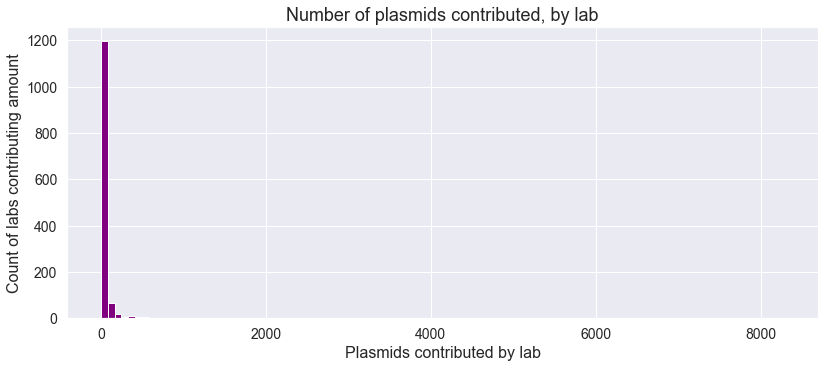


Obviously, plotting number of plasmids by number of labs contributing that amount is not very useful--other than to show us that a small percentage of labs contribute the majority of plasmids.  


Labs can have anywhere from 1 to > 8000 sequences in this data set.  Using ```describe()```, we can get a sense of the distribution of the number of sequences submitted by lab.  

```python
lab_ids.lab_id.value_counts().describe()
```

    count    1314.000000
    mean       47.958143
    std       262.552258
    min         1.000000
    25%         9.000000
    50%        15.000000
    75%        34.000000
    max      8286.000000
    Name: lab_id, dtype: float64


The key takeaway from these numbers is that, despite the very large maximum number of plasmids submitted (8286 plasmids submitted by just one lab!), **the majority of labs have submitted a small number of plasmids.  In fact, three-quarters of labs have submitted fewer than 35 plasmids each.**  On the flip side, a small percentage of labs (just over 50) have contributed the majority of plasmids to this database.


Looking at the top 50 labs, we see a dramatic dropoff in the number of sequences contributed.  


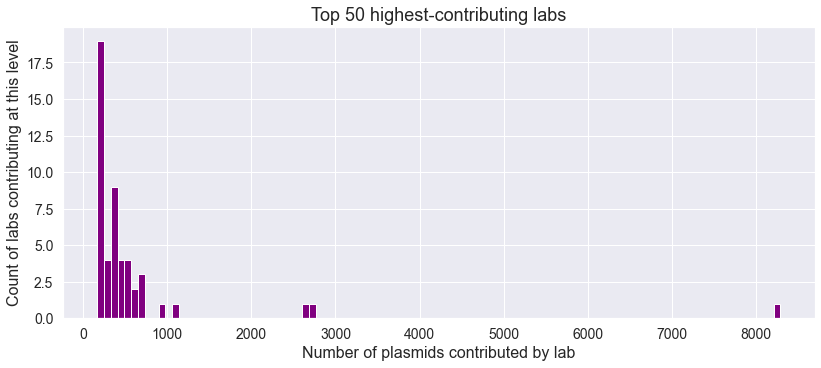


Looking at the top _50_ labs, we see that they have contributed 31,211 plasmids out of a total of 63,007 plasmids in this data set

```python
lab_ids.lab_id.value_counts()[:50].sum()
```
    31211


Looking at just the top _10_ labs, we can see that they have contributed just over 30% (just over 21,000) of all plasmids to this data set.

```python
lab_ids['lab_id'].value_counts(normalize=True).sort_values(ascending=False).head(10).sum()

# Ten labs contribute over 30% of all plasmids to the database
```
    0.30125204309948106


Sorting labs by their prevalence of sequences in the data, we can see that lab I7FXTVDP is the most heavily represented, contributing 8286 plasmids, or just over 13%, to this data set.  


    I7FXTVDP    0.131488
    RKJHZGDQ    0.043353
    GTVTUGVY    0.042401
    A18S09P2    0.016884
    Q2K8NHZY    0.015440
    131RRHBV    0.011267
    0FFBBVE1    0.010822
    AMV4U0A0    0.010537
    THD393NW    0.009918
    G8QWQL1C    0.009140
    Name: lab_id, dtype: float64


### Initial data exploration observations

Two key elements of this dataset present challenges:  the variability in the length of DNA sequences (from 20 to over 60,000) and the non-uniformity of number of sequence contributions per lab (from 1 sequence to over 8900).  Whether using machine learning ensemble methods or neural networks, addressing these issues will be necessary to manage modeling complexity.


# Modeling
## First phase of modeling:  Random forest models 
### Initial model:  Random forest model from DrivenData blog

_(Note:  The text and code in this section are adapted from the DrivenData/altlabs blog providing starter code and guidance for beginning the project.)_


#### Using DNA sequences as the basis for model features (n-grams)

The DNA sequences in this data set are composed of five characters. G, C, A, and T represent the four nucleotides commonly found in DNA (guanine, cytosine, adenine, thymine). N stand for any nucleotide (not a gap).


One common way to turn strings into useful features is to count n-grams, or continuous subsequences of length n. Here, we'll split up the DNA sequences into four-grams, or subsequences consisting of 4 bases.

With 5 unique bases, we can produce 120 different sequence permutations consisting of 4 bases. 


<div>
<table border="1" class="dataframe">
  <thead>
    <tr style="text-align: right;">
      <th></th>
      <th>CTAG</th>
      <th>CTAN</th>
      <th>CTGA</th>
      <th>CTGN</th>
      <th>CTNA</th>
      <th>CTNG</th>
      <th>CATG</th>
      <th>CATN</th>
      <th>CAGT</th>
      <th>CAGN</th>
      <th>CANT</th>
      <th>CANG</th>
      <th>CGTA</th>
      <th>CGTN</th>
      <th>CGAT</th>
      <th>CGAN</th>
      <th>CGNT</th>
      <th>CGNA</th>
      <th>CNTA</th>
      <th>CNTG</th>
      <th>CNAT</th>
      <th>CNAG</th>
      <th>CNGT</th>
      <th>CNGA</th>
      <th>TCAG</th>
      <th>TCAN</th>
      <th>TCGA</th>
      <th>TCGN</th>
      <th>TCNA</th>
      <th>TCNG</th>
      <th>TACG</th>
      <th>TACN</th>
      <th>TAGC</th>
      <th>TAGN</th>
      <th>TANC</th>
      <th>TANG</th>
      <th>TGCA</th>
      <th>TGCN</th>
      <th>TGAC</th>
      <th>TGAN</th>
      <th>TGNC</th>
      <th>TGNA</th>
      <th>TNCA</th>
      <th>TNCG</th>
      <th>TNAC</th>
      <th>TNAG</th>
      <th>TNGC</th>
      <th>TNGA</th>
      <th>ACTG</th>
      <th>ACTN</th>
      <th>ACGT</th>
      <th>ACGN</th>
      <th>ACNT</th>
      <th>ACNG</th>
      <th>ATCG</th>
      <th>ATCN</th>
      <th>ATGC</th>
      <th>ATGN</th>
      <th>ATNC</th>
      <th>ATNG</th>
      <th>AGCT</th>
      <th>AGCN</th>
      <th>AGTC</th>
      <th>AGTN</th>
      <th>AGNC</th>
      <th>AGNT</th>
      <th>ANCT</th>
      <th>ANCG</th>
      <th>ANTC</th>
      <th>ANTG</th>
      <th>ANGC</th>
      <th>ANGT</th>
      <th>GCTA</th>
      <th>GCTN</th>
      <th>GCAT</th>
      <th>GCAN</th>
      <th>GCNT</th>
      <th>GCNA</th>
      <th>GTCA</th>
      <th>GTCN</th>
      <th>GTAC</th>
      <th>GTAN</th>
      <th>GTNC</th>
      <th>GTNA</th>
      <th>GACT</th>
      <th>GACN</th>
      <th>GATC</th>
      <th>GATN</th>
      <th>GANC</th>
      <th>GANT</th>
      <th>GNCT</th>
      <th>GNCA</th>
      <th>GNTC</th>
      <th>GNTA</th>
      <th>GNAC</th>
      <th>GNAT</th>
      <th>NCTA</th>
      <th>NCTG</th>
      <th>NCAT</th>
      <th>NCAG</th>
      <th>NCGT</th>
      <th>NCGA</th>
      <th>NTCA</th>
      <th>NTCG</th>
      <th>NTAC</th>
      <th>NTAG</th>
      <th>NTGC</th>
      <th>NTGA</th>
      <th>NACT</th>
      <th>NACG</th>
      <th>NATC</th>
      <th>NATG</th>
      <th>NAGC</th>
      <th>NAGT</th>
      <th>NGCT</th>
      <th>NGCA</th>
      <th>NGTC</th>
      <th>NGTA</th>
      <th>NGAC</th>
      <th>NGAT</th>
    </tr>
    <tr>
      <th>sequence_id</th>
      <th></th>
      <th></th>
      <th></th>
      <th></th>
      <th></th>
      <th></th>
      <th></th>
      <th></th>
      <th></th>
      <th></th>
      <th></th>
      <th></th>
      <th></th>
      <th></th>
      <th></th>
      <th></th>
      <th></th>
      <th></th>
      <th></th>
      <th></th>
      <th></th>
      <th></th>
      <th></th>
      <th></th>
      <th></th>
      <th></th>
      <th></th>
      <th></th>
      <th></th>
      <th></th>
      <th></th>
      <th></th>
      <th></th>
      <th></th>
      <th></th>
      <th></th>
      <th></th>
      <th></th>
      <th></th>
      <th></th>
      <th></th>
      <th></th>
      <th></th>
      <th></th>
      <th></th>
      <th></th>
      <th></th>
      <th></th>
      <th></th>
      <th></th>
      <th></th>
      <th></th>
      <th></th>
      <th></th>
      <th></th>
      <th></th>
      <th></th>
      <th></th>
      <th></th>
      <th></th>
      <th></th>
      <th></th>
      <th></th>
      <th></th>
      <th></th>
      <th></th>
      <th></th>
      <th></th>
      <th></th>
      <th></th>
      <th></th>
      <th></th>
      <th></th>
      <th></th>
      <th></th>
      <th></th>
      <th></th>
      <th></th>
      <th></th>
      <th></th>
      <th></th>
      <th></th>
      <th></th>
      <th></th>
      <th></th>
      <th></th>
      <th></th>
      <th></th>
      <th></th>
      <th></th>
      <th></th>
      <th></th>
      <th></th>
      <th></th>
      <th></th>
      <th></th>
      <th></th>
      <th></th>
      <th></th>
      <th></th>
      <th></th>
      <th></th>
      <th></th>
      <th></th>
      <th></th>
      <th></th>
      <th></th>
      <th></th>
      <th></th>
      <th></th>
      <th></th>
      <th></th>
      <th></th>
      <th></th>
      <th></th>
      <th></th>
      <th></th>
      <th></th>
      <th></th>
      <th></th>
    </tr>
  </thead>
  <tbody>
    <tr>
      <th>9ZIMC</th>
      <td>13</td>
      <td>0</td>
      <td>44</td>
      <td>0</td>
      <td>0</td>
      <td>0</td>
      <td>28</td>
      <td>0</td>
      <td>25</td>
      <td>0</td>
      <td>0</td>
      <td>0</td>
      <td>14</td>
      <td>0</td>
      <td>17</td>
      <td>0</td>
      <td>0</td>
      <td>0</td>
      <td>0</td>
      <td>0</td>
      <td>0</td>
      <td>0</td>
      <td>0</td>
      <td>0</td>
      <td>37</td>
      <td>0</td>
      <td>24</td>
      <td>0</td>
      <td>0</td>
      <td>0</td>
      <td>18</td>
      <td>0</td>
      <td>13</td>
      <td>0</td>
      <td>0</td>
      <td>0</td>
      <td>29</td>
      <td>0</td>
      <td>46</td>
      <td>0</td>
      <td>0</td>
      <td>0</td>
      <td>0</td>
      <td>0</td>
      <td>0</td>
      <td>0</td>
      <td>0</td>
      <td>0</td>
      <td>24</td>
      <td>0</td>
      <td>21</td>
      <td>0</td>
      <td>0</td>
      <td>0</td>
      <td>19</td>
      <td>0</td>
      <td>30</td>
      <td>0</td>
      <td>0</td>
      <td>0</td>
      <td>39</td>
      <td>0</td>
      <td>25</td>
      <td>0</td>
      <td>0</td>
      <td>0</td>
      <td>0</td>
      <td>0</td>
      <td>0</td>
      <td>0</td>
      <td>0</td>
      <td>0</td>
      <td>27</td>
      <td>0</td>
      <td>20</td>
      <td>0</td>
      <td>0</td>
      <td>0</td>
      <td>28</td>
      <td>0</td>
      <td>15</td>
      <td>0</td>
      <td>0</td>
      <td>0</td>
      <td>30</td>
      <td>0</td>
      <td>32</td>
      <td>0</td>
      <td>0</td>
      <td>0</td>
      <td>0</td>
      <td>0</td>
      <td>0</td>
      <td>0</td>
      <td>0</td>
      <td>0</td>
      <td>0</td>
      <td>0</td>
      <td>0</td>
      <td>0</td>
      <td>0</td>
      <td>0</td>
      <td>0</td>
      <td>0</td>
      <td>0</td>
      <td>0</td>
      <td>0</td>
      <td>0</td>
      <td>0</td>
      <td>0</td>
      <td>0</td>
      <td>0</td>
      <td>0</td>
      <td>0</td>
      <td>0</td>
      <td>0</td>
      <td>0</td>
      <td>0</td>
      <td>0</td>
      <td>0</td>
    </tr>
    <tr>
      <th>5SAQC</th>
      <td>1</td>
      <td>0</td>
      <td>6</td>
      <td>0</td>
      <td>0</td>
      <td>0</td>
      <td>2</td>
      <td>0</td>
      <td>3</td>
      <td>0</td>
      <td>0</td>
      <td>0</td>
      <td>0</td>
      <td>0</td>
      <td>0</td>
      <td>0</td>
      <td>0</td>
      <td>0</td>
      <td>0</td>
      <td>0</td>
      <td>0</td>
      <td>0</td>
      <td>0</td>
      <td>0</td>
      <td>0</td>
      <td>0</td>
      <td>0</td>
      <td>0</td>
      <td>0</td>
      <td>0</td>
      <td>0</td>
      <td>0</td>
      <td>2</td>
      <td>0</td>
      <td>0</td>
      <td>0</td>
      <td>2</td>
      <td>0</td>
      <td>6</td>
      <td>0</td>
      <td>0</td>
      <td>0</td>
      <td>0</td>
      <td>0</td>
      <td>0</td>
      <td>0</td>
      <td>0</td>
      <td>0</td>
      <td>3</td>
      <td>0</td>
      <td>0</td>
      <td>0</td>
      <td>0</td>
      <td>0</td>
      <td>1</td>
      <td>0</td>
      <td>2</td>
      <td>0</td>
      <td>0</td>
      <td>0</td>
      <td>2</td>
      <td>0</td>
      <td>2</td>
      <td>0</td>
      <td>0</td>
      <td>0</td>
      <td>0</td>
      <td>0</td>
      <td>0</td>
      <td>0</td>
      <td>0</td>
      <td>0</td>
      <td>1</td>
      <td>0</td>
      <td>0</td>
      <td>0</td>
      <td>0</td>
      <td>0</td>
      <td>0</td>
      <td>0</td>
      <td>1</td>
      <td>0</td>
      <td>0</td>
      <td>0</td>
      <td>1</td>
      <td>0</td>
      <td>1</td>
      <td>0</td>
      <td>0</td>
      <td>0</td>
      <td>0</td>
      <td>0</td>
      <td>0</td>
      <td>0</td>
      <td>0</td>
      <td>0</td>
      <td>0</td>
      <td>0</td>
      <td>0</td>
      <td>0</td>
      <td>0</td>
      <td>0</td>
      <td>0</td>
      <td>0</td>
      <td>0</td>
      <td>0</td>
      <td>0</td>
      <td>0</td>
      <td>0</td>
      <td>0</td>
      <td>0</td>
      <td>0</td>
      <td>0</td>
      <td>0</td>
      <td>0</td>
      <td>0</td>
      <td>0</td>
      <td>0</td>
      <td>0</td>
      <td>0</td>
    </tr>
    <tr>
      <th>E7QRO</th>
      <td>0</td>
      <td>0</td>
      <td>2</td>
      <td>2</td>
      <td>0</td>
      <td>0</td>
      <td>0</td>
      <td>0</td>
      <td>0</td>
      <td>0</td>
      <td>0</td>
      <td>0</td>
      <td>0</td>
      <td>0</td>
      <td>1</td>
      <td>1</td>
      <td>0</td>
      <td>0</td>
      <td>0</td>
      <td>0</td>
      <td>0</td>
      <td>0</td>
      <td>0</td>
      <td>0</td>
      <td>1</td>
      <td>0</td>
      <td>0</td>
      <td>0</td>
      <td>0</td>
      <td>0</td>
      <td>1</td>
      <td>0</td>
      <td>1</td>
      <td>0</td>
      <td>0</td>
      <td>0</td>
      <td>0</td>
      <td>1</td>
      <td>1</td>
      <td>1</td>
      <td>0</td>
      <td>0</td>
      <td>0</td>
      <td>0</td>
      <td>0</td>
      <td>0</td>
      <td>1</td>
      <td>0</td>
      <td>2</td>
      <td>0</td>
      <td>0</td>
      <td>0</td>
      <td>0</td>
      <td>0</td>
      <td>0</td>
      <td>0</td>
      <td>1</td>
      <td>0</td>
      <td>0</td>
      <td>0</td>
      <td>3</td>
      <td>0</td>
      <td>0</td>
      <td>0</td>
      <td>0</td>
      <td>0</td>
      <td>0</td>
      <td>1</td>
      <td>0</td>
      <td>0</td>
      <td>1</td>
      <td>0</td>
      <td>1</td>
      <td>0</td>
      <td>0</td>
      <td>1</td>
      <td>0</td>
      <td>0</td>
      <td>0</td>
      <td>0</td>
      <td>1</td>
      <td>0</td>
      <td>0</td>
      <td>0</td>
      <td>3</td>
      <td>0</td>
      <td>1</td>
      <td>0</td>
      <td>0</td>
      <td>0</td>
      <td>0</td>
      <td>0</td>
      <td>0</td>
      <td>0</td>
      <td>0</td>
      <td>0</td>
      <td>0</td>
      <td>0</td>
      <td>0</td>
      <td>0</td>
      <td>0</td>
      <td>1</td>
      <td>0</td>
      <td>0</td>
      <td>0</td>
      <td>0</td>
      <td>0</td>
      <td>0</td>
      <td>0</td>
      <td>0</td>
      <td>0</td>
      <td>0</td>
      <td>1</td>
      <td>0</td>
      <td>0</td>
      <td>1</td>
      <td>0</td>
      <td>0</td>
      <td>0</td>
      <td>0</td>
    </tr>
    <tr>
      <th>CT5FP</th>
      <td>6</td>
      <td>0</td>
      <td>8</td>
      <td>0</td>
      <td>0</td>
      <td>0</td>
      <td>3</td>
      <td>0</td>
      <td>3</td>
      <td>0</td>
      <td>0</td>
      <td>0</td>
      <td>1</td>
      <td>0</td>
      <td>0</td>
      <td>0</td>
      <td>0</td>
      <td>0</td>
      <td>0</td>
      <td>0</td>
      <td>0</td>
      <td>0</td>
      <td>0</td>
      <td>0</td>
      <td>6</td>
      <td>0</td>
      <td>3</td>
      <td>0</td>
      <td>0</td>
      <td>0</td>
      <td>1</td>
      <td>0</td>
      <td>1</td>
      <td>0</td>
      <td>0</td>
      <td>0</td>
      <td>5</td>
      <td>0</td>
      <td>2</td>
      <td>0</td>
      <td>0</td>
      <td>0</td>
      <td>0</td>
      <td>0</td>
      <td>0</td>
      <td>0</td>
      <td>0</td>
      <td>0</td>
      <td>3</td>
      <td>0</td>
      <td>0</td>
      <td>0</td>
      <td>0</td>
      <td>0</td>
      <td>1</td>
      <td>0</td>
      <td>2</td>
      <td>0</td>
      <td>0</td>
      <td>0</td>
      <td>2</td>
      <td>0</td>
      <td>6</td>
      <td>0</td>
      <td>0</td>
      <td>0</td>
      <td>0</td>
      <td>0</td>
      <td>0</td>
      <td>0</td>
      <td>0</td>
      <td>0</td>
      <td>3</td>
      <td>0</td>
      <td>3</td>
      <td>0</td>
      <td>0</td>
      <td>0</td>
      <td>3</td>
      <td>0</td>
      <td>1</td>
      <td>0</td>
      <td>0</td>
      <td>0</td>
      <td>3</td>
      <td>0</td>
      <td>7</td>
      <td>0</td>
      <td>0</td>
      <td>0</td>
      <td>0</td>
      <td>0</td>
      <td>0</td>
      <td>0</td>
      <td>0</td>
      <td>0</td>
      <td>0</td>
      <td>0</td>
      <td>0</td>
      <td>0</td>
      <td>0</td>
      <td>0</td>
      <td>0</td>
      <td>0</td>
      <td>0</td>
      <td>0</td>
      <td>0</td>
      <td>0</td>
      <td>0</td>
      <td>0</td>
      <td>0</td>
      <td>0</td>
      <td>0</td>
      <td>0</td>
      <td>0</td>
      <td>0</td>
      <td>0</td>
      <td>0</td>
      <td>0</td>
      <td>0</td>
    </tr>
    <tr>
      <th>7PTD8</th>
      <td>2</td>
      <td>0</td>
      <td>4</td>
      <td>0</td>
      <td>0</td>
      <td>0</td>
      <td>7</td>
      <td>0</td>
      <td>4</td>
      <td>0</td>
      <td>0</td>
      <td>1</td>
      <td>2</td>
      <td>0</td>
      <td>1</td>
      <td>0</td>
      <td>0</td>
      <td>0</td>
      <td>0</td>
      <td>0</td>
      <td>0</td>
      <td>0</td>
      <td>0</td>
      <td>0</td>
      <td>3</td>
      <td>0</td>
      <td>3</td>
      <td>0</td>
      <td>0</td>
      <td>0</td>
      <td>2</td>
      <td>0</td>
      <td>3</td>
      <td>0</td>
      <td>0</td>
      <td>0</td>
      <td>2</td>
      <td>0</td>
      <td>5</td>
      <td>0</td>
      <td>0</td>
      <td>0</td>
      <td>0</td>
      <td>0</td>
      <td>0</td>
      <td>0</td>
      <td>0</td>
      <td>1</td>
      <td>5</td>
      <td>0</td>
      <td>3</td>
      <td>0</td>
      <td>0</td>
      <td>0</td>
      <td>2</td>
      <td>0</td>
      <td>6</td>
      <td>0</td>
      <td>0</td>
      <td>0</td>
      <td>5</td>
      <td>0</td>
      <td>3</td>
      <td>0</td>
      <td>0</td>
      <td>0</td>
      <td>0</td>
      <td>0</td>
      <td>0</td>
      <td>0</td>
      <td>1</td>
      <td>0</td>
      <td>2</td>
      <td>0</td>
      <td>3</td>
      <td>0</td>
      <td>0</td>
      <td>0</td>
      <td>7</td>
      <td>0</td>
      <td>4</td>
      <td>0</td>
      <td>0</td>
      <td>0</td>
      <td>6</td>
      <td>0</td>
      <td>3</td>
      <td>0</td>
      <td>0</td>
      <td>0</td>
      <td>0</td>
      <td>0</td>
      <td>0</td>
      <td>0</td>
      <td>0</td>
      <td>0</td>
      <td>0</td>
      <td>0</td>
      <td>0</td>
      <td>0</td>
      <td>0</td>
      <td>0</td>
      <td>0</td>
      <td>0</td>
      <td>0</td>
      <td>0</td>
      <td>0</td>
      <td>0</td>
      <td>0</td>
      <td>0</td>
      <td>0</td>
      <td>0</td>
      <td>0</td>
      <td>0</td>
      <td>0</td>
      <td>1</td>
      <td>0</td>
      <td>0</td>
      <td>0</td>
      <td>0</td>
    </tr>
    <tr>
      <th>...</th>
      <td>...</td>
      <td>...</td>
      <td>...</td>
      <td>...</td>
      <td>...</td>
      <td>...</td>
      <td>...</td>
      <td>...</td>
      <td>...</td>
      <td>...</td>
      <td>...</td>
      <td>...</td>
      <td>...</td>
      <td>...</td>
      <td>...</td>
      <td>...</td>
      <td>...</td>
      <td>...</td>
      <td>...</td>
      <td>...</td>
      <td>...</td>
      <td>...</td>
      <td>...</td>
      <td>...</td>
      <td>...</td>
      <td>...</td>
      <td>...</td>
      <td>...</td>
      <td>...</td>
      <td>...</td>
      <td>...</td>
      <td>...</td>
      <td>...</td>
      <td>...</td>
      <td>...</td>
      <td>...</td>
      <td>...</td>
      <td>...</td>
      <td>...</td>
      <td>...</td>
      <td>...</td>
      <td>...</td>
      <td>...</td>
      <td>...</td>
      <td>...</td>
      <td>...</td>
      <td>...</td>
      <td>...</td>
      <td>...</td>
      <td>...</td>
      <td>...</td>
      <td>...</td>
      <td>...</td>
      <td>...</td>
      <td>...</td>
      <td>...</td>
      <td>...</td>
      <td>...</td>
      <td>...</td>
      <td>...</td>
      <td>...</td>
      <td>...</td>
      <td>...</td>
      <td>...</td>
      <td>...</td>
      <td>...</td>
      <td>...</td>
      <td>...</td>
      <td>...</td>
      <td>...</td>
      <td>...</td>
      <td>...</td>
      <td>...</td>
      <td>...</td>
      <td>...</td>
      <td>...</td>
      <td>...</td>
      <td>...</td>
      <td>...</td>
      <td>...</td>
      <td>...</td>
      <td>...</td>
      <td>...</td>
      <td>...</td>
      <td>...</td>
      <td>...</td>
      <td>...</td>
      <td>...</td>
      <td>...</td>
      <td>...</td>
      <td>...</td>
      <td>...</td>
      <td>...</td>
      <td>...</td>
      <td>...</td>
      <td>...</td>
      <td>...</td>
      <td>...</td>
      <td>...</td>
      <td>...</td>
      <td>...</td>
      <td>...</td>
      <td>...</td>
      <td>...</td>
      <td>...</td>
      <td>...</td>
      <td>...</td>
      <td>...</td>
      <td>...</td>
      <td>...</td>
      <td>...</td>
      <td>...</td>
      <td>...</td>
      <td>...</td>
      <td>...</td>
      <td>...</td>
      <td>...</td>
      <td>...</td>
      <td>...</td>
      <td>...</td>
    </tr>
    <tr>
      <th>BOQSD</th>
      <td>8</td>
      <td>0</td>
      <td>28</td>
      <td>0</td>
      <td>0</td>
      <td>0</td>
      <td>28</td>
      <td>0</td>
      <td>24</td>
      <td>0</td>
      <td>0</td>
      <td>0</td>
      <td>11</td>
      <td>0</td>
      <td>20</td>
      <td>0</td>
      <td>0</td>
      <td>0</td>
      <td>0</td>
      <td>0</td>
      <td>0</td>
      <td>0</td>
      <td>0</td>
      <td>0</td>
      <td>27</td>
      <td>0</td>
      <td>14</td>
      <td>0</td>
      <td>0</td>
      <td>0</td>
      <td>19</td>
      <td>0</td>
      <td>22</td>
      <td>0</td>
      <td>0</td>
      <td>0</td>
      <td>22</td>
      <td>0</td>
      <td>33</td>
      <td>0</td>
      <td>0</td>
      <td>0</td>
      <td>0</td>
      <td>0</td>
      <td>0</td>
      <td>0</td>
      <td>0</td>
      <td>0</td>
      <td>17</td>
      <td>0</td>
      <td>20</td>
      <td>0</td>
      <td>0</td>
      <td>0</td>
      <td>18</td>
      <td>0</td>
      <td>22</td>
      <td>0</td>
      <td>0</td>
      <td>0</td>
      <td>24</td>
      <td>0</td>
      <td>16</td>
      <td>0</td>
      <td>0</td>
      <td>0</td>
      <td>0</td>
      <td>0</td>
      <td>0</td>
      <td>0</td>
      <td>1</td>
      <td>0</td>
      <td>10</td>
      <td>0</td>
      <td>27</td>
      <td>0</td>
      <td>0</td>
      <td>0</td>
      <td>24</td>
      <td>0</td>
      <td>13</td>
      <td>0</td>
      <td>0</td>
      <td>0</td>
      <td>19</td>
      <td>0</td>
      <td>30</td>
      <td>0</td>
      <td>1</td>
      <td>0</td>
      <td>0</td>
      <td>0</td>
      <td>0</td>
      <td>0</td>
      <td>0</td>
      <td>0</td>
      <td>0</td>
      <td>0</td>
      <td>0</td>
      <td>1</td>
      <td>0</td>
      <td>0</td>
      <td>0</td>
      <td>0</td>
      <td>0</td>
      <td>0</td>
      <td>0</td>
      <td>0</td>
      <td>0</td>
      <td>0</td>
      <td>0</td>
      <td>0</td>
      <td>0</td>
      <td>0</td>
      <td>0</td>
      <td>1</td>
      <td>0</td>
      <td>0</td>
      <td>0</td>
      <td>0</td>
    </tr>
    <tr>
      <th>5XVVU</th>
      <td>7</td>
      <td>0</td>
      <td>26</td>
      <td>0</td>
      <td>0</td>
      <td>0</td>
      <td>28</td>
      <td>0</td>
      <td>23</td>
      <td>0</td>
      <td>0</td>
      <td>0</td>
      <td>11</td>
      <td>0</td>
      <td>20</td>
      <td>0</td>
      <td>0</td>
      <td>0</td>
      <td>0</td>
      <td>0</td>
      <td>0</td>
      <td>0</td>
      <td>0</td>
      <td>0</td>
      <td>28</td>
      <td>0</td>
      <td>14</td>
      <td>0</td>
      <td>0</td>
      <td>0</td>
      <td>19</td>
      <td>0</td>
      <td>22</td>
      <td>0</td>
      <td>0</td>
      <td>0</td>
      <td>23</td>
      <td>0</td>
      <td>33</td>
      <td>0</td>
      <td>0</td>
      <td>0</td>
      <td>0</td>
      <td>0</td>
      <td>0</td>
      <td>0</td>
      <td>0</td>
      <td>0</td>
      <td>17</td>
      <td>0</td>
      <td>19</td>
      <td>0</td>
      <td>0</td>
      <td>0</td>
      <td>17</td>
      <td>0</td>
      <td>22</td>
      <td>0</td>
      <td>0</td>
      <td>0</td>
      <td>24</td>
      <td>0</td>
      <td>16</td>
      <td>0</td>
      <td>0</td>
      <td>0</td>
      <td>0</td>
      <td>0</td>
      <td>0</td>
      <td>0</td>
      <td>0</td>
      <td>0</td>
      <td>10</td>
      <td>0</td>
      <td>26</td>
      <td>0</td>
      <td>0</td>
      <td>0</td>
      <td>25</td>
      <td>0</td>
      <td>13</td>
      <td>0</td>
      <td>0</td>
      <td>0</td>
      <td>20</td>
      <td>0</td>
      <td>28</td>
      <td>0</td>
      <td>0</td>
      <td>0</td>
      <td>0</td>
      <td>0</td>
      <td>0</td>
      <td>0</td>
      <td>0</td>
      <td>0</td>
      <td>0</td>
      <td>0</td>
      <td>0</td>
      <td>0</td>
      <td>0</td>
      <td>0</td>
      <td>0</td>
      <td>0</td>
      <td>0</td>
      <td>0</td>
      <td>0</td>
      <td>0</td>
      <td>0</td>
      <td>0</td>
      <td>0</td>
      <td>0</td>
      <td>0</td>
      <td>0</td>
      <td>0</td>
      <td>0</td>
      <td>0</td>
      <td>0</td>
      <td>0</td>
      <td>0</td>
    </tr>
    <tr>
      <th>CVGHF</th>
      <td>22</td>
      <td>0</td>
      <td>50</td>
      <td>0</td>
      <td>0</td>
      <td>0</td>
      <td>40</td>
      <td>0</td>
      <td>33</td>
      <td>0</td>
      <td>0</td>
      <td>0</td>
      <td>17</td>
      <td>0</td>
      <td>19</td>
      <td>0</td>
      <td>0</td>
      <td>0</td>
      <td>0</td>
      <td>0</td>
      <td>0</td>
      <td>0</td>
      <td>0</td>
      <td>0</td>
      <td>36</td>
      <td>0</td>
      <td>23</td>
      <td>0</td>
      <td>0</td>
      <td>0</td>
      <td>22</td>
      <td>0</td>
      <td>21</td>
      <td>0</td>
      <td>0</td>
      <td>0</td>
      <td>35</td>
      <td>0</td>
      <td>42</td>
      <td>0</td>
      <td>0</td>
      <td>0</td>
      <td>0</td>
      <td>0</td>
      <td>0</td>
      <td>0</td>
      <td>0</td>
      <td>0</td>
      <td>33</td>
      <td>0</td>
      <td>22</td>
      <td>0</td>
      <td>0</td>
      <td>0</td>
      <td>27</td>
      <td>0</td>
      <td>33</td>
      <td>0</td>
      <td>0</td>
      <td>0</td>
      <td>46</td>
      <td>0</td>
      <td>23</td>
      <td>0</td>
      <td>0</td>
      <td>0</td>
      <td>0</td>
      <td>0</td>
      <td>0</td>
      <td>0</td>
      <td>0</td>
      <td>0</td>
      <td>28</td>
      <td>0</td>
      <td>33</td>
      <td>0</td>
      <td>0</td>
      <td>0</td>
      <td>34</td>
      <td>0</td>
      <td>16</td>
      <td>0</td>
      <td>0</td>
      <td>0</td>
      <td>24</td>
      <td>0</td>
      <td>45</td>
      <td>0</td>
      <td>0</td>
      <td>0</td>
      <td>0</td>
      <td>0</td>
      <td>0</td>
      <td>0</td>
      <td>0</td>
      <td>0</td>
      <td>0</td>
      <td>0</td>
      <td>0</td>
      <td>0</td>
      <td>0</td>
      <td>0</td>
      <td>0</td>
      <td>0</td>
      <td>0</td>
      <td>0</td>
      <td>0</td>
      <td>0</td>
      <td>0</td>
      <td>0</td>
      <td>0</td>
      <td>0</td>
      <td>0</td>
      <td>0</td>
      <td>0</td>
      <td>0</td>
      <td>0</td>
      <td>0</td>
      <td>0</td>
      <td>0</td>
    </tr>
    <tr>
      <th>ZVT1A</th>
      <td>21</td>
      <td>0</td>
      <td>48</td>
      <td>0</td>
      <td>0</td>
      <td>0</td>
      <td>40</td>
      <td>0</td>
      <td>32</td>
      <td>0</td>
      <td>0</td>
      <td>0</td>
      <td>17</td>
      <td>0</td>
      <td>18</td>
      <td>0</td>
      <td>0</td>
      <td>0</td>
      <td>0</td>
      <td>0</td>
      <td>0</td>
      <td>0</td>
      <td>0</td>
      <td>0</td>
      <td>37</td>
      <td>0</td>
      <td>22</td>
      <td>0</td>
      <td>0</td>
      <td>0</td>
      <td>22</td>
      <td>0</td>
      <td>21</td>
      <td>0</td>
      <td>0</td>
      <td>0</td>
      <td>36</td>
      <td>0</td>
      <td>42</td>
      <td>0</td>
      <td>0</td>
      <td>0</td>
      <td>0</td>
      <td>0</td>
      <td>0</td>
      <td>0</td>
      <td>0</td>
      <td>0</td>
      <td>33</td>
      <td>0</td>
      <td>21</td>
      <td>0</td>
      <td>0</td>
      <td>0</td>
      <td>25</td>
      <td>0</td>
      <td>33</td>
      <td>0</td>
      <td>0</td>
      <td>0</td>
      <td>46</td>
      <td>0</td>
      <td>23</td>
      <td>0</td>
      <td>0</td>
      <td>0</td>
      <td>0</td>
      <td>0</td>
      <td>0</td>
      <td>0</td>
      <td>0</td>
      <td>0</td>
      <td>28</td>
      <td>0</td>
      <td>32</td>
      <td>0</td>
      <td>0</td>
      <td>0</td>
      <td>35</td>
      <td>0</td>
      <td>16</td>
      <td>0</td>
      <td>0</td>
      <td>0</td>
      <td>24</td>
      <td>0</td>
      <td>43</td>
      <td>0</td>
      <td>0</td>
      <td>0</td>
      <td>0</td>
      <td>0</td>
      <td>0</td>
      <td>0</td>
      <td>0</td>
      <td>0</td>
      <td>0</td>
      <td>0</td>
      <td>0</td>
      <td>0</td>
      <td>0</td>
      <td>0</td>
      <td>0</td>
      <td>0</td>
      <td>0</td>
      <td>0</td>
      <td>0</td>
      <td>0</td>
      <td>0</td>
      <td>0</td>
      <td>0</td>
      <td>0</td>
      <td>0</td>
      <td>0</td>
      <td>0</td>
      <td>0</td>
      <td>0</td>
      <td>0</td>
      <td>0</td>
      <td>0</td>
    </tr>
    <tr>
      <th>U5MR3</th>
      <td>7</td>
      <td>0</td>
      <td>35</td>
      <td>0</td>
      <td>0</td>
      <td>0</td>
      <td>28</td>
      <td>0</td>
      <td>23</td>
      <td>0</td>
      <td>0</td>
      <td>0</td>
      <td>11</td>
      <td>0</td>
      <td>23</td>
      <td>0</td>
      <td>0</td>
      <td>0</td>
      <td>0</td>
      <td>0</td>
      <td>0</td>
      <td>0</td>
      <td>0</td>
      <td>0</td>
      <td>22</td>
      <td>0</td>
      <td>13</td>
      <td>0</td>
      <td>0</td>
      <td>0</td>
      <td>12</td>
      <td>0</td>
      <td>8</td>
      <td>0</td>
      <td>0</td>
      <td>0</td>
      <td>24</td>
      <td>0</td>
      <td>17</td>
      <td>0</td>
      <td>0</td>
      <td>0</td>
      <td>0</td>
      <td>0</td>
      <td>0</td>
      <td>0</td>
      <td>0</td>
      <td>0</td>
      <td>23</td>
      <td>0</td>
      <td>14</td>
      <td>0</td>
      <td>0</td>
      <td>0</td>
      <td>29</td>
      <td>0</td>
      <td>28</td>
      <td>0</td>
      <td>0</td>
      <td>0</td>
      <td>20</td>
      <td>0</td>
      <td>15</td>
      <td>0</td>
      <td>0</td>
      <td>0</td>
      <td>0</td>
      <td>0</td>
      <td>0</td>
      <td>0</td>
      <td>0</td>
      <td>0</td>
      <td>15</td>
      <td>0</td>
      <td>28</td>
      <td>0</td>
      <td>0</td>
      <td>0</td>
      <td>19</td>
      <td>0</td>
      <td>4</td>
      <td>0</td>
      <td>0</td>
      <td>0</td>
      <td>18</td>
      <td>0</td>
      <td>22</td>
      <td>0</td>
      <td>0</td>
      <td>0</td>
      <td>0</td>
      <td>0</td>
      <td>0</td>
      <td>0</td>
      <td>0</td>
      <td>0</td>
      <td>0</td>
      <td>0</td>
      <td>0</td>
      <td>0</td>
      <td>0</td>
      <td>0</td>
      <td>0</td>
      <td>0</td>
      <td>0</td>
      <td>0</td>
      <td>0</td>
      <td>0</td>
      <td>0</td>
      <td>0</td>
      <td>0</td>
      <td>0</td>
      <td>0</td>
      <td>0</td>
      <td>0</td>
      <td>0</td>
      <td>0</td>
      <td>0</td>
      <td>0</td>
      <td>0</td>
    </tr>
  </tbody>
</table>
<p>63017 rows × 120 columns</p>
</div>


```python
ngram_features.shape
```


    (63017, 120)


We now have features for all 120 possible subsequences. Their values show the counts of each 4-gram within the full DNA sequence.

Let's join them with our one-hot endcoded binary features.


```python
all_features = ngram_features.join(train_values.drop('sequence', axis=1))
all_features.head()
```


<div>
<table border="1" class="dataframe">
  <thead>
    <tr style="text-align: right;">
      <th></th>
      <th>CTAG</th>
      <th>CTAN</th>
      <th>CTGA</th>
      <th>CTGN</th>
      <th>CTNA</th>
      <th>CTNG</th>
      <th>CATG</th>
      <th>CATN</th>
      <th>CAGT</th>
      <th>CAGN</th>
      <th>CANT</th>
      <th>CANG</th>
      <th>CGTA</th>
      <th>CGTN</th>
      <th>CGAT</th>
      <th>CGAN</th>
      <th>CGNT</th>
      <th>CGNA</th>
      <th>CNTA</th>
      <th>CNTG</th>
      <th>CNAT</th>
      <th>CNAG</th>
      <th>CNGT</th>
      <th>CNGA</th>
      <th>TCAG</th>
      <th>TCAN</th>
      <th>TCGA</th>
      <th>TCGN</th>
      <th>TCNA</th>
      <th>TCNG</th>
      <th>TACG</th>
      <th>TACN</th>
      <th>TAGC</th>
      <th>TAGN</th>
      <th>TANC</th>
      <th>TANG</th>
      <th>TGCA</th>
      <th>TGCN</th>
      <th>TGAC</th>
      <th>TGAN</th>
      <th>TGNC</th>
      <th>TGNA</th>
      <th>TNCA</th>
      <th>TNCG</th>
      <th>TNAC</th>
      <th>TNAG</th>
      <th>TNGC</th>
      <th>TNGA</th>
      <th>ACTG</th>
      <th>ACTN</th>
      <th>ACGT</th>
      <th>ACGN</th>
      <th>ACNT</th>
      <th>ACNG</th>
      <th>ATCG</th>
      <th>ATCN</th>
      <th>ATGC</th>
      <th>ATGN</th>
      <th>ATNC</th>
      <th>ATNG</th>
      <th>AGCT</th>
      <th>AGCN</th>
      <th>AGTC</th>
      <th>AGTN</th>
      <th>AGNC</th>
      <th>AGNT</th>
      <th>ANCT</th>
      <th>ANCG</th>
      <th>ANTC</th>
      <th>ANTG</th>
      <th>ANGC</th>
      <th>ANGT</th>
      <th>GCTA</th>
      <th>GCTN</th>
      <th>GCAT</th>
      <th>GCAN</th>
      <th>GCNT</th>
      <th>GCNA</th>
      <th>GTCA</th>
      <th>GTCN</th>
      <th>GTAC</th>
      <th>GTAN</th>
      <th>GTNC</th>
      <th>GTNA</th>
      <th>GACT</th>
      <th>GACN</th>
      <th>GATC</th>
      <th>GATN</th>
      <th>GANC</th>
      <th>GANT</th>
      <th>GNCT</th>
      <th>GNCA</th>
      <th>GNTC</th>
      <th>GNTA</th>
      <th>GNAC</th>
      <th>GNAT</th>
      <th>NCTA</th>
      <th>NCTG</th>
      <th>NCAT</th>
      <th>NCAG</th>
      <th>NCGT</th>
      <th>NCGA</th>
      <th>NTCA</th>
      <th>NTCG</th>
      <th>NTAC</th>
      <th>NTAG</th>
      <th>NTGC</th>
      <th>NTGA</th>
      <th>NACT</th>
      <th>NACG</th>
      <th>NATC</th>
      <th>NATG</th>
      <th>NAGC</th>
      <th>NAGT</th>
      <th>NGCT</th>
      <th>NGCA</th>
      <th>NGTC</th>
      <th>NGTA</th>
      <th>NGAC</th>
      <th>NGAT</th>
      <th>bacterial_resistance_ampicillin</th>
      <th>bacterial_resistance_chloramphenicol</th>
      <th>bacterial_resistance_kanamycin</th>
      <th>bacterial_resistance_other</th>
      <th>bacterial_resistance_spectinomycin</th>
      <th>copy_number_high_copy</th>
      <th>copy_number_low_copy</th>
      <th>copy_number_unknown</th>
      <th>growth_strain_ccdb_survival</th>
      <th>growth_strain_dh10b</th>
      <th>growth_strain_dh5alpha</th>
      <th>growth_strain_neb_stable</th>
      <th>growth_strain_other</th>
      <th>growth_strain_stbl3</th>
      <th>growth_strain_top10</th>
      <th>growth_strain_xl1_blue</th>
      <th>growth_temp_30</th>
      <th>growth_temp_37</th>
      <th>growth_temp_other</th>
      <th>selectable_markers_blasticidin</th>
      <th>selectable_markers_his3</th>
      <th>selectable_markers_hygromycin</th>
      <th>selectable_markers_leu2</th>
      <th>selectable_markers_neomycin</th>
      <th>selectable_markers_other</th>
      <th>selectable_markers_puromycin</th>
      <th>selectable_markers_trp1</th>
      <th>selectable_markers_ura3</th>
      <th>selectable_markers_zeocin</th>
      <th>species_budding_yeast</th>
      <th>species_fly</th>
      <th>species_human</th>
      <th>species_mouse</th>
      <th>species_mustard_weed</th>
      <th>species_nematode</th>
      <th>species_other</th>
      <th>species_rat</th>
      <th>species_synthetic</th>
      <th>species_zebrafish</th>
    </tr>
    <tr>
      <th>sequence_id</th>
      <th></th>
      <th></th>
      <th></th>
      <th></th>
      <th></th>
      <th></th>
      <th></th>
      <th></th>
      <th></th>
      <th></th>
      <th></th>
      <th></th>
      <th></th>
      <th></th>
      <th></th>
      <th></th>
      <th></th>
      <th></th>
      <th></th>
      <th></th>
      <th></th>
      <th></th>
      <th></th>
      <th></th>
      <th></th>
      <th></th>
      <th></th>
      <th></th>
      <th></th>
      <th></th>
      <th></th>
      <th></th>
      <th></th>
      <th></th>
      <th></th>
      <th></th>
      <th></th>
      <th></th>
      <th></th>
      <th></th>
      <th></th>
      <th></th>
      <th></th>
      <th></th>
      <th></th>
      <th></th>
      <th></th>
      <th></th>
      <th></th>
      <th></th>
      <th></th>
      <th></th>
      <th></th>
      <th></th>
      <th></th>
      <th></th>
      <th></th>
      <th></th>
      <th></th>
      <th></th>
      <th></th>
      <th></th>
      <th></th>
      <th></th>
      <th></th>
      <th></th>
      <th></th>
      <th></th>
      <th></th>
      <th></th>
      <th></th>
      <th></th>
      <th></th>
      <th></th>
      <th></th>
      <th></th>
      <th></th>
      <th></th>
      <th></th>
      <th></th>
      <th></th>
      <th></th>
      <th></th>
      <th></th>
      <th></th>
      <th></th>
      <th></th>
      <th></th>
      <th></th>
      <th></th>
      <th></th>
      <th></th>
      <th></th>
      <th></th>
      <th></th>
      <th></th>
      <th></th>
      <th></th>
      <th></th>
      <th></th>
      <th></th>
      <th></th>
      <th></th>
      <th></th>
      <th></th>
      <th></th>
      <th></th>
      <th></th>
      <th></th>
      <th></th>
      <th></th>
      <th></th>
      <th></th>
      <th></th>
      <th></th>
      <th></th>
      <th></th>
      <th></th>
      <th></th>
      <th></th>
      <th></th>
      <th></th>
      <th></th>
      <th></th>
      <th></th>
      <th></th>
      <th></th>
      <th></th>
      <th></th>
      <th></th>
      <th></th>
      <th></th>
      <th></th>
      <th></th>
      <th></th>
      <th></th>
      <th></th>
      <th></th>
      <th></th>
      <th></th>
      <th></th>
      <th></th>
      <th></th>
      <th></th>
      <th></th>
      <th></th>
      <th></th>
      <th></th>
      <th></th>
      <th></th>
      <th></th>
      <th></th>
      <th></th>
      <th></th>
      <th></th>
      <th></th>
      <th></th>
      <th></th>
      <th></th>
    </tr>
  </thead>
  <tbody>
    <tr>
      <th>9ZIMC</th>
      <td>13</td>
      <td>0</td>
      <td>44</td>
      <td>0</td>
      <td>0</td>
      <td>0</td>
      <td>28</td>
      <td>0</td>
      <td>25</td>
      <td>0</td>
      <td>0</td>
      <td>0</td>
      <td>14</td>
      <td>0</td>
      <td>17</td>
      <td>0</td>
      <td>0</td>
      <td>0</td>
      <td>0</td>
      <td>0</td>
      <td>0</td>
      <td>0</td>
      <td>0</td>
      <td>0</td>
      <td>37</td>
      <td>0</td>
      <td>24</td>
      <td>0</td>
      <td>0</td>
      <td>0</td>
      <td>18</td>
      <td>0</td>
      <td>13</td>
      <td>0</td>
      <td>0</td>
      <td>0</td>
      <td>29</td>
      <td>0</td>
      <td>46</td>
      <td>0</td>
      <td>0</td>
      <td>0</td>
      <td>0</td>
      <td>0</td>
      <td>0</td>
      <td>0</td>
      <td>0</td>
      <td>0</td>
      <td>24</td>
      <td>0</td>
      <td>21</td>
      <td>0</td>
      <td>0</td>
      <td>0</td>
      <td>19</td>
      <td>0</td>
      <td>30</td>
      <td>0</td>
      <td>0</td>
      <td>0</td>
      <td>39</td>
      <td>0</td>
      <td>25</td>
      <td>0</td>
      <td>0</td>
      <td>0</td>
      <td>0</td>
      <td>0</td>
      <td>0</td>
      <td>0</td>
      <td>0</td>
      <td>0</td>
      <td>27</td>
      <td>0</td>
      <td>20</td>
      <td>0</td>
      <td>0</td>
      <td>0</td>
      <td>28</td>
      <td>0</td>
      <td>15</td>
      <td>0</td>
      <td>0</td>
      <td>0</td>
      <td>30</td>
      <td>0</td>
      <td>32</td>
      <td>0</td>
      <td>0</td>
      <td>0</td>
      <td>0</td>
      <td>0</td>
      <td>0</td>
      <td>0</td>
      <td>0</td>
      <td>0</td>
      <td>0</td>
      <td>0</td>
      <td>0</td>
      <td>0</td>
      <td>0</td>
      <td>0</td>
      <td>0</td>
      <td>0</td>
      <td>0</td>
      <td>0</td>
      <td>0</td>
      <td>0</td>
      <td>0</td>
      <td>0</td>
      <td>0</td>
      <td>0</td>
      <td>0</td>
      <td>0</td>
      <td>0</td>
      <td>0</td>
      <td>0</td>
      <td>0</td>
      <td>0</td>
      <td>0</td>
      <td>0.0</td>
      <td>0.0</td>
      <td>1.0</td>
      <td>0.0</td>
      <td>0.0</td>
      <td>1.0</td>
      <td>0.0</td>
      <td>0.0</td>
      <td>0.0</td>
      <td>0.0</td>
      <td>1.0</td>
      <td>0.0</td>
      <td>0.0</td>
      <td>0.0</td>
      <td>0.0</td>
      <td>0.0</td>
      <td>0.0</td>
      <td>1.0</td>
      <td>0.0</td>
      <td>0.0</td>
      <td>0.0</td>
      <td>0.0</td>
      <td>0.0</td>
      <td>0.0</td>
      <td>0.0</td>
      <td>0.0</td>
      <td>0.0</td>
      <td>0.0</td>
      <td>0.0</td>
      <td>0.0</td>
      <td>0.0</td>
      <td>0.0</td>
      <td>1.0</td>
      <td>0.0</td>
      <td>0.0</td>
      <td>0.0</td>
      <td>0.0</td>
      <td>0.0</td>
      <td>0.0</td>
    </tr>
    <tr>
      <th>5SAQC</th>
      <td>1</td>
      <td>0</td>
      <td>6</td>
      <td>0</td>
      <td>0</td>
      <td>0</td>
      <td>2</td>
      <td>0</td>
      <td>3</td>
      <td>0</td>
      <td>0</td>
      <td>0</td>
      <td>0</td>
      <td>0</td>
      <td>0</td>
      <td>0</td>
      <td>0</td>
      <td>0</td>
      <td>0</td>
      <td>0</td>
      <td>0</td>
      <td>0</td>
      <td>0</td>
      <td>0</td>
      <td>0</td>
      <td>0</td>
      <td>0</td>
      <td>0</td>
      <td>0</td>
      <td>0</td>
      <td>0</td>
      <td>0</td>
      <td>2</td>
      <td>0</td>
      <td>0</td>
      <td>0</td>
      <td>2</td>
      <td>0</td>
      <td>6</td>
      <td>0</td>
      <td>0</td>
      <td>0</td>
      <td>0</td>
      <td>0</td>
      <td>0</td>
      <td>0</td>
      <td>0</td>
      <td>0</td>
      <td>3</td>
      <td>0</td>
      <td>0</td>
      <td>0</td>
      <td>0</td>
      <td>0</td>
      <td>1</td>
      <td>0</td>
      <td>2</td>
      <td>0</td>
      <td>0</td>
      <td>0</td>
      <td>2</td>
      <td>0</td>
      <td>2</td>
      <td>0</td>
      <td>0</td>
      <td>0</td>
      <td>0</td>
      <td>0</td>
      <td>0</td>
      <td>0</td>
      <td>0</td>
      <td>0</td>
      <td>1</td>
      <td>0</td>
      <td>0</td>
      <td>0</td>
      <td>0</td>
      <td>0</td>
      <td>0</td>
      <td>0</td>
      <td>1</td>
      <td>0</td>
      <td>0</td>
      <td>0</td>
      <td>1</td>
      <td>0</td>
      <td>1</td>
      <td>0</td>
      <td>0</td>
      <td>0</td>
      <td>0</td>
      <td>0</td>
      <td>0</td>
      <td>0</td>
      <td>0</td>
      <td>0</td>
      <td>0</td>
      <td>0</td>
      <td>0</td>
      <td>0</td>
      <td>0</td>
      <td>0</td>
      <td>0</td>
      <td>0</td>
      <td>0</td>
      <td>0</td>
      <td>0</td>
      <td>0</td>
      <td>0</td>
      <td>0</td>
      <td>0</td>
      <td>0</td>
      <td>0</td>
      <td>0</td>
      <td>0</td>
      <td>0</td>
      <td>0</td>
      <td>0</td>
      <td>0</td>
      <td>0</td>
      <td>1.0</td>
      <td>0.0</td>
      <td>0.0</td>
      <td>0.0</td>
      <td>0.0</td>
      <td>1.0</td>
      <td>0.0</td>
      <td>0.0</td>
      <td>0.0</td>
      <td>0.0</td>
      <td>1.0</td>
      <td>0.0</td>
      <td>0.0</td>
      <td>0.0</td>
      <td>0.0</td>
      <td>0.0</td>
      <td>0.0</td>
      <td>1.0</td>
      <td>0.0</td>
      <td>0.0</td>
      <td>0.0</td>
      <td>0.0</td>
      <td>0.0</td>
      <td>0.0</td>
      <td>0.0</td>
      <td>0.0</td>
      <td>0.0</td>
      <td>0.0</td>
      <td>0.0</td>
      <td>0.0</td>
      <td>0.0</td>
      <td>0.0</td>
      <td>1.0</td>
      <td>0.0</td>
      <td>0.0</td>
      <td>0.0</td>
      <td>0.0</td>
      <td>0.0</td>
      <td>0.0</td>
    </tr>
    <tr>
      <th>E7QRO</th>
      <td>0</td>
      <td>0</td>
      <td>2</td>
      <td>2</td>
      <td>0</td>
      <td>0</td>
      <td>0</td>
      <td>0</td>
      <td>0</td>
      <td>0</td>
      <td>0</td>
      <td>0</td>
      <td>0</td>
      <td>0</td>
      <td>1</td>
      <td>1</td>
      <td>0</td>
      <td>0</td>
      <td>0</td>
      <td>0</td>
      <td>0</td>
      <td>0</td>
      <td>0</td>
      <td>0</td>
      <td>1</td>
      <td>0</td>
      <td>0</td>
      <td>0</td>
      <td>0</td>
      <td>0</td>
      <td>1</td>
      <td>0</td>
      <td>1</td>
      <td>0</td>
      <td>0</td>
      <td>0</td>
      <td>0</td>
      <td>1</td>
      <td>1</td>
      <td>1</td>
      <td>0</td>
      <td>0</td>
      <td>0</td>
      <td>0</td>
      <td>0</td>
      <td>0</td>
      <td>1</td>
      <td>0</td>
      <td>2</td>
      <td>0</td>
      <td>0</td>
      <td>0</td>
      <td>0</td>
      <td>0</td>
      <td>0</td>
      <td>0</td>
      <td>1</td>
      <td>0</td>
      <td>0</td>
      <td>0</td>
      <td>3</td>
      <td>0</td>
      <td>0</td>
      <td>0</td>
      <td>0</td>
      <td>0</td>
      <td>0</td>
      <td>1</td>
      <td>0</td>
      <td>0</td>
      <td>1</td>
      <td>0</td>
      <td>1</td>
      <td>0</td>
      <td>0</td>
      <td>1</td>
      <td>0</td>
      <td>0</td>
      <td>0</td>
      <td>0</td>
      <td>1</td>
      <td>0</td>
      <td>0</td>
      <td>0</td>
      <td>3</td>
      <td>0</td>
      <td>1</td>
      <td>0</td>
      <td>0</td>
      <td>0</td>
      <td>0</td>
      <td>0</td>
      <td>0</td>
      <td>0</td>
      <td>0</td>
      <td>0</td>
      <td>0</td>
      <td>0</td>
      <td>0</td>
      <td>0</td>
      <td>0</td>
      <td>1</td>
      <td>0</td>
      <td>0</td>
      <td>0</td>
      <td>0</td>
      <td>0</td>
      <td>0</td>
      <td>0</td>
      <td>0</td>
      <td>0</td>
      <td>0</td>
      <td>1</td>
      <td>0</td>
      <td>0</td>
      <td>1</td>
      <td>0</td>
      <td>0</td>
      <td>0</td>
      <td>0</td>
      <td>1.0</td>
      <td>0.0</td>
      <td>0.0</td>
      <td>0.0</td>
      <td>0.0</td>
      <td>1.0</td>
      <td>0.0</td>
      <td>0.0</td>
      <td>0.0</td>
      <td>0.0</td>
      <td>1.0</td>
      <td>0.0</td>
      <td>0.0</td>
      <td>0.0</td>
      <td>0.0</td>
      <td>0.0</td>
      <td>0.0</td>
      <td>1.0</td>
      <td>0.0</td>
      <td>0.0</td>
      <td>0.0</td>
      <td>0.0</td>
      <td>0.0</td>
      <td>0.0</td>
      <td>0.0</td>
      <td>0.0</td>
      <td>0.0</td>
      <td>0.0</td>
      <td>0.0</td>
      <td>0.0</td>
      <td>0.0</td>
      <td>0.0</td>
      <td>1.0</td>
      <td>0.0</td>
      <td>0.0</td>
      <td>0.0</td>
      <td>0.0</td>
      <td>0.0</td>
      <td>0.0</td>
    </tr>
    <tr>
      <th>CT5FP</th>
      <td>6</td>
      <td>0</td>
      <td>8</td>
      <td>0</td>
      <td>0</td>
      <td>0</td>
      <td>3</td>
      <td>0</td>
      <td>3</td>
      <td>0</td>
      <td>0</td>
      <td>0</td>
      <td>1</td>
      <td>0</td>
      <td>0</td>
      <td>0</td>
      <td>0</td>
      <td>0</td>
      <td>0</td>
      <td>0</td>
      <td>0</td>
      <td>0</td>
      <td>0</td>
      <td>0</td>
      <td>6</td>
      <td>0</td>
      <td>3</td>
      <td>0</td>
      <td>0</td>
      <td>0</td>
      <td>1</td>
      <td>0</td>
      <td>1</td>
      <td>0</td>
      <td>0</td>
      <td>0</td>
      <td>5</td>
      <td>0</td>
      <td>2</td>
      <td>0</td>
      <td>0</td>
      <td>0</td>
      <td>0</td>
      <td>0</td>
      <td>0</td>
      <td>0</td>
      <td>0</td>
      <td>0</td>
      <td>3</td>
      <td>0</td>
      <td>0</td>
      <td>0</td>
      <td>0</td>
      <td>0</td>
      <td>1</td>
      <td>0</td>
      <td>2</td>
      <td>0</td>
      <td>0</td>
      <td>0</td>
      <td>2</td>
      <td>0</td>
      <td>6</td>
      <td>0</td>
      <td>0</td>
      <td>0</td>
      <td>0</td>
      <td>0</td>
      <td>0</td>
      <td>0</td>
      <td>0</td>
      <td>0</td>
      <td>3</td>
      <td>0</td>
      <td>3</td>
      <td>0</td>
      <td>0</td>
      <td>0</td>
      <td>3</td>
      <td>0</td>
      <td>1</td>
      <td>0</td>
      <td>0</td>
      <td>0</td>
      <td>3</td>
      <td>0</td>
      <td>7</td>
      <td>0</td>
      <td>0</td>
      <td>0</td>
      <td>0</td>
      <td>0</td>
      <td>0</td>
      <td>0</td>
      <td>0</td>
      <td>0</td>
      <td>0</td>
      <td>0</td>
      <td>0</td>
      <td>0</td>
      <td>0</td>
      <td>0</td>
      <td>0</td>
      <td>0</td>
      <td>0</td>
      <td>0</td>
      <td>0</td>
      <td>0</td>
      <td>0</td>
      <td>0</td>
      <td>0</td>
      <td>0</td>
      <td>0</td>
      <td>0</td>
      <td>0</td>
      <td>0</td>
      <td>0</td>
      <td>0</td>
      <td>0</td>
      <td>0</td>
      <td>1.0</td>
      <td>0.0</td>
      <td>0.0</td>
      <td>0.0</td>
      <td>0.0</td>
      <td>1.0</td>
      <td>0.0</td>
      <td>0.0</td>
      <td>0.0</td>
      <td>0.0</td>
      <td>1.0</td>
      <td>0.0</td>
      <td>0.0</td>
      <td>0.0</td>
      <td>0.0</td>
      <td>0.0</td>
      <td>0.0</td>
      <td>1.0</td>
      <td>0.0</td>
      <td>0.0</td>
      <td>0.0</td>
      <td>0.0</td>
      <td>0.0</td>
      <td>0.0</td>
      <td>0.0</td>
      <td>0.0</td>
      <td>0.0</td>
      <td>0.0</td>
      <td>0.0</td>
      <td>0.0</td>
      <td>0.0</td>
      <td>0.0</td>
      <td>1.0</td>
      <td>0.0</td>
      <td>0.0</td>
      <td>0.0</td>
      <td>0.0</td>
      <td>0.0</td>
      <td>0.0</td>
    </tr>
    <tr>
      <th>7PTD8</th>
      <td>2</td>
      <td>0</td>
      <td>4</td>
      <td>0</td>
      <td>0</td>
      <td>0</td>
      <td>7</td>
      <td>0</td>
      <td>4</td>
      <td>0</td>
      <td>0</td>
      <td>1</td>
      <td>2</td>
      <td>0</td>
      <td>1</td>
      <td>0</td>
      <td>0</td>
      <td>0</td>
      <td>0</td>
      <td>0</td>
      <td>0</td>
      <td>0</td>
      <td>0</td>
      <td>0</td>
      <td>3</td>
      <td>0</td>
      <td>3</td>
      <td>0</td>
      <td>0</td>
      <td>0</td>
      <td>2</td>
      <td>0</td>
      <td>3</td>
      <td>0</td>
      <td>0</td>
      <td>0</td>
      <td>2</td>
      <td>0</td>
      <td>5</td>
      <td>0</td>
      <td>0</td>
      <td>0</td>
      <td>0</td>
      <td>0</td>
      <td>0</td>
      <td>0</td>
      <td>0</td>
      <td>1</td>
      <td>5</td>
      <td>0</td>
      <td>3</td>
      <td>0</td>
      <td>0</td>
      <td>0</td>
      <td>2</td>
      <td>0</td>
      <td>6</td>
      <td>0</td>
      <td>0</td>
      <td>0</td>
      <td>5</td>
      <td>0</td>
      <td>3</td>
      <td>0</td>
      <td>0</td>
      <td>0</td>
      <td>0</td>
      <td>0</td>
      <td>0</td>
      <td>0</td>
      <td>1</td>
      <td>0</td>
      <td>2</td>
      <td>0</td>
      <td>3</td>
      <td>0</td>
      <td>0</td>
      <td>0</td>
      <td>7</td>
      <td>0</td>
      <td>4</td>
      <td>0</td>
      <td>0</td>
      <td>0</td>
      <td>6</td>
      <td>0</td>
      <td>3</td>
      <td>0</td>
      <td>0</td>
      <td>0</td>
      <td>0</td>
      <td>0</td>
      <td>0</td>
      <td>0</td>
      <td>0</td>
      <td>0</td>
      <td>0</td>
      <td>0</td>
      <td>0</td>
      <td>0</td>
      <td>0</td>
      <td>0</td>
      <td>0</td>
      <td>0</td>
      <td>0</td>
      <td>0</td>
      <td>0</td>
      <td>0</td>
      <td>0</td>
      <td>0</td>
      <td>0</td>
      <td>0</td>
      <td>0</td>
      <td>0</td>
      <td>0</td>
      <td>1</td>
      <td>0</td>
      <td>0</td>
      <td>0</td>
      <td>0</td>
      <td>1.0</td>
      <td>0.0</td>
      <td>0.0</td>
      <td>0.0</td>
      <td>0.0</td>
      <td>1.0</td>
      <td>0.0</td>
      <td>0.0</td>
      <td>0.0</td>
      <td>0.0</td>
      <td>1.0</td>
      <td>0.0</td>
      <td>0.0</td>
      <td>0.0</td>
      <td>0.0</td>
      <td>0.0</td>
      <td>0.0</td>
      <td>1.0</td>
      <td>0.0</td>
      <td>0.0</td>
      <td>0.0</td>
      <td>0.0</td>
      <td>0.0</td>
      <td>0.0</td>
      <td>0.0</td>
      <td>0.0</td>
      <td>0.0</td>
      <td>0.0</td>
      <td>0.0</td>
      <td>0.0</td>
      <td>0.0</td>
      <td>0.0</td>
      <td>1.0</td>
      <td>0.0</td>
      <td>0.0</td>
      <td>0.0</td>
      <td>0.0</td>
      <td>0.0</td>
      <td>0.0</td>
    </tr>
  </tbody>
</table>
</div>


```python
all_features.shape

# includes all n-grams and binary features in original data set
```

    (63017, 159)


#### The Error Metric:  Top 10 Accuracy

The goal for the GEAC competition was to narrow down the field of possible labs-of-origin from thousands to just a few. To that end, predictions were evaluated based on top-ten accuracy--meaning that a prediction was considered "correct" if the true lab-of-origin is in the top ten most likely labs.

There is not a built in evaluation metric for top-k accuracy in scikit-learn, so DrivenData/altlabs provided code for a custom scorer. This was used to determine the final accuracy of the model.  The function took in validation data, labels, and an estimator, and returned a score based on the top ten results from each predicton. 


#### Model run on 4-grams plus original binary features

_(Text in this section is verbatim from DrivenData blog.)_

Random forests are often a good first model to try so we'll start there. We'll leave more complicated modeling and feature selection up to you!

It's easy to build a random forest model with Scikit Learn. We're going to create a simple model with a few specified hyperparameters.


We've got our features and our labels, but we still have to address the class imbalance we discovered during data exploration. Luckily, scikit-learn has an easy solution for us. We can set ```class_weight``` to "balanced". This will set class weights inversely proportional to the class frequency.

```python
# instantiate RF model

rf = RandomForestClassifier(n_jobs=4, n_estimators=150, class_weight='balanced', max_depth=3, random_state=0)

rf.fit(X, y)
```


    RandomForestClassifier(class_weight='balanced', max_depth=3, n_estimators=150,
                           n_jobs=4, random_state=0)


```python
rf.score(X, y)
```
    0.16916070266753416


Using the top 10 scorer, we should expect to do better on the competition metric, top-10 accuracy. Let's use our custom defined scorer to see how we did:


```python
top10_accuracy_scorer(rf, X, y)
```
    0.38835552311281085


The model got almost 40% top-ten accuracy.  


### Constructing my own features for random forest models:  3-grams

To create predictions and show how these should be formatted for submittal to the GEAC competition, DrivenData and altlabs used the binary features of the data set, as well as creating additional features (n-grams of length 4), to run a random forest model.  I was curious about whether 3-grams would be better than 4-grams, so I decided to run the model with the binary features plus all possible 3-grams.


#### Feature Engineering and Model Run:  3 bp Sequences


As in the initial model setup outlined in the previous section, the first step here was to create 3-grams out of the possible 5 'letters' (A, G, C, T, and N) and then add the binary features in the original data set.  (As a reminder, 'N' represents a place in the sequence where a letter substitution that does not compromise the function of the sequence.)  The engineered features plus the binary features give a total of 164 features.  

The first 5 rows of the dataframe resulting from the feature engineering process are displayed below:


<div>
<table border="1" class="dataframe">
  <thead>
    <tr style="text-align: right;">
      <th></th>
      <th>CCC</th>
      <th>CCT</th>
      <th>CCA</th>
      <th>CCG</th>
      <th>CCN</th>
      <th>CTC</th>
      <th>CTT</th>
      <th>CTA</th>
      <th>CTG</th>
      <th>CTN</th>
      <th>CAC</th>
      <th>CAT</th>
      <th>CAA</th>
      <th>CAG</th>
      <th>CAN</th>
      <th>CGC</th>
      <th>CGT</th>
      <th>CGA</th>
      <th>CGG</th>
      <th>CGN</th>
      <th>CNC</th>
      <th>CNT</th>
      <th>CNA</th>
      <th>CNG</th>
      <th>CNN</th>
      <th>TCC</th>
      <th>TCT</th>
      <th>TCA</th>
      <th>TCG</th>
      <th>TCN</th>
      <th>TTC</th>
      <th>TTT</th>
      <th>TTA</th>
      <th>TTG</th>
      <th>TTN</th>
      <th>TAC</th>
      <th>TAT</th>
      <th>TAA</th>
      <th>TAG</th>
      <th>TAN</th>
      <th>TGC</th>
      <th>TGT</th>
      <th>TGA</th>
      <th>TGG</th>
      <th>TGN</th>
      <th>TNC</th>
      <th>TNT</th>
      <th>TNA</th>
      <th>TNG</th>
      <th>TNN</th>
      <th>ACC</th>
      <th>ACT</th>
      <th>ACA</th>
      <th>ACG</th>
      <th>ACN</th>
      <th>ATC</th>
      <th>ATT</th>
      <th>ATA</th>
      <th>ATG</th>
      <th>ATN</th>
      <th>AAC</th>
      <th>AAT</th>
      <th>AAA</th>
      <th>AAG</th>
      <th>AAN</th>
      <th>AGC</th>
      <th>AGT</th>
      <th>AGA</th>
      <th>AGG</th>
      <th>AGN</th>
      <th>ANC</th>
      <th>ANT</th>
      <th>ANA</th>
      <th>ANG</th>
      <th>ANN</th>
      <th>GCC</th>
      <th>GCT</th>
      <th>GCA</th>
      <th>GCG</th>
      <th>GCN</th>
      <th>GTC</th>
      <th>GTT</th>
      <th>GTA</th>
      <th>GTG</th>
      <th>GTN</th>
      <th>GAC</th>
      <th>GAT</th>
      <th>GAA</th>
      <th>GAG</th>
      <th>GAN</th>
      <th>GGC</th>
      <th>GGT</th>
      <th>GGA</th>
      <th>GGG</th>
      <th>GGN</th>
      <th>GNC</th>
      <th>GNT</th>
      <th>GNA</th>
      <th>GNG</th>
      <th>GNN</th>
      <th>NCC</th>
      <th>NCT</th>
      <th>NCA</th>
      <th>NCG</th>
      <th>NCN</th>
      <th>NTC</th>
      <th>NTT</th>
      <th>NTA</th>
      <th>NTG</th>
      <th>NTN</th>
      <th>NAC</th>
      <th>NAT</th>
      <th>NAA</th>
      <th>NAG</th>
      <th>NAN</th>
      <th>NGC</th>
      <th>NGT</th>
      <th>NGA</th>
      <th>NGG</th>
      <th>NGN</th>
      <th>NNC</th>
      <th>NNT</th>
      <th>NNA</th>
      <th>NNG</th>
      <th>NNN</th>
      <th>bacterial_resistance_ampicillin</th>
      <th>bacterial_resistance_chloramphenicol</th>
      <th>bacterial_resistance_kanamycin</th>
      <th>bacterial_resistance_other</th>
      <th>bacterial_resistance_spectinomycin</th>
      <th>copy_number_high_copy</th>
      <th>copy_number_low_copy</th>
      <th>copy_number_unknown</th>
      <th>growth_strain_ccdb_survival</th>
      <th>growth_strain_dh10b</th>
      <th>growth_strain_dh5alpha</th>
      <th>growth_strain_neb_stable</th>
      <th>growth_strain_other</th>
      <th>growth_strain_stbl3</th>
      <th>growth_strain_top10</th>
      <th>growth_strain_xl1_blue</th>
      <th>growth_temp_30</th>
      <th>growth_temp_37</th>
      <th>growth_temp_other</th>
      <th>selectable_markers_blasticidin</th>
      <th>selectable_markers_his3</th>
      <th>selectable_markers_hygromycin</th>
      <th>selectable_markers_leu2</th>
      <th>selectable_markers_neomycin</th>
      <th>selectable_markers_other</th>
      <th>selectable_markers_puromycin</th>
      <th>selectable_markers_trp1</th>
      <th>selectable_markers_ura3</th>
      <th>selectable_markers_zeocin</th>
      <th>species_budding_yeast</th>
      <th>species_fly</th>
      <th>species_human</th>
      <th>species_mouse</th>
      <th>species_mustard_weed</th>
      <th>species_nematode</th>
      <th>species_other</th>
      <th>species_rat</th>
      <th>species_synthetic</th>
      <th>species_zebrafish</th>
    </tr>
    <tr>
      <th>sequence_id</th>
      <th></th>
      <th></th>
      <th></th>
      <th></th>
      <th></th>
      <th></th>
      <th></th>
      <th></th>
      <th></th>
      <th></th>
      <th></th>
      <th></th>
      <th></th>
      <th></th>
      <th></th>
      <th></th>
      <th></th>
      <th></th>
      <th></th>
      <th></th>
      <th></th>
      <th></th>
      <th></th>
      <th></th>
      <th></th>
      <th></th>
      <th></th>
      <th></th>
      <th></th>
      <th></th>
      <th></th>
      <th></th>
      <th></th>
      <th></th>
      <th></th>
      <th></th>
      <th></th>
      <th></th>
      <th></th>
      <th></th>
      <th></th>
      <th></th>
      <th></th>
      <th></th>
      <th></th>
      <th></th>
      <th></th>
      <th></th>
      <th></th>
      <th></th>
      <th></th>
      <th></th>
      <th></th>
      <th></th>
      <th></th>
      <th></th>
      <th></th>
      <th></th>
      <th></th>
      <th></th>
      <th></th>
      <th></th>
      <th></th>
      <th></th>
      <th></th>
      <th></th>
      <th></th>
      <th></th>
      <th></th>
      <th></th>
      <th></th>
      <th></th>
      <th></th>
      <th></th>
      <th></th>
      <th></th>
      <th></th>
      <th></th>
      <th></th>
      <th></th>
      <th></th>
      <th></th>
      <th></th>
      <th></th>
      <th></th>
      <th></th>
      <th></th>
      <th></th>
      <th></th>
      <th></th>
      <th></th>
      <th></th>
      <th></th>
      <th></th>
      <th></th>
      <th></th>
      <th></th>
      <th></th>
      <th></th>
      <th></th>
      <th></th>
      <th></th>
      <th></th>
      <th></th>
      <th></th>
      <th></th>
      <th></th>
      <th></th>
      <th></th>
      <th></th>
      <th></th>
      <th></th>
      <th></th>
      <th></th>
      <th></th>
      <th></th>
      <th></th>
      <th></th>
      <th></th>
      <th></th>
      <th></th>
      <th></th>
      <th></th>
      <th></th>
      <th></th>
      <th></th>
      <th></th>
      <th></th>
      <th></th>
      <th></th>
      <th></th>
      <th></th>
      <th></th>
      <th></th>
      <th></th>
      <th></th>
      <th></th>
      <th></th>
      <th></th>
      <th></th>
      <th></th>
      <th></th>
      <th></th>
      <th></th>
      <th></th>
      <th></th>
      <th></th>
      <th></th>
      <th></th>
      <th></th>
      <th></th>
      <th></th>
      <th></th>
      <th></th>
      <th></th>
      <th></th>
      <th></th>
      <th></th>
      <th></th>
      <th></th>
      <th></th>
      <th></th>
      <th></th>
      <th></th>
    </tr>
  </thead>
  <tbody>
    <tr>
      <th>9ZIMC</th>
      <td>109</td>
      <td>115</td>
      <td>163</td>
      <td>116</td>
      <td>0</td>
      <td>107</td>
      <td>113</td>
      <td>82</td>
      <td>137</td>
      <td>0</td>
      <td>112</td>
      <td>103</td>
      <td>164</td>
      <td>157</td>
      <td>0</td>
      <td>109</td>
      <td>75</td>
      <td>101</td>
      <td>103</td>
      <td>0</td>
      <td>0</td>
      <td>0</td>
      <td>0</td>
      <td>0</td>
      <td>0</td>
      <td>111</td>
      <td>92</td>
      <td>133</td>
      <td>79</td>
      <td>0</td>
      <td>121</td>
      <td>91</td>
      <td>65</td>
      <td>100</td>
      <td>0</td>
      <td>82</td>
      <td>71</td>
      <td>76</td>
      <td>52</td>
      <td>0</td>
      <td>100</td>
      <td>85</td>
      <td>143</td>
      <td>119</td>
      <td>0</td>
      <td>0</td>
      <td>0</td>
      <td>0</td>
      <td>0</td>
      <td>0</td>
      <td>146</td>
      <td>103</td>
      <td>108</td>
      <td>94</td>
      <td>0</td>
      <td>104</td>
      <td>84</td>
      <td>72</td>
      <td>113</td>
      <td>0</td>
      <td>121</td>
      <td>98</td>
      <td>109</td>
      <td>156</td>
      <td>0</td>
      <td>150</td>
      <td>86</td>
      <td>127</td>
      <td>126</td>
      <td>0</td>
      <td>0</td>
      <td>0</td>
      <td>0</td>
      <td>0</td>
      <td>0</td>
      <td>137</td>
      <td>130</td>
      <td>132</td>
      <td>96</td>
      <td>0</td>
      <td>82</td>
      <td>89</td>
      <td>61</td>
      <td>94</td>
      <td>0</td>
      <td>135</td>
      <td>102</td>
      <td>135</td>
      <td>127</td>
      <td>0</td>
      <td>140</td>
      <td>83</td>
      <td>125</td>
      <td>81</td>
      <td>0</td>
      <td>0</td>
      <td>0</td>
      <td>0</td>
      <td>0</td>
      <td>0</td>
      <td>0</td>
      <td>0</td>
      <td>0</td>
      <td>0</td>
      <td>0</td>
      <td>0</td>
      <td>0</td>
      <td>0</td>
      <td>0</td>
      <td>0</td>
      <td>0</td>
      <td>0</td>
      <td>0</td>
      <td>0</td>
      <td>0</td>
      <td>0</td>
      <td>0</td>
      <td>0</td>
      <td>0</td>
      <td>0</td>
      <td>0</td>
      <td>0</td>
      <td>0</td>
      <td>0</td>
      <td>0</td>
      <td>0.0</td>
      <td>0.0</td>
      <td>1.0</td>
      <td>0.0</td>
      <td>0.0</td>
      <td>1.0</td>
      <td>0.0</td>
      <td>0.0</td>
      <td>0.0</td>
      <td>0.0</td>
      <td>1.0</td>
      <td>0.0</td>
      <td>0.0</td>
      <td>0.0</td>
      <td>0.0</td>
      <td>0.0</td>
      <td>0.0</td>
      <td>1.0</td>
      <td>0.0</td>
      <td>0.0</td>
      <td>0.0</td>
      <td>0.0</td>
      <td>0.0</td>
      <td>0.0</td>
      <td>0.0</td>
      <td>0.0</td>
      <td>0.0</td>
      <td>0.0</td>
      <td>0.0</td>
      <td>0.0</td>
      <td>0.0</td>
      <td>0.0</td>
      <td>1.0</td>
      <td>0.0</td>
      <td>0.0</td>
      <td>0.0</td>
      <td>0.0</td>
      <td>0.0</td>
      <td>0.0</td>
    </tr>
    <tr>
      <th>5SAQC</th>
      <td>11</td>
      <td>14</td>
      <td>9</td>
      <td>2</td>
      <td>0</td>
      <td>10</td>
      <td>12</td>
      <td>2</td>
      <td>14</td>
      <td>0</td>
      <td>5</td>
      <td>6</td>
      <td>7</td>
      <td>10</td>
      <td>0</td>
      <td>0</td>
      <td>2</td>
      <td>3</td>
      <td>3</td>
      <td>0</td>
      <td>0</td>
      <td>0</td>
      <td>0</td>
      <td>0</td>
      <td>0</td>
      <td>7</td>
      <td>9</td>
      <td>5</td>
      <td>1</td>
      <td>0</td>
      <td>5</td>
      <td>6</td>
      <td>2</td>
      <td>11</td>
      <td>0</td>
      <td>4</td>
      <td>3</td>
      <td>1</td>
      <td>4</td>
      <td>0</td>
      <td>9</td>
      <td>5</td>
      <td>19</td>
      <td>14</td>
      <td>0</td>
      <td>0</td>
      <td>0</td>
      <td>0</td>
      <td>0</td>
      <td>0</td>
      <td>10</td>
      <td>8</td>
      <td>10</td>
      <td>2</td>
      <td>0</td>
      <td>4</td>
      <td>4</td>
      <td>5</td>
      <td>12</td>
      <td>0</td>
      <td>9</td>
      <td>6</td>
      <td>9</td>
      <td>8</td>
      <td>0</td>
      <td>10</td>
      <td>6</td>
      <td>9</td>
      <td>3</td>
      <td>0</td>
      <td>0</td>
      <td>0</td>
      <td>0</td>
      <td>0</td>
      <td>0</td>
      <td>9</td>
      <td>6</td>
      <td>4</td>
      <td>3</td>
      <td>0</td>
      <td>4</td>
      <td>2</td>
      <td>3</td>
      <td>9</td>
      <td>0</td>
      <td>12</td>
      <td>10</td>
      <td>15</td>
      <td>6</td>
      <td>0</td>
      <td>2</td>
      <td>6</td>
      <td>12</td>
      <td>3</td>
      <td>0</td>
      <td>0</td>
      <td>0</td>
      <td>0</td>
      <td>0</td>
      <td>0</td>
      <td>0</td>
      <td>0</td>
      <td>0</td>
      <td>0</td>
      <td>0</td>
      <td>0</td>
      <td>0</td>
      <td>0</td>
      <td>0</td>
      <td>0</td>
      <td>0</td>
      <td>0</td>
      <td>0</td>
      <td>0</td>
      <td>0</td>
      <td>0</td>
      <td>0</td>
      <td>0</td>
      <td>0</td>
      <td>0</td>
      <td>0</td>
      <td>0</td>
      <td>0</td>
      <td>0</td>
      <td>0</td>
      <td>1.0</td>
      <td>0.0</td>
      <td>0.0</td>
      <td>0.0</td>
      <td>0.0</td>
      <td>1.0</td>
      <td>0.0</td>
      <td>0.0</td>
      <td>0.0</td>
      <td>0.0</td>
      <td>1.0</td>
      <td>0.0</td>
      <td>0.0</td>
      <td>0.0</td>
      <td>0.0</td>
      <td>0.0</td>
      <td>0.0</td>
      <td>1.0</td>
      <td>0.0</td>
      <td>0.0</td>
      <td>0.0</td>
      <td>0.0</td>
      <td>0.0</td>
      <td>0.0</td>
      <td>0.0</td>
      <td>0.0</td>
      <td>0.0</td>
      <td>0.0</td>
      <td>0.0</td>
      <td>0.0</td>
      <td>0.0</td>
      <td>0.0</td>
      <td>1.0</td>
      <td>0.0</td>
      <td>0.0</td>
      <td>0.0</td>
      <td>0.0</td>
      <td>0.0</td>
      <td>0.0</td>
    </tr>
    <tr>
      <th>E7QRO</th>
      <td>4</td>
      <td>5</td>
      <td>4</td>
      <td>7</td>
      <td>0</td>
      <td>2</td>
      <td>5</td>
      <td>3</td>
      <td>11</td>
      <td>0</td>
      <td>6</td>
      <td>1</td>
      <td>4</td>
      <td>8</td>
      <td>1</td>
      <td>6</td>
      <td>0</td>
      <td>10</td>
      <td>15</td>
      <td>0</td>
      <td>1</td>
      <td>0</td>
      <td>0</td>
      <td>0</td>
      <td>2</td>
      <td>2</td>
      <td>3</td>
      <td>2</td>
      <td>1</td>
      <td>0</td>
      <td>4</td>
      <td>0</td>
      <td>0</td>
      <td>7</td>
      <td>0</td>
      <td>4</td>
      <td>1</td>
      <td>2</td>
      <td>2</td>
      <td>0</td>
      <td>5</td>
      <td>3</td>
      <td>8</td>
      <td>21</td>
      <td>3</td>
      <td>0</td>
      <td>0</td>
      <td>1</td>
      <td>1</td>
      <td>2</td>
      <td>3</td>
      <td>5</td>
      <td>5</td>
      <td>4</td>
      <td>0</td>
      <td>2</td>
      <td>2</td>
      <td>4</td>
      <td>7</td>
      <td>0</td>
      <td>2</td>
      <td>7</td>
      <td>10</td>
      <td>15</td>
      <td>3</td>
      <td>13</td>
      <td>5</td>
      <td>20</td>
      <td>94</td>
      <td>1</td>
      <td>1</td>
      <td>1</td>
      <td>0</td>
      <td>5</td>
      <td>5</td>
      <td>10</td>
      <td>8</td>
      <td>7</td>
      <td>17</td>
      <td>1</td>
      <td>0</td>
      <td>3</td>
      <td>2</td>
      <td>15</td>
      <td>1</td>
      <td>6</td>
      <td>6</td>
      <td>19</td>
      <td>94</td>
      <td>3</td>
      <td>17</td>
      <td>13</td>
      <td>99</td>
      <td>242</td>
      <td>9</td>
      <td>0</td>
      <td>1</td>
      <td>3</td>
      <td>8</td>
      <td>8</td>
      <td>1</td>
      <td>0</td>
      <td>1</td>
      <td>2</td>
      <td>2</td>
      <td>0</td>
      <td>1</td>
      <td>0</td>
      <td>0</td>
      <td>3</td>
      <td>0</td>
      <td>0</td>
      <td>2</td>
      <td>3</td>
      <td>5</td>
      <td>2</td>
      <td>0</td>
      <td>2</td>
      <td>9</td>
      <td>5</td>
      <td>4</td>
      <td>2</td>
      <td>6</td>
      <td>6</td>
      <td>16</td>
      <td>1.0</td>
      <td>0.0</td>
      <td>0.0</td>
      <td>0.0</td>
      <td>0.0</td>
      <td>1.0</td>
      <td>0.0</td>
      <td>0.0</td>
      <td>0.0</td>
      <td>0.0</td>
      <td>1.0</td>
      <td>0.0</td>
      <td>0.0</td>
      <td>0.0</td>
      <td>0.0</td>
      <td>0.0</td>
      <td>0.0</td>
      <td>1.0</td>
      <td>0.0</td>
      <td>0.0</td>
      <td>0.0</td>
      <td>0.0</td>
      <td>0.0</td>
      <td>0.0</td>
      <td>0.0</td>
      <td>0.0</td>
      <td>0.0</td>
      <td>0.0</td>
      <td>0.0</td>
      <td>0.0</td>
      <td>0.0</td>
      <td>0.0</td>
      <td>1.0</td>
      <td>0.0</td>
      <td>0.0</td>
      <td>0.0</td>
      <td>0.0</td>
      <td>0.0</td>
      <td>0.0</td>
    </tr>
    <tr>
      <th>CT5FP</th>
      <td>18</td>
      <td>27</td>
      <td>20</td>
      <td>14</td>
      <td>0</td>
      <td>13</td>
      <td>15</td>
      <td>12</td>
      <td>25</td>
      <td>0</td>
      <td>13</td>
      <td>18</td>
      <td>16</td>
      <td>20</td>
      <td>0</td>
      <td>13</td>
      <td>3</td>
      <td>10</td>
      <td>10</td>
      <td>0</td>
      <td>0</td>
      <td>0</td>
      <td>0</td>
      <td>0</td>
      <td>0</td>
      <td>20</td>
      <td>16</td>
      <td>14</td>
      <td>5</td>
      <td>0</td>
      <td>10</td>
      <td>7</td>
      <td>2</td>
      <td>20</td>
      <td>0</td>
      <td>8</td>
      <td>4</td>
      <td>7</td>
      <td>8</td>
      <td>0</td>
      <td>19</td>
      <td>11</td>
      <td>22</td>
      <td>16</td>
      <td>0</td>
      <td>0</td>
      <td>0</td>
      <td>0</td>
      <td>0</td>
      <td>0</td>
      <td>11</td>
      <td>9</td>
      <td>20</td>
      <td>3</td>
      <td>0</td>
      <td>20</td>
      <td>7</td>
      <td>8</td>
      <td>12</td>
      <td>0</td>
      <td>10</td>
      <td>11</td>
      <td>15</td>
      <td>24</td>
      <td>0</td>
      <td>20</td>
      <td>15</td>
      <td>19</td>
      <td>20</td>
      <td>0</td>
      <td>0</td>
      <td>0</td>
      <td>0</td>
      <td>0</td>
      <td>0</td>
      <td>30</td>
      <td>13</td>
      <td>13</td>
      <td>14</td>
      <td>0</td>
      <td>13</td>
      <td>10</td>
      <td>5</td>
      <td>11</td>
      <td>0</td>
      <td>12</td>
      <td>14</td>
      <td>22</td>
      <td>22</td>
      <td>0</td>
      <td>17</td>
      <td>10</td>
      <td>19</td>
      <td>8</td>
      <td>0</td>
      <td>0</td>
      <td>0</td>
      <td>0</td>
      <td>0</td>
      <td>0</td>
      <td>0</td>
      <td>0</td>
      <td>0</td>
      <td>0</td>
      <td>0</td>
      <td>0</td>
      <td>0</td>
      <td>0</td>
      <td>0</td>
      <td>0</td>
      <td>0</td>
      <td>0</td>
      <td>0</td>
      <td>0</td>
      <td>0</td>
      <td>0</td>
      <td>0</td>
      <td>0</td>
      <td>0</td>
      <td>0</td>
      <td>0</td>
      <td>0</td>
      <td>0</td>
      <td>0</td>
      <td>0</td>
      <td>1.0</td>
      <td>0.0</td>
      <td>0.0</td>
      <td>0.0</td>
      <td>0.0</td>
      <td>1.0</td>
      <td>0.0</td>
      <td>0.0</td>
      <td>0.0</td>
      <td>0.0</td>
      <td>1.0</td>
      <td>0.0</td>
      <td>0.0</td>
      <td>0.0</td>
      <td>0.0</td>
      <td>0.0</td>
      <td>0.0</td>
      <td>1.0</td>
      <td>0.0</td>
      <td>0.0</td>
      <td>0.0</td>
      <td>0.0</td>
      <td>0.0</td>
      <td>0.0</td>
      <td>0.0</td>
      <td>0.0</td>
      <td>0.0</td>
      <td>0.0</td>
      <td>0.0</td>
      <td>0.0</td>
      <td>0.0</td>
      <td>0.0</td>
      <td>1.0</td>
      <td>0.0</td>
      <td>0.0</td>
      <td>0.0</td>
      <td>0.0</td>
      <td>0.0</td>
      <td>0.0</td>
    </tr>
    <tr>
      <th>7PTD8</th>
      <td>7</td>
      <td>19</td>
      <td>14</td>
      <td>10</td>
      <td>1</td>
      <td>17</td>
      <td>10</td>
      <td>12</td>
      <td>21</td>
      <td>0</td>
      <td>8</td>
      <td>19</td>
      <td>19</td>
      <td>17</td>
      <td>2</td>
      <td>11</td>
      <td>8</td>
      <td>15</td>
      <td>14</td>
      <td>0</td>
      <td>2</td>
      <td>0</td>
      <td>0</td>
      <td>1</td>
      <td>1</td>
      <td>17</td>
      <td>13</td>
      <td>18</td>
      <td>8</td>
      <td>0</td>
      <td>12</td>
      <td>7</td>
      <td>6</td>
      <td>14</td>
      <td>0</td>
      <td>10</td>
      <td>8</td>
      <td>15</td>
      <td>18</td>
      <td>0</td>
      <td>17</td>
      <td>15</td>
      <td>33</td>
      <td>27</td>
      <td>0</td>
      <td>0</td>
      <td>0</td>
      <td>0</td>
      <td>1</td>
      <td>0</td>
      <td>9</td>
      <td>13</td>
      <td>15</td>
      <td>12</td>
      <td>0</td>
      <td>13</td>
      <td>10</td>
      <td>14</td>
      <td>25</td>
      <td>0</td>
      <td>12</td>
      <td>12</td>
      <td>25</td>
      <td>65</td>
      <td>0</td>
      <td>23</td>
      <td>22</td>
      <td>56</td>
      <td>46</td>
      <td>1</td>
      <td>2</td>
      <td>0</td>
      <td>0</td>
      <td>1</td>
      <td>0</td>
      <td>18</td>
      <td>15</td>
      <td>18</td>
      <td>16</td>
      <td>0</td>
      <td>14</td>
      <td>12</td>
      <td>19</td>
      <td>31</td>
      <td>1</td>
      <td>18</td>
      <td>23</td>
      <td>55</td>
      <td>49</td>
      <td>0</td>
      <td>14</td>
      <td>33</td>
      <td>40</td>
      <td>18</td>
      <td>3</td>
      <td>0</td>
      <td>0</td>
      <td>0</td>
      <td>1</td>
      <td>3</td>
      <td>0</td>
      <td>0</td>
      <td>1</td>
      <td>1</td>
      <td>2</td>
      <td>0</td>
      <td>0</td>
      <td>0</td>
      <td>0</td>
      <td>0</td>
      <td>0</td>
      <td>0</td>
      <td>0</td>
      <td>0</td>
      <td>1</td>
      <td>2</td>
      <td>0</td>
      <td>1</td>
      <td>3</td>
      <td>0</td>
      <td>1</td>
      <td>0</td>
      <td>1</td>
      <td>2</td>
      <td>20</td>
      <td>1.0</td>
      <td>0.0</td>
      <td>0.0</td>
      <td>0.0</td>
      <td>0.0</td>
      <td>1.0</td>
      <td>0.0</td>
      <td>0.0</td>
      <td>0.0</td>
      <td>0.0</td>
      <td>1.0</td>
      <td>0.0</td>
      <td>0.0</td>
      <td>0.0</td>
      <td>0.0</td>
      <td>0.0</td>
      <td>0.0</td>
      <td>1.0</td>
      <td>0.0</td>
      <td>0.0</td>
      <td>0.0</td>
      <td>0.0</td>
      <td>0.0</td>
      <td>0.0</td>
      <td>0.0</td>
      <td>0.0</td>
      <td>0.0</td>
      <td>0.0</td>
      <td>0.0</td>
      <td>0.0</td>
      <td>0.0</td>
      <td>0.0</td>
      <td>1.0</td>
      <td>0.0</td>
      <td>0.0</td>
      <td>0.0</td>
      <td>0.0</td>
      <td>0.0</td>
      <td>0.0</td>
    </tr>
  </tbody>
</table>
</div>


```python
all_features.shape
```
    (63017, 164)


#### Run model on 3-letter DNA sequences


```python
# instantiate RF model

rf = RandomForestClassifier(n_jobs=4, n_estimators=150, class_weight='balanced', max_depth=3, random_state=0)

rf.fit(X, y)
```


    RandomForestClassifier(class_weight='balanced', max_depth=3, n_estimators=150,
                           n_jobs=4, random_state=0)


```python
rf.score(X, y)
```

    0.1263944649856388


Using top-10 accuracy scorer:  

```python
top10_accuracy_scorer(rf, X, y)
```
    0.36160083786914643


We can see that 3-grams did slightly worse than the 4-grams used in the original random forest model (36.2% vs. over 38% for the 4-grams in the DrivenData blog example).  My next effort is to use common plasmid marker sequences for features in the model. 


### Constructing my own features for random forest models:   Commonly used sequences 
Additional sequences include repeats, common restriction enzyme recognition sites, origins of replication, primers, start and stop codons, and more.  I created a list of 48 commonly used sequences as a starting point to run a basic model and see whether performance improved.  I used these sequences, along with the binary features present in the original data set, in this model run.  _(Note: I did not create n-gram features for this model run.)_


#### Additional sequences (e.g., RE recognition sites, ORIs, primers, and more)


I constructed the following set of 48 sequences based on a list of very commonly-used short sequences in plasmids.  More information on this process and list can be found in the technical notebook. 


    {'AAAA',
     'AACGTT',
     'AAGCTT',
     'AGCGAGTCAGTGAGCGAG',
     'AGCT',
     'AGCTAAGG',
     'ATG',
     'CAGCTG',
     'CCANNNNNTTG',
     'CCCC',
     'CCCGGG',
     'CCGCAGCCGAACGACCGAGC',
     'CCTCTAGAAGCGGCCGCGAATTC',
     'CGGCCG',
     'CTCGAG',
     'CTGCAG',
     'CTGGAGNNNNNNNNNNNNNNNN',
     'GAATGCN',
     'GAATTC',
     'GACCGANNNNNNNNNNN',
     'GACGGTGCGTC',
     'GACGTC',
     'GACGTCA',
     'GACTGCAGGGTC',
     'GAGCTC',
     'GATATC',
     'GATC',
     'GCAACTGACTGAAATGCCTC',
     'GCAATGNN',
     'GCATAT',
     'GCATGC',
     'GCGATCNNNNNNNNNN',
     'GCGGCCGC',
     'GGATCC',
     'GGCC',
     'GGGAAACGCCTGGTATCTTT',
     'GGGG',
     'GGTACC',
     'GTCGAC',
     'NNNN',
     'TAA',
     'TAG',
     'TCCGGA',
     'TCGA',
     'TCTTTTCGGTTTTAAAGAAAAAGGGCAGGGTGGTGACACCTTGCCCTTTTTTGCCGGA',
     'TGA',
     'TGGCCA',
     'TTTT'}


Adding back binary features from original data set gives us a dataframe of 87 features (first five rows shown):


<div>
<table border="1" class="dataframe">
  <thead>
    <tr style="text-align: right;">
      <th></th>
      <th>AAAA</th>
      <th>TTTT</th>
      <th>GGGG</th>
      <th>CCCC</th>
      <th>NNNN</th>
      <th>CGGCCG</th>
      <th>GAATTC</th>
      <th>GACGTCA</th>
      <th>AACGTT</th>
      <th>GACGGTGCGTC</th>
      <th>AGCT</th>
      <th>TGGCCA</th>
      <th>GGATCC</th>
      <th>CTGGAGNNNNNNNNNNNNNNNN</th>
      <th>AGCTAAGG</th>
      <th>GAATGCN</th>
      <th>TCCGGA</th>
      <th>GCAATGNN</th>
      <th>GCGATCNNNNNNNNNN</th>
      <th>GACTGCAGGGTC</th>
      <th>GATATC</th>
      <th>GGCC</th>
      <th>AAGCTT</th>
      <th>GGTACC</th>
      <th>GCATAT</th>
      <th>GCGGCCGC</th>
      <th>CTCGAG</th>
      <th>CCANNNNNTTG</th>
      <th>CAGCTG</th>
      <th>CTGCAG</th>
      <th>GTCGAC</th>
      <th>GATC</th>
      <th>CCCGGG</th>
      <th>GCATGC</th>
      <th>GAGCTC</th>
      <th>TCGA</th>
      <th>GACCGANNNNNNNNNNN</th>
      <th>GACGTC</th>
      <th>ATG</th>
      <th>TAG</th>
      <th>TAA</th>
      <th>TGA</th>
      <th>AGCGAGTCAGTGAGCGAG</th>
      <th>GGGAAACGCCTGGTATCTTT</th>
      <th>GCAACTGACTGAAATGCCTC</th>
      <th>TCTTTTCGGTTTTAAAGAAAAAGGGCAGGGTGGTGACACCTTGCCCTTTTTTGCCGGA</th>
      <th>CCTCTAGAAGCGGCCGCGAATTC</th>
      <th>CCGCAGCCGAACGACCGAGC</th>
      <th>bacterial_resistance_ampicillin</th>
      <th>bacterial_resistance_chloramphenicol</th>
      <th>bacterial_resistance_kanamycin</th>
      <th>bacterial_resistance_other</th>
      <th>bacterial_resistance_spectinomycin</th>
      <th>copy_number_high_copy</th>
      <th>copy_number_low_copy</th>
      <th>copy_number_unknown</th>
      <th>growth_strain_ccdb_survival</th>
      <th>growth_strain_dh10b</th>
      <th>growth_strain_dh5alpha</th>
      <th>growth_strain_neb_stable</th>
      <th>growth_strain_other</th>
      <th>growth_strain_stbl3</th>
      <th>growth_strain_top10</th>
      <th>growth_strain_xl1_blue</th>
      <th>growth_temp_30</th>
      <th>growth_temp_37</th>
      <th>growth_temp_other</th>
      <th>selectable_markers_blasticidin</th>
      <th>selectable_markers_his3</th>
      <th>selectable_markers_hygromycin</th>
      <th>selectable_markers_leu2</th>
      <th>selectable_markers_neomycin</th>
      <th>selectable_markers_other</th>
      <th>selectable_markers_puromycin</th>
      <th>selectable_markers_trp1</th>
      <th>selectable_markers_ura3</th>
      <th>selectable_markers_zeocin</th>
      <th>species_budding_yeast</th>
      <th>species_fly</th>
      <th>species_human</th>
      <th>species_mouse</th>
      <th>species_mustard_weed</th>
      <th>species_nematode</th>
      <th>species_other</th>
      <th>species_rat</th>
      <th>species_synthetic</th>
      <th>species_zebrafish</th>
    </tr>
    <tr>
      <th>sequence_id</th>
      <th></th>
      <th></th>
      <th></th>
      <th></th>
      <th></th>
      <th></th>
      <th></th>
      <th></th>
      <th></th>
      <th></th>
      <th></th>
      <th></th>
      <th></th>
      <th></th>
      <th></th>
      <th></th>
      <th></th>
      <th></th>
      <th></th>
      <th></th>
      <th></th>
      <th></th>
      <th></th>
      <th></th>
      <th></th>
      <th></th>
      <th></th>
      <th></th>
      <th></th>
      <th></th>
      <th></th>
      <th></th>
      <th></th>
      <th></th>
      <th></th>
      <th></th>
      <th></th>
      <th></th>
      <th></th>
      <th></th>
      <th></th>
      <th></th>
      <th></th>
      <th></th>
      <th></th>
      <th></th>
      <th></th>
      <th></th>
      <th></th>
      <th></th>
      <th></th>
      <th></th>
      <th></th>
      <th></th>
      <th></th>
      <th></th>
      <th></th>
      <th></th>
      <th></th>
      <th></th>
      <th></th>
      <th></th>
      <th></th>
      <th></th>
      <th></th>
      <th></th>
      <th></th>
      <th></th>
      <th></th>
      <th></th>
      <th></th>
      <th></th>
      <th></th>
      <th></th>
      <th></th>
      <th></th>
      <th></th>
      <th></th>
      <th></th>
      <th></th>
      <th></th>
      <th></th>
      <th></th>
      <th></th>
      <th></th>
      <th></th>
      <th></th>
    </tr>
  </thead>
  <tbody>
    <tr>
      <th>9ZIMC</th>
      <td>24</td>
      <td>34</td>
      <td>20</td>
      <td>33</td>
      <td>0</td>
      <td>1</td>
      <td>2</td>
      <td>4</td>
      <td>0</td>
      <td>0</td>
      <td>39</td>
      <td>1</td>
      <td>1</td>
      <td>0</td>
      <td>0</td>
      <td>0</td>
      <td>1</td>
      <td>0</td>
      <td>0</td>
      <td>0</td>
      <td>0</td>
      <td>33</td>
      <td>2</td>
      <td>1</td>
      <td>0</td>
      <td>0</td>
      <td>1</td>
      <td>0</td>
      <td>2</td>
      <td>2</td>
      <td>1</td>
      <td>32</td>
      <td>0</td>
      <td>3</td>
      <td>2</td>
      <td>24</td>
      <td>0</td>
      <td>5</td>
      <td>113</td>
      <td>52</td>
      <td>76</td>
      <td>143</td>
      <td>0</td>
      <td>1</td>
      <td>0</td>
      <td>0</td>
      <td>0</td>
      <td>0</td>
      <td>0.0</td>
      <td>0.0</td>
      <td>1.0</td>
      <td>0.0</td>
      <td>0.0</td>
      <td>1.0</td>
      <td>0.0</td>
      <td>0.0</td>
      <td>0.0</td>
      <td>0.0</td>
      <td>1.0</td>
      <td>0.0</td>
      <td>0.0</td>
      <td>0.0</td>
      <td>0.0</td>
      <td>0.0</td>
      <td>0.0</td>
      <td>1.0</td>
      <td>0.0</td>
      <td>0.0</td>
      <td>0.0</td>
      <td>0.0</td>
      <td>0.0</td>
      <td>0.0</td>
      <td>0.0</td>
      <td>0.0</td>
      <td>0.0</td>
      <td>0.0</td>
      <td>0.0</td>
      <td>0.0</td>
      <td>0.0</td>
      <td>0.0</td>
      <td>1.0</td>
      <td>0.0</td>
      <td>0.0</td>
      <td>0.0</td>
      <td>0.0</td>
      <td>0.0</td>
      <td>0.0</td>
    </tr>
    <tr>
      <th>5SAQC</th>
      <td>4</td>
      <td>0</td>
      <td>0</td>
      <td>4</td>
      <td>0</td>
      <td>0</td>
      <td>0</td>
      <td>0</td>
      <td>0</td>
      <td>0</td>
      <td>2</td>
      <td>0</td>
      <td>0</td>
      <td>0</td>
      <td>0</td>
      <td>0</td>
      <td>0</td>
      <td>0</td>
      <td>0</td>
      <td>0</td>
      <td>0</td>
      <td>1</td>
      <td>0</td>
      <td>0</td>
      <td>0</td>
      <td>0</td>
      <td>0</td>
      <td>0</td>
      <td>0</td>
      <td>0</td>
      <td>0</td>
      <td>1</td>
      <td>0</td>
      <td>0</td>
      <td>0</td>
      <td>0</td>
      <td>0</td>
      <td>0</td>
      <td>12</td>
      <td>4</td>
      <td>1</td>
      <td>19</td>
      <td>0</td>
      <td>0</td>
      <td>0</td>
      <td>0</td>
      <td>0</td>
      <td>0</td>
      <td>1.0</td>
      <td>0.0</td>
      <td>0.0</td>
      <td>0.0</td>
      <td>0.0</td>
      <td>1.0</td>
      <td>0.0</td>
      <td>0.0</td>
      <td>0.0</td>
      <td>0.0</td>
      <td>1.0</td>
      <td>0.0</td>
      <td>0.0</td>
      <td>0.0</td>
      <td>0.0</td>
      <td>0.0</td>
      <td>0.0</td>
      <td>1.0</td>
      <td>0.0</td>
      <td>0.0</td>
      <td>0.0</td>
      <td>0.0</td>
      <td>0.0</td>
      <td>0.0</td>
      <td>0.0</td>
      <td>0.0</td>
      <td>0.0</td>
      <td>0.0</td>
      <td>0.0</td>
      <td>0.0</td>
      <td>0.0</td>
      <td>0.0</td>
      <td>1.0</td>
      <td>0.0</td>
      <td>0.0</td>
      <td>0.0</td>
      <td>0.0</td>
      <td>0.0</td>
      <td>0.0</td>
    </tr>
    <tr>
      <th>E7QRO</th>
      <td>2</td>
      <td>0</td>
      <td>160</td>
      <td>0</td>
      <td>11</td>
      <td>0</td>
      <td>0</td>
      <td>0</td>
      <td>0</td>
      <td>0</td>
      <td>3</td>
      <td>0</td>
      <td>0</td>
      <td>0</td>
      <td>0</td>
      <td>0</td>
      <td>0</td>
      <td>0</td>
      <td>0</td>
      <td>0</td>
      <td>0</td>
      <td>3</td>
      <td>0</td>
      <td>0</td>
      <td>0</td>
      <td>0</td>
      <td>0</td>
      <td>0</td>
      <td>1</td>
      <td>0</td>
      <td>0</td>
      <td>1</td>
      <td>0</td>
      <td>0</td>
      <td>0</td>
      <td>0</td>
      <td>0</td>
      <td>0</td>
      <td>7</td>
      <td>2</td>
      <td>2</td>
      <td>8</td>
      <td>0</td>
      <td>0</td>
      <td>0</td>
      <td>0</td>
      <td>0</td>
      <td>0</td>
      <td>1.0</td>
      <td>0.0</td>
      <td>0.0</td>
      <td>0.0</td>
      <td>0.0</td>
      <td>1.0</td>
      <td>0.0</td>
      <td>0.0</td>
      <td>0.0</td>
      <td>0.0</td>
      <td>1.0</td>
      <td>0.0</td>
      <td>0.0</td>
      <td>0.0</td>
      <td>0.0</td>
      <td>0.0</td>
      <td>0.0</td>
      <td>1.0</td>
      <td>0.0</td>
      <td>0.0</td>
      <td>0.0</td>
      <td>0.0</td>
      <td>0.0</td>
      <td>0.0</td>
      <td>0.0</td>
      <td>0.0</td>
      <td>0.0</td>
      <td>0.0</td>
      <td>0.0</td>
      <td>0.0</td>
      <td>0.0</td>
      <td>0.0</td>
      <td>1.0</td>
      <td>0.0</td>
      <td>0.0</td>
      <td>0.0</td>
      <td>0.0</td>
      <td>0.0</td>
      <td>0.0</td>
    </tr>
    <tr>
      <th>CT5FP</th>
      <td>3</td>
      <td>2</td>
      <td>1</td>
      <td>3</td>
      <td>0</td>
      <td>1</td>
      <td>0</td>
      <td>0</td>
      <td>0</td>
      <td>0</td>
      <td>2</td>
      <td>0</td>
      <td>1</td>
      <td>0</td>
      <td>0</td>
      <td>0</td>
      <td>0</td>
      <td>0</td>
      <td>0</td>
      <td>0</td>
      <td>1</td>
      <td>8</td>
      <td>0</td>
      <td>0</td>
      <td>0</td>
      <td>1</td>
      <td>1</td>
      <td>0</td>
      <td>1</td>
      <td>0</td>
      <td>0</td>
      <td>7</td>
      <td>0</td>
      <td>0</td>
      <td>0</td>
      <td>3</td>
      <td>0</td>
      <td>0</td>
      <td>12</td>
      <td>8</td>
      <td>7</td>
      <td>22</td>
      <td>0</td>
      <td>0</td>
      <td>0</td>
      <td>0</td>
      <td>0</td>
      <td>0</td>
      <td>1.0</td>
      <td>0.0</td>
      <td>0.0</td>
      <td>0.0</td>
      <td>0.0</td>
      <td>1.0</td>
      <td>0.0</td>
      <td>0.0</td>
      <td>0.0</td>
      <td>0.0</td>
      <td>1.0</td>
      <td>0.0</td>
      <td>0.0</td>
      <td>0.0</td>
      <td>0.0</td>
      <td>0.0</td>
      <td>0.0</td>
      <td>1.0</td>
      <td>0.0</td>
      <td>0.0</td>
      <td>0.0</td>
      <td>0.0</td>
      <td>0.0</td>
      <td>0.0</td>
      <td>0.0</td>
      <td>0.0</td>
      <td>0.0</td>
      <td>0.0</td>
      <td>0.0</td>
      <td>0.0</td>
      <td>0.0</td>
      <td>0.0</td>
      <td>1.0</td>
      <td>0.0</td>
      <td>0.0</td>
      <td>0.0</td>
      <td>0.0</td>
      <td>0.0</td>
      <td>0.0</td>
    </tr>
    <tr>
      <th>7PTD8</th>
      <td>3</td>
      <td>2</td>
      <td>5</td>
      <td>2</td>
      <td>14</td>
      <td>0</td>
      <td>0</td>
      <td>0</td>
      <td>0</td>
      <td>0</td>
      <td>5</td>
      <td>0</td>
      <td>0</td>
      <td>0</td>
      <td>0</td>
      <td>0</td>
      <td>0</td>
      <td>0</td>
      <td>0</td>
      <td>0</td>
      <td>2</td>
      <td>2</td>
      <td>0</td>
      <td>1</td>
      <td>0</td>
      <td>0</td>
      <td>1</td>
      <td>0</td>
      <td>0</td>
      <td>0</td>
      <td>0</td>
      <td>3</td>
      <td>0</td>
      <td>0</td>
      <td>1</td>
      <td>3</td>
      <td>0</td>
      <td>0</td>
      <td>25</td>
      <td>18</td>
      <td>15</td>
      <td>33</td>
      <td>0</td>
      <td>0</td>
      <td>0</td>
      <td>0</td>
      <td>0</td>
      <td>0</td>
      <td>1.0</td>
      <td>0.0</td>
      <td>0.0</td>
      <td>0.0</td>
      <td>0.0</td>
      <td>1.0</td>
      <td>0.0</td>
      <td>0.0</td>
      <td>0.0</td>
      <td>0.0</td>
      <td>1.0</td>
      <td>0.0</td>
      <td>0.0</td>
      <td>0.0</td>
      <td>0.0</td>
      <td>0.0</td>
      <td>0.0</td>
      <td>1.0</td>
      <td>0.0</td>
      <td>0.0</td>
      <td>0.0</td>
      <td>0.0</td>
      <td>0.0</td>
      <td>0.0</td>
      <td>0.0</td>
      <td>0.0</td>
      <td>0.0</td>
      <td>0.0</td>
      <td>0.0</td>
      <td>0.0</td>
      <td>0.0</td>
      <td>0.0</td>
      <td>1.0</td>
      <td>0.0</td>
      <td>0.0</td>
      <td>0.0</td>
      <td>0.0</td>
      <td>0.0</td>
      <td>0.0</td>
    </tr>
  </tbody>
</table>
</div>


```python
all_features_sel_seqs.shape
```
    (63017, 87)


#### Model run on selected marker sequences


```python
# instantiate RF model

rf = RandomForestClassifier(n_jobs=4, n_estimators=150, class_weight='balanced', max_depth=3, random_state=0)

rf.fit(X_rf, y_rf)
```


    RandomForestClassifier(class_weight='balanced', max_depth=3, n_estimators=150,
                           n_jobs=4, random_state=0)


```python
rf.score(X_rf, y_rf)
```


    0.14135868099084373


```python
top10_accuracy_scorer(rf, X_rf, y_rf)
```
    0.3759303045210023


### Conclusion from running Random Forest models on these features

The very simple random forest model included in the starter code gave top-10 lab predictions that were better than chance, but not by much (~38% for the model vs. ~30%  by just guessing the 10 most common labs every time).  

For this first phase of modeling, I continued with the approach outlined by DrivenData's blog and ran a few models with my own feature engineering:  one model used 3-grams (vs. the 4-grams in the original blog) and another included some common sequences (markers) as features but omitted n-grams.  (All models used the original binary features.). However, my changes did not improve on the results obtained by the original DrivenData starter model.  

A much larger marker library would probably have resulted in better predictions.  Having said that,  a problem with the random forest approach is that it can't learn from spatial relationships within and among sequences within a plasmid.  

* First, the spatial relationships are important if a plasmid is going to work properly 
* Second, the way plasmids are constructed from one lab to the next and the markers used will be reflected in the sequence order of a plasmid  

With that, let's look at other approaches to predicting plasmid lab-of-origin based on plasmid characteristics and sequence order.   


## Second phase of modeling:  Neural networks


### Conceptual approach

When considering the next modeling approach, I thought about how information is encoded in DNA.  

First, and perhaps most obvious, DNA, like written language, encodes information in a linear sequence of units.  While not a perfect analogy, DNA information encoding and written language information encoding have some fundamental similarities:

* Base pairs can be represented by 'letters' 
* Assemblages of 'letters' code for functional units (analogous to letters in words)
* The order of the 'words' created by the ordering of DNA 'letters', in turn, contains additional information (similar to how a sentence conveys meaning by virtue of how the words within it are ordered)


<!-- #region -->


_Source: National Human Genome Research Institute, National Institutes of Health (NIH) at https://www.genome.gov/sites/default/files/inline-images/DNA_Fact-sheet2020.jpg_
<!-- #endregion -->

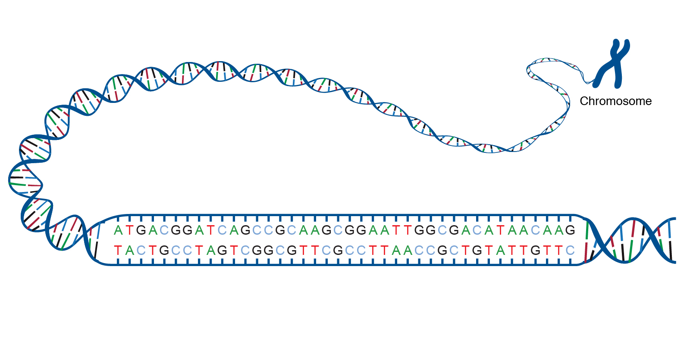

_Source: National Human Genome Research Institute, National Institutes of Health (NIH) at https://www.genome.gov/genetics-glossary/acgt_


Second, and perhaps less obvious, is the similarity of DNA sequence information encoding to image information encoding:  
* Analysis of 2D images by neural networks provides analysis of both local spatial features and spatially-distant features that must nevertheless be considered relative to each other  
* Researching deep learning approaches brought me to 1D Convolutional Neural Networks (CNNs) and Recurrent Neural Networks (RNNs)


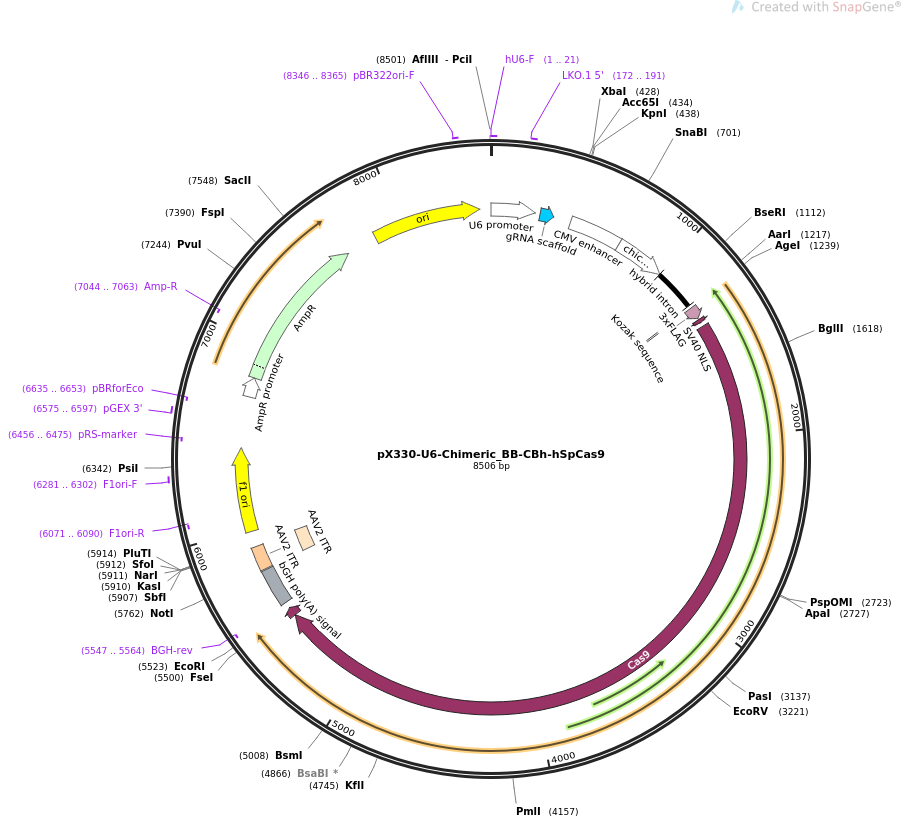

_Source:  Addgene.org  https://www.addgene.org/42230/_


With all of the above in mind, and with suggestions from my instructors (each of whom saw merits in one approach or the other), I decided to start with 1D CNNs, moving on to Recurrent Neural Networks (RNN) if time allowed.  


### Preparing data for modeling


#### Reducing dataframe size to increase the speed of training models


Given the amount of time neural network models require to run, and to get at least a minimum viable model up and running, I decided to start with a subset of the data that provided a greatly reduced list of targets (labs) but that still contained tens of thousands of sequences for training.  

As discussed in the data exploration section, a large proportion of sequences in the original data set were submitted by a small percentage of labs (similar to the 80:20 rule).  I wrote a function that allowed me to select plasmids from labs that had submitted at least 'n' number of plasmids to the data base.  

For example, when I selected n = 200, I obtained a data set containing over 31,000 plasmids that had been submitted by just 42 labs.  This is a huge reduction of targets (labs), down from the original count of 1,314 labs in the data set, while providing plenty of sequences for training. 

Model runs were performed on the following subsets of data:

* Plasmids from labs submitting at least 200 plasmids each, producing a data set of ~31,000 plasmids submitted by 42 labs
* Plasmids from labs that had submitted 10 or fewer plasmids each, producing a data set of 3,356 plasmids from 449 labs
* Plasmids from labs that had submitted between 10 and 50 plasmids each, producing a data set of 15,602 plasmids from 730 labs
* Plasmids from labs submitting up to 50 plasmids each, producing a data set of 18,228 sequences from 1106 labs


#### Character-level vectorization:  values and targets

The next step in preparing the data for analysis in the CNN is to tokenize the base pair letters in the sequences and the lab IDs.  These steps include:

* Tokenizing (representing each character as an integer)--before data can be analyzed in a neural network, any non-numerical data type (e.g., string, object) must be converted to numerical form (integer or float) 
* Padding or truncating sequences to ensure the same length for each sequence (the default for most model runs is 8,500)
* Vectorizing (encoding integers as binary features)


#### Train_test_split on this data for validation

For demonstration purposes, the preprocessing steps and/or function outputs are displayed here with minimal code for just the first run.  All code can be found in the technical notebook for this project.

```python
from sklearn.model_selection import train_test_split
```


```python
X_train_200_85, X_test_200_85, y_train_200_85, y_test_200_85 = train_test_split(X_200_85, y_200, test_size=0.25, random_state=42)
```


```python
X_train_200_85.shape
```


    (22341, 8500)


```python
X_test_200_85.shape
```


    (7448, 8500)


```python
y_train_200_85.shape
```


    (22341, 42)


```python
y_test_200_85.shape
```


    (7448, 42)


#### Compute class weights for training dataset


Because the number of plasmids submitted by lab varies widely, it's important to address this class imbalance to ensure that the model is actually learning from the features in the data set (as opposed to just picking the more commonly represented classes in the data set).  

In Tensorflow 2.0, users can import a dictionary of class weights to address imbalances.  I created a function (details in the technical notebook) that creates this dictionary for use in the models.  The results for this first model run are shown below as an example.   

```python
class_weights = class_weights_dict_tokenized(Y_200)
class_weights
```


    {0: 0.08559762307046884,
     1: 0.2596127030607265,
     2: 0.26544232962646136,
     3: 0.6665995345506623,
     4: 0.7289433759115157,
     5: 0.9989604292421194,
     6: 1.0399734673928223,
     7: 1.0681655192197361,
     8: 1.1348190476190476,
     9: 1.2313574735449735,
     10: 1.2421399382870486,
     11: 1.2848947550034506,
     12: 1.2942735488355925,
     13: 1.4128723202428382,
     14: 1.4474732750242953,
     15: 1.4994966274036041,
     16: 1.5553989139515456,
     17: 1.6807154141277365,
     18: 1.8518587591694642,
     19: 1.8714034426435482,
     20: 1.9325937459452447,
     21: 1.975659901843746,
     22: 1.9811785049215216,
     23: 2.055831608005521,
     24: 2.0860644257703083,
     25: 2.12991562991563,
     26: 2.1363310384394723,
     27: 2.223391550977758,
     28: 2.348549353516241,
     29: 2.4974010731052982,
     30: 2.7174785623061486,
     31: 2.8715056872951608,
     32: 2.9429954554435884,
     33: 3.031033781033781,
     34: 3.1107978279030912,
     35: 3.209329885800474,
     36: 3.209329885800474,
     37: 3.314307966177125,
     38: 3.377437641723356,
     39: 3.4099130036630036,
     40: 3.4767740429505136,
     41: 3.5286661928452974}


### Modeling:  Labs submitting at least 200 plasmids each (n = 200)

This dataset includes sequences from labs submitting at least 200 plasmids to the database.  There are over 31,000 plasmids submitted by a total of 42 labs.  


_(The preprocessing steps outlined in Section 3.2.2, "Preparing data for modeling", were performed prior to model setup)_


#### Model setup

```python
max_char = 8500

model = Sequential()
embedding_dim = 1
model.add(Embedding(len(word_index) + 1, embedding_dim, input_length=max_char))
model.add(layers.Conv1D(filters=32, kernel_size=12, padding='same', activation='relu'))
model.add(layers.MaxPooling1D(pool_size=2))
model.add(Dropout(0.2))
model.add(layers.Conv1D(filters=32, kernel_size=8, padding='same', activation='relu'))
model.add(layers.MaxPooling1D(pool_size=2))
model.add(Dropout(0.2))
model.add(layers.Flatten())
model.add(layers.Dense(128, activation='relu'))
model.add(layers.Dense(len(y_train_200_85[0]), activation='softmax'))
```


Model summary:


    Model: "sequential_20"
    _________________________________________________________________
    Layer (type)                 Output Shape              Param #   
    =================================================================
    embedding_20 (Embedding)     (None, 8500, 1)           6         
    _________________________________________________________________
    conv1d_37 (Conv1D)           (None, 8500, 32)          416       
    _________________________________________________________________
    max_pooling1d_27 (MaxPooling (None, 4250, 32)          0         
    _________________________________________________________________
    dropout_18 (Dropout)         (None, 4250, 32)          0         
    _________________________________________________________________
    conv1d_38 (Conv1D)           (None, 4250, 32)          8224      
    _________________________________________________________________
    max_pooling1d_28 (MaxPooling (None, 2125, 32)          0         
    _________________________________________________________________
    dropout_19 (Dropout)         (None, 2125, 32)          0         
    _________________________________________________________________
    flatten_17 (Flatten)         (None, 68000)             0         
    _________________________________________________________________
    dense_34 (Dense)             (None, 128)               8704128   
    _________________________________________________________________
    dense_35 (Dense)             (None, 42)                5418      
    =================================================================
    Total params: 8,718,192
    Trainable params: 8,718,192
    Non-trainable params: 0
    _________________________________________________________________
    None


#### Model compile


```python
model.compile(loss='categorical_crossentropy', optimizer='adam', metrics=['accuracy'])
```

#### Model fit


```python
%%time

history = model.fit(X_train_200_85, y_train_200_85, epochs=12, validation_data=(X_test_200_85, y_test_200_85), class_weight = class_weights)
```

```python
history.history['accuracy']
```


    [0.3942527174949646,
     0.5978693962097168,
     0.7053846716880798,
     0.7698401808738708,
     0.8140637874603271,
     0.8448591828346252,
     0.8564074635505676,
     0.8741327524185181,
     0.8858153223991394,
     0.875744104385376,
     0.8982588052749634,
     0.923772394657135]


```python
history.history['val_accuracy']

```


    [0.5095327496528625,
     0.5477980971336365,
     0.5860633850097656,
     0.6674275398254395,
     0.6721267700195312,
     0.6754833459854126,
     0.6749463081359863,
     0.7152255773544312,
     0.6349355578422546,
     0.6887755393981934,
     0.7075725197792053,
     0.7156283855438232]


#### Visualizations


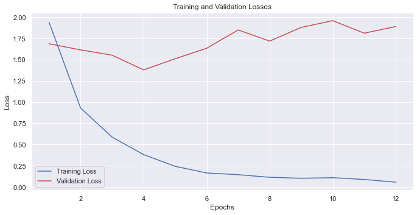


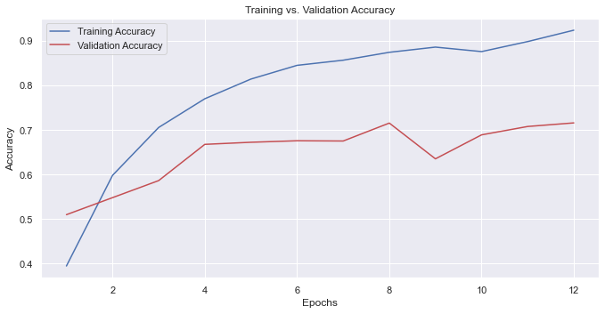


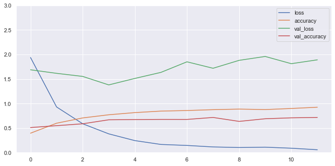


#### Observations about model:  n >= 200 plasmids per lab


The 1D CNN models for this data subset (plasmids submitted by the 42 most prolific labs) did a pretty good job predicting plasmid single lab-of-origin (up to ~92% training accuracy and 72% test accuracy).  _(Note that these results--indeed all CNN results discussed below--are for **single** lab-of-origin predictions. I figure that train and test accuracies would be extremely high with only 42 labs in the data set if I had used the "top 10" approach.)_


### Model:  labs submitting 10 or fewer plasmids each

For this run, I selected plasmids submitted by labs that have submitted fewer than 10 plasmids to the database.

_(Note:  The preprocessing steps outlined in Section 3.2.2, "Preparing data for modeling", were performed on this data subset prior to model setup.)_


#### Model setup


```python
max_char = 8500

model = Sequential()
embedding_dim = 1
model.add(Embedding(len(word_index) + 1, embedding_dim, input_length=max_char))
model.add(layers.Conv1D(filters=32, kernel_size=12, padding='same', activation='relu'))
model.add(layers.MaxPooling1D(pool_size=2))
model.add(layers.Conv1D(filters=32, kernel_size=8, padding='same', activation='relu'))
model.add(layers.MaxPooling1D(pool_size=2))
model.add(layers.Flatten())
model.add(layers.Dense(128, activation='relu'))
model.add(layers.Dense(len(y_train_lt_10[0]), activation='softmax'))

```


```python
model.summary()

```

    Model: "sequential_26"
    _________________________________________________________________
    Layer (type)                 Output Shape              Param #   
    =================================================================
    embedding_26 (Embedding)     (None, 8500, 1)           6         
    _________________________________________________________________
    conv1d_49 (Conv1D)           (None, 8500, 32)          416       
    _________________________________________________________________
    max_pooling1d_39 (MaxPooling (None, 4250, 32)          0         
    _________________________________________________________________
    conv1d_50 (Conv1D)           (None, 4250, 32)          8224      
    _________________________________________________________________
    max_pooling1d_40 (MaxPooling (None, 2125, 32)          0         
    _________________________________________________________________
    flatten_23 (Flatten)         (None, 68000)             0         
    _________________________________________________________________
    dense_46 (Dense)             (None, 128)               8704128   
    _________________________________________________________________
    dense_47 (Dense)             (None, 449)               57921     
    =================================================================
    Total params: 8,770,695
    Trainable params: 8,770,695
    Non-trainable params: 0
    _________________________________________________________________


#### Model compile


```python
model.compile(loss='categorical_crossentropy', optimizer='adam', metrics=['accuracy'])
```

#### Model fit


```python
%%time

history = model.fit(X_train_lt_10, y_train_lt_10, epochs=40, validation_data=(X_test_lt_10, y_test_lt_10), class_weight = class_weights_lt_10)
```

```python
history.history['accuracy']
```


    [0.0043702819384634495,
     0.02781088650226593,
     0.17481128871440887,
     0.3976956605911255,
     0.5593960881233215,
     0.6909018754959106,
     0.7620182633399963,
     0.8243941068649292,
     0.8812077641487122,
     0.919348418712616,
     0.9451728463172913,
     0.9666269421577454,
     0.9813269972801208,
     0.9876837730407715,
     0.9924513101577759,
     0.9932458996772766,
     0.9936432242393494,
     0.9936432242393494,
     0.9928486347198486,
     0.9924513101577759,
     0.9928486347198486,
     0.9956297278404236,
     0.9952324032783508,
     0.9960269927978516,
     0.9964243173599243,
     0.9964243173599243,
     0.9964243173599243,
     0.9952324032783508,
     0.997218906879425,
     0.9964243173599243,
     0.997218906879425,
     0.9960269927978516,
     0.9940404891967773,
     0.9928486347198486,
     0.9928486347198486,
     0.9952324032783508,
     0.9964243173599243,
     0.997218906879425,
     0.9964243173599243,
     0.997218906879425]


```python
history.history['val_accuracy']
```


    [0.0035756854340434074,
     0.04290822520852089,
     0.1609058380126953,
     0.23718713223934174,
     0.27771157026290894,
     0.25983312726020813,
     0.2824791371822357,
     0.3051251471042633,
     0.29797378182411194,
     0.3051251471042633,
     0.31466031074523926,
     0.29678186774253845,
     0.31823599338531494,
     0.31823599338531494,
     0.3075089454650879,
     0.3098927140235901,
     0.3051251471042633,
     0.3027413487434387,
     0.3063170313835144,
     0.31346842646598816,
     0.31704410910606384,
     0.31823599338531494,
     0.31704410910606384,
     0.31466031074523926,
     0.31704410910606384,
     0.31585219502449036,
     0.31585219502449036,
     0.31704410910606384,
     0.3098927140235901,
     0.3063170313835144,
     0.3098927140235901,
     0.31585219502449036,
     0.308700829744339,
     0.3075089454650879,
     0.3110846281051636,
     0.31823599338531494,
     0.31585219502449036,
     0.31823599338531494,
     0.31585219502449036,
     0.31823599338531494]


#### Visualizations


```python
loss_viz(history)
```


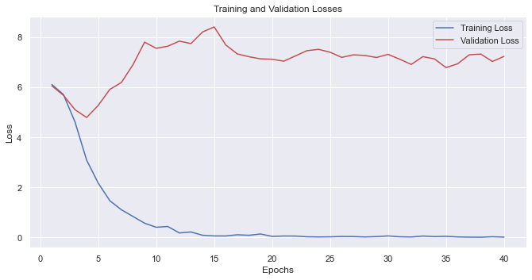


```python
acc_viz(history)
```


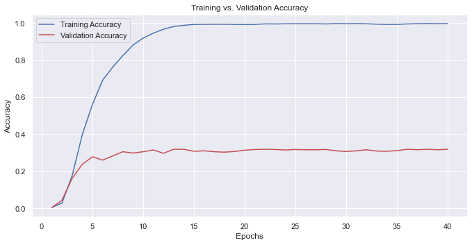


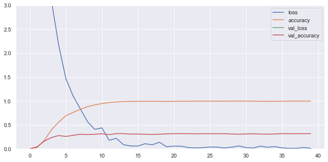


#### Observations about model for n<=10 plasmids per lab data subset

The data set for the chart above included 3,356 sequences submitted by 449 labs in total.  Training accuracy peaked at over 99% and validation accuracy was just under 32%.  


### Model:  labs submitting between 10 and 50 plasmids each

For this run, I selected plasmids submitted by labs that have submitted between 10 and 50 plasmids to the database.

_(Note:  The preprocessing steps outlined in Section 3.2.2, "Preparing data for modeling", were performed on this data subset prior to model setup.)_


#### Model setup


```python
max_char = 8500

model = Sequential()
embedding_dim = 1
model.add(Embedding(len(word_index) + 1, embedding_dim, input_length=max_char))
model.add(layers.Conv1D(filters=32, kernel_size=12, padding='same', activation='relu'))
model.add(layers.MaxPooling1D(pool_size=2))
model.add(layers.Conv1D(filters=32, kernel_size=8, padding='same', activation='relu'))
model.add(layers.MaxPooling1D(pool_size=2))
model.add(layers.Flatten())
model.add(layers.Dense(128, activation='relu'))
model.add(layers.Dense(len(y_train_10_50[0]), activation='softmax'))

```


```python
model.summary()

```

    Model: "sequential_29"
    _________________________________________________________________
    Layer (type)                 Output Shape              Param #   
    =================================================================
    embedding_29 (Embedding)     (None, 8500, 1)           6         
    _________________________________________________________________
    conv1d_53 (Conv1D)           (None, 8500, 32)          416       
    _________________________________________________________________
    max_pooling1d_43 (MaxPooling (None, 4250, 32)          0         
    _________________________________________________________________
    conv1d_54 (Conv1D)           (None, 4250, 32)          8224      
    _________________________________________________________________
    max_pooling1d_44 (MaxPooling (None, 2125, 32)          0         
    _________________________________________________________________
    flatten_25 (Flatten)         (None, 68000)             0         
    _________________________________________________________________
    dense_50 (Dense)             (None, 128)               8704128   
    _________________________________________________________________
    dense_51 (Dense)             (None, 730)               94170     
    =================================================================
    Total params: 8,806,944
    Trainable params: 8,806,944
    Non-trainable params: 0
    _________________________________________________________________


#### Model compile


```python
model.compile(loss='categorical_crossentropy', optimizer='adam', metrics=['accuracy'])
```

#### Model fit


```python
%%time

history = model.fit(X_train_10_50, y_train_10_50, epochs=20, validation_data=(X_test_10_50, y_test_10_50), class_weight = class_weights_10_50)
```

```python
history.history['accuracy']
```


    [0.020083753392100334,
     0.18169386684894562,
     0.34817537665367126,
     0.5128621459007263,
     0.6636185050010681,
     0.7622425556182861,
     0.8371079564094543,
     0.8902657628059387,
     0.933082640171051,
     0.9703444242477417,
     0.9813690781593323,
     0.9833347201347351,
     0.986667811870575,
     0.9869241714477539,
     0.9845312237739563,
     0.9852149486541748,
     0.9867532253265381,
     0.9841039180755615,
     0.988206148147583,
     0.9872660040855408]


```python
history.history['val_accuracy']
```


    [0.06536785513162613,
     0.20353755354881287,
     0.2794155478477478,
     0.3158164620399475,
     0.3094078600406647,
     0.32555755972862244,
     0.32812100648880005,
     0.327095627784729,
     0.3391438126564026,
     0.34862855076789856,
     0.3345296084880829,
     0.33606767654418945,
     0.3450397253036499,
     0.3445270359516144,
     0.3409382402896881,
     0.3488849103450775,
     0.34734684228897095,
     0.3350422978401184,
     0.35247373580932617,
     0.35273006558418274]


#### Visualizations


```python
loss_viz(history)
```


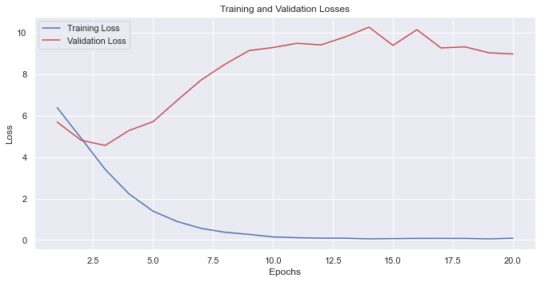


```python
acc_viz(history)
```


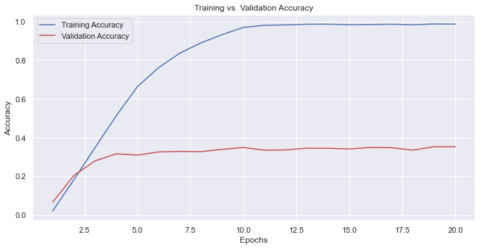


#### Observations about model for plasmids per lab:  10 <= n <= 50

Training accuracy peaked at around 99% after epoch 10, but at epoch 4, validation accuracy was approaching its eventual peak at epoch 10 at around 35% accuracy.  


### Model:  labs summitting 50 or fewer plasmids each


For this model run, I selected plasmids based on whether the lab that submitted it had submitted 50 or fewer plasmids to the database.  This yielded a data subset with 18,228 plasmids and 1106 labs.

_(Note:  The preprocessing steps outlined in Section 3.2.2, "Preparing data for modeling", were performed on this data subset prior to model setup.)_


#### Model setup

```python
max_char = 8500 
model = Sequential()
embedding_dim = 1
model.add(Embedding(len(word_index) + 1, embedding_dim, input_length=max_char))
model.add(layers.Conv1D(filters=32, kernel_size=12, padding='same', activation='relu'))
model.add(layers.MaxPooling1D(pool_size=2))
model.add(Dropout(0.2))
model.add(layers.Conv1D(filters=32, kernel_size=8, padding='same', activation='relu'))
model.add(layers.MaxPooling1D(pool_size=2))
model.add(Dropout(0.2))
model.add(layers.Flatten())
model.add(layers.Dense(128, activation='relu'))
model.add(layers.Dense(len(y_train_lt_50[0]), activation='softmax'))

```


```python
model.summary()

```

    Model: "sequential_22"
    _________________________________________________________________
    Layer (type)                 Output Shape              Param #   
    =================================================================
    embedding_22 (Embedding)     (None, 8500, 1)           6         
    _________________________________________________________________
    conv1d_41 (Conv1D)           (None, 8500, 32)          416       
    _________________________________________________________________
    max_pooling1d_31 (MaxPooling (None, 4250, 32)          0         
    _________________________________________________________________
    dropout_22 (Dropout)         (None, 4250, 32)          0         
    _________________________________________________________________
    conv1d_42 (Conv1D)           (None, 4250, 32)          8224      
    _________________________________________________________________
    max_pooling1d_32 (MaxPooling (None, 2125, 32)          0         
    _________________________________________________________________
    dropout_23 (Dropout)         (None, 2125, 32)          0         
    _________________________________________________________________
    flatten_19 (Flatten)         (None, 68000)             0         
    _________________________________________________________________
    dense_38 (Dense)             (None, 128)               8704128   
    _________________________________________________________________
    dense_39 (Dense)             (None, 1106)              142674    
    =================================================================
    Total params: 8,855,448
    Trainable params: 8,855,448
    Non-trainable params: 0
    _________________________________________________________________


#### Model compile


```python
model.compile(loss='categorical_crossentropy', optimizer='adam', metrics=['accuracy'])
```

#### Model fit


```python
%%time

history = model.fit(X_train_lt_50, y_train_lt_50, epochs=12, validation_data=(X_test_lt_50, y_test_lt_50), class_weight = class_weights_lt_50)
```

```python
history.history['accuracy']
```


    [0.001024065539240837,
     0.0015360983088612556,
     0.0017555409576743841,
     0.0018286884296685457,
     0.0016823933692649007,
     0.0019018360180780292,
     0.002121278550475836,
     0.0017555409576743841,
     0.002121278550475836,
     0.0017555409576743841,
     0.0017555409576743841,
     0.002121278550475836]


```python
history.history['val_accuracy']
```


    [0.0, 0.0, 0.0, 0.0, 0.0, 0.0, 0.0, 0.0, 0.0, 0.0, 0.0, 0.0]


#### Visualizations


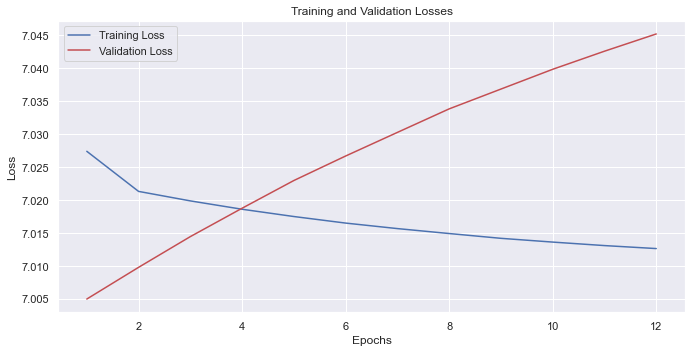


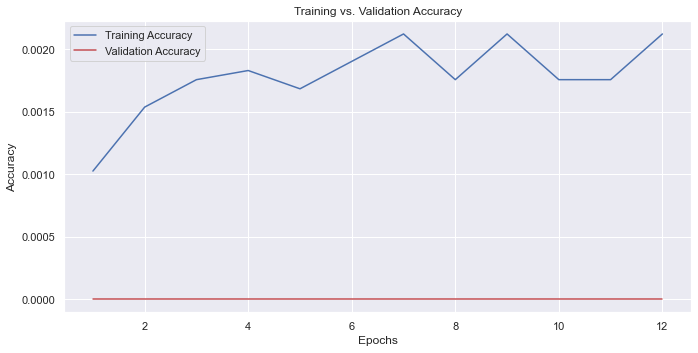


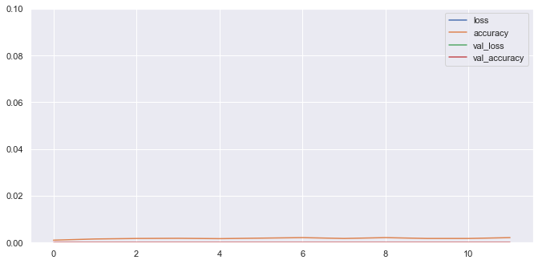


#### Observations about model:  n <= 50 plasmids per lab

The data set for this run included 18,228 sequences submitted by 1106 labs in total. Model performance was abysmal, with training accuracy peaked at just over 0.2% and validation accuracy was flatlined at 0.000%. 


# Results and Conclusions


## Summary of results and outcomes for analysis performed October 2020
For the analyses completed in October 2020 to satisfy my capstone project requirements, I focused on the end-to-end implementation of a project, creating 1D CNN models with a subset of the GEAC data set.  _(Note:  Flatiron student capstone projects are done independently and all work in the project is my own unless otherwise noted.)_  Given time constraints, I was unable to also explore RNN models. 

The 1D CNN models I developed did a pretty good job predicting plasmid single lab-of-origin (up to ~92% training accuracy and 72% test accuracy) for a subset of labs that had provided nearly 50% (over 31,000) of the sequences in the study data set.  _(Note that these results were of single lab-of-origin predictions; if I had used the "top 10" approach, I figure that train and test accuracies would be extremely high with only 42 labs in the data set.)_  

The two graphs below plot the model's performance over 12 epochs for sequences of max length 8,500 and 10,000, respectively.


_Accuracy of the best version of 1D CNN model over 12 epochs for sequences of maximum length 8,500.  Training accuracy peaked at 92% and validation accuracy peaked at about 72%._ 


_Accuracy of the best version of 1D CNN model over 12 epochs for maximum sequence lengths of 10,000._ 

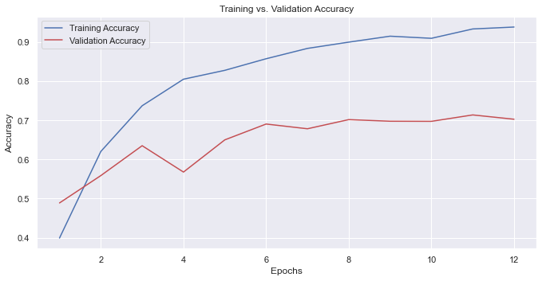

Training accuracy peaked at around 93% and validation accuracy peaked at about 70%, just shy of what the model produced with max sequence lengths of 8,500.


Given that I took on this project to satisfy my capstone project requirement, I was really pleased to be able to implement a challenging end-to-end data science project and get good results.  Furthermore, I exceeded the capstone requirements and received strong marks for my final assessment, which felt great!

Even so, I hoped to have a chance to revisit these analyses to find out whether these models would perform as well or better when sequences from a greater number of labs was included. 


## Summary of revised analysis (performed July 2021)

In July 2021, with a new M1 MacBook Air and improved data science/programming skills, I decided to revisit the project to update the code for this project to run Tensorflow 2.5 and python 3.9 natively on the MacBook Air.  I purposely chose _not_ to revisit the DrivenData GEAC competition website until updating the code, trying some additional approaches, and expanding my analysis a bit.  

Key results are shown below.  In a nutshell: the 1D CNN performed reasonably well predicting single lab-of-origin for the subset of sequences (summarized above), but the results using a larger subset of sequences and labs ranged from lackluster to spectacularly awful.  _(As a reminder, these are single lab-of-origin predictions, rather than top-10 lab probabilities.  While I did explore whether it would be possible to set up the 1D CNN model to run with top-10 probability predictions for each epoch, time constraints caused me to cut that effort short.)_  


### Model run:  Sequences from labs submitting 10 or fewer plasmids (449 labs in total)

<!-- #region -->
The data set for the charts below included plasmids from labs that had submitted 10 or fewer plasmids, resulting in a data set of 3,356 plasmids from 449 labs.  Training accuracy peaked at just over 99% and validation accuracy peaked just over 31% around epoch 14 or 15.  

_Accuracy of the best version of 1D CNN model over 40 epochs for sequences submitted by labs that had submitted 10 or less sequences to the database (max sequence length = 8,500)._ 


However, validation _losses_ were at their minimum at epoch 4, bouncing back up until epoch 15, after which point they declined slightly and then remained around that point through epoch 40.  


<!-- #endregion -->

### Model run:  Sequences from labs submitting between 10 and 50 plasmids (730 labs)


Slicing the data set to look at plasmids from labs that had submitted between 10 and 50 plasmids each produced a data set of 15,602 plasmids from 730 labs.  

<!-- #region -->
_Accuracy of the best version of 1D CNN model over 20 epochs for sequences  (max sequence length = 8,500)._ 


Training accuracy peaked at around 99% after epoch 10, but at epoch 4, validation accuracy was approaching its eventual peak at epoch 10 at around 35% accuracy.  It is interesting that the validation accuracy was so similar for this model run and the previous run, despite the data sets being significantly different.  But in both cases, the validation accuracy isn't great (though certainly is much better than chance).
<!-- #endregion -->

### Model run:  sequences from labs submitting 50 or fewer plasmids (1106 labs in total)

Selecting a subset of data consisting of plasmids from labs submitting 50 or fewer plasmids each resulted in 18,228 sequences from 1106 labs.  Training accuracy peaked at just over 0.2% and validation accuracy was flatlined at 0.000%.  This is a chart that "only a mother could love".

_Accuracy of the best version of 1D CNN model over 12 epochs for sequences submitted by labs that had submitted 50 or less sequences to the database (max sequence length = 8,500)._ 


### Comments on the revised analysis using data subsets with many more targets 

So, why were these analyses (especially the last one) so much worse than the original analyses on the data set of plasmids from the top 42 labs?  Possible causes for the poor performance on these data subsets could include:
* These data subsets had fewer plasmids but many more labs compared to the original data subset (~31,000 sequences and 42 labs)
* The binary features in the original data set were not included in these modeling runs  
* My neural network models were focused on predicting single lab-of-origin for each plasmid, as opposed to predicting the top 10 most likely labs for each plasmid

Furthermore, I knew that additional approaches, such as variable batch length processing, using an RNN with LSTM, and/or including a large library of commonly-used plasmid marker sequences, were likely to improve results.  However, I was sure of one thing:  whatever the winners of the competition developed would be quite a bit more advanced than what I could do in the time available.  


## So, how did the GEAC competition winners approach the problem?

After updating the code in my notebook and running additional analyses, I checked out the summary of the winning GEAC competition projects at https://www.drivendata.co/blog/genetic-engineering-attribution-winners/.  The algorithms employed by the winner (a computational biologist) were really sophisticated--so much so that I might have decided to pursue a simpler project if the outcomes of the competition were available as reference when I started!  But I learned so much about various modeling approaches (most especially 1DCNN and RNN with LSTM), coding in Tensorflow 2.5--even getting the conda environment set up for the M1 MacBook Air, which was a complicated effort--that I figure it was worth it.  All in all, it has been a very interesting project, and I am excited to apply what I've learned to new challenges.


## Final thoughts 

As I mentioned in the first section, my goal for this project was to submit it as my capstone.  The complexity of this analysis exceeded the requirements for the capstone, but I love tackling complex problems and this one definitely held my interest.  Even so, I might not have taken it on at all if I had seen the work published after the conclusion of the competition.  The problem is even more challenging than I thought it would be, and I feel like I bit off more than I could chew.  At least I started with a subset of the data, so that I could get the models up and running and have reasonably good results.  I certainly learned a lot during this project--and gained a newfound appreciation for working up from simpler projects to more complex ones.  
